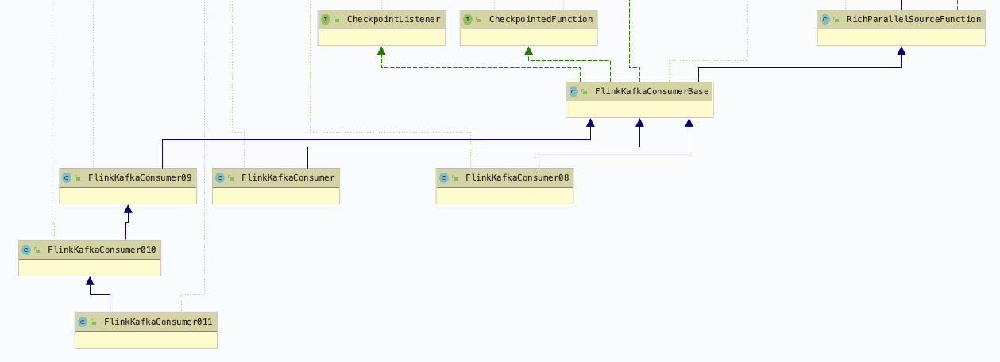
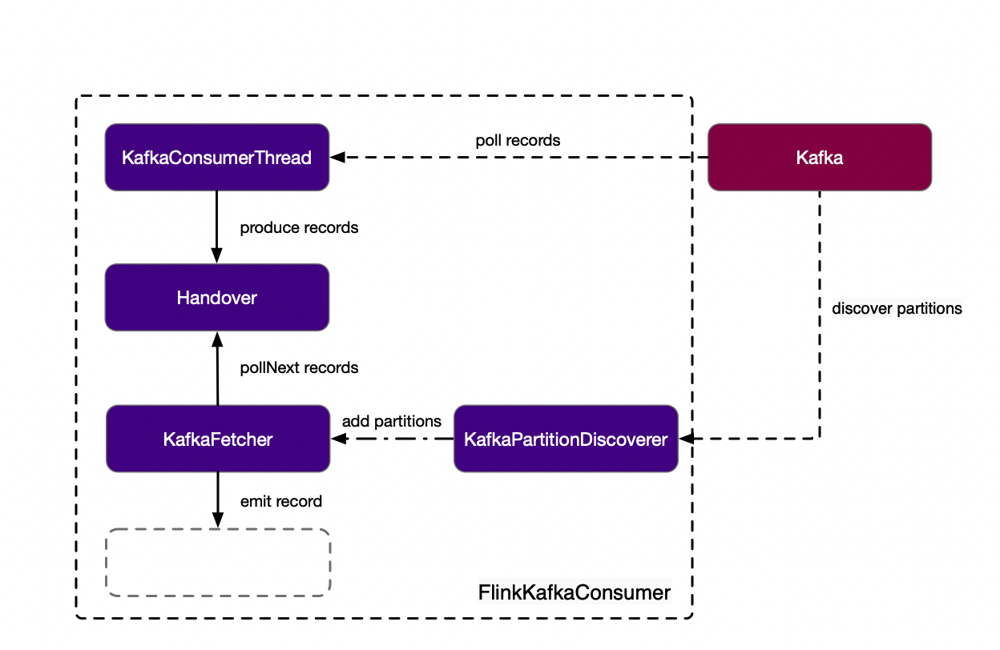
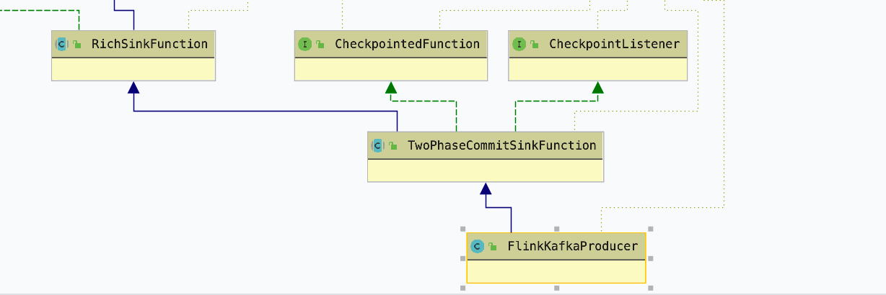
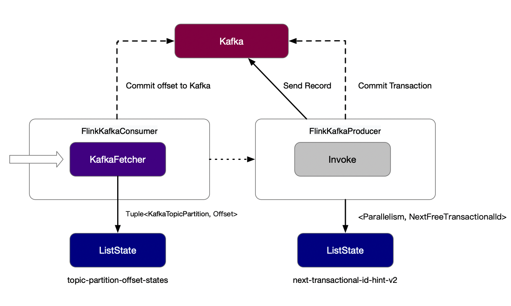

## 1. FlinkKafkaConnector 能做什么？

Flink 主要由 FlinkKafkaConsumer、FlinkKafkaProducer 两部分组成，它为 Flink 应用提供了用来读取/写入数据到 Kafka 能力，并在 Kafka Consumer 中结合了自身的提供的 Checkpointing 机制为 Flink 应用提供了 EXACTLY_ONCE 的语义，它并不完全依赖 Kafka 的 Consumer group 来对 Offset进行记录，而是在内部利用 Checkpoint 中的状态记录了这些的偏移量来完成这个功能

## 2. FlinkKafkaConsumer 实现分析

### 2.1 FlinkKafkaConsumer 的运行机制

FlinkKafkaConsumer 是一个不断从 Kafka 获取的一个流式数据的数据源，它可以同时的在不同的并行实例中运行，从一个或者多个 Kafka partition 中拉取数据



我们可以先简单的从类图的关系了解下 FlinkKafkaConsumer 的实现，上面是 FlinkKafkaConsumer 的之间的关系，不同 Kafka 版本实现的 FlinkKafkaConsumer 都基于 FlinkKafkaConsumerBase 这个抽象类。在 FlinkKafkaConsumerBase 中，它的主要负责初始化一些列对象来构建KafkaFetcher，用于获取 Kafka 上面的数据，如果开启了 Partition Discoverer 功能，则启动 DiscoveryLoopThread 定期获取 KafkaTopicPartition 信息。并将这些信息更新到 KafkaFetcher 中，从而获取新的 Topic 或 Partition 数据



在 KafkaFetcher 里，它并没有直接使用 KafkaClient 进行直接的数据读取，它通过创建了一条 KafkaConsumerThread 线程定时 ( flink.poll-timeout, default 100ms) 的从 Kafka 拉取数据, 并调用 Handover.produce 将获取到的 Records 放到 Handover中，对于 Handover 来说，它相当于一个阻塞对列，KafkaFetcher 线程和 KafkaConsumerThread 线程通过 Handover 进行通信，KafkaFetcher 线程的 run 方法中轮询 handover.pollNext 获取来自KafkaConsumerThread 的数据，否则则阻塞，如果获取到数据，则通过 SourceContext 将数据 emit 到下游

### 2.2 FlinkKafkaConsumer 的状态管理

和大多数有状态的算子一样，为了容错和更容易的进行水平扩展，它也实现了 CheckpointedFunction，CheckpointListener 接口，当 checkpoint 开启时，snapshotState 方法会被周期性的调用，就会将当前 fetcher 提交的 KafkaTopicPartition 信息和 Offset 定期的存储到状态存储 ListState 上，并在所有任务都成功 checkpoint 时，notifyCheckpointComplete 方法将会被调用，并将等待提交的 offset，从 pendingOffsetsToCommit 取出，并提交到 Kafka 上

## 3. FlinkKafkaProducer 实现分析

### 3.1 FlinkKafkaProducer 的运行机制

FlinkKafkaProducer实现了Flink Sink的接口，能够将上游的数据写入到Kafka对应的Topic中，在默认情况下，使用AT_LEAST_ONCE语义



通过类图的关系看出，FlinkKafkaProducer 是 TwoPhaseCommitSinkFunction 的一个实现类，在 Flink 中，TwoPhaseCommitSinkFunction 被推荐为Sink实现 EXACTLY_ONCE 语义的基类，它也需要配合 CheckpointedFunction，CheckpointListener 使用



这里简单的说说什么是2PC-二阶段提交协议？

二阶段提交(Two-phaseCommit)是指，在计算机网络以及数据库领域内，为了使基于分布式系统架构下的所有节点在进行事务提交时保持一致性而设计的一种算法(Algorithm)。通常，二阶段提交也被称为是一种协议(Protocol))。

在分布式系统中，每个节点虽然可以知晓自己的操作时成功或者失败，却无法知道其他节点的操作的成功或失败。

当一个事务跨越多个节点时，为了保持事务的ACID特性，需要引入一个作为协调者的组件来统一掌控所有节点(称作参与者)的操作结果并最终指示这些节点是否要把操作结果进行真正的提交(比如将更新后的数据写入磁盘等等)。

因此，二阶段提交的算法思路可以概括为： 参与者将操作成败通知协调者，再由协调者根据所有参与者的反馈情报决定各参与者是否要提交操作还是中止操作。 所谓的两个阶段是指：
- 第一阶段：voting phase 投票阶段
- 第二阶段：commit phase 提交阶段

对于Flink的实现来说，第一阶段就是 preCommit 预提交，第二个阶段是提交阶段，协调者就是JM。所以，我们先看看 TwoPhaseCommitSinkFunction 的主要抽象方法：
- invoke
- beginTransaction
- preCommit
- commit
- recoverAndCommit
- abort
- recoverAndAbort

和上面的 FlinkKafkaConsumer 类似，假设应用开启了 Checkpoint，那么这个 Operator 就会定时的收到来自上游的 barrier，就会调用TwoPhaseCommitSinkFunction 的 snapshotState 的方法，将当前的状态进行预提交（ flush 数据到 Kafka ），并将这次 TransactionHolder 放到pendingCommitTransactions，开启新的 transaction，并将状态保存到 ListState 中
```java
@Override
public void snapshotState(FunctionSnapshotContext context) throws Exception {
    checkState(currentTransactionHolder != null, "bug: no transaction object when performing state snapshot");

    long checkpointId = context.getCheckpointId();
    LOG.debug("{} - checkpoint {} triggered, flushing transaction '{}'", name(), context.getCheckpointId(), currentTransactionHolder);

    // 进行预提交
    preCommit(currentTransactionHolder.handle);
    // 将flush后的currentTransactionHolder放入到pendingCommitTransactions中等待完成
    pendingCommitTransactions.put(checkpointId, currentTransactionHolder);
    LOG.debug("{} - stored pending transactions {}", name(), pendingCommitTransactions);

    currentTransactionHolder = beginTransactionInternal();
    LOG.debug("{} - started new transaction '{}'", name(), currentTransactionHolder);

    state.clear();
    state.add(new State<>(
        this.currentTransactionHolder,
        new ArrayList<>(pendingCommitTransactions.values()),
        userContext));
}
```
当所有的任务都 Checkpoint 完成，notifyCheckpointComplete 方法就会被调用，这时后就会调用 TwoPhaseCommitSinkFunction.commit 方法，从pendingCommitTransactions 中，找出小于这次 checkpointId 的 transactionHolder 执行提交，完成事务

说完了 preCommit 和 commit，在两次 Checkpoint 发生的间隔当中，会持续的执行 invoke 方法将数据的写到 Kafka，直到 snapshotState 方法被调用，旧的数据被进行预提交，同时生成新的事务，数据继续写入，直到所有任务Checkpoint完成，收到通知，对完成的checkpointId把事务进行正式的提交

## 4. 总 结

Flink 在 Source 对 Kafka 进行消费拉取 Records，记录状态并定时 snapshot 对应的 topic，partition，offset 到 Flink 管理的状态中，Sink 持续发送数据，进行预提交，直到本次的 snapshot 都完成，Source 提交 Offset 到 Kafka，Sink 完成事务，完成整个流程的确认，当任务发生异常时，从状态中恢复或者从提交的 Kafka 的 Offset 进行恢复，能够恢复当时算子的一个 Snapshot 状态，从而实现端到端的只算一次。

> 原文:[Flink Kafka Connector 实现机制简析](http://hackershell.cn/?p=1453)
