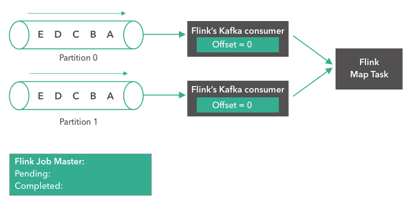
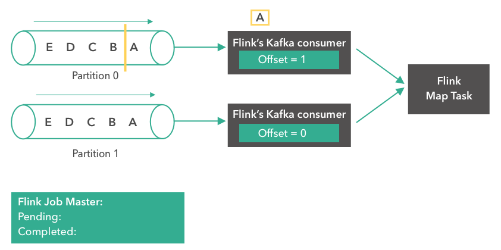
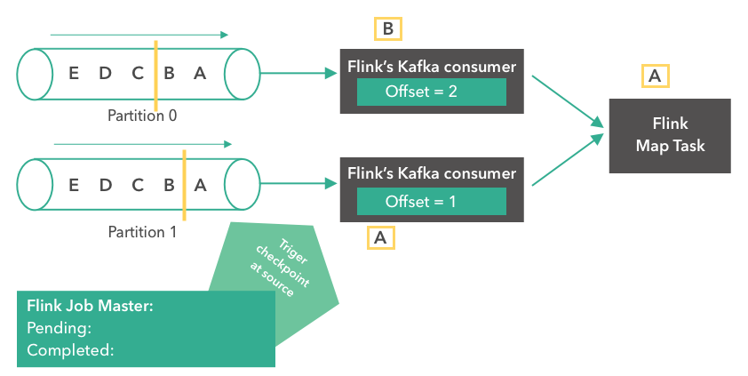
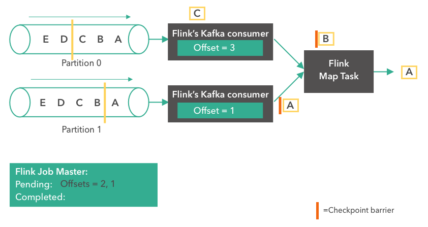
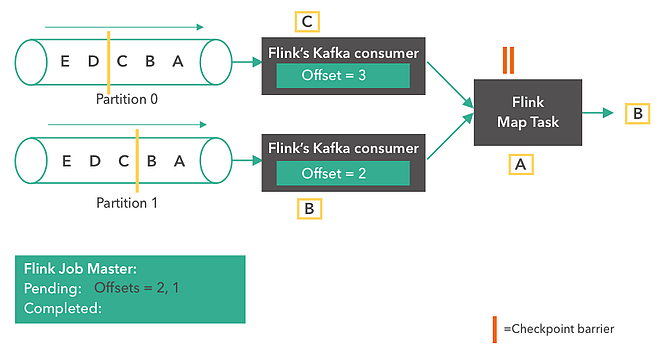
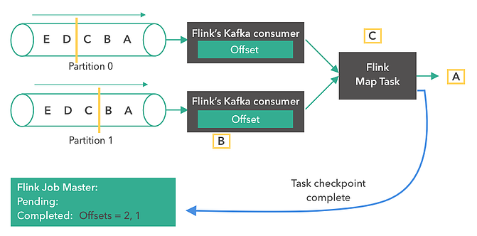
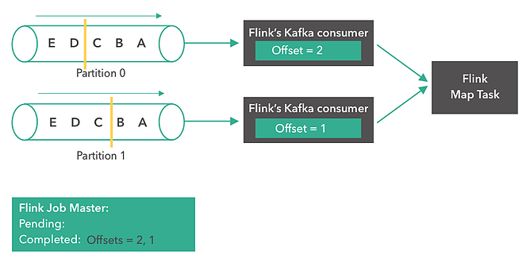

在这篇文章中我们将结合例子逐步讲解 Flink 是如何与 Kafka 配合来确保 Kafka Topic 中的消息以 Exactly-Once 语义处理。

检查点(Checkpoint)是一种能使 Flink 从故障恢复的内部机制。检查点是 Flink 应用程序状态的一致性副本，包括了输入的读取位点。如果发生故障，Flink 通过检查点加载应用程序状态来恢复应用程序，并从恢复的读取位点继续处理，就好像什么事情都没发生一样。你可以把检查点理解为电脑游戏的存档。如果存档之后在游戏中发生了什么事情，你可以重新读档再来一次。检查点使 Flink 具有容错能力，并确保在发生故障时也能保证流应用程序的语义。检查点每隔固定的间隔来触发，该间隔可以在应用中配置。

Flink 中的 Kafka 消费者是一个有状态的算子并集成了 Flink 的检查点机制，它的状态是所有 Kafka 分区的读取偏移量。当一个检查点被触发时，每一个分区的偏移量都保存到这个检查点中。Flink 的检查点机制保证了所有算子任务的存储状态都是一致的，即它们存储状态都是基于相同的输入数据。当所有的算子任务成功存储了它们的状态，一个检查点才成功完成。因此，当从潜在的系统故障中恢复时，系统提供了 Excatly-Once 的状态更新语义。

下面我们将一步步的介绍 Flink 如何对 Kafka 消费偏移量做检查点的。在本文的例子中，数据存储在 Flink 的 JobMaster 中。值得注意的是，在 POC 或生产用例下，这些数据通常是存储到一个外部文件系统（如HDFS或S3）中。

### 1. 第一步

如下实例，从包含两个分区的 Kafka Topic 中读取数据，每个分区都含有 'A', 'B', 'C', 'D', 'E' 5条消息。我们将两个分区的消费偏移量都设置为0：

### 2. 第二步

第二步，Kafka 消费者开始从分区 0 读取消息。消息 'A' 被处理，第一个消费者的偏移量变成了 1：

### 3. 第三步

第三步，消息 'A' 到达了 Flink Map Task。两个消费者都开始读取他们下一条消息（分区 0 读取 'B'，分区 1 读取 'A'）。两个分区各自将偏移量更新为 2 和 1。同时，Flink 的 JobMaster 决定在 Source 触发一个检查点：

### 4. 第四步

接下来，Kafka 消费者为它们的状态创建第一个快照（"offset = 2, 1"），并存储到 Flink 的 JobMaster 中。Source 在消息 'B' 和 'A' 后发送一个 checkpoint barrier。Checkopint barrier 用于在所有算子任务之间对齐检查点，保证了整个检查点的一致性。消息 'A' 到达了 Flink Map Task，而上面的消费者继续读取下一条消息（消息 'C'）：

### 5. 第五步

这一步中，Flink Map Task 接收到两个 Source 的 checkpoint barrier 后（对齐 barrier），那么就会将它自己的状态存储到 JobMaster。同时，消费者会继续从 Kafka 分区中读取更多消息：

### 6. 第六步

一旦 Flink Map Task 完成了状态快照后，会与 Flink JobMaster 进行通信（汇报已经完成了checkpoint）。当一个作业的所有的 Task 都确认完成状态快照后，JobMaster 就成功完成了这个 checkpoint。从此刻开始，这个 checkpoint 就可以用于故障恢复了。值得一提的是，Flink 并不依赖 Kafka 的偏移量从系统故障中恢复：

### 7. 故障恢复

在发生故障时（例如，某个 worker 崩溃），所有的算子任务都会被重启，而他们的状态会被重置到最近一次成功的 checkpoint。如下图所示：

Kafka Source 分别从偏移量 2 和 1 重新开始读取消息（因为这是最近一次成功的 checkpoint 中的偏移量）。当作业重启后，我们可以期待正常的系统操作，就好像之前没有发生故障一样。

原文:[How Apache Flink manages Kafka consumer offsets](https://www.ververica.com/blog/how-apache-flink-manages-kafka-consumer-offsets)
