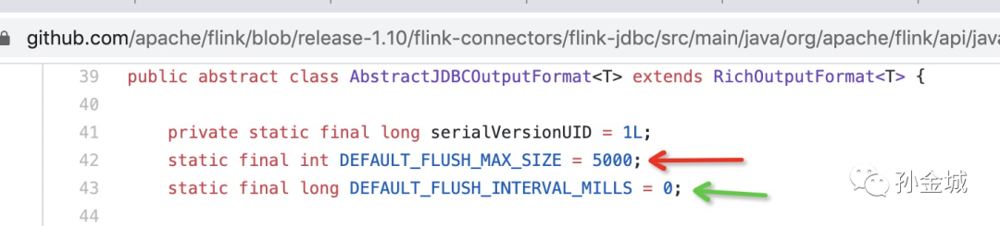
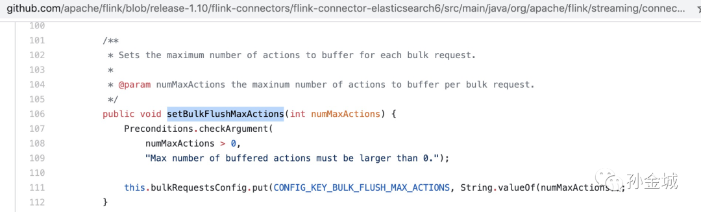

> 摘要：本文为 Flink 生产环境应用中的疑问剖析，Flink 无法实时写入 MySQL 是初学者常见问题之一，由社区同学罗鹏程提出，Apache Flink PMC 孙金城（金竹）老师分享该问题的解决方案及分析思路。主要分为以下四部分：
> 1. 问题描述
> 2. 解决思路
> 3. 原因剖析
> 4. 举一反三

## 1. 问题描述

Flink 1.10 使用 flink-jdbc 连接器的方式与 MySQL 交互，读数据和写数据都能完成，但是在写数据时，发现 Flink 程序执行完毕之后，才能在 MySQL 中查询到插入的数据。即，虽然是流计算，但却不能实时的输出计算结果？


相关代码片段：
```java
JDBCAppendTableSink.builder()
    .setDrivername("com.mysql.jdbc.Driver")
    .setDBUrl("jdbc:mysql://localhost/flink")
    .setUsername("root")
    .setPassword("123456")
    .setParameterTypes(
    	BasicTypeInfo.INT_TYPE_INFO,
    	BasicTypeInfo.STRING_TYPE_INFO)
    .setQuery("insert into batch_size values(?,?)")
   	.build()
```

## 2. 如何解决？

Flink 1.10 这个问题是知道一秒钟，不知磨洋工的 Case，在初学时候非常容易遇上，那么真的是 Flink 不能实时写入 MySQL 吗？当然不是，上面代码基础之上简单的加上一行，就解决问题了：
```java
...
.setBatchSize(1) //将写入MySQL的buffer大小为1。
..
```
## 3. 原因剖析

那么问题虽然解决了，根本原因是个啥呢？也许你看到这里会说，这问题很明显，就是 Flink 设计 JDBC Sink 的时候出于性能因素考虑，对写入 buffer 做了默认值设置。没错，这一点你说的很对，在 Flink 1.10 中 JDBC OutputFormat 的基类  AbstractJDBCOutputFormat 里面和这相关的变量 `DEFAULT_FLUSH_MAX_SIZE` 默认值是 5000，所以在你学习测试时候由于测试数据少（少于 5000），数据一直在 buffer 中，直到数据源数据结束，作业也结束了，才将计算结果刷入 MySQL，所以没有实时的（每条）写入 MySQL。如下：



但这里还有个因素需要注意，那就是时间因素，上面 `DEFAULT_FLUSH_INTERVAL_MILLS` 默认值是 0，这个相当于没有时间限制，一直等到 buffer 满了或者作业结束才能触发写出动作。

也就是有些初学者，发现问题，即使故意 debug 时候打上断点，不让作业结束，但是等到花儿都谢了，数据也没有写入到 MySQL。

在 Flink 1.10 中 AbstractJDBCOutputFormat 有两个实现类：


分别对应了如下两类 Sink：


所以在 Flink 1.10 中不论是 AppendTableSink 还是 UpsertTableSink 都会有同样的问题。不过 UpsertTableSink 时用户可以设置时间，而 AppendTableSink 是连时间设置的入口都木有。

那么，是 Flink 的锅？就这个问题而言，我个人认为不是用户的问题，是 Flink 1.10 代码设计有进一步改进的空间。在 Flink 1.11 中社区的确重构了，对 JDBCOutputFormat 打了  `@Deprecated`。感兴趣可以查阅 FLINK-17537 了解变化过程。但是在这个改进中，并没有对 `DEFAULT_FLUSH_MAX_SIZE` 默认值和 `DEFAULT_FLUSH_INTERVAL_MILLS` 默认值做变化，社区也在积极的讨论改进方案，想参与社区贡献或者了解最终讨论结果的可以查阅 FLINK-16497。

## 4. 举一反三

当然在你学习过程中使用任何 Sink 的时候，只要没有实时写入，都可以找找是否有写出 buffer 和写出时间的限制设置。在这一点上，罗鹏程也提到了 Elasticsearch 也有类似问题，需要调用 `setBulkFlushMaxActions` 进行设置。



> 原文：[为什么 Flink 无法实时写入 MySQL？](https://mp.weixin.qq.com/s/XLr_N78A7RK-Ovj0max2vQ)
