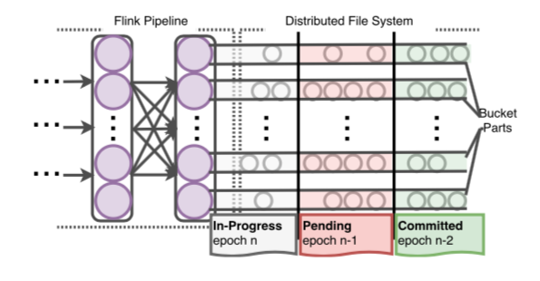

> 本文作者：Paul Lin
> 文章来源：https://www.whitewood.me

随着近来越来越多的业务迁移到 Flink 上，对 Flink 作业的准确性要求也随之进一步提高，其中最为关键的是如何在不同业务场景下保证 exactly-once 的投递语义。虽然不少实时系统（e.g. 实时计算/消息队列）都宣称支持 exactly-once，exactly-once 投递似乎是一个已被解决的问题，但是其实它们更多是针对内部模块之间的信息投递，比如 Kafka 生产（producer 到 Kafka broker）和消费（broker 到 consumer）的 exactly-once。而 Flink 作为实时计算引擎，在实际场景业务会涉及到很多不同组件，由于组件特性和定位的不同，Flink 并不是对所有组件都支持 exactly-once（见[1]），而且不同组件实现 exactly-once 的方法也有所差异，有些实现或许会带来副作用或者用法上的局限性，因此深入了解 Flink exactly-once 的实现机制对于设计稳定可靠的架构有十分重要的意义。

下文将基于 Flink 详细分析 exactly-once 的难点所在以及实现方案，而这些结论也可以推广到其他实时系统，特别是流式计算系统。

## 1. Exactly-Once 难点分析

由于在分布式系统的进程间协调需要通过网络，而网络情况在很多情况下是不可预知的，通常发送消息要考虑三种情况：正常返回、错误返回和超时，其中错误返回又可以分为可重试错误返回（e.g. 数据库维护暂时不可用）和不可重试错误返回（e.g. 认证错误），而可重试错误返回和超时都会导致重发消息，导致下游可能接收到重复的消息，也就是 at-least-once 的投递语义。而 exactly-once 是在 at-least-once 的基础之上加上了可以识别出重发数据或者将消息包装为为幂等操作的机制。

其实消息的 exactly-once 投递并不是一个分布式系统产生的新课题（虽然它一般特指分布式领域的 exactly-once），早在计算网络发展初期的 TCP 协议已经实现了网络的可靠传输。TCP 协议的 exactly-once 实现方式是将消息传递变为有状态的：首先同步建立连接，然后发送的每个数据包加上递增的序列号（sequence number），发送完毕后再同步释放连接。由于发送端和接受端都保存了状态信息（已发送数据包的序列号/已接收数据包的序列号），它们可以知道哪些数据包是缺失或重复的。

而在分布式环境下 exactly-once 则更为复杂，最大的不同点在于分布式系统需要容忍进程崩溃和节点丢失，这会带来许多问题，比如下面常见的几个：
- 进程状态需要持续化到可靠的分布式存储，以防止节点丢失带来状态的丢失。
- 由于发送消息是一个两阶段的操作（即发送消息和收到对方的确认），重启之后的进程没有办法判断崩溃前是否已经使用当前序列号发送过消息，因此可能会导致重复使用序列号的问题。
- 被认为崩溃的进程有可能并没有退出，随后再次连上来变为 zombie 进程继续发送数据。

第2点和第3点其实是同一个问题，即需要区分出原本进程和重启后的进程。对此业界已经有比较成熟的解决方案: 引入 epoch 表示进程的不同世代并用分布式协调系统来负责管理。虽然还有一些衍生的细节问题，但总体来说问题都不大。但是第1点问题造成了一个比较深远的影响，即为了减低 IO 成本，状态的保存必然是微批量（micro-batching）的而不是流式的，这会导致状态的保存总是落后于流计算进度，因而为了保证 exactly-once 流计算引擎需要实现事务回滚。

## 2. 状态 Exactly-Once 和端到端 Exactly-Once

Flink 提供 exactly-once 的状态（state）投递语义，这为有状态的（stateful）计算提供了准确性保证。其中比较容易令人混淆的一点是状态投递语义和更加常见的端到端（end to end）投递语义，而实现前者是实现后者的前置条件。

Flink 从 0.9 版本开始提供 State API，标志着 Flink 进入了 Stateful Streaming 的时代。State API 简单来说是“不受进程重启影响的“数据结构，其命名规范也与常见的数据结构一致，比如 MapState、ListState。Flink 官方提供的算子（比如 KafkaSource）和用户开发的算子都可以使用 State API 来保存状态信息。和大多数分布式系统一样 Flink 采用快照的方式来将整个作业的状态定期同步到外部存储，也就是将 State API 保存的信息以序列化的形式存储，作业恢复的时候只要读取外部存储即可将作业恢复到先前某个时间点的状态。由于从快照恢复同时会回滚数据流的处理进度，所以 State 是天然的 exactly-once 投递。

而端到端的一致性则需要上下游的外部系统配合，因为 Flink 无法将它们的状态也保存到快照并独立地回滚它们，否则就不叫作外部系统了。通常来说 Flink 的上游是可以重复读取或者消费的 pull-based 持续化存储，所以要实现 source 端的 exactly-once 只需要回滚 source 的读取进度即可（e.g. Kafka 的 offset）。而 sink 端的 exactly-once 则比较复杂，因为 sink 是 push-based 的。所谓覆水难收，要撤回发出去的消息是并不是容易的事情，因为这要求下游根据消息作出的一系列反应都是可撤回的。这就需要用 State API 来保存已发出消息的元数据，记录哪些数据是重启后需要回滚的。

下面将分析 Flink 是如何实现 exactly-once Sink 的。

## 3. Exactly-Once Sink 原理

Flink 的 exactly-once sink 均基于快照机制，按照实现原理可以分为幂等（Idempotent） sink 和事务性（Transactional） sink 两种。

### 3.1 幂等 Sink

幂等性是分布式领域里十分有用的特性，它意味着相同的操作执行一次和执行多次可以获得相同的结果，因此 at-least-once 自然等同于 exactly-once。如此一来，在从快照恢复的时候幂等 sink 便不需要对外部系统撤回已发消息，相当于回避了外部系统的状态回滚问题。比如写入 KV 数据库的 sink，由于插入一行的操作是幂等的，因此 sink 可以无状态的，在错误恢复时也不需要关心外部系统的状态。从某种意义来讲，上文提到的 TCP 协议也是利用了发送数据包幂等性来保证 exactly-once。

然而幂等 sink 的适用场景依赖于业务逻辑，如果下游业务本来就无法保证幂等性，这时就需要应用事务性 sink。

### 3.2 事务性 Sink

事务性 sink 顾名思义类似于传统 DBMS 的事务，将一系列（一般是一个 checkpoint 内）的所有输出包装为一个逻辑单元，理想的情况下提供 ACID 的事务保证。之所以说是“理想的情况下”，主要是因为 sink 依赖于目标输出系统的事务保证，而分布式系统对于事务的支持并不一定很完整，比如 HBase 就不支持跨行事务，再比如 HDFS 等文件系统是不提供事务的，这种情况下 sink 只可以在客户端的基础上再包装一层来尽最大努力地提供事务保证。

然而仅有下游系统本身提供的事务保证对于 exactly-once sink 来说是不够的，因为同一个 sink 的子任务（subtask）会有多个，对于下游系统来说它们是处在不同会话和事务中的，并不能保证操作的原子性，因此 exactly-once sink 还需要实现分布式事务来达到所有 subtask 的一致 commit 或 rollback。由于 sink 事务生命周期是与 checkpoint 一一对应的，或者说 checkpoint 本来就是实现作业状态持久化的分布式事务，sink 的分布式事务也理所当然可以通过 checkpoint 机制提供的 hook 来实现。

Checkpoint 提供给算子的 hook 有 CheckpointedFunction 和 CheckpointListener 两个，前者在算子进行 checkpoint 快照时被调用，后者在 checkpoint 成功后调用。为了简单起见 Flink 结合上述两个接口抽象出 exactly-once sink 的通用逻辑抽象 TwoPhaseCommitSinkFunction 接口，从命名即可看出这是对两阶段提交协议的一个实现，其主要方法如下:
- beginTransaction: 初始化一个事务。在有新数据到达并且当前事务为空时调用。
- preCommit: 预提交数据，即不再写入当前事务并准好提交当前事务。在 sink 算子进行快照的时候调用。
- commit: 正式提交数据，将准备好的事务提交。在作业的 checkpoint 完成时调用。
- abort: 放弃事务。在作业 checkpoint 失败的时候调用。

下面以 Bucketing File Sink 作为例子来说明如何基于异步 checkpoint 来实现事务性 sink。

Bucketing File Sink 是 Flink 提供的一个 FileSystem Connector，用于将数据流写到固定大小的文件里。Bucketing File Sink 将文件分为三种状态，in-progress/pending/committed，分别表示正在写的文件、写完准备提交的文件和已经提交的文件。

运行时，Bucketing File Sink 首先会打开一个临时文件并不断地将收到的数据写入（相当于事务的 beginTransaction 步骤），这时文件处于 in-progress。直到这个文件因为大小超过阈值或者一段时间内没有新数据写入，这时文件关闭并变为 pending 状态（相当于事务的 pre-commit 步骤）。由于 Flink checkpoint 是异步的，可能有多个并发的 checkpoint，Bucketing File Sink 会记录 pending 文件对应的 checkpoint epoch，当某个 epoch 的 checkpoint 完成后，Bucketing File Sink 会收到 callback 并将对应的文件改为 committed 状态。这是通过原子操作重命名来完成的，因此可以保证 pre-commit 的事务要么 commit 成功要么 commit 失败，不会出现其他中间状态。

Commit 出现错误会导致作业自动重启，重启后 Bucketing File Sink 本身已被恢复为上次 checkpoint 时的状态，不过仍需要将文件系统的状态也恢复以保证一致性。从 checkpoint 恢复后对应的事务会再次重试 commit，它会将记录的 pending 文件改为 committed 状态，记录的 in-progress 文件 truncate 到 checkpoint 记录下来的 offset，而其余未被记录的 pending 文件和 in-progress 文件都将被删除。

上面主要围绕事务保证的 AC 两点（Atomicity 和 Consistency），而在 I（Isolation）上 Flink exactly-once sink 也有不同的实现方式。实际上由于 Flink 的流计算特性，当前事务的未 commit 数据是一直在积累的，根据缓存未 commit 数据的地方的不同，可以将事务性 sink 分为两种实现方式:
- 在 sink 端缓存未 commit 数据，等 checkpoint 完成以后将缓存的数据 flush 到下游。这种方式可以提供 read-committed 的事务隔离级别，但同时由于未 commit 的数据不会发往下游（与 checkpoint 同步），sink 端缓存会带来一定的延迟，相当于退化为与 checkpoint 同步的 micro-batching 模式。
- 在下游系统缓存未 commit 数据，等 checkpoint 完成后通知下游 commit。这样的好处是数据是流式发往下游的，不会在每次 checkpoint 完成后出现网络 IO 的高峰，并且事务隔离级别可以由下游设置，下游可以选择低延迟弱一致性的 read-uncommitted 或高延迟强一致性的 read-committed。

在 Bucketing File Sink 的例子中，处于 in-progress 和 pending 状态的文件默认情况下都是隐藏文件（在实践中是使用下划线作为文件名前缀，HDFS 的 FileInputFormat 会将其过滤掉），只有 commit 成功后文件才对用户是可见的，即提供了 read-committed 的事务隔离性。理想的情况下 exactly-once sink 都应该使用在下游系统缓存未 commit 数据的方式，因为这最为符合流式计算的理念。最为典型的是下游系统本来就支持事务，那么未 commit 的数据很自然地就是缓存在下游系统的，否则 sink 可以选择像上例的 Bucketing File Sink 一样在下游系统的用户层面实现自己的事务，或者 fallback 到等待数据变为 committed 再发出的 micro-batching 模式。

## 4. 总结

Exactly-once 是实时系统最为关键的准确性要求，也是当前限制大部分分布式实时系统应用到准确性要求更高的业务场景（比如在线事务处理 OLTP）的问题之一。目前来说流式计算的 exactly-once 在理论上已经有了很大的突破，而 Flink 社区也在积极汲取最先进的思想和实践经验。随着 Flink 在 exactly-once 上的技术愈发成熟，结合 Flink 本身的流处理特性，相信在不远的将来，除了构造数据分析、数据管道应用， Flink 也可以在微服务领域占有一席之地。

## 5. 参考文献

- [Fault Tolerance Guarantees of Data Sources and Sinks](https://ci.apache.org/projects/flink/flink-docs-release-1.6/dev/connectors/guarantees.html)
- [An Overview of End-to-End Exactly-Once Processing in Apache Flink](https://flink.apache.org/features/2018/03/01/end-to-end-exactly-once-apache-flink.html)
- [State Management in Apache Flink](http://www.vldb.org/pvldb/vol10/p1718-carbone.pdf)
