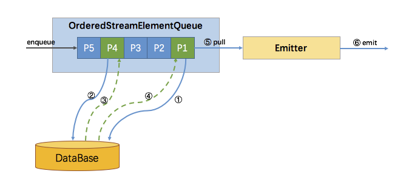

## 1. 背景

Async I/O 是阿里巴巴贡献给社区的一个呼声非常高的特性，于 1.2 版本引入。主要目的是为了解决与外部系统交互时网络延迟成为了系统瓶颈的问题。

流计算系统中经常需要与外部系统进行交互，比如需要查询外部数据库以关联上用户的额外信息。通常，我们的实现方式是向数据库发送用户 a 的查询请求，然后等待结果返回，在这之前，我们无法发送用户 b 的查询请求。这是一种同步访问的模式，如下图左边所示。


> 图片来自官方文档

图中棕色的长条表示等待时间，可以发现网络等待时间极大地阻碍了吞吐和延迟。为了解决同步访问的问题，异步模式可以并发地处理多个请求和回复。也就是说，你可以连续地向数据库发送用户 a、b、c 等的请求，与此同时，哪个请求的回复先返回了就处理哪个回复，从而连续的请求之间不需要阻塞等待，如上图右边所示。这也正是 Async I/O 的实现原理。

## 2. Async I/O

使用 Async I/O 的前提是需要一个支持异步请求的客户端。当然，没有异步请求客户端的话也可以将同步客户端丢到线程池中执行作为异步客户端。Flink 提供了非常简洁的 API，让用户只需要关注业务逻辑，一些脏活累活比如消息顺序性和一致性保证都由框架处理了，多么棒的事情！

使用方式如下方代码片段所示（来自官网文档）：
```
/** 'AsyncFunction' 的一个实现，向数据库发送异步请求并设置回调 */
class AsyncDatabaseRequest extends AsyncFunction[String, (String, String)] {

    /** 可以异步请求的特定数据库的客户端 */
    lazy val client: DatabaseClient = new DatabaseClient(host, post, credentials)

    /** future 的回调的执行上下文（当前线程） */
    implicit lazy val executor: ExecutionContext = ExecutionContext.fromExecutor(Executors.directExecutor())

    override def asyncInvoke(str: String, asyncCollector: AsyncCollector[(String, String)]): Unit = {

        // 发起一个异步请求，返回结果的 future
        val resultFuture: Future[String] = client.query(str)

        // 设置请求完成时的回调: 将结果传递给 collector
        resultFuture.onSuccess {
            case result: String => asyncCollector.collect(Iterable((str, result)));
        }
    }
}

// 创建一个原始的流
val stream: DataStream[String] = ...

// 添加一个 async I/O 的转换
val resultStream: DataStream[(String, String)] =
    AsyncDataStream.(un)orderedWait(
      stream, new AsyncDatabaseRequest(),
      1000, TimeUnit.MILLISECONDS, // 超时时间
      100)  // 进行中的异步请求的最大数量
```
AsyncDataStream 有两个静态方法，orderedWait 和 unorderedWait，对应了两种输出模式：有序和无序:
- 有序：消息的发送顺序与接受到的顺序相同（包括 watermark ），也就是先进先出。
- 无序：
  - 在 ProcessingTime 的情况下，完全无序，先返回的结果先发送。
  - 在 EventTime 的情况下，watermark 不能超越消息，消息也不能超越 watermark，也就是说 watermark 定义了顺序的边界。在两个 watermark 之间的消息的发送是无序的，但是在 watermark 之后的消息不能先于该 watermark 之前的消息发送。

## 3. 原理实现

AsyncDataStream.(un)orderedWait  的主要工作就是创建了一个 AsyncWaitOperator。AsyncWaitOperator 是支持异步 IO 访问的算子实现，该算子会运行 AsyncFunction 并处理异步返回的结果，其内部原理如下图所示：


如图所示，AsyncWaitOperator 主要由两部分组成：StreamElementQueue 和 Emitter。StreamElementQueue 是一个 Promise 队列，所谓 Promise 是一种异步抽象表示将来会有一个值（参考 Scala Promise 了解更多），这个队列是未完成的 Promise 队列，也就是进行中的请求队列。Emitter 是一个单独的线程，负责发送消息（收到的异步回复）给下游。

图中E5表示进入该算子的第五个元素（”Element-5”），在执行过程中首先会将其包装成一个 “Promise” P5，然后将 P5 放入队列。最后调用 AsyncFunction 的 ayncInvoke 方法，该方法会向外部服务发起一个异步的请求，并注册回调。该回调会在异步请求成功返回时调用 AsyncCollector.collect 方法将返回的结果交给框架处理。实际上 AsyncCollector 是一个 Promise ，也就是P5，在调用 collect 的时候会标记 Promise 为完成状态，并通知 Emitter 线程有完成的消息可以发送了。Emitter 就会从队列中拉取完成的 Promise ，并从 Promise 中取出消息发送给下游。

### 3.1 消息的顺序性

上文提到 Async I/O 提供了两种输出模式。其实细分有三种模式: 有序，ProcessingTime 无序，EventTime 无序。Flink 使用队列来实现不同的输出模式，并抽象出一个队列的接口（StreamElementQueue），这种分层设计使得 AsyncWaitOperator 和 Emitter 不用关心消息的顺序问题。StreamElementQueue 有两种具体实现，分别是 OrderedStreamElementQueue 和 UnorderedStreamElementQueue。UnorderedStreamElementQueue 比较有意思，它使用了一套逻辑巧妙地实现完全无序和 EventTime 无序。

#### 3.1.1 有序

有序比较简单，使用一个队列就能实现。所有新进入该算子的元素（包括 watermark），都会包装成 Promise 并按到达顺序放入该队列。如下图所示，尽管 P4的结果先返回，但并不会发送，只有 P1 （队首）的结果返回了才会触发 Emitter 拉取队首元素进行发送。



#### 3.1.2  ProcessingTime 无序

ProcessingTime 无序也比较简单，因为没有 watermark，不需要协调 watermark 与消息的顺序性，所以使用两个队列就能实现，一个 uncompletedQueue 一个 completedQueue。所有新进入该算子的元素，同样的包装成 Promise 并放入 uncompletedQueue 队列，当 uncompletedQueue 队列中任意的 Promise 返回了数据，则将该 Promise 移到 completedQueue 队列中，并通知 Emitter 消费。如下图所示：


### 3.1.3 EventTime 无序

EventTime 无序类似于有序与 ProcessingTime 无序的结合体。因为有 watermark，需要协调 watermark 与消息之间的顺序性，所以 uncompletedQueue 中存放的元素从原先的 Promise 变成了 Promise 集合。如果进入算子的是消息元素，则会包装成 Promise 放入队尾的集合中。如果进入算子的是 watermark，也会包装成 Promise 并放到一个独立的集合中，再将该集合加入到 uncompletedQueue 队尾，最后再创建一个空集合加到 uncompletedQueue 队尾。这样，watermark 就成了消息顺序的边界。只有处在队首的集合中的 Promise 返回了数据，才能将该 Promise 移到 completedQueue 队列中，由 Emitter 消费发往下游。只有队首集合空了，才能处理第二个集合。这样就保证了当且仅当某个 watermark 之前所有的消息都已经被发送了，该 watermark 才能被发送。过程如下图所示：


### 3.2 快照与恢复

分布式快照机制是为了保证状态的一致性。我们需要分析哪些状态是需要快照的，哪些是不需要的。首先，已经完成回调并且已经发往下游的元素是不需要快照的。否则，会导致重发，那就不是 exactly-once 了。而已经完成回调且未发往下游的元素，加上未完成回调的元素，就是上述队列中的所有元素。

所以快照的逻辑也非常简单，(1)清空原有的状态存储，(2)遍历队列中的所有 Promise，从中取出 StreamElement（消息或 watermark）并放入状态存储中，(3)执行快照操作。

恢复的时候，从快照中读取所有的元素全部再处理一次，当然包括之前已完成回调的元素。所以在失败恢复后，会有元素重复请求外部服务，但是每个回调的结果只会被发往下游一次。

> 本文的原理和实现分析基于 Flink 1.3 版本。
