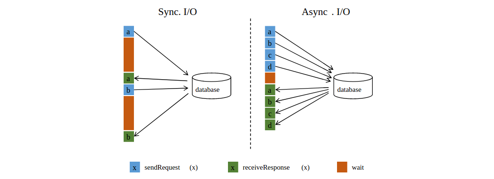

### 1. 异步IO操作的必要性

当与外部系统交互时（例如，使用存储在数据库中数据丰富数据流事件），需要注意与外部系统的通信延迟并不主导流应用程序的整体工作。访问外部数据库中的数据（例如在 `MapFunction` 中）通常意味着同步交互：将请求发送到数据库，`MapFunction` 会等待直到收到响应。在许多情况下，这个等待时间占了该函数绝大部分时间。

与外部数据库进行异步交互意味着一个并行函数实例可以并发地处理多个请求和并发地接收多个响应。那样的话，可以通过发送其他请求和接收响应来重叠等待时间。至少，等待时间可以被多个请求平摊，这在很多情况下会导致更高的流吞吐量。



通过扩展 `MapFunction` 到一个很高的并发度来提高吞吐量在一定程度上是可行的，但是常常会导致很高的资源成本：有更多的并行 `MapFunction` 实例意味着更多的任务、线程、Flink内部网络连接、与数据库之间的网络连接、缓存以及通常的内部开销。

### 2. 前提条件

如上面的部分所述，实现数据库（或key/value存储系统）适当的异步I/O访问需要该数据库的客户端支持异步请求。许多流行的数据库提供这样的客户端。在没有这样的客户端的情况下，可以尝试创建多个客户端并使用线程池处理同步调用，从而将同步客户端转换为有限的并发客户端。但是，这种方法通常比适当的异步客户端效率低。

### 3. Async I/O API

Flink 的异步 I/O API允许用户在数据流中使用异步请求客户端。API处理与数据流的集成，以及处理顺序，事件时间，容错等。

假设有一个用于目标数据库的异步客户端，要实现一个通过异步I/O来操作数据库还需要三个步骤：
- 实现调度请求的 `AsyncFunction`
- 获取操作结果并把它传递给 `ResultFuture` 的 `callBack`
- 将异步 I/O 操作作为转换操作应用于 `DataStream`

以下代码示例说明了基本模式：
```java
class AsyncDatabaseRequest extends RichAsyncFunction<String, Tuple2<String, String>> {

    /** The database specific client that can issue concurrent requests with callbacks */
    private transient DatabaseClient client;

    @Override
    public void open(Configuration parameters) throws Exception {
        client = new DatabaseClient(host, post, credentials);
    }

    @Override
    public void close() throws Exception {
        client.close();
    }

    @Override
    public void asyncInvoke(final String str, final ResultFuture<Tuple2<String, String>> resultFuture) throws Exception {

        // 发出异步请求，返回结果的 Future
        Future<String> resultFuture = client.query(str);

        // 一旦客户端的请求完成，执行回调函数
        // 回调函数只是将结果转发给 resultFuture
        resultFuture.thenAccept( (String result) -> {

            resultFuture.complete(Collections.singleton(new Tuple2<>(str, result)));

        });
    }
}

// create the original stream
DataStream<String> stream = ...;

// apply the async I/O transformation
DataStream<Tuple2<String, String>> resultStream =
    AsyncDataStream.unorderedWait(stream, new AsyncDatabaseRequest(), 1000, TimeUnit.MILLISECONDS, 100);
```
> 重要提示
> ResultFuture是在第一次调用 ResultFuture.complete 时已经完成。所有后续的 `complete` 调用都将被忽略。

以下两个参数控制异步操作：
- 超时：超时定义了异步请求在被认为失败之前可能需要多长时间。该参数防止死亡/失败请求。
- 容量：该参数定义可以同时进行多少个异步请求。尽管异步I/O方法通常会有更好的吞吐量，但是算子仍然可能是流应用程序中的瓶颈。限制并发请求的数量可以确保算子不会积压不断增长的未处理请求，但一旦容量耗尽，它将触发背压。

### 4. 结果顺序

由 `AsyncFunction` 发出的并发请求经常是以无序的形式完成，取决于哪个请求先完成。为了控制结果记录发出的顺序，Flink 提供了两种模式：
- `Unordered`：异步请求结束后立即输出结果记录。在经过异步I/O算子之后，流中记录的顺序与之前会不一样。当使用处理时间作为基本时间特性时，该模式具有最低延迟和最低开销的特性。在这种模式下使用 `AsyncDataStream.unorderedWait（...）` 函数。
- `Ordered`：在这种情况下，保留流的顺序。结果记录输出的顺利与异步请求触发的顺序(算子输入记录的顺序)一致。为此，算子必须缓冲结果记录，直到其前面所有的记录输出（或超时）为止。这通常会导致在检查点中出现一定量的额外延迟和一些开销，因为与 `Unordered` 模式相比，结果的记录在检查点状态中保持较长的一段时间。在这种模式下使用 `AsyncDataStream.orderedWait（...）` 函数。

### 5. 事件时间

当流式应用程序使用事件时间时，异步 I/O 算子能正确处理 `watermarks`。这意味着对于两个顺序模式具体如下：
- `Unordered`： `watermarks` 不会超过记录，反之亦然，这意味着 `watermarks` 建立起顺序边界。记录只在 `watermarks` 之间无序排列。只有在发布 `watermarks` 后才会发出某个 `watermarks` 后发生的记录。反过来，只有在发布 `watermarks` 前的所有输入结果记录之后才会发送 `watermarks`。这意味着，在有 `watermarks` 的情况下，`Unordered` 模式与 `Ordered` 模式一样，都引入了延迟和开销。该开销取决于 `watermarks` 发送频率。
- `Ordered`：保存记录的 `watermarks` 顺序，就像保存记录之间的顺序一样。与处理时间相比，开销没有显着变化。

请记住，提取时间是事件时间的特例，自动生成的 `watermarks` 基于数据源的处理时间。

### 6. 容错保证

异步 I/O 算子提供 `exactly-once` 语义容错保证。它将检查点中正在进行的异步请求记录存储起来，并在从故障中恢复时恢复/重新触发请求。

> 原文：[Asynchronous I/O for External Data Access](https://nightlies.apache.org/flink/flink-docs-release-1.13/docs/dev/datastream/operators/asyncio/)
