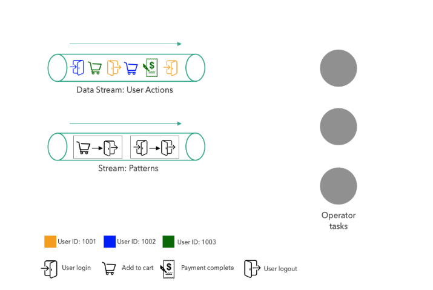
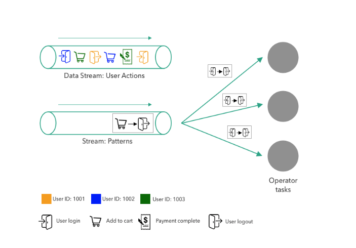
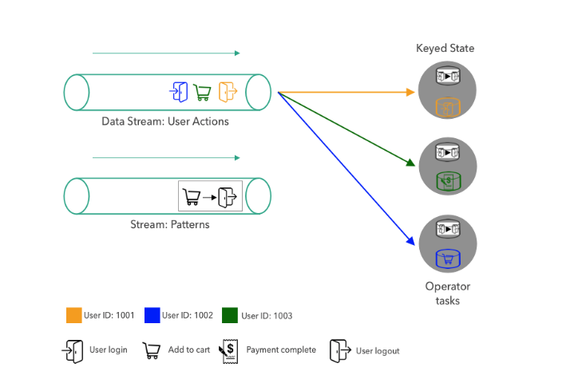

> Flink 版本 1.13.0

Flink 从 1.5.0 版本开始引入了一种新的状态，称为广播状态。在这篇文章中，我们会解释什么是广播状态以及展示一个示例来说明如何使用广播状态。

### 1. 什么是广播状态？

广播状态可以以某种方式组合处理两个事件流。第一个流的事件被广播到算子所有并行实例上，并存储在状态中。另一个流的事件不会被广播，但是会被发送到同一算子的各个实例上，并与广播流的事件一起处理。这种新的广播状态非常适合低吞吐量和高吞吐量流 Join 或需要动态更新处理逻辑的应用程序。我们将使用一个具体示例来演示如何使用广播状态，并展示具体的API。

### 2. 广播状态的动态模型评估

想象一下，一个电子商务网站获取用户所有交互行为作为用户行为流。运营该网站的公司分析交互行为以增加收入，改善用户体验，以及检测和防止恶意行为。该网站实现了一个流应用程序，用于检测用户事件流上的行为模式。但是，我们希望每次模式修改时不需要修改以及重新部署应用程序，应用程序能从模式数据流接收新模式并动态更新模式。在下文中，我们将逐步讨论此应用程序，并展示如何利用 Flink 中的广播状态功能。



我们示例应用程序接收两个数据流。第一个数据流提供在网站上的用户行为操作，在上图的左上方显示。用户交互事件由不同类型的操作（用户登录，用户退出，添加到购物车或完成支付）以及由不同颜色编码的用户ID组成。在上图中我们可以看到用户行为数据流最新三个事件分别为：1001用户的登录事件、1003用户的支付完成事件以及1002用户的添加购物车事件。

第二个流提供了动态模型评估的用户操作模式。一个模式由两个连续的行为组成。在上图中的模式流包含以下两个模式：
- 模式＃1：用户登录后并立即退出，没有浏览电子商务网站上的任何页面。
- 模式＃2：用户将物品添加到购物车并立即退出，没有进行购买。

这些模式有助于企业更好地分析用户行为，检测恶意行为并改善网站的用户体验。例如，如果商品被添加到购物车而没有后续购买，网站团队可以采取适当的措施来更好地了解用户未完成购买的原因并进行一些工作改善网站的转化率（ 如提供折扣，限时免费送货优惠等）。

在右侧，该图显示了算子的三个并发任务，该算子接收模式流和用户行为流，并在用户行为流上进行模式评估，然后向下游发送匹配的模式。为简单起见，我们示例中的算子仅计算满足单个模式的连续两个操作。当从模式流接收到新模式时，新模式会替换当前模式。原则上，还可以实现计算更复杂的模式或多个模式，这些模式可以单独添加或是删除。

我们将描述模式匹配应用程序如何处理用户操作和模式流。



首先将模式发送给算子。该模式被广播到算子的所有三个并发任务上。任务将模式存储在其广播状态中。由于广播状态只应使用广播数据进行更新，因此所有任务的状态都是一样的。



接下来，第一个用户行为根据用户ID分区并发送到算子任务上。分区可确保同一用户的所有行为都由同一个任务处理。上图显示了算子任务消费第一个模式和前三个行为事件后应用程序的状态。

当任务收到新的用户行为时，通过查看用户最新行为和前一个行为来评估当前的活跃模式。对于每个用户，算子都将前一个行为存储在 Keyed State 中。由于上图中的任务到目前为止每个用户仅收到了一个行为（因为我们刚刚才启动应用程序），因此不需要进行模式评估。最后， 最新行为会更新 Keyed State 中存储的前一个行为，以便能够在同一用户的下一个行为到达时进行查找。


在处理完前三个行为之后，下一个行为（用户1001的退出行为）被发送到处理用户 1001 的任务上。当任务接收到新行为时，从广播状态中查找当前模式以及用户1001的前一个行为。由于两个行为匹配模式（用户登录后并立即退出），因此任务发出一个模式匹配事件。最后，任务使用最新行为来覆盖 Keyed State 上的前一个行为。


当一个新模式进入了模式流，它会被广播给所有任务，并且每个并发任务通过使用新模式替换当前模式来更新其广播状态。


一旦用新模式更新了广播状态，匹配逻辑就像之前一样继续执行，即用户行为事件按 key 分区并由负责的任务进行评估。

### 3. 如何使用广播状态实现应用程序？

到目前为止，我们在理论上讨论了应用程序并解释了如何使用广播状态来计算事件流上的动态模式。接下来，我们将展示如何使用 Flink 的 DataStream API 和广播状态功能实现示例应用程序。

让我们从应用程序的输入数据开始。我们有两个数据流，行为数据流和模式数据流。在这，我们并不关心流来自何处。可以从 Kafka 或 Kinesis 或任何其他系统获取流:
```java
DataStream<String> actionsSource =
DataStream<String> patternsSource =
```
行为和模式都有两个字段：
- Action的字段：String uid, String action
- Pattern的字段：String firstAction, String secondAction

```java
// 行为流 (uid, action)
DataStream<Action> actionsStream = actionsSource
    .map(new MapFunction<String, Action>() {
        @Override
        public Action map(String str) throws Exception {
            String[] params = str.split(",");
            String uid = params[0];
            String action = params[1];
            LOG.info("[行为流] uid: " + uid + ", action: " + action);
            return new Action(uid, action);
        }
    });

// 模式流 (firstAction, secondAction)
DataStream<Pattern> patternsStream = patternsSource
    .map(new MapFunction<String, Pattern>() {
        @Override
        public Pattern map(String str) throws Exception {
            String[] params = str.split(",");
            String firstAction = params[0];
            String secondAction = params[1];
            LOG.info("[模式流] firstAction: " + firstAction + ", secondAction: " + secondAction);
            return new Pattern(firstAction, secondAction);
        }
    });
```

作为第一步，我们根据 uid 对行为流分区:
```java
KeyedStream<Action, String> actionsByUser = actionsStream.keyBy(new KeySelector<Action, String>() {
      @Override
      public String getKey(Action action) throws Exception {
          return action.uid;
      }
  });
```
下面，我们准备广播状态。广播状态始终用 MapState 表示，这是 Flink 提供的最通用的状态原语:
```java
MapStateDescriptor<Void, Pattern> stateDescriptor = new MapStateDescriptor<>(
  "patternsState", Types.VOID, Types.POJO(Pattern.class)
);
```
由于我们的应用程序一次只评估和存储一个 Pattern，因此我们将广播状态配置键为 Void 类型和值为 Pattern 类型的 MapState。Pattern 始终存储在 MapState 中，并将 null 作为键:
```java
BroadcastStream broadcastStream = patternsStream.broadcast(stateDescriptor);
```
以 MapStateDescriptor 为参数，调用模式流上的 Broadcast 转换操作，得到一个  BroadcastStream 对象 broadcastStream。
```java
DataStream<Tuple2<Long, Pattern>> matches = actionsByUser
 .connect(broadcastStream)
 .process(new PatternEvaluatorProcessFunction());
```
在我们获得 actionsByUser 行为流和 broadcastStream 广播流之后，使用 connect() 函数连接两个流并在连接的流上应用 PatternEvaluatorProcessFunction。PatternEvaluatorProcessFunction 是一个实现 KeyedBroadcastProcessFunction 接口的自定义函数。它调用了我们之前讨论过的模式匹配逻辑，并发出模式匹配的记录，其中包含用户 ID 和匹配的模式：
```java
public static class PatternEvaluatorProcessFunction
        extends KeyedBroadcastProcessFunction<String, Action, Pattern, Tuple2<String, Pattern>> {

    // 前一个行为
    private ValueState<String> prevActionState;
    // 模式
    private MapStateDescriptor<Void, Pattern> patternDesc;

    @Override
    public void open(Configuration parameters) throws Exception {
        // 初始化 KeyedState
        prevActionState = getRuntimeContext().getState(
                new ValueStateDescriptor<>("lastAction", Types.STRING)
        );
        patternDesc = new MapStateDescriptor<>("patternsState", Types.VOID, Types.POJO(Pattern.class));
    }

    @Override
    public void processElement(Action action, ReadOnlyContext ctx, Collector<Tuple2<String, Pattern>> out) throws Exception {
        String uid = action.uid;
        String lastAction = action.action;

        // 从广播状态中获取模式
        Pattern pattern = ctx.getBroadcastState(this.patternDesc)
                // access MapState with null as VOID default value
                .get(null);

        // 获取当前用户的前一个行为
        String prevAction = prevActionState.value();
        if (pattern != null && prevAction != null) {
            String firstAction = pattern.firstAction;
            String secondAction = pattern.secondAction;
            // 模式是否匹配
            boolean isMatch = false;
            if (firstAction.equals(prevAction) && secondAction.equals(lastAction)) {
                isMatch = true;
                out.collect(new Tuple2<>(ctx.getCurrentKey(), pattern));
            }
            LOG.info("[Evaluation] uid: {}, Action: [{}->{}], Pattern: [{}->{}], IsMatch: {}",
                    uid, prevAction, lastAction, firstAction, secondAction, isMatch
            );
        }
        // 用最新行为更新状态
        prevActionState.update(lastAction);
    }

    @Override
    public void processBroadcastElement(Pattern pattern, Context ctx, Collector<Tuple2<String, Pattern>> out) throws Exception {
        // 如果有新模式则更新广播状态
        BroadcastState<Void, Pattern> broadcastState = ctx.getBroadcastState(patternDesc);
        broadcastState.put(null, pattern);
    }
}
```

> 完整代码请查阅 [BroadcastStateExample](https://github.com/sjf0115/data-example/blob/master/flink-example/src/main/java/com/flink/example/stream/state/state/BroadcastStateExample.java)

KeyedBroadcastProcessFunction 接口提供了三种处理记录和发送结果的方法：
- processBroadcastElement：每次收到广播流的记录时会调用。在自定义实现中，我们只需使用 null 键将接收到的 Pattern 记录放入广播状态中（记住，我们只在 MapState 中存储一个模式）。
- processElement：每次收到行为流的记录时会调用。它提供对广播状态的只读访问权限，以防止对广播状态修改导致函数的并行实例之间有不同的广播状态。自定义函数实现中我们从广播状态查看当前的模式，并从 KeyedState 查看用户的前一个行为。如果两者都存在，就会检查上一个行为和当前行为是否与模式匹配，如果是匹配，则发送模式匹配记录。最后，用当前最新行为更新 KeyedState。
- onTimer：当之前注册过的计时器触发时被调用。计时器可以在 processElement 方法中定义，用于执行计算或是清除状态。为了保持代码的简洁性，我们没有在例子中实现这个方法，但当用户在某段时间内没有操作时，它可以用来删除最后一个操作，以避免由于非活动用户而导致状态增长；

你可能注意到了 KeyedBroadcastProcessFunction 类方法的上下文对象，提供了对其它功能的访问方法，例如：
- 广播状态（读写或只读，取决于方法），
- TimerService，可以访问记录的时间戳，当前的 Watermark，可以注册定时器，
- 当前键（仅在 processElement() 中可用）以及
- 一种将函数应用于每个已注册键的 keyed state 的方法（仅在 processBroadcastElement() 方法中可用）。

KeyedBroadcastProcessFunction 可以像任何其他 ProcessFunction 一样访问 Flink 状态和时间功能，因此可用于实现复杂的应用程序逻辑。广播状态被设计为一种适用于不同场景和用例的通用功能。虽然我们只讨论了一个相当简单且受限制的应用程序，但你可以通过多种方式使用广播状态来实现应用程序的要求。

现在我们以下面的具体行为和模式为例，具体演示一下执行过程：
```
// 模式流输入
login,logout

// 行为流输入
1001,login
1003,pay
1002,cart
1001,logout
1002,pay

// 模式流切换模式
cart,logout

// 行为流输入
1003,cart
1002,logout
1003,logout
```


### 4. 结论

在这篇博文中，我们向你介绍了一个示例应用程序，以解释 Flink 的广播状态以及它如何用于计算事件流上的动态模式。 我们还讨论了API并展示了我们的示例应用程序的源代码。

欢迎关注我的公众号和博客：


原文:[A Practical Guide to Broadcast State in Apache Flink](https://www.ververica.com/blog/a-practical-guide-to-broadcast-state-in-apache-flink)
