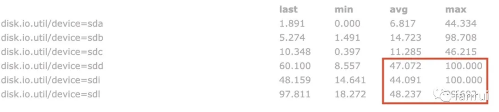
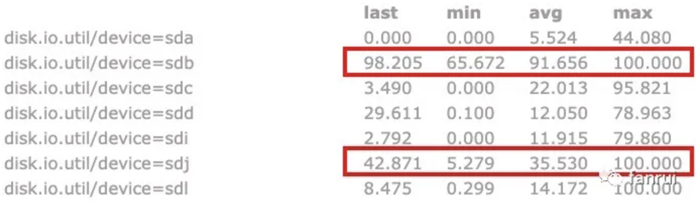

通过本文你能 get 到以下几点：
- Flink 内使用大状态时，该如何配置？
- 常见的负载均衡策略有哪些？
- Flink 源码中在选择 RocksDB 状态磁盘时，存在的问题。
- 一些解决方案，并分析了每种方案的利弊。

## 1. 为什么要优化？（优化背景）

> Flink 1.13 之后重构为 EmbeddedRocksDBStateBackend

Flink 支持多种 StateBackend，当状态比较大时目前只有 RocksDBStateBackend 可供选择。

RocksDB 是基于 LSM 树原理实现的 KV 数据库，LSM 树读放大问题比较严重，因此对磁盘性能要求比较高，强烈建议生产环境使用 SSD 作为 RocksDB 的存储介质。但是有些集群可能并没有配置 SSD，仅仅是普通的机械硬盘，当 Flink 任务比较大，且对状态访问比较频繁时，机械硬盘的磁盘 IO 可能成为性能瓶颈。在这种情况下，该如何解决此瓶颈呢？

### 1.1 使用多块硬盘来分担压力

RocksDB 使用内存加磁盘的方式存储数据，当状态比较大时，磁盘占用空间会比较大。如果对 RocksDB 有频繁的读取请求，那么磁盘 IO 会成为 Flink 任务瓶颈。

强烈建议在 flink-conf.yaml 中配置 `state.backend.rocksdb.localdir` 参数来指定 RocksDB 在磁盘中的存储目录。当一个 TaskManager 包含 3 个 slot 时，那么单个服务器上的三个并行度都对磁盘造成频繁读写，从而导致三个并行度的之间相互争抢同一个磁盘 io，这样必定导致三个并行度的吞吐量都会下降。

庆幸的是 Flink 的 `state.backend.rocksdb.localdir` 参数可以指定多个目录，一般大数据服务器都会挂载很多块硬盘，我们期望同一个 TaskManager 的三个 slot 使用不同的硬盘从而减少资源竞争。具体参数配置如下所示：
```
state.backend.rocksdb.localdir: /data1/flink/rocksdb,/data2/flink/rocksdb,/data3/flink/rocksdb,/data4/flink/rocksdb,/data5/flink/rocksdb,/data6/flink/rocksdb,/data7/flink/rocksdb,/data8/flink/rocksdb,/data9/flink/rocksdb,/data10/flink/rocksdb,/data11/flink/rocksdb,/data12/flink/rocksdb
```

> 注意：务必将目录配置到多块不同的磁盘上，不要配置单块磁盘的多个目录，这里配置多个目录是为了让多块磁盘来分担压力。

如下图所示是笔者测试过程中磁盘的 IO 使用率，可以看出三个大状态算子的并行度分别对应了三块磁盘，这三块磁盘的 IO 平均使用率都保持在 45% 左右，IO 最高使用率几乎都是 100%，而其他磁盘的 IO 平均使用率为 10% 左右，相对低很多。由此可见使用 RocksDB 做为状态后端且有大状态的频繁读写操作时，对磁盘 IO 性能消耗确实比较大。



上述属于理想情况，当设置多个 RocksDB 本地磁盘目录时，Flink 会随机选择要使用的目录，所以就可能存在三个并行度共用同一目录的情况。

如下图所示，其中两个并行度共用了 sdb 磁盘，一个并行度使用 sdj 磁盘。可以看到 sdb 磁盘的 IO 平均使用率已经达到了 91.6%，此时 sdb 的磁盘 IO 肯定会成为整个 Flink 任务的瓶颈，会导致 sdb 磁盘对应的两个并行度吞吐量大大降低，从而使得整个 Flink 任务吞吐量降低。



如果服务器挂载的硬盘数量较多，一般不会出现该情况，但是如果任务重启后吞吐量较低，可以检查是否发生了多个并行度共用同一块磁盘的情况。

Flink 可能会出现多个并行度共用同一块磁盘的问题，那该如何解决呢？

## 2. 常用的负载均衡策略

从现象来看，为 RocksDB 分配了 12 块磁盘，仅仅有 3 个并行度需要使用 3 块磁盘，但是有一定几率 2 个并行度共用同一块磁盘，甚至可能会有很小的几率 3 个并行度共用同一块磁盘。这样我们的 Flink 任务很容易因为磁盘 IO 成为瓶颈。

上述分配磁盘的策略，实际上就是业界的负载均衡策略。通用的负载均衡策略有 hash、随机以及轮循等策略。

### 2.1 Hash 策略

任务本身经过某种 hash 策略后，将压力分担到多个 Worker 上。对应到上述场景，就是将多个 slot 使用的 RocksDB 目录压力分担到多块磁盘上。但是 hash 可能会有冲突的情况，hash 冲突表示多个不同的 Flink 并行度，经过 hash 后得到的 hashCode 一样，或者 hashCode 对硬盘数量求余后被分配到同一块硬盘。

### 2.2 Random 策略

随机策略是每来一个 Flink 任务，生成一个随机数，将压力随机分配到某个 Worker 上，也就是将压力随机分配到某块磁盘。但是随机数也会存在冲突的情况。

### 2.3 Round Robin 策略

轮循策略比较容易理解，多个 Worker 轮流接收数据即可，Flink 任务第一次申请 RocksDB 目录时使用目录1，第二次申请目录时使用目录2，依次申请即可。该策略是分配任务数最均匀的策略，如果使用该策略会保证所有硬盘分配到的任务数相差最大为 1。

### 2.4 最低负载策略 / Least Response Time（最短响应时间 ）策略

根据 Worker 的响应时间来分配任务，响应时间短说明负载能力强，应该多分配一些任务。对应到上述场景就是检测各个磁盘的 IO 使用率，使用率低表示磁盘 IO 比较空闲，应该多分配任务。

### 2.5 指定权重策略

为每个 Worker 分配不同的权重值，权重值高的任务分配更多的任务，一般分配的任务数与权重值成正比。

例如 Worker0 权重值为 2，Worker1 权重为 1，则分配任务时 Worker0 分配的任务数尽量分配成 Worker1 任务数的两倍。该策略可能并不适合当前业务场景，一般相同服务器上每个硬盘的负载能力相差不会很大，除非 RocksDB 的 local dir 既包含 SSD 也包含 HDD。

## 3. 源码中如何分配磁盘？

笔者线上使用 Flink 1.8.1 版本，出现了有些硬盘分配了多个并行度，有些硬盘一个并行度都没有分配。可以大胆的猜测一下，源码中使用 hash 或者 random 的概率比较高，因为大多数情况下，每个硬盘只分到一个任务，小几率分配多个任务（要解决的就是这个小几率分配多个任务的问题）。

如果使用轮循策略，肯定会保证每个硬盘都分配一个并行度以后，才会出现单硬盘分配两个任务的情况。而且轮循策略可以保证分配的硬盘是连续的。

直接看 RocksDBStateBackend 类的部分源码：
```java
/** Base paths for RocksDB directory, as initialized.
这里就是我们上述设置的 12 个 rocksdb local dir */
private transient File[] initializedDbBasePaths;

/** The index of the next directory to be used from {@link #initializedDbBasePaths}.
下一次要使用 dir 的 index，如果 nextDirectory = 2，
则使用 initializedDbBasePaths 中下标为 2 的那个目录做为 rocksdb 的存储目录 */
private transient int nextDirectory;

// lazyInitializeForJob 方法中， 通过这一行代码决定下一次要使用 dir 的 index，
// 根据 initializedDbBasePaths.length 生成随机数，
// 如果 initializedDbBasePaths.length = 12，生成随机数的范围为 0-11
nextDirectory = new Random().nextInt(initializedDbBasePaths.length);
```

分析完简单的源码后，我们知道了源码中使用了 random 的策略来分配 dir，跟我们所看到的现象能够匹配。随机分配有小概率会出现冲突。（写这篇文章时，Flink 最新的 master 分支代码仍然是上述策略，尚未做任何改动）

## 4. 使用哪种策略更合理？

> 各种策略带来的挑战

random 和 hash 策略在任务数量比较大时，可以保证每个 Worker 承担的任务量基本一样，但是如果任务量比较小，例如将 20 个任务通过随机算法分配给 10 个 Worker 时，就会出现有的 Worker 分配不到任务，有的 Worker 可能分配到 3 或 4 个任务。所以 random 和 hash 策略不能解决 rocksdb 分配磁盘不均的痛点，那轮循策略和最低负载策略呢？

### 4.1 轮循策略

轮循策略可以解决上述问题，解决方式如下：
```java
// 在 RocksDBStateBackend 类中定义了
private static final AtomicInteger DIR_INDEX = new AtomicInteger(0);

// nextDirectory 的分配策略变成了如下代码，每次将 DIR_INDEX + 1，然后对 dir 的总数求余
nextDirectory = DIR_INDEX.getAndIncrement() % initializedDbBasePaths.length;
```
通过上述即可实现轮循策略，申请磁盘时，从 0 号磁盘开始申请，每次使用下一块磁盘即可。

- 带来的问题：
  - Java 中静态变量属于 JVM 级别的，每个 TaskManager 属于单独的 JVM，所以 TaskManager 内部保证了轮循策略。如果同一台服务器上运行多个 TaskManager，那么多个 TaskManager 都会从 index 为 0 的磁盘开始使用，所以导致 index 较小的磁盘会被经常使用，而 index 较大的磁盘可能经常不会被使用到。

■ 解决方案 1：


DIR_INDEX 初始化时，不要每次初始化为 0，可以生成一个随机数，这样可以保证不会每次使用 index 较小的磁盘，实现代码如下所示：


// 在 RocksDBStateBackend 类中定义了
private static final AtomicInteger DIR_INDEX = new AtomicInteger(new Random().nextInt(100));


但是上述方案不能完全解决磁盘冲突的问题，同一台机器上 12 块磁盘，TaskManager0 使用 index 为 0、1、2 的三块磁盘，TaskManager1 可能使用 index 为 1、2、3 的三块磁盘。结果就是 TaskManager 内部来看，实现了轮循策略保证负载均衡，但是全局来看，负载并不均衡。


■ 解决方案 2：


为了全局负载均衡，所以多个 TaskManager 之间必须通信才能做到绝对的负载均衡，可以借助第三方的存储进行通信，例如在 Zookeeper 中，为每个服务器生成一个 znode，znode 命名可以是 host 或者 ip。使用 Curator 的 DistributedAtomicInteger 来维护 DIR_INDEX 变量，存储在当前服务器对应的 znode 中，无论是哪个 TaskManager 申请磁盘，都可以使用 DistributedAtomicInteger 将当前服务器对应的 DIR_INDEX + 1，从而就可以实现全局的轮循策略。


DistributedAtomicInteger 的 increment 的思路：先使用 Zookeeper 的 withVersion api 进行 +1 操作（也就是 Zookeeper 提供的 CAS api），如果成功则成功；如果失败，则使用分布式互斥锁进行 +1 操作。


基于上述描述，我们得到两种策略来实现轮循，AtomicInteger 只能保证 TaskManager 内部的轮循，不能保证全局轮循。如果要基于全局轮循，需要借助 Zookeeper 或其他组件来实现。如果对轮循策略要求比较苛刻，可以使用基于 Zookeeper 的轮循策略，如果不想依赖外部组件则只能使用 AtomicInteger 来实现。


最低负载策略


思想就是 TaskManager 启动时，监测所有 rocksdb local dir 对应的磁盘最近 1 分钟或 5 分钟的 IO 平均使用率，筛掉 IO 使用率较高的磁盘，优先选择 IO 平均使用率较低的磁盘，同时在 IO 平均使用率较低的磁盘中，依然要使用轮循策略来实现。


■ 面临的问题


Flink 任务启动时，只能拿到磁盘当前的 IO 使用率，是一个瞬时值，会不会不靠谱？

Flink 任务启动，不可能等待任务先采集 1 分钟 IO 使用率以后，再去启动。

不想依赖外部监控系统去拿这个 IO 使用率，要考虑通用性。

假设已经拿到了所有硬盘最近 1 分钟的 IO 使用率，该如何去决策呢？

对于 IO 平均使用率较低的磁盘中，依然要使用轮循策略来实现。

IO 平均使用率较低，这里的较低不好评判，相差 10% 算低，还是 20%、30%。

而且不同的新任务对于磁盘的使用率要求也是不一样的，所以评判难度较大。


■ 新思路（discussing）


启动阶段不采集硬盘的负载压力，使用之前的 DistributedAtomicInteger 基本就可以保证每个硬盘负载均衡。但是任务启动后一段时间，如果因为 Flink 任务导致某个磁盘 IO 的平均使用率相对其他磁盘而言非常高。我们可以选择迁移高负载硬盘的数据到低负载硬盘。


基于此分析，最低负载策略比较麻烦，笔者目前尚未实现此策略。


五、总结


本文分析了目前 Flink 使用大状态时遇到的问题，并给出了多种解决方案。


目前笔者已经实现了随机、TaskManager 内轮循、基于 Zookeeper 的全局轮循三种策略，并应用到生产环境，可以直接在 flink-conf.yaml 文件中配置策略。目前来看基于 Zookeeper 的全局轮循策略非常好。之后尽量会回馈给社区。
