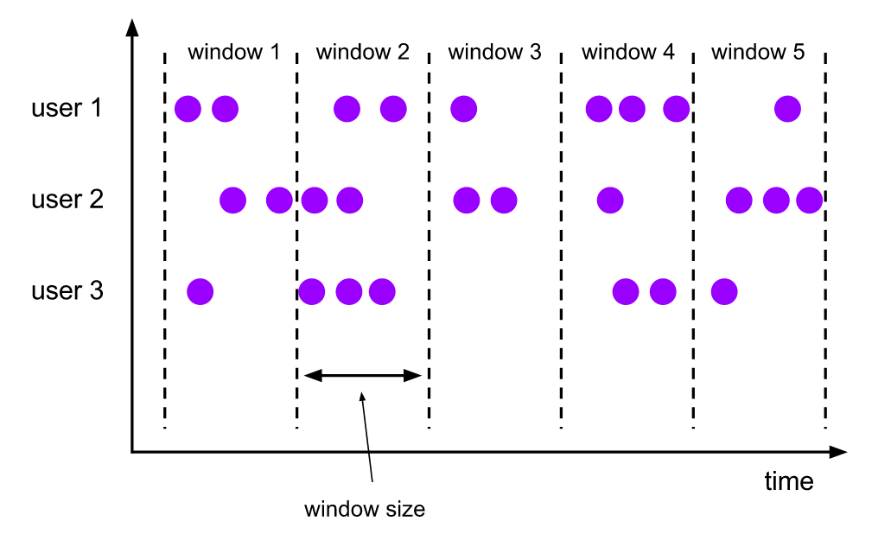
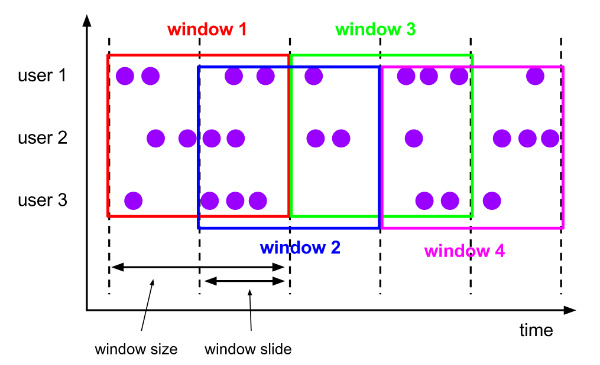
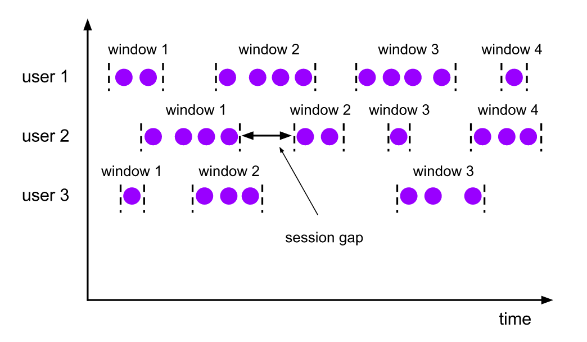
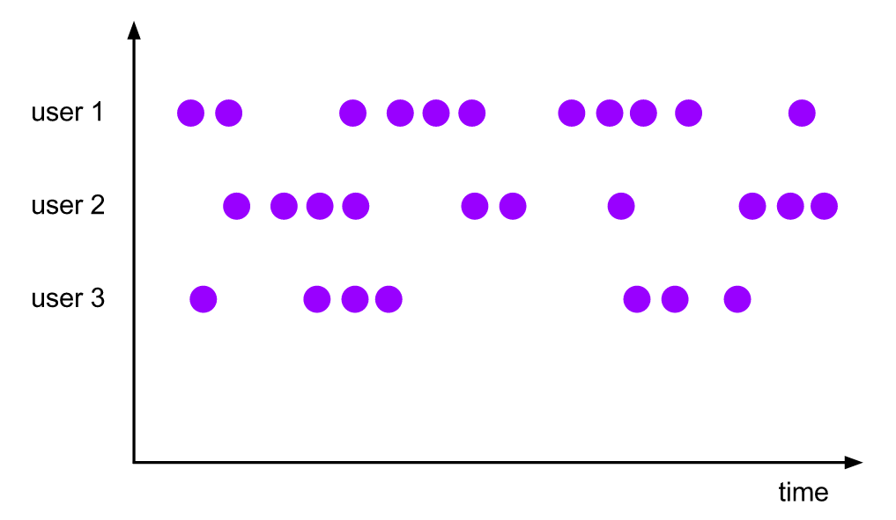

Windows(窗口)是处理无限数据流的核心。窗口将流分解成有限大小的"桶"，在上面可以进行各种计算。本文将重点介绍 Flink 中的窗口分配器 WindowAssigner。新建一个窗口算子一般必须要指定两个窗口组件：
- 一个用于决定输入流中的元素如何划分的窗口分配器 WindowAssigner。窗口分配器将元素分配到一个或者多个窗口中。
- 另一个是用于处理分配到窗口中元素的窗口函数 WindowFunction。

如下代码展示了如何在 KeyedStream 和非 KeyedStream 上指定窗口分配器和窗口函数（以及可选的触发器和剔除器，后面文章会具体介绍）的示例：
```java
// keyedStream
keyedStream
       .keyBy(...)          <-  keyed versus non-keyed windows
       .window(...)         <-  必选: 窗口分配器
      [.trigger(...)]       <-  可选: 窗口触发器
      [.evictor(...)]       <-  可选: 窗口剔除器
      [.allowedLateness()]  <-  可选：是否允许延迟
       .reduce/fold/apply() <-  必选: 窗口函数

// 非keyedStream
stream
      .windowAll(...)      <-  必选: 窗口分配器
     [.trigger(...)]       <-  可选: 窗口触发器
     [.evictor(...)]       <-  可选: 窗口剔除器
     [.allowedLateness()]  <-  可选：是否允许延迟
      .reduce/fold/apply() <-  必选: 窗口函数
```

对于在 KeyedStream 上使用窗口，要做的第一件事就是为数据流指定 key，并且必须在定义窗口之前完成。直接调用 `keyBy()` 方法就可以将无限数据流拆分成 KeyedStream。在 KeyedStream 上，事件的任何属性都可以用作 key，如何指定 key 可以参阅 [Flink 指定 keys 的几种方法](https://smartsi.blog.csdn.net/article/details/126417116?spm=1001.2014.3001.5502)。对于非 KeyedStream，原始数据流不会被拆分成多个逻辑 Keyd 数据流，并且所有窗口逻辑将由单个任务执行，即并行度为1。

在确定数据流是否指定 key 之后，下一步就是定义窗口分配器 WindowAssigners。窗口分配器定义了元素如何分配给窗口，即指定元素分配给哪个窗口。对于 KeyedStream，可以通过在 `window()` 指定你选择的窗口分配器来完成，而非 KeyedStream 则需要使用 `windowAll()`。窗口分配器负责将每个传入的元素分配给一个或多个窗口。Flink 内置了一些用于解决常见问题的窗口分配器，例如，滚动窗口，滑动窗口，会话窗口以及全局窗口等。你还可以通过继承 `WindowAssigner` 类实现自定义窗口分配器。所有内置窗口分配器(全局窗口除外)都会根据时间将元素分配给窗口，可以是处理时间，也可以是事件时间。

> 请参阅[Flink 事件时间与处理时间](https://smartsi.blog.csdn.net/article/details/126554454)，了解处理时间和事件时间之间的差异。

基于时间的窗口会有开始时间戳(闭区间)和结束时间戳(开区间)，它们共同描述了窗口的大小。在代码中，Flink 在使用基于时间的窗口时使用 TimeWindow，该窗口具有用于查询开始和结束时间戳的方法，以及用于返回给定窗口的最大允许时间戳的 maxTimestamp() 方法。

接下来我们将介绍 DataStream API 中的多种内置窗口分配器以及如何使用它们来定义窗口算子。

> 下面分配器运行图中，紫色圆圈表示数据流中的元素，根据某些 key 进行分区（在我们这个例子中为 user1，user2 和 user3），x轴显示时间进度。

## 1. 滚动窗口

滚动窗口分配器将每个元素分配给固定大小且不重叠的窗口。例如，如果指定大小为 10 分钟的滚动窗口，那么每 10 分钟都会启动一个新窗口，如下图所示:



DataStream 针对事件时间和处理时间的滚动窗口分别提供了对应的分配器 TumblingEventTimeWindows 和 TumblingProcessingTimeWindows。

以下代码显示如何使用滚动窗口：
```java
DataStream<T> input = ...;

// 基于事件时间的滚动窗口
input
    .keyBy(<key selector>)
    .window(TumblingEventTimeWindows.of(Time.seconds(5)))
    .<windowed transformation>(<window function>);

// 基于处理时间的滚动窗口
input
    .keyBy(<key selector>)
    .window(TumblingProcessingTimeWindows.of(Time.seconds(5)))
    .<windowed transformation>(<window function>);

// 基于事件时间的每日滚动窗口会-8小时的偏移。
input
    .keyBy(<key selector>)
    .window(TumblingEventTimeWindows.of(Time.days(1), Time.hours(-8)))
    .<windowed transformation>(<window function>);
```

也可以通过使用 `Time.milliseconds(x)`， `Time.seconds(x)`， `Time.minutes(x)` 来指定时间间隔。

如上面例子中所示，滚动窗口分配器还可以使用一个可选的偏移量参数，用来改变窗口的对齐方式。例如，没有偏移量的情况下，窗口大小为1小时的滚动窗口与 `epoch` （指的是一个特定的时间：`1970-01-01 00:00:00 UTC`）对齐，那么你将获得如`1:00:00.000 - 1:59:59.999`，`2:00:00.000 - 2:59:59.999` 之类的窗口。如果你想改变，可以给一个偏移量。以15分钟的偏移量为例，那么你将获得`1:15:00.000 - 2:14:59.999`，`2:15:00.000 - 3:14:59.999` 之类的窗口。偏移量的一个重要应用是将窗口调整为 `timezones` 而不是 `UTC-0`。例如，在中国，你必须指定 `Time.hours(-8)` 的偏移量。

> 滚动窗口分配器的内部实现细节，可以参阅[TumblingEventTimeWindows](https://smartsi.blog.csdn.net/article/details/126594720?spm=1001.2014.3001.5502) 和 [TumblingProcessingTimeWindows](https://smartsi.blog.csdn.net/article/details/126594720?spm=1001.2014.3001.5502)

### 1.1 基于处理时间的滚动窗口

如下是一个基于处理时间的滚动窗口，用来每10秒统计每个单词的词频：
```java
DataStream<WordCount> tumblingTimeWindowStream = words
        // 根据单词分组
        .keyBy(new KeySelector<WordCount, String>() {
            @Override
            public String getKey(WordCount wc) throws Exception {
                return wc.getWord();
            }
        })
        // 窗口大小为10秒的滚动窗口
        .window(TumblingProcessingTimeWindows.of(Time.seconds(10)))
        // 求和
        .reduce(new ReduceFunction<WordCount>() {
            @Override
            public WordCount reduce(WordCount wc1, WordCount wc2) throws Exception {
                return new WordCount(wc1.getWord(), wc1.getFrequency() + wc2.getFrequency());
            }
        });
```
运行程序输出如下信息，可以看到每10秒输出一次结果，结果是最近10秒内每个单词的词频：
```java
10:00:35,538 INFO  com.flink.example.stream.source.custom.WordCountMockSource   [] - word: flink, frequency: 7
10:00:36,538 INFO  com.flink.example.stream.source.custom.WordCountMockSource   [] - word: spark, frequency: 10
10:00:37,539 INFO  com.flink.example.stream.source.custom.WordCountMockSource   [] - word: storm, frequency: 10
10:00:38,540 INFO  com.flink.example.stream.source.custom.WordCountMockSource   [] - word: flink, frequency: 9
10:00:39,541 INFO  com.flink.example.stream.source.custom.WordCountMockSource   [] - word: spark, frequency: 5
TumblingTimeWindow> WordCount{word='flink', frequency=16}
TumblingTimeWindow> WordCount{word='storm', frequency=10}
TumblingTimeWindow> WordCount{word='spark', frequency=15}
10:00:40,541 INFO  com.flink.example.stream.source.custom.WordCountMockSource   [] - word: storm, frequency: 2
10:00:41,542 INFO  com.flink.example.stream.source.custom.WordCountMockSource   [] - word: flink, frequency: 4
10:00:42,542 INFO  com.flink.example.stream.source.custom.WordCountMockSource   [] - word: spark, frequency: 2
10:00:43,542 INFO  com.flink.example.stream.source.custom.WordCountMockSource   [] - word: storm, frequency: 6
10:00:44,543 INFO  com.flink.example.stream.source.custom.WordCountMockSource   [] - word: flink, frequency: 5
10:00:45,544 INFO  com.flink.example.stream.source.custom.WordCountMockSource   [] - word: spark, frequency: 10
10:00:46,545 INFO  com.flink.example.stream.source.custom.WordCountMockSource   [] - word: storm, frequency: 10
10:00:47,546 INFO  com.flink.example.stream.source.custom.WordCountMockSource   [] - word: flink, frequency: 10
10:00:48,546 INFO  com.flink.example.stream.source.custom.WordCountMockSource   [] - word: spark, frequency: 8
10:00:49,547 INFO  com.flink.example.stream.source.custom.WordCountMockSource   [] - word: storm, frequency: 8
TumblingTimeWindow> WordCount{word='storm', frequency=26}
TumblingTimeWindow> WordCount{word='spark', frequency=20}
TumblingTimeWindow> WordCount{word='flink', frequency=19}
10:00:50,548 INFO  com.flink.example.stream.source.custom.WordCountMockSource   [] - word: flink, frequency: 5
10:00:51,549 INFO  com.flink.example.stream.source.custom.WordCountMockSource   [] - word: spark, frequency: 3
10:00:52,549 INFO  com.flink.example.stream.source.custom.WordCountMockSource   [] - word: storm, frequency: 2
10:00:53,549 INFO  com.flink.example.stream.source.custom.WordCountMockSource   [] - word: flink, frequency: 7
10:00:54,549 INFO  com.flink.example.stream.source.custom.WordCountMockSource   [] - word: spark, frequency: 10
10:00:55,549 INFO  com.flink.example.stream.source.custom.WordCountMockSource   [] - word: storm, frequency: 4
10:00:56,550 INFO  com.flink.example.stream.source.custom.WordCountMockSource   [] - word: flink, frequency: 9
10:00:57,551 INFO  com.flink.example.stream.source.custom.WordCountMockSource   [] - word: spark, frequency: 1
10:00:58,552 INFO  com.flink.example.stream.source.custom.WordCountMockSource   [] - word: storm, frequency: 4
10:00:59,552 INFO  com.flink.example.stream.source.custom.WordCountMockSource   [] - word: flink, frequency: 4
TumblingTimeWindow> WordCount{word='flink', frequency=25}
TumblingTimeWindow> WordCount{word='storm', frequency=10}
TumblingTimeWindow> WordCount{word='spark', frequency=14}
10:01:00,553 INFO  com.flink.example.stream.source.custom.WordCountMockSource   [] - word: spark, frequency: 2
10:01:01,553 INFO  com.flink.example.stream.source.custom.WordCountMockSource   [] - word: storm, frequency: 5
10:01:02,553 INFO  com.flink.example.stream.source.custom.WordCountMockSource   [] - word: flink, frequency: 7
10:01:03,554 INFO  com.flink.example.stream.source.custom.WordCountMockSource   [] - word: spark, frequency: 4
10:01:04,555 INFO  com.flink.example.stream.source.custom.WordCountMockSource   [] - word: storm, frequency: 6
10:01:05,556 INFO  com.flink.example.stream.source.custom.WordCountMockSource   [] - word: flink, frequency: 1
10:01:06,557 INFO  com.flink.example.stream.source.custom.WordCountMockSource   [] - word: spark, frequency: 8
10:01:07,558 INFO  com.flink.example.stream.source.custom.WordCountMockSource   [] - word: storm, frequency: 9
10:01:08,558 INFO  com.flink.example.stream.source.custom.WordCountMockSource   [] - word: flink, frequency: 4
10:01:09,558 INFO  com.flink.example.stream.source.custom.WordCountMockSource   [] - word: spark, frequency: 9
TumblingTimeWindow> WordCount{word='spark', frequency=23}
TumblingTimeWindow> WordCount{word='flink', frequency=12}
TumblingTimeWindow> WordCount{word='storm', frequency=20}
```

### 1.2 基于事件时间的滚动窗口

## 2. 滑动窗口

滑动窗口分配器将每个元素分配给固定窗口大小的窗口。与滚动窗口分配器类似，窗口的大小由 `window size` 参数配置。还有一个`window slide`参数用来控制滑动窗口的滑动大小。因此，如果滑动大小小于窗口大小，则滑动窗口会重叠。在这种情况下，一个元素会被分配到多个窗口中。

例如，窗口大小为10分钟，滑动大小为5分钟的窗口。这样，每5分钟会生成一个窗口，每个窗口包含最后10分钟内到达的事件，如下图所示：



```java
DataStream<T> input = ...;

// 基于事件时间的滑动窗口
input
    .keyBy(<key selector>)
    .window(SlidingEventTimeWindows.of(Time.seconds(10), Time.seconds(5)))
    .<windowed transformation>(<window function>);

// 基于处理时间的滑动窗口
input
    .keyBy(<key selector>)
    .window(SlidingProcessingTimeWindows.of(Time.seconds(10), Time.seconds(5)))
    .<windowed transformation>(<window function>);

// 基于处理时间的滑动窗口 偏移量-8
input
    .keyBy(<key selector>)
    .window(SlidingProcessingTimeWindows.of(Time.hours(12), Time.hours(1), Time.hours(-8)))
    .<windowed transformation>(<window function>);
```

> 滑动窗口分配器的内部实现细节，可以参阅[SlidingEventTimeWindows](https://smartsi.blog.csdn.net/article/details/126594720?spm=1001.2014.3001.5502) 和 [SlidingProcessingTimeWindows](https://smartsi.blog.csdn.net/article/details/126594720?spm=1001.2014.3001.5502)

### 2.1 基于处理时间的滑动窗口

如下是一个基于处理时间的滑动窗口，用来每5秒统计最近10秒内的每个单词的词频：
```java
// 滑动窗口 每5s统计最近10秒内的每个单词个数
DataStream<WordCount> slidingWindowStream = words
        // 根据单词分组
        .keyBy(new KeySelector<WordCount, String>() {
            @Override
            public String getKey(WordCount wc) throws Exception {
                return wc.getWord();
            }
        })
        // 窗口大小为10秒、滑动步长为5秒的滑动窗口
        .window(SlidingProcessingTimeWindows.of(Time.seconds(10), Time.seconds(5)))
        // 求和
        .reduce(new ReduceFunction<WordCount>() {
            @Override
            public WordCount reduce(WordCount wc1, WordCount wc2) throws Exception {
                return new WordCount(wc1.getWord(), wc1.getFrequency() + wc2.getFrequency());
            }
        });
```
> 源码：[ProcessingTimeWindowExample](https://github.com/sjf0115/flink-example/blob/main/flink-example-1.13/src/main/java/com/flink/example/stream/window/assigner/ProcessingTimeWindowExample.java)

运行程序输出如下信息，可以看到每5秒输出一次结果，结果是最近10秒内每个单词的词频：
```java
10:06:11,351 INFO  com.flink.example.stream.source.custom.WordCountMockSource   [] - word: flink, frequency: 6
10:06:12,352 INFO  com.flink.example.stream.source.custom.WordCountMockSource   [] - word: spark, frequency: 3
10:06:13,353 INFO  com.flink.example.stream.source.custom.WordCountMockSource   [] - word: storm, frequency: 9
10:06:14,354 INFO  com.flink.example.stream.source.custom.WordCountMockSource   [] - word: flink, frequency: 9
SlidingWindow> WordCount{word='flink', frequency=15}
SlidingWindow> WordCount{word='spark', frequency=3}
SlidingWindow> WordCount{word='storm', frequency=9}
10:06:15,354 INFO  com.flink.example.stream.source.custom.WordCountMockSource   [] - word: spark, frequency: 10
10:06:16,355 INFO  com.flink.example.stream.source.custom.WordCountMockSource   [] - word: storm, frequency: 9
10:06:17,356 INFO  com.flink.example.stream.source.custom.WordCountMockSource   [] - word: flink, frequency: 6
10:06:18,356 INFO  com.flink.example.stream.source.custom.WordCountMockSource   [] - word: spark, frequency: 5
10:06:19,356 INFO  com.flink.example.stream.source.custom.WordCountMockSource   [] - word: storm, frequency: 4
SlidingWindow> WordCount{word='flink', frequency=21}
SlidingWindow> WordCount{word='spark', frequency=18}
SlidingWindow> WordCount{word='storm', frequency=22}
10:06:20,357 INFO  com.flink.example.stream.source.custom.WordCountMockSource   [] - word: flink, frequency: 9
10:06:21,357 INFO  com.flink.example.stream.source.custom.WordCountMockSource   [] - word: spark, frequency: 2
10:06:22,358 INFO  com.flink.example.stream.source.custom.WordCountMockSource   [] - word: storm, frequency: 10
10:06:23,358 INFO  com.flink.example.stream.source.custom.WordCountMockSource   [] - word: flink, frequency: 5
10:06:24,359 INFO  com.flink.example.stream.source.custom.WordCountMockSource   [] - word: spark, frequency: 7
SlidingWindow> WordCount{word='spark', frequency=24}
SlidingWindow> WordCount{word='flink', frequency=20}
SlidingWindow> WordCount{word='storm', frequency=23}
10:06:25,360 INFO  com.flink.example.stream.source.custom.WordCountMockSource   [] - word: storm, frequency: 2
10:06:26,360 INFO  com.flink.example.stream.source.custom.WordCountMockSource   [] - word: flink, frequency: 6
10:06:27,361 INFO  com.flink.example.stream.source.custom.WordCountMockSource   [] - word: spark, frequency: 9
10:06:28,362 INFO  com.flink.example.stream.source.custom.WordCountMockSource   [] - word: storm, frequency: 10
10:06:29,363 INFO  com.flink.example.stream.source.custom.WordCountMockSource   [] - word: flink, frequency: 3
SlidingWindow> WordCount{word='flink', frequency=23}
SlidingWindow> WordCount{word='storm', frequency=22}
SlidingWindow> WordCount{word='spark', frequency=18}
10:06:30,364 INFO  com.flink.example.stream.source.custom.WordCountMockSource   [] - word: spark, frequency: 2
10:06:31,364 INFO  com.flink.example.stream.source.custom.WordCountMockSource   [] - word: storm, frequency: 10
10:06:32,365 INFO  com.flink.example.stream.source.custom.WordCountMockSource   [] - word: flink, frequency: 8
10:06:33,366 INFO  com.flink.example.stream.source.custom.WordCountMockSource   [] - word: spark, frequency: 7
10:06:34,367 INFO  com.flink.example.stream.source.custom.WordCountMockSource   [] - word: storm, frequency: 2
SlidingWindow> WordCount{word='storm', frequency=24}
SlidingWindow> WordCount{word='spark', frequency=18}
SlidingWindow> WordCount{word='flink', frequency=17}
10:06:35,368 INFO  com.flink.example.stream.source.custom.WordCountMockSource   [] - word: flink, frequency: 6
10:06:36,369 INFO  com.flink.example.stream.source.custom.WordCountMockSource   [] - word: spark, frequency: 8
10:06:37,369 INFO  com.flink.example.stream.source.custom.WordCountMockSource   [] - word: storm, frequency: 6
10:06:38,370 INFO  com.flink.example.stream.source.custom.WordCountMockSource   [] - word: flink, frequency: 1
10:06:39,371 INFO  com.flink.example.stream.source.custom.WordCountMockSource   [] - word: spark, frequency: 8
SlidingWindow> WordCount{word='spark', frequency=25}
SlidingWindow> WordCount{word='flink', frequency=15}
SlidingWindow> WordCount{word='storm', frequency=18}
10:06:40,372 INFO  com.flink.example.stream.source.custom.WordCountMockSource   [] - word: storm, frequency: 6
10:06:41,372 INFO  com.flink.example.stream.source.custom.WordCountMockSource   [] - word: flink, frequency: 3
10:06:42,373 INFO  com.flink.example.stream.source.custom.WordCountMockSource   [] - word: spark, frequency: 9
10:06:43,374 INFO  com.flink.example.stream.source.custom.WordCountMockSource   [] - word: storm, frequency: 2
10:06:44,374 INFO  com.flink.example.stream.source.custom.WordCountMockSource   [] - word: flink, frequency: 6
SlidingWindow> WordCount{word='flink', frequency=16}
SlidingWindow> WordCount{word='storm', frequency=14}
SlidingWindow> WordCount{word='spark', frequency=25}
```

## 3. 会话窗口

会话窗口分配器通过活动会话对元素进行分组。与滚动窗口和滑动窗口相比，会话窗口不会重叠，也没有固定的开始和结束时间。当会话窗口在一段时间内没有接收到元素时会关闭。会话窗口分配器需要配置一个会话间隙，定义了所需的不活动时长。当此时间段到期时，当前会话关闭，后续元素被分配到新的会话窗口。



```java
DataStream<T> input = ...;

// 基于事件时间的会话窗口
input
    .keyBy(<key selector>)
    .window(EventTimeSessionWindows.withGap(Time.minutes(10)))
    .<windowed transformation>(<window function>);

// 基于处理时间的会话窗口
input
    .keyBy(<key selector>)
    .window(ProcessingTimeSessionWindows.withGap(Time.minutes(10)))
    .<windowed transformation>(<window function>);
```

由于会话窗口没有固定的开始时间和结束时间，因此它们的执行与滚动窗口和滑动窗口不同。在内部，会话窗口算子为每个到达记录创建一个新窗口，如果它们之间的距离比定义的间隙要小，那么窗口会合并在一起。为了能合并，会话窗口算子需要一个合并触发器和合并窗口函数，例如，ReduceFunction 、AggregateFunction 或 ProcessWindowFunction。

## 4. 全局窗口

全局窗口分配器将具有相同 key 的所有元素分配给同一个全局窗口。仅当我们指定自定义触发器时，窗口才起作用。否则，不会执行任何计算，因为全局窗口没有我们可以处理聚合元素的自然结束的点（译者注：即本身自己不知道窗口的大小，计算多长时间的元素）。



```java
DataStream<T> input = ...;

input
    .keyBy(<key selector>)
    .window(GlobalWindows.create())
    .<windowed transformation>(<window function>);
```

> 全局窗口分配器的内部实现细节，可以参阅[GlobalWindows](https://smartsi.blog.csdn.net/article/details/126594720?spm=1001.2014.3001.5502)
