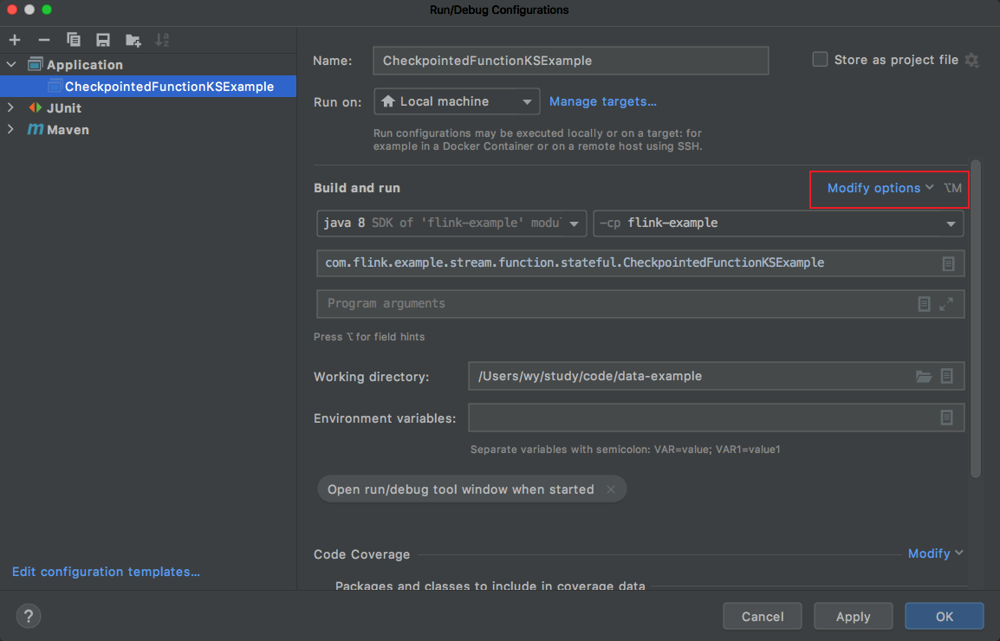
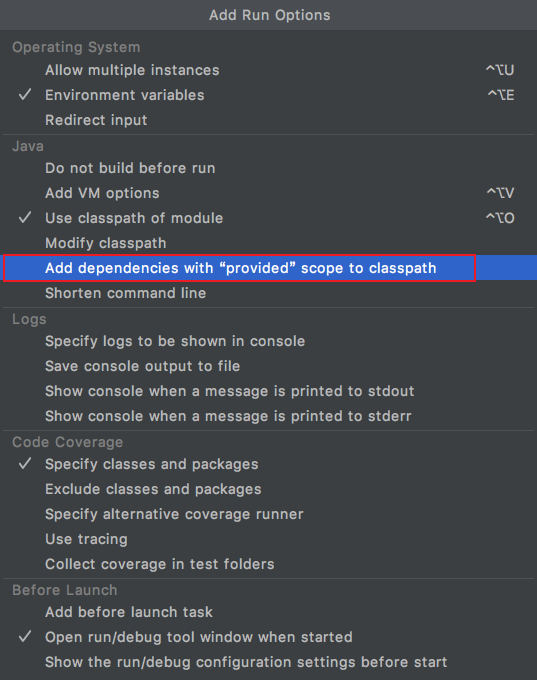
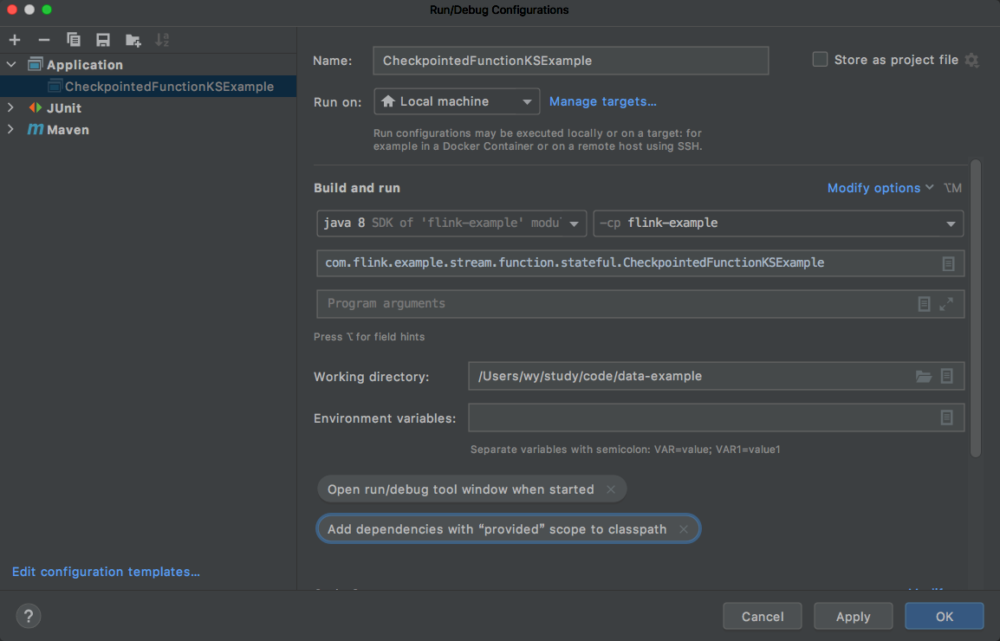

## 1. 问题

本地运行 Flink DataStream 示例时，抛出如下异常：
```java
Exception in thread "main" java.lang.NoClassDefFoundError: org/apache/flink/api/common/functions/MapFunction
	at java.lang.Class.getDeclaredMethods0(Native Method)
	at java.lang.Class.privateGetDeclaredMethods(Class.java:2701)
	at java.lang.Class.privateGetMethodRecursive(Class.java:3048)
	at java.lang.Class.getMethod0(Class.java:3018)
	at java.lang.Class.getMethod(Class.java:1784)
	at sun.launcher.LauncherHelper.validateMainClass(LauncherHelper.java:544)
	at sun.launcher.LauncherHelper.checkAndLoadMain(LauncherHelper.java:526)
Caused by: java.lang.ClassNotFoundException: org.apache.flink.api.common.functions.MapFunction
	at java.net.URLClassLoader.findClass(URLClassLoader.java:381)
	at java.lang.ClassLoader.loadClass(ClassLoader.java:424)
	at sun.misc.Launcher$AppClassLoader.loadClass(Launcher.java:338)
	at java.lang.ClassLoader.loadClass(ClassLoader.java:357)
	... 7 more
```

## 2. 解决方案

从上面报错中很明显的知道是没有找到 class，很奇怪的是我们明明在 pom.xml 文件里面引入了呀？后来仔细观察 pom.xml 文件：
```xml
<dependency>
    <groupId>org.apache.flink</groupId>
    <artifactId>flink-streaming-java_${scala.binary.version}</artifactId>
    <version>${flink.version}</version>
    <scope>provided</scope>
</dependency>
```
我们看到 `org/apache/flink/api/common/functions/MapFunction` 类所在依赖项 `flink-streaming-java_2.11` 的 scope 属性设置为 `provided`。因为这些依赖项是 Flink 核心依赖项，在实际运行时已经被加载，只需要对它们进行编译，不应将它们打包到项目生成的应用程序 jar 文件中。但是我们在本地进行编译和测试的时候却需要，一种方法是在本地运行模式下注释或者去掉 `provided`：
```xml
<dependency>
    <groupId>org.apache.flink</groupId>
    <artifactId>flink-streaming-java_${scala.binary.version}</artifactId>
    <version>${flink.version}</version>
</dependency>
```
这种方式虽然解决了本地运行模式下的问题，但是正式打包生成的应用程序 jar 文件时又需要，不得不又重新修改回来。

为了避免来回修改 pom 文件中的 scope 属性设置，我们可以修改 Flink 应用的配置项，选择 Edit Configurations 菜单项：


点击 `Modify options`：



然后勾选 `Add dependencies with "provided" scope to classpath` 或者 `Include dependencies with provided scope`（取决于你的 IDE）：



最终配置效果如下所示：



通过这种方式，无论是本地模式运行还是打包提交到集群运行都不需要修改 scope 属性设置。
