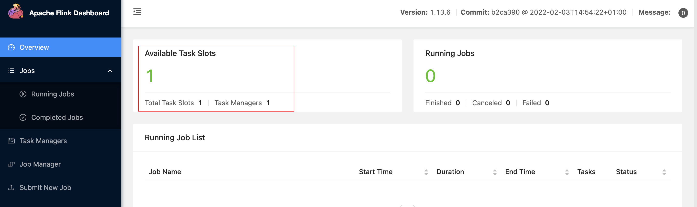

## 1. 问题

安装 Flink 1.13.6 集群之后启动，访问 Web UI 却发现 Task Slots 为 0，没有可用的 Task Slots。

## 2. 分析

首选要通过查看日志来判断是否有异常。日志文件全部都在 flink-1.13.6/log 路径下，查阅 `flink-smartsi-taskexecutor-0-smarsi.out` 日志发现如下异常信息：
```
Error: VM option 'UseG1GC' is experimental and must be enabled via -XX:+UnlockExperimentalVMOptions.
Error: Could not create the Java Virtual Machine.
Error: A fatal exception has occurred. Program will exit.
```

从上述异常信息中可以知道：
- JVM 认为你尝试使用的虚拟机选项 `-XX:+UseG1GC` 是一个实验性（Experimental） 功能。
- 为了防止用户无意中使用可能不稳定的实验功能，JVM要求必须显式地“解锁”这些选项。这就是为什么它提示你必须通过 `-XX:+UnlockExperimentalVMOptions` 来启用。
- 直接后果时由于 JVM 参数校验失败，Java 虚拟机根本无法创建，导致 Kafka 服务进程启动失败并退出。

这个问题的根源在于 JVM 版本的变迁 和 Flink 默认配置的冲突。在这由于我们使用的 Flink 比较新的版本，其 TaskManager 启动脚本中默认的 JVM 参数配置包含了 `-XX:+UseG1GC`，但由于我们使用的是 JDK 8 比较低的版本，所以导致冲突。

## 3. 解决方案

### 3.1 方案1：升级 Java 版本

这是最根本、最推荐的解决方案。

### 3.2 方案2：修改 Flink 启动参数（临时或兼容性方案）

如果你因某些原因暂时无法升级 Java，可以修改 Flink 的 TaskManager 启动脚本，增加解锁实验性选项的参数。

打开 `bin/taskmanager.sh` 文件，找到设置 JVM 参数的地方。通常你会在文件中看到类似这样的代码：
```bash
# if no other JVM options are set, set the GC to G1
if [ -z "${FLINK_ENV_JAVA_OPTS}" ] && [ -z "${FLINK_ENV_JAVA_OPTS_TM}" ]; then
    export JVM_ARGS="$JVM_ARGS -XX:+UseG1GC"
fi
```
我们只需要修改 `JVM_ARGS` 配置添加 `-XX:+UnlockExperimentalVMOptions` 即可:
```bash
export JVM_ARGS="$JVM_ARGS -XX:+UnlockExperimentalVMOptions -XX:+UseG1GC"
```

重启集群观察是否恢复：


