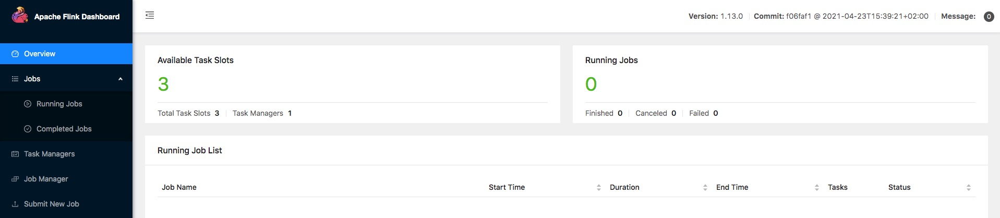
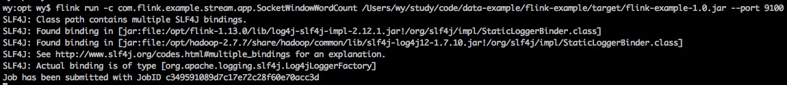
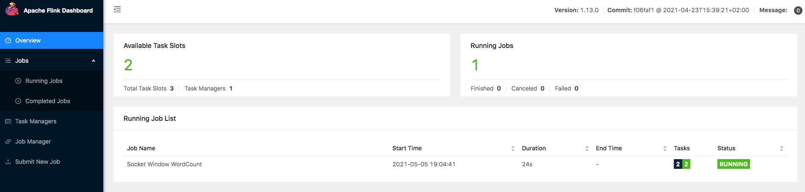

> Flink版本：1.13.0

### 1. 下载

Flink 可以运行在 Linux, Mac OS X和Windows上。为了运行 Flink, 唯一的要求是安装Java 8 或 11。Windows 用户, 请查看 Flink在Windows上的安装指南。你可以使用以下命令检查 Java 当前运行的版本：
```
java -version
```
如果你安装的是Java 8，输出结果类似于如下:
```
java version "1.8.0_91"
Java(TM) SE Runtime Environment (build 1.8.0_91-b14)
Java HotSpot(TM) 64-Bit Server VM (build 25.91-b14, mixed mode)
```

目前 Flink 最新版本为 [1.13.0](https://flink.apache.org/downloads.html)，从下载页下载一个二进制的包，你可以选择你需要的 Scala版本，在这我们选择 scala-2.11。下载完成之后运行如下命令解压缩到指定的工作目录下：
```
tar -zxvf flink-1.13.0-bin-scala_2.11.tgz -C /opt/
```

> 因为我们要在 Zeppelin 中提交以及运行 Flink 代码，Zeppelin 仅支持 scala-2.11，尚不支持 scala-2.12，所以我们选择 scala-2.11。

为了以后升级方便，运行如下命令创建软连接：
```
ln -s flink-1.13.0/ flink
```
为防止端口号冲突，我们这修改如下参数指定端口号：
```
rest.port: 8090
```
> 默认端口号为8081

### 2. 启动本地集群

使用如下命令启动 Flink：
```
./bin/start-cluster.sh
```
通过访问 http://localhost:8090 检查JobManager网页，确保所有组件都启动并已运行：



### 3. Example Code

你可以在 GitHub 上找到 SocketWindowWordCount 例子的完整代码，这我们提供了一个[Java](https://github.com/sjf0115/flink-example/blob/main/flink-example-1.13/src/main/java/com/flink/example/stream/app/wordcount/SocketWindowWordCount.java)版本：
```java
public class SocketWindowWordCount {
    public static void main(String[] args) throws Exception {
        // 1. 通过 ParameterTool 解析参数
        final String hostname;
        final int port;
        try {
            final ParameterTool params = ParameterTool.fromArgs(args);
            hostname = params.has("hostname") ? params.get("hostname") : "localhost";
            port = params.getInt("port");
        }
        catch (Exception e) {
            System.err.println("No port specified. Please run 'SocketWindowWordCount " +
                    "--hostname <hostname> --port <port>', where hostname (localhost by default) " +
                    "and port is the address of the text server");
            System.err.println("To start a simple text server, run 'netcat -l <port>' and " +
                    "type the input text into the command line");
            return;
        }
        // 2. 创建StreamExecutionEnvironment
        final StreamExecutionEnvironment env = StreamExecutionEnvironment.getExecutionEnvironment();
        // 3. 连接Socket获取数据
        DataStream<String> text = env.socketTextStream(hostname, port, "\n");
        // 4. 输入字符串解析为<单词,出现次数>
        DataStream<Tuple2<String, Integer>> wordsCount = text.flatMap(new FlatMapFunction<String, Tuple2<String, Integer>>() {
            @Override
            public void flatMap(String value, Collector out) {
                for (String word : value.split("\\s")) {
                    out.collect(Tuple2.of(word, 1));
                }
            }
        });
        // 5. 分组窗口计算
        DataStream<Tuple2<String, Integer>> windowCount = wordsCount
                .keyBy(new KeySelector<Tuple2<String, Integer>, String>() {
                    @Override
                    public String getKey(Tuple2<String, Integer> tuple) throws Exception {
                        return tuple.f0;
                    }
                })
                .timeWindow(Time.seconds(5))
                .reduce(new ReduceFunction<Tuple2<String, Integer>>() {
                    @Override
                    public Tuple2 reduce(Tuple2<String, Integer> a, Tuple2<String, Integer> b) {
                        return new Tuple2(a.f0, a.f1 + b.f1);
                    }
                });
        // 6. 输出结果并开始执行
        windowCount.print().setParallelism(1);
        // 7. 开启作业
        env.execute("Socket Window WordCount");
    }
}
```

### 4. 运行Example

现在, 我们可以运行 Flink 应用程序。这个例子将会从一个 Socket 中读取一段文本，并且每隔5秒打印之前5秒内每个单词出现的个数。首先，我们通过 netcat 命令来启动本地服务：
```
nc -l 9100
```
> 在这我们约定端口号为 9100

启动本地服务之后我们就可以通过如下命令提交 Flink 应用程序：



提交 Flink 应用程序之后我们可以通过 Web 界面来查看我们提交的任务：



单词的个数在5秒的时间窗口中进行累加（使用处理时间和滚动窗口），并打印在控制台。假设我们输入数据如下：
```
hello flink hello spark hello storm hello hadoop
```
在控制台输出如下结果数据：
```
(hello,4)
(hadoop,1)
(storm,1)
(spark,1)
(flink,1)
```
