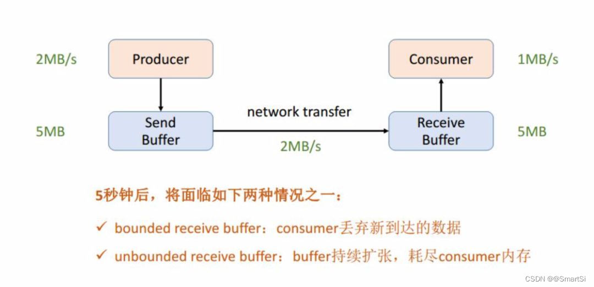
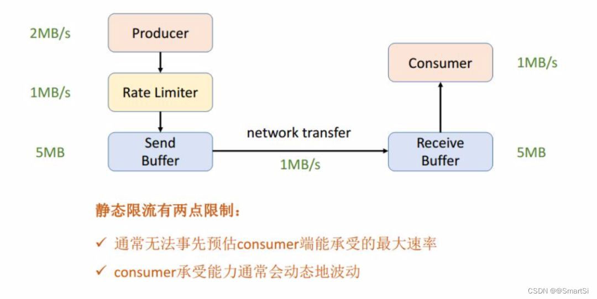

**前言：** 本文根据 Apache Flink 系列直播整理而成，由 Apache Flink Contributor、OPPO 大数据平台研发负责人张俊老师分享，社区志愿者张友亮整理。主要内容如下：
- 网络流控的概念与背景
- TCP 的流控机制
- Flink TCP-based 反压机制（before V1.5）
- Flink Credit-based 反压机制 （since V1.5）
- 总结与思考

## 1. 网络流控的概念与背景

### 1.1 为什么需要网络流控

首先我们可以看下这张最精简的网络流控的图，Producer 的吞吐率是 2MB/s，Consumer 是 1MB/s，这个时候我们就会发现在网络通信的时候我们的 Producer 的速度是比 Consumer 要快的，有 1MB/s 的这样的速度差，假定我们两端都有一个 Buffer，Producer 端有一个发送用的 Send Buffer，Consumer 端有一个接收用的 Receive Buffer，在网络端的吞吐率是 2MB/s，过了 5s 后我们的 Receive Buffer 可能就撑不住了，这时候会面临两种情况：
- 如果 Receive Buffer 是有界的，这时候新到达的数据就只能被丢弃掉了。
- 如果 Receive Buffer 是无界的，Receive Buffer 会持续的扩张，最终会导致 Consumer 的内存耗尽。

### 1.2 网络流控的实现：静态限速

为了解决这个问题，我们就需要网络流控来解决上下游速度差的问题，传统的做法可以在 Producer 端实现一个类似 Rate Limiter 这样的静态限流，Producer 的发送速率是 2MB/s，但是经过限流这一层后，往 Send Buffer 去传数据的时候就会降到 1MB/s 了，这样的话 Producer 端的发送速率跟 Consumer 端的处理速率就可以匹配起来了，就不会导致上述问题。但是这个解决方案有两点限制：
- 事先无法预估 Consumer 到底能承受多大的速率；
- Consumer 的承受能力通常会动态地波动。

### 1.3 网络流控的实现：动态反馈/自动反压

针对静态限速的问题我们就演进到了动态反馈（自动反压）的机制，我们需要 Consumer 能够及时的给 Producer 做一个 feedback，即告知 Producer 能够承受的速率是多少。动态反馈分为两种：
- 负反馈：接受速率小于发送速率时发生，告知 Producer 降低发送速率；
- 正反馈：发送速率小于接收速率时发生，告知 Producer 可以把发送速率提上来。

让我们来看几个经典案例：

**案例一**：Storm 反压实现

上图就是 Storm 里实现的反压机制，可以看到 Storm 在每一个 Bolt 都会有一个监测反压的线程（Backpressure Thread），这个线程一但检测到 Bolt 里的接收队列（recv queue）出现了严重阻塞就会把这个情况写到 ZooKeeper 里，ZooKeeper 会一直被 Spout 监听，监听到有反压的情况就会停止发送，通过这样的方式匹配上下游的发送接收速率。

**案例二**：Spark Streaming 反压实现

Spark Streaming 里也有做类似这样的 feedback 机制，上图 Fecher 会实时的从 Buffer、Processing 这样的节点收集一些指标然后通过 Controller 把速度接收的情况再反馈到 Receiver，实现速率的匹配。

**疑问：为什么 Flink（before V1.5）里没有用类似的方式实现 feedback 机制**？首先在解决这个疑问之前我们需要先了解一下 Flink 的网络传输是一个什么样的架构。

这张图就体现了 Flink 在做网络传输的时候基本的数据的流向，发送端在发送网络数据前要经历自己内部的一个流程，会有一个自己的 Network Buffer，在底层用 Netty 去做通信，Netty 这一层又有属于自己的 ChannelOutbound Buffer，因为最终是要通过 Socket 做网络请求的发送，所以在 Socket 也有自己的 Send Buffer，同样在接收端也有对应的三级 Buffer。学过计算机网络的时候我们应该了解到，TCP 是自带流量控制的。实际上 Flink （before V1.5）就是通过 TCP 的流控机制来实现 feedback 的。

## 2. TCP 流控机制
根据下图我们来简单的回顾一下 TCP 包的格式结构。首先，他有 Sequence number 这样一个机制给每个数据包做一个编号，还有 ACK number 这样一个机制来确保 TCP 的数据传输是可靠的，除此之外还有一个很重要的部分就是 Window Size，接收端在回复消息的时候会通过 Window Size 告诉发送端还可以发送多少数据。

接下来我们来简单看一下这个过程。TCP 流控：滑动窗口

TCP 的流控就是基于滑动窗口的机制，现在我们有一个 Socket 的发送端和一个 Socket 的接收端，目前我们的发送端的速率是我们接收端的 3 倍，这样会发生什么样的一个情况呢？假定初始的时候我们发送的 window 大小是 3，然后我们接收端的 window 大小是固定的，就是接收端的 Buffer 大小为 5。

首先，发送端会一次性发 3 个 packets，将 1，2，3 发送给接收端，接收端接收到后会将这 3 个 packets 放到 Buffer 里去。

接收端一次消费 1 个 packet，这时候 1 就已经被消费了，然后我们看到接收端的滑动窗口会往前滑动一格，这时候 2，3 还在 Buffer 当中 而 4，5，6 是空出来的，所以接收端会给发送端发送 ACK = 4 ，代表发送端可以从 4 开始发送，同时会将 window 设置为 3 （Buffer 的大小 5 减去已经存下的 2 和 3），发送端接收到回应后也会将他的滑动窗口向前移动到 4，5，6。

这时候发送端将 4，5，6 发送，接收端也能成功的接收到 Buffer 中去。

到这一阶段后，接收端就消费到 2 了，同样他的窗口也会向前滑动一个，这时候他的 Buffer 就只剩一个了，于是向发送端发送 ACK = 7、window = 1。发送端收到之后滑动窗口也向前移，但是这个时候就不能移动 3 格了，虽然发送端的速度允许发 3 个 packets 但是 window 传值已经告知只能接收一个，所以他的滑动窗口就只能往前移一格到 7 ，这样就达到了限流的效果，发送端的发送速度从 3 降到 1。

我们再看一下这种情况，这时候发送端将 7 发送后，接收端接收到，但是由于接收端的消费出现问题，一直没有从 Buffer 中去取，这时候接收端向发送端发送 ACK = 8、window = 0 ，由于这个时候 window = 0，发送端是不能发送任何数据，也就会使发送端的发送速度降为 0。这个时候发送端不发送任何数据了，接收端也不进行任何的反馈了，那么如何知道消费端又开始消费了呢？

TCP 当中有一个 ZeroWindowProbe 的机制，发送端会定期的发送 1 个字节的探测消息，这时候接收端就会把 window 的大小进行反馈。当接收端的消费恢复了之后，接收到探测消息就可以将 window 反馈给发送端端了从而恢复整个流程。TCP 就是通过这样一个滑动窗口的机制实现 feedback。

## 3. Flink TCP-based反压机制（before V1.5）
### 3.1 示例：WindowWordCount

大体的逻辑就是从 Socket 里去接收数据，每 5s 去进行一次 WordCount，将这个代码提交后就进入到了编译阶段。

### 3.2 编译阶段：生成 JobGraph

这时候还没有向集群去提交任务，在 Client 端会将 StreamGraph 生成 JobGraph，JobGraph 就是做为向集群提交的最基本的单元。在生成 JobGrap 的时候会做一些优化，将一些没有 Shuffle 机制的节点进行合并。有了 JobGraph 后就会向集群进行提交，进入运行阶段。

### 3.3 运行阶段：调度 ExecutionGraph

JobGraph 提交到集群后会生成 ExecutionGraph ，这时候就已经具备基本的执行任务的雏形了，把每个任务拆解成了不同的 SubTask，上图 ExecutionGraph 中的 Intermediate Result Partition 就是用于发送数据的模块，最终会将 ExecutionGraph 交给 JobManager 的调度器，将整个 ExecutionGraph 调度起来。

然后我们概念化这样一张物理执行图，可以看到每个 Task 在接收数据时都会通过这样一个 InputGate 可以认为是负责接收数据的，再往前有这样一个 ResultPartition 负责发送数据，在 ResultPartition 又会去做分区跟下游的 Task 保持一致，就形成了 ResultSubPartition 和 InputChannel 的对应关系。这就是从逻辑层上来看的网络传输的通道，基于这么一个概念我们可以将反压的问题进行拆解。

### 3.4 问题拆解：反压传播两个阶段

反压的传播实际上是分为两个阶段的，对应着上面的执行图，我们一共涉及 3 个 TaskManager，在每个 TaskManager 里面都有相应的 Task 在执行，还有负责接收数据的 InputGate，发送数据的 ResultPartition，这就是一个最基本的数据传输的通道。在这时候假设最下游的 Task （Sink）出现了问题，处理速度降了下来这时候是如何将这个压力反向传播回去呢？这时候就分为两种情况：
- 跨 TaskManager ，反压如何从 InputGate 传播到 ResultPartition。
- TaskManager 内，反压如何从 ResultPartition 传播到 InputGate。

### 3.5 跨 TaskManager 数据传输

前面提到，发送数据需要 ResultPartition，在每个 ResultPartition 里面会有分区 ResultSubPartition，中间还会有一些关于内存管理的 Buffer。对于一个 TaskManager 来说会有一个统一的 Network BufferPool 被所有的 Task 共享，在初始化时会从 Off-heap Memory 中申请内存，申请到内存的后续内存管理就是同步 Network BufferPool 来进行的，不需要依赖 JVM GC 的机制去释放。有了 Network BufferPool 之后可以为每一个 ResultSubPartition 创建 Local BufferPool 。

如上图左边的 TaskManager 的 Record Writer 写了 <1，2> 这个两个数据进来，因为 ResultSubPartition 初始化的时候为空，没有 Buffer 用来接收，就会向 Local BufferPool 申请内存，这时 Local BufferPool 也没有足够的内存于是将请求转到 Network BufferPool，最终将申请到的 Buffer 按原链路返还给 ResultSubPartition，<1，2> 这个两个数据就可以被写入了。

之后会将 ResultSubPartition 的 Buffer 拷贝到 Netty 的 Buffer 当中最终拷贝到 Socket 的 Buffer 将消息发送出去。然后接收端按照类似的机制去处理将消息消费掉。接下来我们来模拟上下游处理速度不匹配的场景，发送端的速率为 2，接收端的速率为 1，看一下反压的过程是怎样的。

### 3.6 跨 TaskManager 反压过程

因为速度不匹配就会导致一段时间后 InputChannel 的 Buffer 被用尽，于是他会向 Local BufferPool 申请新的 Buffer ，这时候可以看到 Local BufferPool 中的一个 Buffer 就会被标记为 Used。

发送端还在持续以不匹配的速度发送数据，然后就会导致 InputChannel 向 Local BufferPool 申请 Buffer 的时候发现没有可用的 Buffer 了，这时候就只能向 Network BufferPool 去申请，当然每个 Local BufferPool 都有最大的可用的 Buffer，防止一个 Local BufferPool 把 Network BufferPool 耗尽。这时候看到 Network BufferPool 还是有可用的 Buffer 可以向其申请。

一段时间后，发现 Network BufferPool 没有可用的 Buffer，或是 Local BufferPool 的最大可用 Buffer 到了上限无法向 Network BufferPool 申请，没有办法去读取新的数据，这时 Netty AutoRead 就会被禁掉，Netty 就不会从 Socket 的 Buffer 中读取数据了。

显然，再过不久 Socket 的 Buffer 也被用尽，这时就会将 Window = 0 发送给发送端（前文提到的 TCP 滑动窗口的机制）。这时发送端的 Socket 就会停止发送。

很快发送端的 Socket 的 Buffer 也被用尽，Netty 检测到 Socket 无法写了之后就会停止向 Socket 写数据。

Netty 停止写了之后，所有的数据就会阻塞在 Netty 的 Buffer 当中了，但是 Netty 的 Buffer 是无界的，可以通过 Netty 的水位机制中的 high watermark 控制他的上界。当超过了 high watermark，Netty 就会将其 channel 置为不可写，ResultSubPartition 在写之前都会检测 Netty 是否可写，发现不可写就会停止向 Netty 写数据。

这时候所有的压力都来到了 ResultSubPartition，和接收端一样他会不断的向 Local BufferPool 和 Network BufferPool 申请内存。

Local BufferPool 和 Network BufferPool 都用尽后整个 Operator 就会停止写数据，达到跨 TaskManager 的反压。

### 3.7 TaskManager 内反压过程
了解了跨 TaskManager 反压过程后再来看 TaskManager 内反压过程就更好理解了，下游的 TaskManager 反压导致本 TaskManager 的 ResultSubPartition 无法继续写入数据，于是 Record Writer 的写也被阻塞住了，因为 Operator 需要有输入才能有计算后的输出，输入跟输出都是在同一线程执行， Record Writer 阻塞了，Record Reader 也停止从 InputChannel 读数据，这时上游的 TaskManager 还在不断地发送数据，最终将这个 TaskManager 的 Buffer 耗尽。具体流程可以参考下图，这就是 TaskManager 内的反压过程。

## 4. Flink Credit-based 反压机制（since V1.5）
### 4.1 TCP-based 反压的弊端

在介绍 Credit-based 反压机制之前，先分析下 TCP 反压有哪些弊端。

在一个 TaskManager 中可能要执行多个 Task，如果多个 Task 的数据最终都要传输到下游的同一个 TaskManager 就会复用同一个 Socket 进行传输，这个时候如果单个 Task 产生反压，就会导致复用的 Socket 阻塞，其余的 Task 也无法使用传输，checkpoint barrier 也无法发出导致下游执行 checkpoint 的延迟增大。

依赖最底层的 TCP 去做流控，会导致反压传播路径太长，导致生效的延迟比较大。

### 4.2 引入 Credit-based 反压
这个机制简单的理解起来就是在 Flink 层面实现类似 TCP 流控的反压机制来解决上述的弊端，Credit 可以类比为 TCP 的 Window 机制。

### 4.3 Credit-based 反压过程

如图所示在 Flink 层面实现反压机制，就是每一次 ResultSubPartition 向 InputChannel 发送消息的时候都会发送一个 backlog size 告诉下游准备发送多少消息，下游就会去计算有多少的 Buffer 去接收消息，算完之后如果有充足的 Buffer 就会返还给上游一个 Credit 告知他可以发送消息（图上两个 ResultSubPartition 和 InputChannel 之间是虚线是因为最终还是要通过 Netty 和 Socket 去通信），下面我们看一个具体示例。

假设我们上下游的速度不匹配，上游发送速率为 2，下游接收速率为 1，可以看到图上在 ResultSubPartition 中累积了两条消息，10 和 11， backlog 就为 2，这时就会将发送的数据 <8,9> 和 backlog = 2 一同发送给下游。下游收到了之后就会去计算是否有 2 个 Buffer 去接收，可以看到 InputChannel 中已经不足了这时就会从 Local BufferPool 和 Network BufferPool 申请，好在这个时候 Buffer 还是可以申请到的。

过了一段时间后由于上游的发送速率要大于下游的接受速率，下游的 TaskManager 的 Buffer 已经到达了申请上限，这时候下游就会向上游返回 Credit = 0，ResultSubPartition 接收到之后就不会向 Netty 去传输数据，上游 TaskManager 的 Buffer 也很快耗尽，达到反压的效果，这样在 ResultSubPartition 层就能感知到反压，不用通过 Socket 和 Netty 一层层地向上反馈，降低了反压生效的延迟。同时也不会将 Socket 去阻塞，解决了由于一个 Task 反压导致 TaskManager 和 TaskManager 之间的 Socket 阻塞的问题。

## 5. 总结与思考
### 5.1 总结
- 网络流控是为了在上下游速度不匹配的情况下，防止下游出现过载。
- 网络流控有静态限速和动态反压两种手段。
- Flink 1.5 之前是基于 TCP 流控 + bounded buffer 实现反压。
- Flink 1.5 之后实现了自己托管的 credit - based 流控机制，在应用层模拟 TCP 的流控机制。

### 5.2 思考
有了动态反压，静态限速是不是完全没有作用了？

实际上动态反压不是万能的，我们流计算的结果最终是要输出到一个外部的存储（Storage），外部数据存储到 Sink 端的反压是不一定会触发的，这要取决于外部存储的实现，像 Kafka 这样是实现了限流限速的消息中间件可以通过协议将反压反馈给 Sink 端，但是像 ES 无法将反压进行传播反馈给 Sink 端，这种情况下为了防止外部存储在大的数据量下被打爆，我们就可以通过静态限速的方式在 Source 端去做限流。

所以说动态反压并不能完全替代静态限速的，需要根据合适的场景去选择处理方案。

原文:[咱们从头到尾讲一次 Flink 网络流控和反压剖析](https://mp.weixin.qq.com/s/6kqUEkJdsZgMIknqSPlzbQ)
