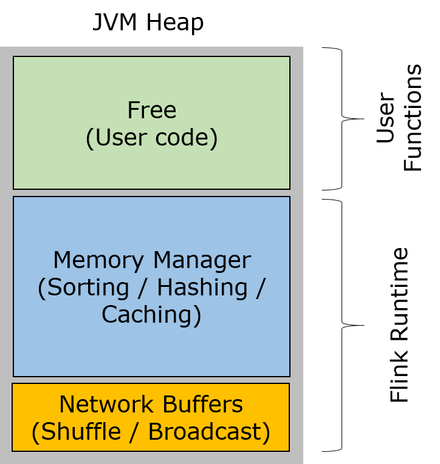
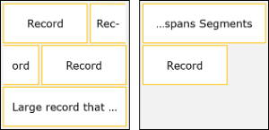
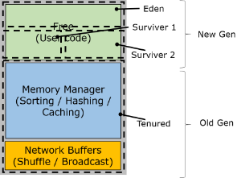

### 1. 概述

Flink中的内存管理用于控制特定运行时操作使用的内存量。内存管理用于所有累积（可能很大）了一定数量记录的操作。
这种操作的典型例子是：
- 排序 `Sorting` - 排序用于对分组，连接后的记录进行排序以及生成排序结果。
- 哈希表 `Hash Tables` - 哈希表用于连接 `join` 中以及迭代中的解集(使用它们进行分组和聚合)。
- 缓存 `Caching` - 缓存数据对于迭代算法以及作业恢复期间的检查点非常重要。
- `(Block-)Nested-Loop-Join` - 此算法用于数据集之间的笛卡尔乘积。

如果没有管理/控制内存的方法，当要排序（或哈希）的数据大于 `JVM` 可以备用的内存（通常会抛出 `OutOfMemoryException`）时，这些操作将会失败。内存管理是一种非常精确地控制每个算子使用多少内存的方法，并且通过将一些数据移动到磁盘上来让他们高效地脱离内核操作。究竟发生了什么取决于具体的操作/算法（见下文）。

内存管理还允许在同一个 `JVM` 中为消耗内存的不同算子划分内存。这样，`Flink` 可以确保不同的算子在同一个 `JVM` 中相互临近运行，不会相互干扰。

> 备注: 目前为止，内存管理仅在批处理算子中使用。流处理算子遵循不同的理念。

### 2. Flink的内存管理

从概念上讲，`Flink` 将堆分成三个区域：
- `Network buffers` ： 一定数量的 32KB 大小的缓冲区 `buffer`，网络堆栈使用它缓冲网络传输（`Shuffle`，`Broadcast`）的记录。在 `TaskManager` 启动时分配。默认分配 2048 个缓冲区，但可以通过 `taskmanager.network.numberOfBuffers` 参数进行调整。
- `Memory Manager pool` : 一个大的缓冲区 `buffer` （32 KB）集合（译者注：可理解为缓冲池），每当需要缓冲记录时，所有运行时算法（`Sorting`，`Hashing`，`Caching`）使用这些缓冲区缓冲记录。记录以序列形式存储在这些块中。内存管理器在启动时分配这些缓冲区。
- `Remaining (Free) Heap` : 这部分堆留给用户代码和 `TaskManager` 的数据结构使用。由于这些数据结构比较小，所以这部分内存基本都是给用户代码使用的。

在分配 `Network buffers` 和 `MemoryManager buffers` 的同时，`JVM` 通常会执行一个或多个 `Full GC`。这会导致 `TaskManager` 的启动时多增加一些时间，但是在执行任务时会节省垃圾回收时间（saves in garbage collection time later）。`Network buffers` 和 `MemoryManager buffers` 在 `TaskManager` 的整个生命周期中存在。他们转移到 `JVM` 的内部存储区域的老年代，成为存活更长时间，不被回收的对象。

> 注意:
- 缓冲区的大小可以通过 `taskmanager.network.bufferSizeInBytes` 进行调整，在大多数情况下，`32K` 已经是一个不错的大小了。
- 有想法去如何统一 `NetworkBuffer Pool`和 `Memory Manager` 区域。
- 有想法添加一个模式，由 `MemoryManager` 惰性分配（需要时分配）内存缓冲区。这会减少 `TaskManager` 的启动时间，但是当实际分配缓冲区时，会导致更多的垃圾回收。

### 3. Memory Segments

`Flink` 将其所有内存表示为内存段的集合。内存段表示一个内存区域（默认为32 KB），并提供根据偏移量访问数据的各种方法（get/put longs，int，bytes，段和数组之间的复制...）。你可以将其视为专用于 `Flink` 的 `java.nio.ByteBuffer` 的一个版本（请参阅下面为什么我们不使用 `java.nio.ByteBuffer`）。

每当 `Flink` 在某个地方存储记录时，它实际上将其序列化到一个或多个内存段中。系统可以在另一个数据结构中存储一个指向该记录的 `指针`（通常也构建为内存段的集合）。这意味着 `Flink` 依靠高效的序列化来识别页面以及实现记录跨越不同页面。为了这个目的，`Flink` 带来了自己的类型信息系统和序列化堆栈。

序列化到 `Memory Segments` 的一组记录

序列化格式由 `Flink` 的序列化器定义，并知道记录的各个字段。尽管这个特性目前还没有广泛使用（此博客写于2015年），但它允许在处理过程中部分反序列化记录，以提高性能。

为了进一步提高性能，使用 `Memory Segments` 的算法尝试可以在序列化的数据上工作。这是通过可扩展类型实用类 [TypeSerializer](https://github.com/apache/flink/blob/master/flink-core/src/main/java/org/apache/flink/api/common/typeutils/TypeSerializer.java) 和 [TypeComparator](https://github.com/apache/flink/blob/master/flink-core/src/main/java/org/apache/flink/api/common/typeutils/TypeComparator.java) 实现的。例如，分类器中的大多数比较可以归结为比较某些页面的字节（如memcmp）即可。这样，使用一起使用序列化和序列化数据的具有更高性能，同时也能够控制分配的内存量。

`MemoryManager` 管理 `Memory Segments`，并将它们提供给请求它们的算法，并在算法完成后进行垃圾收集。因此算法显式地请求内存（考虑32k的分配）并释放它。

算法有一个严格的预算，可以使用多少内存（多少页）。当内存使用完时，他们必须回退到一个`out-of-core variant`。 这是一个非常健壮的机制，不会考虑堆碎片和数据大小的估计。由于数据已经在序列化页面，因此在内存和磁盘之间移动数据非常容易。

#### 3.1 Memory Segments vs ByteBuffers

为什么 `Flink` 不能简单地使用 `java.nio.ByteBuffer`？ `MemorySegment` 相对 `ByteBuffer `有一些优点：
- 在其字节数组上使用了 `sun.misc.Unsafe` 方法，因此像 `long` 这样的类型的获取要容易得多（不需要移位）。
- 只有绝对的 `get/put` 方法，并且所有类型都具有这些方法，这使得它是线程安全的。字节缓冲区对于字节数组和其他`ByteBuffers`类型缺少绝对 `get/put`方法，迫使你使用相对方法，这需要锁定或放弃线程安全。
- 由于 `MemorySegment` 只有一个最终实现类，所以 `JIT` 在去虚拟化和内联方法方面比 `ByteBuffer`（至少5个不同的实现） 执行更好。

### 4. 对垃圾回收的影响

这种内存机制对 `Flink` 的垃圾回收有很好的影响。`Flink` 不会回收任何记录对象，而是将它们序列化到长期存在的缓冲区中。这意味着实际上不存在长期存在的记录 - 只存在通过用户函数传递的记录，并被序列化到 `MemorySegment` 中。长期存在的对象是 `MemorySegment` 本身，从来不进行垃圾回收。当运行 `Flink` 任务时，`JVM` 将在 `新生代` 中的临时对象上执行垃圾回收。这些垃圾回收通常非常廉价。老年代的垃圾回收（时间长且昂贵）发生的频率比较小，因为老年代几乎从未对缓冲区进行垃圾回收。

当 `OldGen`（老年代）堆的大小与 `Network buffers` 和 `MemoryManager` 的聚合大小相匹配时，这种方式效果最好。这个比率由 `JVM` 选项 `-XX：NewRatio` 控制，它定义了 `OldGen` 老年代是 `NewGen` 新生代的多少倍。默认情况下，`Flink` 的目标是配置 `OldGen`是 `NewGen` 两倍（`-XX：NewRatio = 2`），`MemoryManager` 和 `NetworkBuffers` 使用70％的堆。剩余的堆空间留给用户函数和 `TaskManager` 的数据结构（通常比较小，所以绝大多数可用于用户函数）。

### 5. 配置

`Flink` 试图保持内存管理器的简单配置。配置只定义内存管理器将使用多少内存（可用于排序，哈希，缓存...）。`Flink` 的托管内存的数量可以通过两种方式进行配置：
- 相对值（默认模式）：在这种模式下，`MemoryManager` 将评估所有其他 `TaskManager` 服务启动后还剩余多少堆空间。然后，它会将该空间的一部分（默认为0.7）分配为托管页面。这个数可以通过 `taskmanager.memory.fraction` 来指定。
- 绝对值（固定大小） ： 当在 `flink-conf.yaml` 配置文件中指定 `taskmanager.memory.size` 时，内存管理器将在启动时将分配许多兆字节的内存作为托管页面。

### 6. 堆外内存

由于所有对 `Flink` 中的托管内存的访问都是通过 `MemorySegment` 抽象类来实现的，所以我们可以轻松地添加一个不是由 `byte []` 支持的 `MemorySegment` 的变体，而是通过 `JVM` 堆外内存。

这个[pull](https://github.com/apache/flink/pull/290)正好引入了这个实现（正在进行）。其基本思想与 `Java` 的 `ByteBuffer` 非常相似，存在各种实现 - 支持堆字节数组或直接内存。为什么我们不简单地使用 `ByteBuffer` 的说法与上面相同（参见 `MemorySegment`）。

> 注意:
堆外内存的这种实现比在 `JVM` 之外的某处存储算子的结果（如内存映射文件或分布式内存文件系统）更为深入。有了这个补充，`Flink` 实际上可以在 `JVM` 堆外完成所有数据（排序，连接）的工作，让排序缓冲区和哈希表增长到对垃圾回收堆具有非常挑战性的大小。

由于堆外内存不被垃圾回收，因此垃圾回收的内存量变得更小。对于百万GB的 `JVM` 堆大小来说，这可能是一个很好的改进。此外，堆外内存可以 `zero-copy` 溢写到磁盘/SSD以及通过网络发送。

使用 `Off-Heap` 内存的注意事项：
- `JVM` 需要正确配置。堆大小变小，直接内存的最大大小应该增大（`-XX：MaxDirectMemorySize`）
- 系统有两个 `MemorySegment` 的实现，`HeapMemorySegment` 和 `OffHeapMemorySegment`。`MemorySegment` 类是抽象的，就像`put/get`数据的方法一样。当只有两个类中的一个被加载时，可以实现最好的JIT/内联特性（通过类层次分析进行去虚拟化）

原文: https://cwiki.apache.org/confluence/pages/viewpage.action?pageId=53741525
