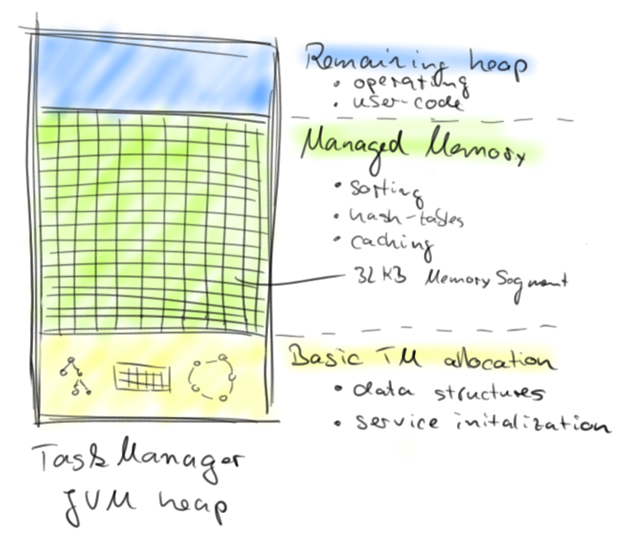
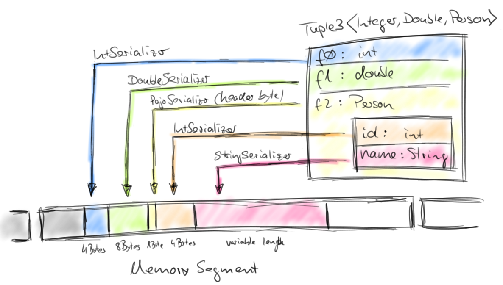
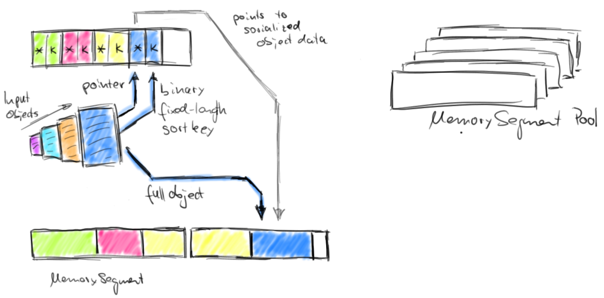
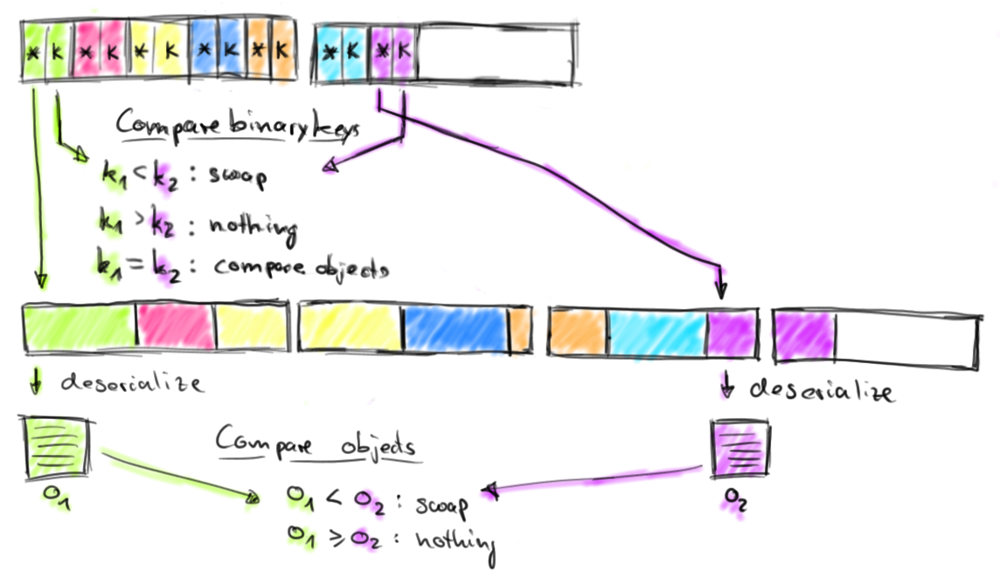
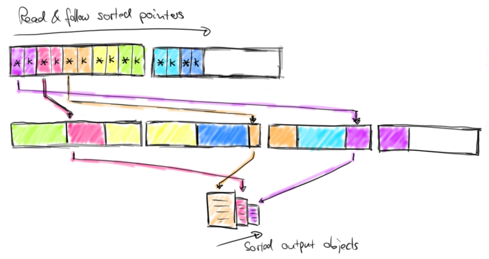

现在，许多用于分析大型数据集的开源系统都是用 Java 或其他基于 JVM 的编程语言来实现。最著名的例子是 Apache Hadoop，此外还有更新的框架也运行在 JVM 上，例如 Apache Spark，Apache Drill 以及 Apache Flink。基于 JVM 的数据分析引擎面临的一个共同挑战是将大量数据存储在内存中，无论是缓存还是高效处理（如排序和连接）。一个配置繁琐、可靠性和性能具有不可预测性的系统与一个运行稳定、配置较少的系统之间的区别在于是否能很好的管理好 JVM 内存。

在这篇博客文章中，我们将讨论 Apache Flink 如何管理内存，讨论它的自定义反序列化/序列化栈以及如何操作二进制数据。

### 1. 数据对象？让我们把它们放在堆上！

在 JVM 中处理大量数据最直接的方法就是将对象放在堆上并对这些对象进行操作。将数据集缓存为对象就像维护一个包含每个记录对象的列表一样简单。内存排序可以简单地对对象列表进行排序。但是，这种方法有一些显着的缺点:
- 首先，当大量对象不断创建并不断失效时，监控和控制堆内存的使用情况并不是一件容易的事情。内存负载过高会立即杀死 JVM 并抛出 OutOfMemoryError 错误。
- 另一个方面是对有数 GB 且有大量新对象的 JVM 进行垃圾回收。在这种情况下垃圾回收的开销可以轻松达到50％以上。
- 最后，Java 对象会带来一定的空间开销，这取决于 JVM 和平台。对于具有许多小对象的数据集，这会显着降低有效可用的内存量。良好的系统设计以及针对性用例的系统参数调优，堆内存的使用可以或多或少地受到控制，并可以避免 OutOfMemoryErrors。但是，这样的配置相当脆弱，尤其是在数据特征或执行环境改变的情况下。

### 2. Flink是怎么做的？

Apache Flink 源于一个研究项目，旨在整合基于 MapReduce 的系统和并行数据库系统最优技术。从这个背景来看，Flink 一直有自己处理内存数据的方式。Flink 没有将大量对象存放在堆上，而是将对象序列化到固定数量预分配的内存段上。其 DBMS 风格的排序和 Join 算法尽可能的在二进制数据上进行，以实现序列化/反序列化的最低开销。如果有更多的数据需要处理不能保存在内存中，Flink 算子会将部分数据溢写到磁盘上。事实上，很多 Flink 的内部实现看起来更像 C/C++ 而不像 Java。下图给出了 Flink 如何将序列化的数据存储在内存段中并在必要时将数据溢出到磁盘上：


Flink 主动内存管理以及直接二进制数据操作的风格有以下几个好处：
- 内存安全执行与高效的非核心算法。由于分配固定数量的内存段，监控剩余的内存资源是非常简单的。在内存不足的情况下，处理算子可以高效地将大批量的内存段写入磁盘，之后再读回来。因此，可以有效地防止 OutOfMemoryErrors。
- 降低垃圾回收的压力。因为所有长期存活的数据以二进制形式存储在 Flink 的托管内存中，短期存活的数据都是对象形式表示，甚至可变以及重用。短期存活的对象可以更有效地进行垃圾回收，大大降低了垃圾回收的压力。目前，预分配的内存段是 JVM 堆中的长久存活的对象，但 Flink 社区正在努力实现在堆外内存分配。这项工作会导致更小的 JVM 堆，并促进甚至更快的垃圾回收周期。
- 高效的内存空间数据表示。Java 对象有存储开销，如果数据以二进制形式存储，则可以避免这种开销。
- 高效的二进制操作和缓存。二进制数据可以在合适的二进制形式上进行有效比较和操作。此外，二进制形式可以将相关的值以及哈希值，key 和指针放到相邻地内存中。这使得数据结构通常具有更高效的缓存访问模式。

主动内存管理和操作二进制数据并不是一件容易的事情，即使用 java.util.HashMap 都比实现由字节数组和自定义序列化堆栈支持的可拆分哈希表要容易得多。当然，Apache Flink 并不是唯一一个基于 JVM 并对序列化的二进制数据操作的数据处理系统。像 Apache Drill，Apache Ignite（孵化）或 Apache Geode（孵化）等项目都采用类似的技术，最近 Apache Spark 也宣布将通过 Project Tungsten 向这个方向发展。

下面我们将详细讨论 Flink 如何分配内存，对对象进行序列化/反序列化操作以及操作二进制数据。

### 3. Flink 如何分配内存？

TaskManager 由几个内部组件组成，比如与 Flink master 协调的 actor 系统，负责将数据溢出到磁盘并读取的 IOManager 以及协调内存使用情况的 MemoryManager。在这篇博文中，MemoryManager 是最受关注的。

MemoryManager 负责内存分配、汇总以及分配 MemorySegments 给数据处理算子，例如排序和 Join 算子。MemorySegment 是 Flink 内存分配单元，由常规 Java 字节数组（默认大小为32 KB）支持。MemorySegment 使用 Java 的 unsafe 方法提供对其支持的字节数组进行高效的读写操作。你可以将 MemorySegment 视为 Java 的 NIO ByteBuffer 的定制版本。为了像在一个连续的内存块上操作多个 MemorySegments ， Flink 需要使用实现 Java java.io.DataOutput 和 java.io.DataInput 接口的逻辑视图。

MemorySegments 在 TaskManager 启动时分配一次，并在 TaskManager 关闭时销毁。因此，在 TaskManager 的整个生命周期内可以被复用而不被垃圾回收。在 TaskManager 所有内部数据结构完成初始化并且所有核心服务启动后，MemoryManager 才开始创建 MemorySegments。默认情况下，服务初始化后可用 JVM 堆的 70％ 由 MemoryManager 分配。也可以配置具体数量的管理内存（例如，多少MB）。剩余的 JVM 堆用于在任务处理期间实例化的对象，包括由用户自定义函数创建的对象。下图显示了启动 TaskManager 后 JVM 中的内存分配情况：



### 4. Flink 如何序列化对象？

Java 生态系统提供了几个库来将对象与二进制相互转换。常见的选择有 Java 序列化、Kryo、Apache Avro、Apache Thrift 以及 Protobuf。Flink 包含自己的自定义序列化框架，来控制数据的二进制形式。这一点很重要，因为对二进制数据进行操作，比如进行比较操作，需要对序列化布局有精确的了解。此外，针对对二进制数据执行的操作配置序列化布局可以显着提高性能。Flink 的序列化堆栈还利用了这样一个事实，即在执行程序之前，需要知道序列化/反序列化对象的类型。

Flink 程序可以处理任意 Java 或 Scala 对象表示的数据。在优化程序之前，需要识别程序数据流中每个处理步骤的数据类型。对于 Java 程序，Flink 提供了基于反射的类型提取组件来分析用户自定义函数的返回类型。Scala 程序在 Scala 编译器的帮助下进行分析。Flink 用 TypeInformation 表示每个数据类型。Flink 有多种数据类型的 TypeInformations，包括：
- BasicTypeInfo：任何 Java 基本类型(装箱的)或者 java.lang.String 类型。
- BasicArrayTypeInfo：任何 Java 基本类型(装箱的)或 java.lang.String 的数组。
- WritableTypeInfo：Hadoop Writable 接口的任意实现类。
- TupleTypeInfo：Flink 任意元组（Tuple1 到 Tuple25）。
- CaseClassTypeInfo：任何 Scala CaseClass（包括Scala元组）。
- PojoTypeInfo：任何 POJO（Java 或 Scala），即所有字段都是 public 的或者通过遵循常用命名约定的 getter 和 setter 来访问的对象。
- GenericTypeInfo：任何不能被识别为另一种类型的数据类型。

每个 TypeInformation 都会为它表示的数据类型提供一个序列化器。例如，BasicTypeInfo 返回一个写对应基本类型的序列化器，WritableTypeInfo 的序列化器将序列化/反序列化委派给实现 Hadoop Writable 接口对象的 write()和 readFields()方法，GenericTypeInfo 返回一个将序列化委托给 Kryo 的序列化器。对象序列化到 DataOutput (由 Flink MemorySegments 支持) 通过 Java 高效的 unsafe 操作自动进行。对于可用作 Key 的数据类型，即可以进行比较和 Hash 的，TypeInformation 提供了 TypeComparator。TypeComparator 进行比较和 Hash 对象，并且根据具体的数据类型还可以有效的比较二进制数据并提取定长的二进制键前缀。

元组，Pojo 和 CaseClass 类型是复合类型，即含有一个或多个可能嵌套数据类型的容器。因此，它们的序列化器和比较器也是复合的，并将其成员数据类型的序列化和比较委托给相应的序列化器和比较器。下图说明了一个（嵌套的）Tuple3 <Integer，Double，Person> 对象的序列化，其中 Person 是 POJO，定义如下：
```java
public class Person {
    public int id;
    public String name;
}
```



Flink的类型系统可以通过提供自定义的 TypeInformations， Serializer 和 Comparators 来扩展，以提高序列化和比较自定义数据类型的性能。

### 5. Flink 如何操作二进制数据？

与许多其他数据处理API（包括SQL）类似，Flink的API提供了对数据集进行分组，排序和连接的转换。这些转换可能在非常大的数据集进行操作。关系数据库系统为此提供了非常高效的算法，几十年来，发展出包括外部合并排序，合并连接和混合哈希连接等算法。Flink在这项技术基础之上，但将其推广到使用其自定义序列化和比较堆栈来处理任意对象。在下文中，我们通过 Flink 的内存排序算法的示例演示 Flink 如何在二进制数据进行操作。

Flink为其数据处理算子分配内存预算。初始化后，排序算法从 MemoryManager 请求其内存预算并接收相应的一组 MemorySegments。MemorySegments 集合成为所谓排序缓冲区的内存池，用于收集要排序的数据。下图说明了如何将数据对象序列化到排序缓冲区中。



排序缓冲区内部由两个内存区域组成。第一个区域保存所有对象的完整二进制数据。第二个区域包含指向完整二进制对象数据的指针和定长的排序键(取决于键的数据类型)。当一个对象被添加到排序缓冲区时，它的二进制数据被追加到第一个区域，并且生成一个指针（可能还有一个键）追加到第二个区域。将实际数据与指针加定长键分离主要为了两个目的。它可以有效地交换定长条目（键+指针），并且还减少了排序时需要移动的数据。如果排序键是可变长度的数据类型（例如 String），那么定长排序键必须是键的前缀，例如字符串的前n个字符。请注意，并非所有数据类型都提供定长（前缀）排序键。将对象序列化到排序缓冲区时，两个内存区域都会使用内存池中的 MemorySegments 进行扩展。一旦内存池为空，并且不能添加更多对象，那么排序缓冲区将被完全填满并可以排序。Flink的排序缓冲区提供了比较和交换元素的方法。这使得在实际上排序算法可插拔。默认情况下，Flink使用Quicksort的实现。下图显示了两个对象的比较。



排序缓冲区通过比较它们的二进制定长排序键来比较两个元素。如果在完整键（而不是前缀键）上进行比较，或者二进制前缀键不相等，则比较成功。如果前缀键是相同的（或者排序键数据类型不提供二进制前缀键），排序缓冲区将遵循指向实际对象数据的指针，对两个对象进行反序列化并比较对象。根据比较结果，排序算法决定是否交换比较的元素。排序缓冲区通过移动它们的定长键和指针来交换两个元素。实际的数据不会被移动。一旦排序算法完成，排序缓冲区中的指针就会正确排序。下图显示了如何从排序缓冲区中返回排序后的数据。



排序后的数据通过顺序读取排序缓冲区的指针区域，跳过排序键并按照排序后的指针找到实际数据来返回。这些数据被反序列化并作为对象返回，或者在外部合并排序的情况下将二进制表示复制并写入磁盘（有关Flink中的联接，请参阅此[博客文章](http://flink.apache.org/news/2015/03/13/peeking-into-Apache-Flinks-Engine-Room.html)）。

原文:https://flink.apache.org/news/2015/05/11/Juggling-with-Bits-and-Bytes.html
