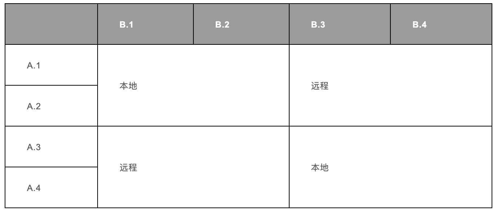
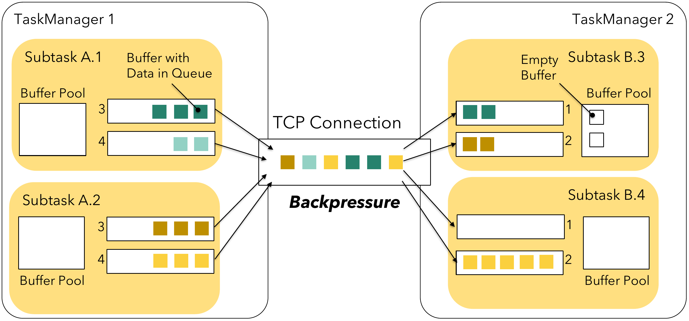
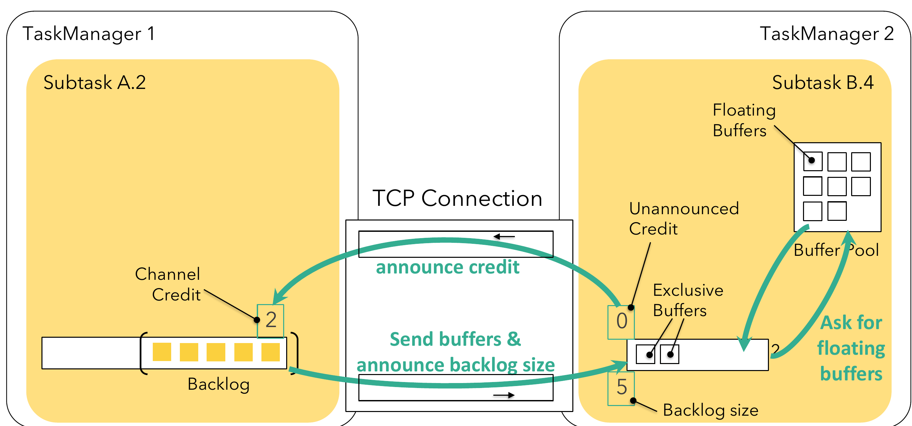
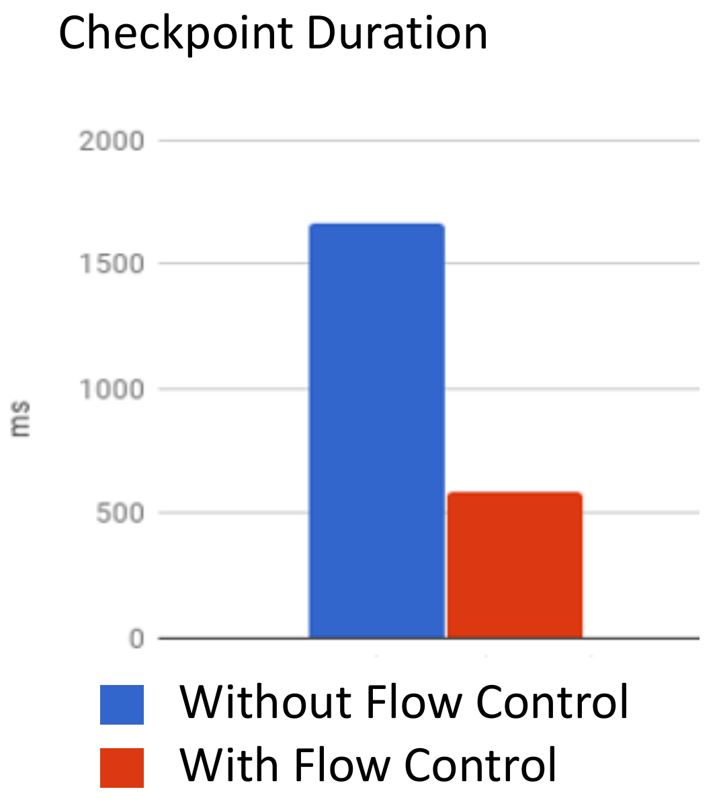
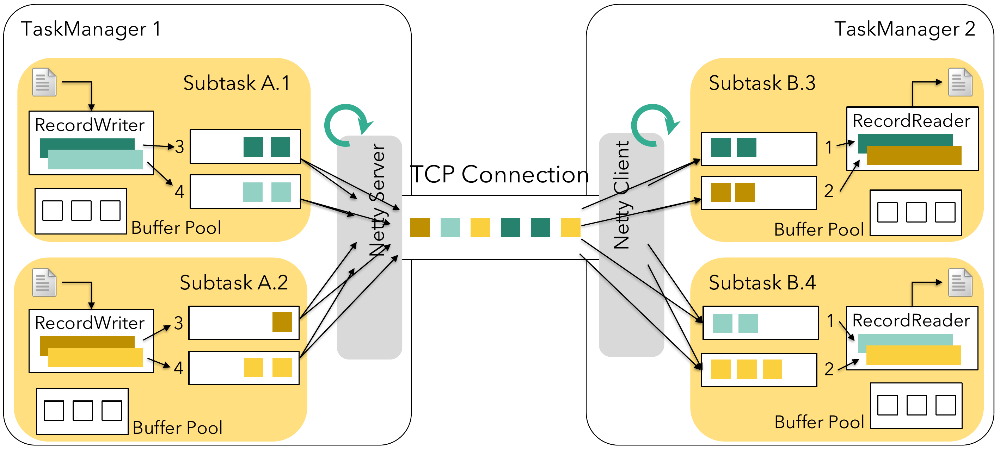
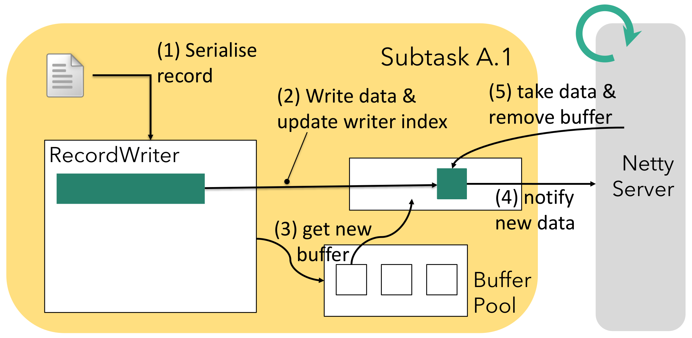
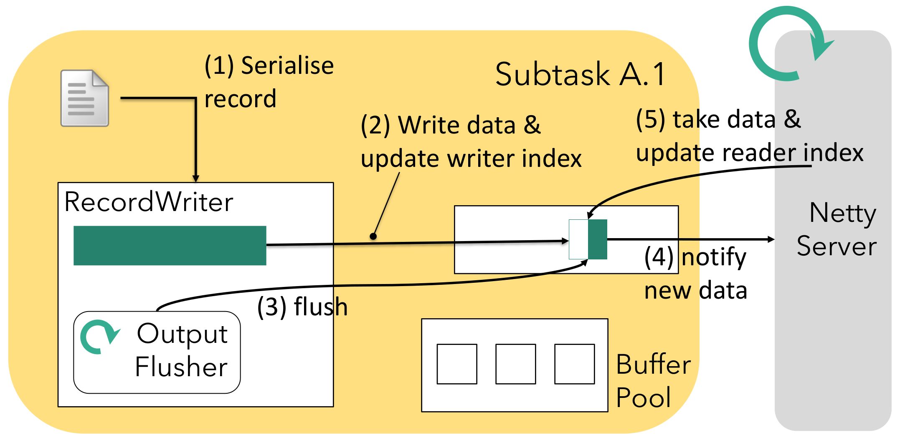
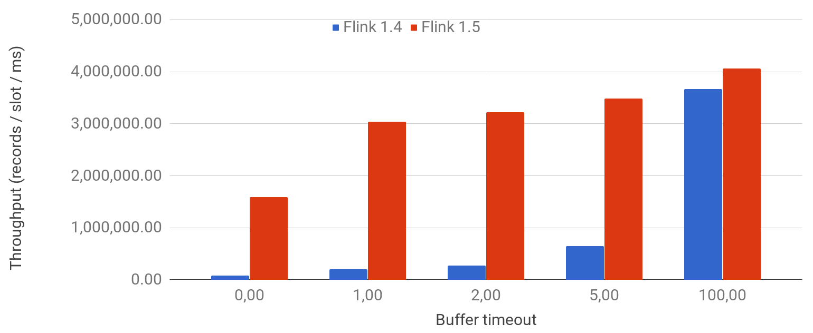

Flink 的网络栈是组成 `flink-runtime` 模块的核心组件之一，也是每个 Flink 作业的核心部分。它连接了 TaskManager 的各个子任务(Subtask)，因此，对于 Flink 作业的性能（包括吞吐量和延迟指标）都至关重要。与 TaskManager 和 JobManager 之间通过基于 Akka 的 RPC 通信的控制通道不同，TaskManager 之间的网络栈依赖于 Netty 的低级 API。

这篇博文是关于网络栈系列文章中的第一篇。在下面的章节中，我们将首先从高层次了解向流操作符暴露的抽象，然后详细介绍 Flink 所做的物理实现和各种优化。我们将简要介绍这些优化的结果以及 Flink 在吞吐量和延迟之间的权衡。本系列后续的博客文章将详细介绍监控和指标、调优参数以及常见的反模式。

## 1.逻辑视图

Flink 的网络栈在相互通信时（例如 `keyBy()` 的网络 Shuffle）子任务的逻辑视图如下所示：


它是如下三个概念的不同设置的抽象：
- 子任务输出类型 `ResultPartitionType`：
  - 流水线 `Pipelined`（有界的或无界的）： 一旦产生数据就向下游发送，可能是逐个发送的，有界或无界的记录流。
  - 阻塞 `Blocking`： 仅在生成完整结果时向下游发送数据。
- 调度策略：
  - 同时调度所有任务(Eager)：同时部署作业的所有子任务（用于流作业）。
  - 上游产生第一条记录部署下游(Lazy)： 任一生产者生成输出后就部署下游任务。
  - 上游产生完整数据部署下游：任一或所有生产者生成完整输出后部署下游任务。
- 数据传输：
  - 高吞吐：Flink 不是一个一个地发送每条记录，而是将若干记录缓冲到其网络缓冲区中并一次性发送它们。这降低了每条记录的发送成本因此提高了吞吐量。
  - 低延迟：当网络缓冲区超过一定的时间未被填满时会触发超时发送，通过减小超时时间，可以通过牺牲一定的吞吐来获取更低的延迟。

我们将在下面深入 Flink 网络栈的物理实现时看到关于吞吐延迟的优化。对于这一部分，让我们详细说明输出类型与调度策略。首先，需要知道的是子任务的输出类型和调度策略是紧密关联的，只有两者的一些特定组合才是有效的。

Pipelined 结果是流式输出，需要目标 Subtask 正在运行以便接收数据。因此需要在上游 Task 产生数据之前或者产生第一条数据的时候调度下游目标 Task 运行。批处理作业生成有界结果数据，而流式处理作业产生无限结果数据。

批处理作业也可能以阻塞方式产生结果，具体取决于所使用的算子和连接模式。在这种情况下，必须等待上游 Task 先生成完整的结果，然后才能调度下游的接收 Task 运行。这能够提高批处理作业的效率并且占用更少的资源。

下表总结了 Task 输出类型以及调度策略的有效组合：

| 输出类型 | 调度策略 | 适用于… |
| :------------- | :------------- | :------------- |
| pipelined, unbounded | 一次性调度所有 task | 流作业 |
| pipelined, unbounded | 上游产生第一条输出调度下游 | N/A' |
| pipelined, bounded | 一次性调度所有 task | N /A² |
| pipelined, bounded | 上游产生第一条输出调度下游 | 批作业 |
| blocking | 上游产生完整输出调度下游 | 批作业 |

> [1]目前 Flink 未使用
> [2]批处理 / 流计算统一完成后，可能适用于流式作业

此外，对于具有多个输入的子任务，调度以两种方式启动：当所有或者任何上游任务产生第一条数据或者产生完整数据时调度任务运行。要调整批处理作业中的输出类型和调度策略，可以参考 ExecutionConfig#setExecutionMode()——尤其是 ExecutionMode，以及 ExecutionConfig#setDefaultInputDependencyConstraint()。

## 2.物理数据传输

为了理解物理数据连接，请回想一下，在 Flink 中，不同的任务可以通过 Slotsharing group 共享相同 Slot。TaskManager 还可以提供多个 Slot，以允许将同一任务的多个子任务调度到同一个 TaskManager 上。

对于下图所示的示例，我们假设 2 个并发为 4 的任务部署在 2 个 TaskManager 上，每个 TaskManager 有两个 Slot。TaskManager 1 执行子任务 A.1，A.2，B.1 和 B.2，TaskManager 2 执行子任务 A.3，A.4，B.3 和 B.4。在 A 和 B 之间是 Shuffle 连接类型，比如来自于 A 的 keyBy() 操作，在每个 TaskManager 上会有 2x4 个逻辑连接，其中一些是本地的，另一些是远程的：



不同任务（远程）之间的每个网络连接将在 Flink 的网络堆栈中获得自己的 TCP 通道。但是，如果同一任务的不同子任务被调度到同一个 TaskManager，则它们与同一个 TaskManager 的网络连接将多路复用并共享同一个 TCP 信道以减少资源使用。在我们的例子中，这适用于 A.1→B.3，A.1→B.4，以及 A.2→B.3 和 A.2→B.4，如下图所示：


每个子任务的输出结果称为 ResultPartition，每个 ResultPartition 被分成多个单独的 ResultSubpartition- 每个逻辑通道一个。Flink 的网络栈在这一点的处理上，不再处理单个记录，而是将一组序列化的记录填充到网络缓冲区中进行处理。每个子任务本地缓冲区中最多可用 Buffer 数目为（每个发送方和接收方各一个）:
```
#channels  * buffers-per-channel + floating-buffers-per-gate
```

单个 TaskManager 上的网络层 Buffer 总数通常不需要配置。有关如何在需要时进行配置的详细信息，请参阅配置网络缓冲区的文档。

### 2.1 造成反压

每当子任务的数据发送缓冲区耗尽时——数据驻留在 Subpartition 的缓冲区队列中或位于更底层的基于 Netty 的网络堆栈内，生产者就会被阻塞，无法继续发送数据，而受到反压。接收端以类似的方式工作：Netty 收到任何数据都需要通过网络 Buffer 传递给 Flink。如果相应子任务的网络缓冲区中没有足够可用的网络 Buffer，Flink 将停止从该通道读取，直到 Buffer 可用。这将反压该多路复用上的所有发送子任务，因此也限制了其他接收子任务。下图说明了过载的子任务 B.4，它会导致多路复用的反压，也会导致子任务 B.3 无法接受和处理数据，即使是 B.3 还有足够的处理能力。



为了防止这种情况发生，Flink 1.5 引入了自己的流量控制机制。

## 3.Credit-based 流量控制

Credit-based 流量控制可确保发送端已经发送的任何数据，接收端都具有足够的能力(Buffer)来接收。新的流量控制机制基于网络缓冲区的可用性，作为 Flink 之前机制的自然延伸。每个远程输入通道(RemoteInputChannel)现在都有自己的一组独占缓冲区(Exclusive buffer)，而不是只有一个共享的本地缓冲池(LocalBufferPool)。与之前不同，本地缓冲池中的缓冲区称为流动缓冲区(Floating buffer)，因为它们会在输出通道间流动并且可用于每个输入通道。

数据接收方会将自身的可用 Buffer 作为 Credit 告知数据发送方（1 buffer = 1 credit）。每个 Subpartition 会跟踪下游接收端的 Credit（也就是可用于接收数据的 Buffer 数目）。只有在相应的通道(Channel)有 Credit 的时候 Flink 才会向更底层的网络栈发送数据(以 Buffer 为粒度)，并且每发送一个 Buffer 的数据，相应的通道上的 Credit 会减 1。除了发送数据本身外，数据发送端还会发送相应 Subpartition 中有多少正在排队发送的 Buffer 数（称之为 Backlog）给下游。数据接收端会利用这一信息(Backlog)去申请合适数量的 Floating buffer 用于接收发送端的数据，这可以加快发送端堆积数据的处理。接收端会首先申请和 Backlog 数量相等的 Buffer，但可能无法申请到全部，甚至一个都申请不到，这时接收端会利用已经申请到的 Buffer 进行数据接收，并监听是否有新的 Buffer 可用。



Credit-based 的流控使用 Buffers-per-channel 来指定每个 Channel 有多少独占的 Buffer，使用 Floating-buffers-per-gate 来指定共享的本地缓冲池(Local buffer pool)大小（可选3），通过共享本地缓冲池，Credit-based 流控可以使用的 Buffer 数目可以达到与原来非 Credit-based 流控同样的大小。这两个参数的默认值是被精心选取的，以保证新的 Credit-based 流控在网络健康延迟正常的情况下至少可以达到与原策略相同的吞吐。可以根据实际的网络 RRT (round-trip-time)和带宽对这两个参数进行调整。

> 如果没有足够的 Buffer 可用，则每个缓冲池将获得全局可用 Buffer 的相同份额（±1）。

### 3.1 造成反压

与没有流量控制的接收端反压机制不同，Credit 提供了更直接的控制：如果接收端的处理速度跟不上，最终它的 Credit 会减少成 0，此时发送端就不会在向网络中发送数据（数据会被序列化到 Buffer 中并缓存在发送端）。由于反压只发生在逻辑链路上，因此没必要阻断从多路复用的 TCP 连接中读取数据，也就不会影响其他的接收者接收和处理数据。

### 3.2 Credit-based 的优势与问题

由于通过 Credit-based 流控机制，多路复用中的一个信道不会由于反压阻塞其他逻辑信道，因此整体资源利用率会增加。此外，通过完全控制正在发送的数据量，我们还能够加快 Checkpoint alignment：如果没有流量控制，通道需要一段时间才能填满网络栈的内部缓冲区并表明接收端不再读取数据了。在这段时间里，大量的 Buffer 不会被处理。任何 Checkpoint barrier（触发 Checkpoint 的消息）都必须在这些数据 Buffer 后排队，因此必须等到所有这些数据都被处理后才能够触发 Checkpoint（“Barrier 不会在数据之前被处理！”）。

但是，来自接收方的附加通告消息（向发送端通知 Credit）可能会产生一些额外的开销，尤其是在使用 SSL 加密信道的场景中。此外，单个输入通道( Input channel)不能使用缓冲池中的所有 Buffer，因为存在无法共享的 Exclusive buffer。新的流控协议也有可能无法做到立即发送尽可能多的数据（如果生成数据的速度快于接收端反馈 Credit 的速度），这时则可能增长发送数据的时间。虽然这可能会影响作业的性能，但由于其所有优点，通常新的流量控制会表现得更好。可能会通过增加单个通道的独占 Buffer 数量，这会增大内存开销。然而，与先前实现相比，总体内存使用可能仍然会降低，因为底层的网络栈不再需要缓存大量数据，因为我们总是可以立即将其传输到 Flink（一定会有相应的 Buffer 接收数据）。

在使用新的 Credit-based 流量控制时，可能还会注意到另一件事：由于我们在发送方和接收方之间缓冲较少的数据，反压可能会更早的到来。然而，这是我们所期望的，因为缓存更多数据并没有真正获得任何好处。如果要缓存更多的数据并且保留 Credit-based 流量控制，可以考虑通过增加单个输入共享 Buffer 的数量。



好处：
- 在多路复用且存在数据倾斜场景下实现更好的资源利用率
- 加快检查点(Checkpoint)对齐
- 减少内存使用（在底层的网络栈中缓存更少的数据）

缺点：
- 额外的 Credit 通知消息
- 额外的 Backlog 通知消息（通过数据 Buffer 捎带，几乎没有额外开销）
- 潜在的往返延迟

> 反压会提早出现

> 如果需要关闭 Credit-based 流量控制，可以将这个配置添加到 flink-conf.yaml 中：taskmanager.network.credit-model:false。但是，此参数已过时，最终将与非 Credit-based 流控制代码一起删除。

## 4.序列号与反序列化

下图从上面的扩展了更高级别的视图，其中包含网络栈及其周围组件的更多详细信息，从发送算子发送记录(Record)到接收算子获取它：



在生成 Record 并将其传递出去之后，例如通过 Collector#collect()，它被传递给 RecordWriter，RecordWriter 会将 Java 对象序列化为字节序列，最终存储在 Buffer 中按照上面所描述的在网络栈中进行处理。RecordWriter 首先使用 SpanningRecordSerializer 将 Record 序列化为灵活的堆上字节数组。然后，它尝试将这些字节写入目标网络 Channel 的 Buffer 中。我们将在下面的章节回到这一部分。

在接收方，底层网络栈（Netty）将接收到的 Buffer 写入相应的输入通道(Channel)。流任务的线程最终从这些队列中读取并尝试在 RecordReader 的帮助下通过 SpillingAdaptiveSpanningRecordDeserializer 将累积的字节反序列化为 Java 对象。与序列化器类似，这个反序列化器还必须处理特殊情况，例如跨越多个网络 Buffer 的 Record，或者因为记录本身比网络缓冲区大（默认情况下为32KB，通过 taskmanager.memory.segment-size 设置）或者因为序列化 Record 时，目标 Buffer 中已经没有足够的剩余空间保存序列化后的字节数据，在这种情况下，Flink 将使用这些字节空间并继续将其余字节写入新的网络 Buffer 中。

### 4.1 将网络 Buffer 写入 Netty

在上图中，Credit-based 流控制机制实际上位于“Netty Server”（和“Netty Client”）组件内部，RecordWriter 写入的 Buffer 始终以空状态（无数据）添加到 Subpartition 中，然后逐渐向其中填写序列化后的记录。但是 Netty 在什么时候真正的获取并发送这些 Buffer 呢？显然，不能是 Buffer 中只要有数据就发送，因为跨线程（写线程与发送线程）的数据交换与同步会造成大量的额外开销，并且会造成缓存本身失去意义（如果是这样的话，不如直接将将序列化后的字节发到网络上而不必引入中间的 Buffer）。

在 Flink 中，有三种情况可以使 Netty 服务端使用（发送）网络 Buffer：
- 写入 Record 时 Buffer 变满，或者
- Buffer 超时未被发送，或
- 发送特殊消息，例如 Checkpoint barrier。

#### 4.1.1 在 Buffer 满后发送

RecordWriter 将 Record 序列化到本地的序列化缓冲区中，并将这些序列化后的字节逐渐写入位于相应 Result subpartition 队列中的一个或多个网络 Buffer中。虽然单个 RecordWriter 可以处理多个 Subpartition，但每个 Subpartition 只会有一个 RecordWriter 向其写入数据。另一方面，Netty 服务端线程会从多个 Result subpartition 中读取并像上面所说的那样将数据写入适当的多路复用信道。这是一个典型的生产者 - 消费者模式，网络缓冲区位于生产者与消费者之间，如下图所示。在（1）序列化和（2）将数据写入 Buffer 之后，RecordWriter 会相应地更新缓冲区的写入索引。一旦 Buffer 完全填满，RecordWriter 会（3）为当前 Record 剩余的字节或者下一个 Record 从其本地缓冲池中获取新的 Buffer，并将新的 Buffer 添加到相应 Subpartition 的队列中。这将（4）通知 Netty服务端线程有新的数据可发送（如果 Netty 还不知道有可用的数据的话4）。每当 Netty 有能力处理这些通知时，它将（5）从队列中获取可用 Buffer 并通过适当的 TCP 通道发送它。



> 如果队列中有更多已完成的 Buffer，我们可以假设 Netty 已经收到通知。

#### 4.1.2 在 Buffer 超时后发送

为了支持低延迟应用，我们不能只等到 Buffer 满了才向下游发送数据。因为可能存在这种情况，某种通信信道没有太多数据，等到 Buffer 满了在发送会不必要地增加这些少量 Record 的处理延迟。因此，Flink 提供了一个定期 Flush 线程(the output flusher)每隔一段时间会将任何缓存的数据全部写出。可以通过 StreamExecutionEnvironment#setBufferTimeout 配置 Flush 的间隔，并作为延迟5的上限（对于低吞吐量通道）。下图显示了它与其他组件的交互方式：RecordWriter 如前所述序列化数据并写入网络 Buffer，但同时，如果 Netty 还不知道有数据可以发送，Output flusher 会（3,4）通知 Netty 服务端线程数据可读（类似与上面的“buffer已满”的场景）。当 Netty 处理此通知（5）时，它将消费（获取并发送）Buffer 中的可用数据并更新 Buffer 的读取索引。Buffer 会保留在队列中——从 Netty 服务端对此 Buffer 的任何进一步操作将在下次从读取索引继续读取。



> 严格来说，Output flusher 不提供任何保证——它只向 Netty 发送通知，而 Netty 线程会按照能力与意愿进行处理。这也意味着如果存在反压，则 Output flusher 是无效的。

#### 4.1.3 特殊消息后发送

一些特殊的消息如果通过 RecordWriter 发送，也会触发立即 Flush 缓存的数据。其中最重要的消息包括 Checkpoint barrier 以及 end-of-partition 事件，这些事件应该尽快被发送，而不应该等待 Buffer 被填满或者 Output flusher 的下一次 Flush。

#### 4.1.4 进一步的讨论

与小于 1.5 版本的 Flink 不同，请注意（a）网络 Buffer 现在会被直接放在 Subpartition 的队列中，（b）网络 Buffer 不会在 Flush 之后被关闭。这给我们带来了一些好处：
- 同步开销较少（Output flusher 和 RecordWriter 是相互独立的）
- 在高负荷情况下，Netty 是瓶颈（直接的网络瓶颈或反压），我们仍然可以在未完成的 Buffer 中填充数据
- Netty 通知显著减少

但是，在低负载情况下，可能会出现 CPU 使用率和 TCP 数据包速率的增加。这是因为，Flink 将使用任何可用的 CPU 计算能力来尝试维持所需的延迟。一旦负载增加，Flink 将通过填充更多的 Buffer 进行自我调整。由于同步开销减少，高负载场景不会受到影响，甚至可以实现更高的吞吐。

### 4.2 BufferBuilder 和 BufferConsumer

更深入地了解 Flink 中是如何实现生产者 - 消费者机制，需要仔细查看 Flink 1.5 中引入的 BufferBuilder 和 BufferConsumer 类。虽然读取是以 Buffer 为粒度，但写入它是按 Record 进行的，因此是 Flink 中所有网络通信的核心路径。因此，我们需要在任务线程（Task thread）和 Netty 线程之间实现轻量级连接，这意味着尽量小的同步开销。你可以通过查看源代码获取更加详细的信息。

## 5. 延迟与吞吐

引入网络 Buffer 的目是获得更高的资源利用率和更高的吞吐，代价是让 Record 在 Buffer 中等待一段时间。虽然可以通过 Buffer 超时给出此等待时间的上限，但可能很想知道有关这两个维度（延迟和吞吐）之间权衡的更多信息，显然，无法两者同时兼得。下图显示了不同的 Buffer 超时时间下的吞吐，超时时间从 0 开始（每个 Record 直接 Flush）到 100 毫秒（默认值），测试在具有 100 个节点每个节点 8 个 Slot 的群集上运行，每个节点运行没有业务逻辑的 Task 因此只用于测试网络栈的能力。为了进行比较，我们还测试了低延迟改进（如上所述）之前的 Flink 1.4 版本。



如图，使用 Flink 1.5+，即使是非常低的 Buffer 超时（例如1ms）（对于低延迟场景）也提供高达超时默认参数（100ms）75％ 的最大吞吐，但会缓存更少的数据。

## 6.结论

了解 Result partition，批处理和流式计算的不同网络连接以及调度类型，Credit-Based 流量控制以及 Flink 网络栈内部的工作机理，有助于更好的理解网络栈相关的参数以及作业的行为。后续我们会推出更多 Flink 网络栈的相关内容，并深入更多细节，包括运维相关的监控指标(Metrics)，进一步的网络调优策略以及需要避免的常见错误等。
