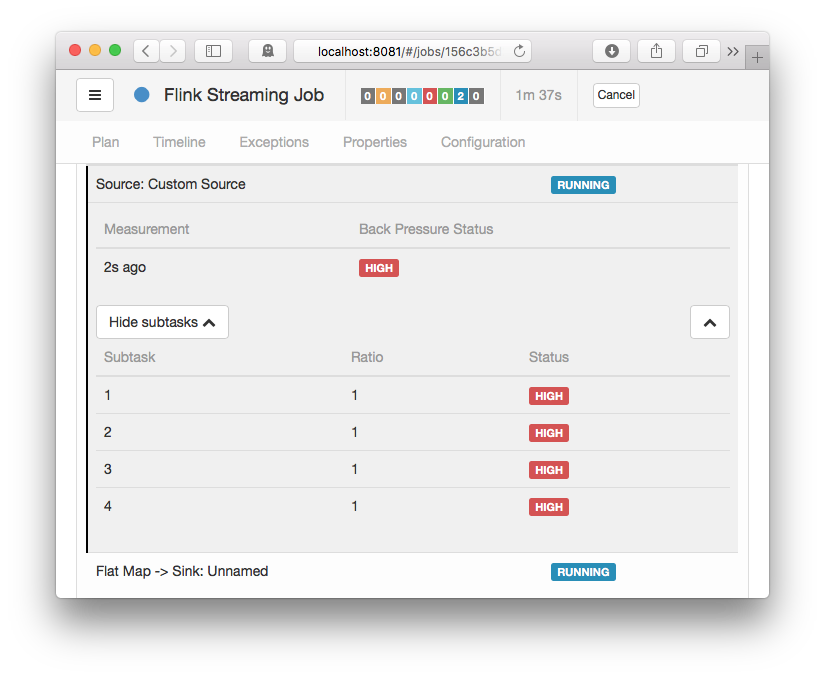

在之前的[文章](https://smartsi.blog.csdn.net/article/details/148828172)中，我们从高级抽象到底层细节各个层面全面介绍了 Flink 网络栈的工作机制。这是网络栈系列文章中的第二篇文章，在此基础上进行扩展，并讨论监控与网络相关的指标，以识别诸如反压、吞吐量和延迟瓶颈等影响。虽然这篇文章简要介绍了如何处理反压，但调优网络栈的话题将在以后的文章中进一步研究。如果您不熟悉网络堆栈，我们强烈建议您先深入阅读本系列的第一篇文章[原理解析 | 深入了解 Apache Flink 的网络栈](https://smartsi.blog.csdn.net/article/details/148828172)，然后继续阅读本文。

---

## 1. 监控

网络监控中最重要的部分可能就是监控反压了，所谓反压就是指系统接收数据的速率高于其处理速度[1]。这种现象将给发送者带来反压力，导致反压的原因可能有两种情况：
- 接收器很慢：
  - 发生这种情况的原因可能是接收方自身受到反压，无法保持与发送方相同的处理速度；
  - 也有可能是接收器因为垃圾回收、缺少系统资源或 I/O 瓶颈而暂时阻塞。
- 网络通道很慢：
  - 尽管这种情况下可能和接收器没有(直接)关系，但是我们说这时发送器遇到了反压，是因为在同一台机器上运行的所有子任务共享的网络带宽可能供不应求了。请注意，除了 Flink 的网络栈之外可能还有其他网络用户，例如数据源(Source)、数据汇(Sink)、分布式文件系统（检查点、网络附加存储）、日志记录和指标监测等。我们之前的一篇关于容量规划的[文章](https://www.ververica.com/blog/how-to-size-your-apache-flink-cluster-general-guidelines)介绍了更多相关内容。

> 如果你不熟悉反压，不了解它与 Flink 的交互方式，建议阅读我们在 2015 年发表的关于反压的文章 [Flink 如何处理反压](https://smartsi.blog.csdn.net/article/details/127355152)。

如果发生反压，它将一路向上游传导并最终到达你的数据源，这将会减慢数据源的速度。这本身并不是一件坏事，只是表明你缺乏足够的资源来处理当前的负载。但是，你可能想要做一些优化，在不动用更多资源的前提下可以处理更高的负载。为此你需要找到（1）瓶颈在哪里（位于哪个任务/操作符）和（2）产生瓶颈的原因。Flink 提供了两种识别瓶颈的机制：
- 直接通过 Flink 的 Web UI 及其反压监视器识别
- 间接的通过一些网络指标识别。

Flink 的 Web UI 大概是快速排除故障时的首选，但它有一些缺点，我们将在下面详细解释。另一方面，Flink 的网络指标更适合持续监控以及推断是哪些瓶颈导致了反压，并分析这些瓶颈的本质属性。我们将在下文中详细介绍这两个部分。在这两种情况下，你都需要从数据源(Source)到数据汇(Sink)识别出反压的根源。排查工作的第一步一般来是在最后一个承受反压的操作符；而且最后这个操作符很可能就是反压产生的源头。

---

### 1.1 反压监视器

[反压监视器](https://nightlies.apache.org/flink/flink-docs-release-1.13/docs/ops/monitoring/back_pressure/)只在 Flink 的 WebUI 中提供。由于它只是在请求时才会触发的活跃组件，因此目前无法通过指标来提供给用户。反压监视器通过 `Thread.getStackTrace()` 对 TaskManager 上运行的所有任务线程采样，并计算缓存请求中阻塞任务的样本数。这些任务之所以会阻塞，要么是因为它们无法按照网络缓冲区生成的速率发送这些缓存，要么就是下游任务处理它们的速度很慢，无法保证发送的速率。反压监视器将显示阻塞请求与总请求的比率。由于某些反压也会被认为是正常的或者临时的，所以监视器将显示如下几种状态：
- OK，比率 ≤ 0.10
- LOW，0.10 < 比率 ≤ 0.5
- HIGH，0.5 < 比率 ≤ 1

虽说你也可以调整刷新间隔、样本数或样本之间的延迟等参数，但通常情况下这些参数用不着你来调整，因为默认值已经提供了足够好的结果。

你还可以通过 REST API 访问反压监视器：`/jobs/:jobid/vertices/:vertexid/backpressure`。

反压监视器可以帮助你找到反压来自何处(哪个任务/操作符)。但你没法用它进一步推断反压产生的原因。此外，对于较大的作业或较高的并行度来说，反压监视器很难使用，还可能要花些时间才能完整收集来自 TaskManager 的数据。另外请注意，采样可能还会影响你当前作业的性能。

---

## 2. 网络指标

网络和任务 I/O 指标比反压监视器更轻量级，而且会针对当前运行的每个作业不断更新。我们可以利用这些指标获得更多信息，收集到的信息除了用来监测反压外还有其他用途。和用户关系最大的指标有：
- Flink 1.8 及更早版本：outPoolUsage、inPoolUsage
  - 是对各个本地缓冲池中已用缓存与可用缓存的比率估计。
  - 在使用基于信用的流控制解析 Flink 1.5-1.8 中的 inPoolUsage 时，请注意它只与浮动缓存有关（独占缓存不算在缓冲池里）。
- Flink 1.9 及以后版本：outPoolUsage、inPoolUsage、floatingBuffersUsage、exclusiveBuffersUsage
  - 是对各个本地缓冲池中已用缓存与可用缓存的比率估计。
  - 从 Flink 1.9 开始，inPoolUsage 是 floatingBuffersUsage 和 exclusiveBuffersUsage 的总和。
- numRecordsOut、numRecordsIn
  - 这两个指标都有两个作用域：一个是运算符，另一个是子任务。
  - 网络监视使用的是子任务作用域指标，并显示它已发送/接收的记录总数。
  - 你可能需要进一步研究这些数字来查看特定时间内的记录数量，或者使用等价的 `xxxPerSecond` 指标。
- numBytesOut、numBytesInLocal、numBytesInRemote
  - 表示这个子任务从本地/远程源发出或读取的字节总数。也可以通过 `xxxPerSecond` 指标获取。
- numBuffersOut、numBuffersInLocal、numBuffersInRemote
  - 与 numBytes 类似，但这里计算的是网络缓冲区的数量。

警告：为了完整起见，并且由于它们在过去已经使用过，我们简要介绍一下 outputQueueLength 和 inputQueueLength 这两个指标。它们有点像 outPoolUsage 和 inPoolUsage 指标，但这两个指标分别显示的是发送方子任务的输出队列和接收方子任务的输入队列中的缓存数量。然而，想要推断缓存的准确数量是很难的，而且本地通道也有一个很微妙的特殊问题：由于本地输入通道没有自己的队列（它直接使用输出队列），因此通道的这个值始终为 0（参[FLINK-12576](https://issues.apache.org/jira/browse/FLINK-12576)）；在只有本地输入通道的情况下 inputQueueLength = 0。

总的来说，我们不鼓励使用 outputQueueLength 和 inputQueueLength，因为它们的解释很大程度上取决于运算符当前的并行度以及独占缓存和浮动缓存的配置数量。相比之下，我们建议使用各种 `*PoolUsage` 指标，它们会为用户提供更详尽的信息。

> 注意：如果你要推断缓存的使用率，请记住以下几点：
- 任何至少使用过一次的传出通道总是占用一个缓存（Flink 1.5 及更高版本）。
  - Flink 1.8 及较早版本：这个缓存（即使是空的！）总是在 backlog 中计 1，因此接收器试图为它保留一个浮动缓存区。
  - Flink 1.9 及以上版本：只有当一个缓存已准备好消费时才在 backlog 中计数，比如说它已满或已刷新时（请参阅 FLINK-11082）
- 接收器仅在反序列化其中的最后一条记录后才释放接收的缓存。

下面几节将使用并结合这些指标来推断反压以及资源的使用率/效率与吞吐量的关系。后面还会有一个单独的部分具体介绍与延迟相关的指标。

---

### 2.1 反压

可以通过两组指标来监测反压：（本地）缓冲池使用率和输入/输出队列长度。这两组指标提供了不同级别的粒度，可惜都不够全面，怎样解读这些指标有很多不同的说法。由于解释队列长度指标有一些困难(问题)，我们将重点讨论输入和输出池的使用率指标，该指标也提供了更多细节信息。
- 如果子任务的 outPoolUsage 为 100％
  - 表示它正在经受反压。子任务是否已经阻塞还是仍在将记录写入网络缓冲区取决于 RecordWriter 当前正在写入的缓冲区有没有写满。
  - 这与反压监视器显示的结果是不一样的！
- 如果子任务的 inPoolUsage 为 100％
  - 表示所有浮动缓存都分配给了通道，反压最终将传递到上游。
  - 这些浮动缓存处于以下任一状态中：由于一个独占缓存正被占用（远程输入通道一直在尝试维护 #exclusive buffer 的信用），这些浮动缓存被保留下来供将来在通道上使用；它们为一个发送器的 backlog 保留下来等待数据；它们可能包含数据并在输入通道中排队；或者它们可能包含数据并正由接收器的子任务读取（一次一个记录）。
- Flink 1.8 及更早的版本：即使在正常情况下 100％ 的 inPoolUsage 也很常见。参考[FLINK-11082](https://issues.apache.org/jira/browse/FLINK-11082)，
- Flink 1.9 及以上版本：如果 inPoolUsage 持续在 100％ 左右，这就是出现上游反压的强烈信号。

下表总结了所有组合及其解释。但请记住，反压可能是轻微的的或临时的（也就是无需查看），或者只出现在特定通道上，或是由特定 TaskManager 上的其他 JVM 进程（例如 GC、同步、I/O、资源短缺等）引起的，源头不是某个子任务。

|  | outPoolUsage 低 | outPoolUsage 高 |
| :------------- | :------------- | :------------- |
| inPoolUsage 低 | 正常 | 反压，临时情况：上游暂未出现反压或已经不再发压） |
| inPoolUsage 高(Flink 1.9+) | (1) 如果所有上游任务的 outPoolUsage 都很低，需要注意: 可能最终会产生反压；(2) 如果任意上游任务的 outPoolUsage 很高，有问题: 可能在上游产生反压，也有可能是反压的源头 | 有问题: 下游任务或网络出现反压，可能会向上游传递 |

我们甚至可以通过查看两个连续任务的子任务的网络指标来来推断反压的原因：
- 如果接收器任务的所有子任务的 inPoolUsage 值都很低，并且有任意上游子任务的 outPoolUsage 较高，则可能是存在网络瓶颈导致了反压。由于网络是 TaskManager 的所有子任务共享的资源，因此瓶颈可能不是直接来自这个子任务，而是来自于各种并发操作，例如检查点、其他流、外部连接或同一台计算机上的其他 TaskManager/进程。

反压也可能由一个任务的所有并行实例或单个任务实例引起。第一种情况通常是因为任务正在执行一些应用到所有输入分区的耗时操作；后者通常是某种倾斜的结果，要么是数据倾斜，要么是资源可用性/分配倾斜。后文的'如何处理反压'一节中会介绍这两种情况下的应对措施。

> Flink 1.9 及以上版本
- 如果 floatingBuffersUsage 不是 100％，那么就不太可能存在反压。如果达到了 100％ 并且所有上游任务都在承受反压，说明这个输入正在单个、部分或全部输入通道上承受反压。你可以使用 exclusiveBuffersUsage 来区分这三种情况：
  - 假设 floatingBuffersUsage 接近 100％，则 exclusiveBuffersUsage 越高，输入通道承受的反压越大。
  - 在 exclusiveBuffersUsage 接近 100％ 的极端情况下，所有通道都在承受反压。

下表总结了 exclusiveBuffersUsage、floatingBuffersUsage 和上游任务的 outPoolUsage 之间的关系，还比上表多了一个 inPoolUsage = floatingBuffersUsage + exclusiveBuffersUsage：

|     | exclusiveBuffersUsage 低  | exclusiveBuffersUsage 高  |
| :------------- | :------------- | :------------- |
| floatingBuffersUsage 低 + 所有上游 outPoolUsage 低  | 正常  | - |
| floatingBuffersUsage 低 + 任一上游 outPoolUsage 高	| 有问题: 可能是网络瓶颈 | - |
| floatingBuffersUsage 高 + 所有上游 outPoolUsage 低	| 注意: 最终只有一些输入通道出现反压 | 注意: 最终多数或全部输入通道出现反压 |
| floatingBuffersUsage 高 + 任一上游 outPoolUsage 高	| 有问题: 只有一些输入通道在承受反压 | 有问题: 多数或全部输入通道都在承受反压 |

---

### 2.2 资源使用率 / 吞吐量

除了上面提到的各个指标的单独用法外，还有一些组合用法可以用来探究网络栈的深层状况：
- 低吞吐量，outPoolUsage 值经常在 100% 左右，但所有接收器的 inPoolUsage 都很低，这表明我们的信用通知的往返时间（取决于你的网络延迟）太久，默认的独占缓存数量无法充分利用带宽。可以考虑增加 `buffers-per-channel` 参数或尝试禁用基于信用的流量控制来进行验证。
- 结合 numRecordsOut 和 numBytesOut 可以用来确定序列化记录的平均大小，进而帮助你针对峰值场景做容量规划。
- 如果您想了解缓存填充率和输出刷新器的影响，可以结合 numBytesInRemote 与 numBuffersInRemote 两个指标。在调优吞吐量（而不是延迟！）时，较低的缓存填充率可能意味着网络效率较低。在这种情况下请考虑增加缓存超时时间。请注意，在 Flink 1.8 和 1.9 中，numBuffersOut 仅在缓存快填满或某事件停用某缓存（例如一个检查点屏障）时才会增加，-这个动作还可能滞后。还请注意，由于缓存是针对远程信道的优化技术，对本地信道影响有限，因此不需要在本地信道上考察缓存填充率。
- 你还可以结合 numBytesInLocal 和 numBytesInRemote 来区分本地与远程流量，但在大多数情况下没这个必要。

---

#### 2.2.1 如何处理反压？

假设你确定了反压的来源，也就是瓶颈所在，下一步就是分析为什么会发生这种情况。下面我们按照从基本到复杂的顺序列出了导致反压的一些潜在成因。我们建议首先检查基本原因，然后再深入研究更复杂的原因，否则就可能得出一些错误的结论。

还请记住，反压可能是暂时的，可能是由于负载高峰、检查点或作业重启时数据 backlog 待处理导致的结果。如果反压是暂时的，那么忽略它就行了。此外还要记住，分析和解决问题的过程可能会受到瓶颈间歇性的影响。话虽如此，这里还是有几件事需要检查一下：
- 系统资源
  - 首先，你应该检查受控机器的基本资源使用情况，如 CPU、网络或磁盘 I/O 等指标。如果某些资源在被全部或大量占用，你可以执行以下操作：
    - 尝试优化你的代码。此时代码分析器是很有用的。  
    - 针对该特定资源调优Flink。
    - 通过增加并行度或增加群集中的计算机数量来扩容。
- 垃圾回收
  - 通常，长时间的垃圾回收可能会引发性能问题。你可以打印 GC 调试日志（通过 `-XX: +PrintGCDetails`）或使用某些内存/ GC 分析器来验证是否处于这种状况下。由于 GC 问题的处理与应用程序高度相关，并且独立于 Flink，因此我们不会在此详细介绍（可参考 Oracle 的[垃圾回收调整指南](https://docs.oracle.com/javase/8/docs/technotes/guides/vm/gctuning/index.html)，或 Plumbr 的 [Java 垃圾回收手册](https://plumbr.io/java-garbage-collection-handbook)）。
- CPU/ 线程瓶颈
  - 有时，如果一个或几个线程导致CPU瓶颈，而整个机器的CPU使用率仍然相对较低，那么乍一看可能不会发现CPU瓶颈。例如，48 核计算机上的单个 CPU 线程瓶颈只会带来 2％的 CPU 使用率。可以考虑使用代码分析器，因为它们可以显示每个线程的 CPU 使用情况，这样就能识别出热点线程。
- 线程争用
  - 与上面的 CPU/线程瓶颈问题类似，共享资源上较高的线程争用率可能会导致子任务瓶颈。还是要请出 CPU 分析器，考虑在用户代码中查找同步开销/锁争用。虽然我们应该避免在用户代码中添加同步，这可能很危险！还可以考虑调查共享系统资源。例如，默认 JVM 的 SSL 实现可以从共享的 /dev/urandom 资源周围获取数据。
- 加载不均衡
  - 如果瓶颈是由数据倾斜引起的，您可以尝试通过更改数据分区以分离重键或实现本地/预聚合来消除瓶颈或减轻其影响。

除此之外还有很多情况。一般来说，为了削弱瓶颈从而减少反压，首先要分析它发生的位置，然后找出原因。最好从检查哪些资源处于充分利用状态开始入手。

---

### 2.3 延迟追踪

在各个可能出现延迟的位置追踪延迟是一个独立的话题。在本节中，我们将重点关注 Flink 网络栈中的记录的等待时间——包括系统网络连接的情况。在吞吐量较低时，这些延迟会直接受输出刷新器的缓存超时参数的影响，或间接受任何应用程序代码延迟的影响。当处理记录的时间比预期的要长或者（多个）计时器同时触发——并阻止接收器处理传入的记录——时，网络栈内后续记录的等待时间会大大延长。我们强烈建议你将自己的指标添加到 Flink 作业中，以便更好地跟踪作业组件中的延迟，并更全面地了解延迟产生的原因。

Flink 为追踪通过系统（用户代码之外）的记录延迟提供了一些支持。但默认情况下此功能被禁用（原因参见下文！），必须用 `metrics.latency.interval` 或 `ExecutionConfig #setLatencyTrackingInterval()` 在 Flink 的配置中设置延迟追踪间隔才能启用此功能。启用后，Flink 将根据 `metrics.latency.granularity` 定义的粒度生成延迟直方图：
- single：每个操作符子任务有一个直方图
- operator（默认值）：源任务和操作符子任务的每个组合有一个直方图
- subtask：源子任务和操作符子任务的每个组合有一个直方图（并行度翻了两番！）

这些指标通过特殊的“延迟标记”收集：每个源子任务将定期发出包含其创建时间戳的特殊记录。然后，延迟标记与正常记录一起流动，不会在线路上或缓存队列中超过正常记录。延迟标记不会进入应用程序逻辑，并会在那里超过正常记录。因此，延迟标记仅测量用户代码之间的等待时间，而不是完整的“端到端”延迟。但用户代码会间接影响这些等待时间！

由于 `LatencyMarker` 就像普通记录一样位于网络缓冲区中，它们也会因缓存已满而等待，或因缓存超时而刷新。当信道处于高负载时，网络缓冲区数据不会增加延迟。但是只要一个信道处于低负载状态，记录和延迟标记就会承受最多 `buffer_timeout/2` 的平均延迟。这个延迟会加到每个连接子任务的网络连接上，在分析子任务的延迟指标时应该考虑这一点。

通过查看每个子任务公开的延迟追踪指标，例如在第 95 百分位，你就应该能识别出是哪些子任务在显著影响数据源到数据汇的延迟，然后对其做针对性优化。

> 注意：Flink 的延迟标记假设集群中所有机器上的时钟都是同步的。我们建议设置自动时钟同步服务（如 NTP）以避免延迟结果出错。

> 警告：启用延迟指标会显著影响集群的性能（设置为 subtask 粒度时尤其明显），因为多出来了大量的指标以及使用维护成本非常高的直方图。强烈建议仅将它们用于调试目的。

---

## 3. 总结

在前面的章节中，我们讨论了如何监控 Flink 的网络栈，主要涉及识别反压：发生的位置，发生的源头，以及（可能）发生的原因。可以通过两种方式来识别：对于简单的场景和调试会话，使用反压监测器；对于持续监控、更深入的分析和更少的运行时开销场景，使用 Flink 的任务和网络栈指标。反压可能由网络层本身引起，但在大多数情况下，是由高负载下的某些子任务引起的。可以通过分析上述指标来区分这两种场景。我们还提供了一些关于监视资源使用情况以及追踪从数据源到数据汇网络延迟的手段。

请继续关注网络栈系列文章中的第三篇文章，该系列文章将重点介绍调优技术和应避免的反模式。
