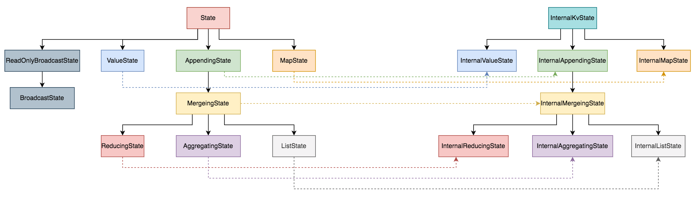

Flink State 从层次上可以分为 API 层和 Backend 层，API 层可以细分为外部 State API 和内部 State API：
- flink-core 模块 org.apache.flink.api.common.state 包下的用户 API，即外部 State API
- flink-runtime 模块 org.apache.flink.runtime.state.internal 包下的开发者 API（Internal API），即内部 State API

外部 State API 是对外部用户开放的稳定 API，需要使用这种 API 来开发应用程序。开发者 API（Internal API）是对内部开发者使用的 API，是不稳定的，可能会随着版本迁移发生变化。开发者 API（Internal API）在形式上继承了对外 API。



## 1. 外部 State API

外部 State API 是对外部用户开放的稳定 API，需要使用这种 API 来开发应用程序。此外外部 State API 定义了 Flink 所支持的各种 State 类型接口，比如 ValueState、MapState 等。

State 接口是 Keyed State 类型的顶级接口。实现 State 接口的状态只能由 KeyedStream 上的函数访问。状态的 Key 由系统自动提供，所以该类型下的各种 State 都是当前 Key 对应的 Value(无论 value、map 还是 list 等等)。State 接口只定义了一个 `clear()` 方法，用于删除当前 Key 对应的状态值：
```java
public interface State {
    void clear();
}
```

> 外部 State API 位于 flink-core 模块 org.apache.flink.api.common.state 包下。

### 1.1 AppendingState

AppendingState 继承自 State 接口，是 KeyedState 的基础接口。AppendingState 提供了 get 和 add 两个方法：
```java
public interface AppendingState<IN, OUT> extends State {
    OUT get() throws Exception;
    void add(IN value) throws Exception;
}
```
添加进来的数据记录可以缓存在 Buffer (缓存在内存中，类似 List)中，也可以进行聚合。输出的状态类型 Out 不必和输入状态类型 IN 保持一致。

#### 1.1.1 MergingState

MergingState 是 AppendingState 的扩展接口，可以实现 State 的合并。目前只是一个标识接口，未定义任何实现：
```java
public interface MergingState<IN, OUT> extends AppendingState<IN, OUT> {}
```
可以允许两个 MergingState 实例进行合并，合并后的实例会包含被合并实例的所有状态信息。

##### 1.1.1.1 ListState

ListState 是 MergingState 的扩展接口，数据类型是一个 List。其中 MergingState 的 OUT 类型为 Iterable，即可以实现多个 State 的合并：
```java
public interface ListState<T> extends MergingState<T, Iterable<T>> {
    void update(List<T> var1) throws Exception;
    void addAll(List<T> var1) throws Exception;
}
```
ListState 提供了两个方法：update 和 addAll：
- update 会进行全量更新，如果传入 List 是 null 或者为空，则 ListState 会被清空。
- addAll 则是对现有列表状态进行更新，如果传入的是 null 或者为空，则不会对现有状态进行更新。

需要注意的是 ListState 相较其它 Keyed State 比较特殊，ListState 既可以是 Keyed ListState，也可以是 Operator ListState：
- 当它是 Keyed ListState 时，状态只能由 KeyedStream 上的函数访问。状态的 Key 由系统自动提供，所以该类型下各种 State 都是当前 Key 对应的 Value。
- 当它是 Operator ListState 时，该 List 是状态项的集合，这些状态项彼此独立，并且在算子并行度发生变化时可以跨算子实例重新分配。

##### 1.1.1.2 AggregatingState

AggregatingState 是 MergingState 的扩展接口，会对所有添加的元素通过 AggregateFunction 进行聚合。目前只是一个标识接口，未定义任何实现：
```java
public interface AggregatingState<IN, OUT> extends MergingState<IN, OUT> {}
```
通过 AggregateFunction 聚合后可以生成与输入数据不一样的数据类型，IN 表示聚合前 State 的数据类型，OUT 表示聚合后 State 的数据类型。

##### 1.1.1.3 ReducingState

ReducingState 是 MergingState 的扩展接口，会对添加的元素通过 ReduceFunction 进行聚合，最后合并到一个单一的状态值：
```java
public interface ReducingState<T> extends MergingState<T, T> {}
```
与 AggregatingState 通过 AggregateFunction 聚合不同的是，通过 ReduceFunction 聚合前后的数据类型 IN 和 OUT 是相同的。

### 1.2 ValueState

ValueState 是 State 的扩展接口，是类型为 T 的单值状态：
```java
public interface ValueState<T> extends State {
    T value() throws IOException;
    void update(T var1) throws IOException;
}
```
ValueState 定义了 value 和 update 两个方法。可以通过 update 方法更新状态值，通过 value 方法获取状态值。

### 1.3 MapState

MapState 是 State 的扩展接口，使用 Map 存储 Key-Value 对：
```java
public interface MapState<UK, UV> extends State {
    UV get(UK key) throws Exception;
    void put(UK key, UV value) throws Exception;
    void putAll(Map<UK, UV> map) throws Exception;
    void remove(UK key) throws Exception;
    boolean contains(UK key) throws Exception;
    Iterable<Map.Entry<UK, UV>> entries() throws Exception;
    Iterable<UK> keys() throws Exception;
    Iterable<UV> values() throws Exception;
    Iterator<Map.Entry<UK, UV>> iterator() throws Exception;
    boolean isEmpty() throws Exception;
}
```
通过 put(UK,UV) 或者 putAll(Map<UK,UV>) 来添加，使用 get(UK) 来获取。

### 1.4 ReadOnlyBroadcastState

ReadOnlyBroadcastState 是 State 的扩展接口，是一个只提供只读操作的 BroadcastState。ReadOnlyBroadcastState 定了三个方法：get、contains 和 immutableEntries。对于 get 和 immutableEntries 返回的结果，用户不应该对其修改，否则会引发状态的不一致性(之所以没有直接返回副本，主要考虑性能原因)：
```java
public interface ReadOnlyBroadcastState<K, V> extends State {
    V get(K key) throws Exception;
    boolean contains(K key) throws Exception;
    Iterable<Map.Entry<K, V>> immutableEntries() throws Exception;
}
```

#### 1.4.1 BroadcastState

BroadcastState 是 ReadOnlyBroadcastState 的扩展接口。BroadcastState 用来存储 BroadcastStream 广播流的状态。BroadcastState 中的数据会被发送到指定算子的所有实例中，并保证每个实例中的数据都相同。BroadcastState 在方法定义上和 MapState 非常类似，定了 put、putAll、remove、iterator 和 entries 方法：
```java
public interface BroadcastState<K, V> extends ReadOnlyBroadcastState<K, V> {
    void put(K var1, V var2) throws Exception;
    void putAll(Map<K, V> var1) throws Exception;
    void remove(K var1) throws Exception;
    Iterator<Map.Entry<K, V>> iterator() throws Exception;
    Iterable<Map.Entry<K, V>> entries() throws Exception;
}
```

## 2. 内部 State API

为了在运行时访问状态数据的所有辅助方法(内部方法)，且避免直接将状态内部方法提供给用户使用，Flink 抽象了 InternalKvState 接口，定义了专门用来系统内部访问状态数据的辅助方法。InternalKvState 中定义的方法不对用户开放。一方面是避免引起混淆，另一方面是因为在各个发行版本中 InternalKvState 接口的方法是不稳定的。

在 InternalKvState 接口中提供了获取和设定命名空间以及获取定义状态 Key 和 Value 等类型序列化器的方法：
```java
public interface InternalKvState<K, N, V> extends State {
    TypeSerializer<K> getKeySerializer();
    TypeSerializer<N> getNamespaceSerializer();
    TypeSerializer<V> getValueSerializer();
    void setCurrentNamespace(N var1);
    byte[] getSerializedValue(byte[] var1, TypeSerializer<K> var2, TypeSerializer<N> var3, TypeSerializer<V> var4) throws Exception;
    StateIncrementalVisitor<K, N, V> getStateIncrementalVisitor(int var1);
    public interface StateIncrementalVisitor<K, N, V> {
        boolean hasNext();
        Collection<StateEntry<K, N, V>> nextEntries();
        void remove(StateEntry<K, N, V> var1);
        void update(StateEntry<K, N, V> var1, V var2);
    }
}
```
InternalKvState 接口中定义的方法不会对用户开放，只能用于系统内部使用，接口上通过 Internal 进行标记。和 State 接口作为所有状态的根节点类似，InternalKvState 也是所有内部状态的根节点。将 InternalKvState 和具体数据类型的状态接口结合，形成不同类型的内部访问状态接口。例如，继承 MapSate 和 InternalKvState 接口生成 InternalMapState，继承 ValueState 和 InternalKvState 接口生成 InternalValueState 等。内部 State API（Internal API）定义了 Flink 内部使用 State 的类型接口，内部 API 接口和外部 API 接口一一对应，并且内部 API 接口都继承了外部 API 的接口。内部 API 接口除了继承了外部 API 的接口方法外，在运行时通过 InternalKvState 提供的方法操作状态数据，避免了直接提供给用户使用。

> 内部 State API flink-runtime 模块 org.apache.flink.runtime.state.internal 包下。

### 2.1 InternalAppendingState

InternalAppendingState 继承了 InternalKvState 和 AppendingState。在内部状态类型层次结构中与 AppendingState 对等：
```java
public interface InternalAppendingState<K, N, IN, SV, OUT> extends InternalKvState<K, N, SV>, AppendingState<IN, OUT> {
    SV getInternal() throws Exception;
    void updateInternal(SV var1) throws Exception;
}
```
K：KVState 中的 key 类型
N：namespace 的数据类型
IN：输入元素的数据类型
SV：KVState 中的 value 类型，SV 是 State Value 的缩写，也就是代表状态数据在 State 内的数据类型
OUT：输出元素的数据类型

#### 2.1.1 InternalMergeingState

InternalMergeingState 继承了 InternalAppendingState 和 MergingState 接口：
```java
public interface InternalMergingState<K, N, IN, SV, OUT>
        extends InternalAppendingState<K, N, IN, SV, OUT>, MergingState<IN, OUT> {
    void mergeNamespaces(N var1, Collection<N> var2) throws Exception;
}
```
InternalMergingState 定义了一个 mergeNamespaces 方法，用于将给定 namespace 的 state 合并到目标 namespace 里。

##### 2.1.1.1 InternalListState

InternalListState 继承了 InternalMergingState 和 ListState 接口：
```java
public interface InternalListState<K, N, T>
        extends InternalMergingState<K, N, T, List<T>, Iterable<T>>, ListState<T> {
    void update(List<T> var1) throws Exception;
    void addAll(List<T> var1) throws Exception;
}
```
InternalListState 定义了 update 和 addAll 两个方法。

##### 2.1.1.2 InternalAggregatingState

InternalAggregatingState 只是单纯的继承了 InternalMergingState 和 AggregatingState 接口:
```java
public interface InternalAggregatingState<K, N, IN, SV, OUT>
        extends InternalMergingState<K, N, IN, SV, OUT>, AggregatingState<IN, OUT> {
}
```

##### 2.1.1.3 InternalReducingState

InternalReducingState 只是单纯的继承了 InternalMergingState 和 ReducingState 接口：
```java
public interface InternalReducingState<K, N, T>
        extends InternalMergingState<K, N, T, T, T>, ReducingState<T> {}
```

### 2.2 InternalValueState

InternalValueState 只是单纯的直接继承了 InternalKvState 和 ValueState 接口：
```java
public interface InternalValueState<K, N, T>
        extends InternalKvState<K, N, T>, ValueState<T> {
}
```

### 2.3 InternalMapState

InternalMapState 只是单纯的直接继承了 InternalKvState 和 MapState 接口:
```java
public interface InternalMapState<K, N, UK, UV>
      extends InternalKvState<K, N, Map<UK, UV>>, MapState<UK, UV> {
}
```
其中UK、UV代表 Map 的 KV 数据类型。
