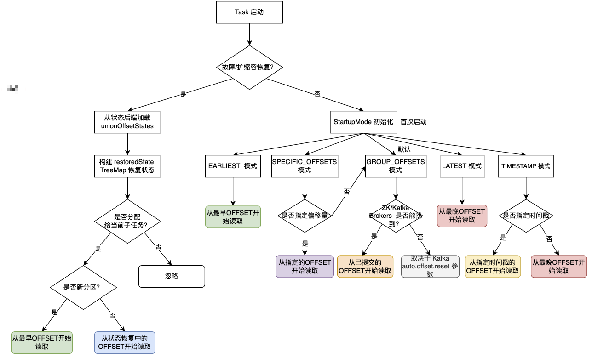

在实时流处理中，控制消费者从何处开始消费 Kafka 数据至关重要。Flink Kafka DataStream Connector 提供了灵活的 `StartupMode` 策略，本文将深入剖析其原理与实现（基于 Flink 1.13.6 源码）。


## 1. 启动模式介绍

启动模式 `StartupMode` 定义了 Flink 消费者初始化时的消费位点偏移量 Offset 策略，核心模式如下所示：
```java
public enum StartupMode {
    GROUP_OFFSETS(KafkaTopicPartitionStateSentinel.GROUP_OFFSET),
    EARLIEST(KafkaTopicPartitionStateSentinel.EARLIEST_OFFSET),
    LATEST(KafkaTopicPartitionStateSentinel.LATEST_OFFSET),
    TIMESTAMP(Long.MIN_VALUE),
    SPECIFIC_OFFSETS(Long.MIN_VALUE);
...
}
```


| 启动模式 (StartupMode) | 说明 |
| -------- | -------- |
| EARLIEST         | 从最早偏移量 Offset 开始     |
| LATEST           | 从最晚偏移量 Offset 开始    |
| TIMESTAMP        | 从指定时间戳开始的偏移量 Offset 开始     |
| GROUP_OFFSETS    | 从 Zookeeper/Kafka Brokers 中找到已提交的分组偏移量 Offset 开始 |
| SPECIFIC_OFFSETS | 指定的偏移量 Offset 开始     |

---

## 2. 如何指定启动模式

### 2.1 EARLIEST

`EARLIEST` 启动模式会忽略 Zookeeper/Kafka Brokers 中已提交的分组偏移量 Offset，直接从所有分区的最早偏移量 Offset 开始读取。你可以使用如下方法来指定 `EARLIEST` 启动模式：
```java
public FlinkKafkaConsumerBase<T> setStartFromEarliest() {
    this.startupMode = StartupMode.EARLIEST;
    this.startupOffsetsTimestamp = null;
    this.specificStartupOffsets = null;
    return this;
}
```
> 需要注意的是此方法不会影响从检查点或保存点恢复时读取的偏移量 Offset，只会使用从状态中恢复的偏移量 Offset。

---

### 2.2 LATEST

`LATEST` 启动模式会忽略 Zookeeper/Kafka Brokers 中已提交的分组偏移量 Offset，直接从所有分区的最晚偏移量 Offset 开始读取。你可以使用如下方法来指定 `LATEST` 启动模式：
```java
public FlinkKafkaConsumerBase<T> setStartFromLatest() {
    this.startupMode = StartupMode.LATEST;
    this.startupOffsetsTimestamp = null;
    this.specificStartupOffsets = null;
    return this;
}
```
> 需要注意的是此方法不会影响从检查点或保存点恢复时读取的偏移量 Offset，只会使用从状态中恢复的偏移量 Offset。

---

### 2.3 TIMESTAMP

`TIMESTAMP` 启动模式会忽略 Zookeeper/Kafka Brokers 中已提交的分组偏移量 Offset，只会从指定时间戳开始的偏移量 Offset 开始读取。需要注意的是这种模式需要指定时间戳，并且必须小于等于当前时间戳，大于等于0。你可以使用如下方法来指定 `TIMESTAMP` 启动模式：
```java
public FlinkKafkaConsumerBase<T> setStartFromTimestamp(long startupOffsetsTimestamp) {
    // 检查1: 指定的时间戳必须大于等于0
    checkArgument(startupOffsetsTimestamp >= 0, "The provided value for the startup offsets timestamp is invalid.");

    // 检查2: 指定的时间戳必须小于等于当前时间戳
    long currentTimestamp = System.currentTimeMillis();
    checkArgument(
        startupOffsetsTimestamp <= currentTimestamp,
        "Startup time[%s] must be before current time[%s].",
        startupOffsetsTimestamp,
        currentTimestamp
    );

    this.startupMode = StartupMode.TIMESTAMP;
    // 指定的时间戳
    this.startupOffsetsTimestamp = startupOffsetsTimestamp;
    this.specificStartupOffsets = null;
    return this;
}
```
> 需要注意的是此方法不会影响从检查点或保存点恢复时读取的偏移量 Offset，只会使用从状态中恢复的偏移量 Offset。

---

### 2.4 GROUP_OFFSETS

`GROUP_OFFSETS` 启动模式会从 Zookeeper/Kafka Brokers 中找到已提交的分组偏移量 Offset 开始读取。使用这种模式必须在 Kafka 属性配置中配置 `group.id`。如果在 Zookeeper/Kafka Brokers 中找不到分区的偏移量 Offset，那么会使用配置属性中 `auto.offset.reset` 参数设置的偏移量 Offset。

> `auto.offset.reset` 是 Apache Kafka 消费者的核心参数，用于在无法找到有效消费偏移量 Offset 时决定从何处开始消费，支持 `earliest`、`latest`、`none` 三种取值，默认值为 `latest`。

你可以使用如下方法来指定 `GROUP_OFFSETS` 启动模式：
```java
public FlinkKafkaConsumerBase<T> setStartFromGroupOffsets() {
    this.startupMode = StartupMode.GROUP_OFFSETS;
    this.startupOffsetsTimestamp = null;
    this.specificStartupOffsets = null;
    return this;
}
```
> 需要注意的是此方法不会影响从检查点或保存点恢复时读取的偏移量 Offset，只会使用从状态中恢复的偏移量 Offset。

---

### 2.5 SPECIFIC_OFFSETS

`SPECIFIC_OFFSETS` 启动模式会从指定的偏移量 Offset 开始读取。需要注意的是这种模式需要为每个分区分别设置偏移量 Offset，并且指定的偏移量 Offset 是从分区中读取的下一条记录的偏移量 Offset。你可以使用如下方法来指定 `SPECIFIC_OFFSETS` 启动模式：
```java
public FlinkKafkaConsumerBase<T> setStartFromSpecificOffsets(Map<KafkaTopicPartition, Long> specificStartupOffsets) {
    this.startupMode = StartupMode.SPECIFIC_OFFSETS;
    this.startupOffsetsTimestamp = null;
    this.specificStartupOffsets = checkNotNull(specificStartupOffsets);
    return this;
}
```
> 需要注意的是此方法不会影响从检查点或保存点恢复时读取的偏移量 Offset，只会使用从状态中恢复的偏移量 Offset。

如果用户提供的偏移量 Map `specificStartupOffsets` 包含了未被用户订阅的分区，那么该分区将自动被忽略。如果用户订阅的分区不在偏移量 Map 中，那么启动模式将回退到默认的 `GROUP_OFFSETS` 模式。后面会详细介绍。

---

## 3. 启动模式实现

上面介绍了如何指定启动模式，下面详细介绍每种启动模式是如何实现的，并介绍从故障/扩缩容恢复或任务首次启动时，如何初始化每个 Kafka 分区的偏移量 Offset。实现的核心逻辑位于 `FlinkKafkaConsumerBase` 类中，重点关注 `initializeState()` 和 `open()` 方法。

---

### 3.1 故障/扩缩容恢复启动

故障/扩缩容恢复启动时，从状态恢复每个 Kafka 分区偏移量 Offset 的核心逻辑在 `initializeState()` 方法中。当从故障/扩缩容恢复启动时会从 `unionOffsetStates` 状态中恢复偏移量 `Offset` 来定位每个分区的消费起始偏移量 `Offset`：
```java
public final void initializeState(FunctionInitializationContext context) throws Exception {
    // UnionListState 状态
    OperatorStateStore stateStore = context.getOperatorStateStore();
    this.unionOffsetStates = stateStore.getUnionListState(
        new ListStateDescriptor<>(
            OFFSETS_STATE_NAME,
            createStateSerializer(getRuntimeContext().getExecutionConfig())
        )
    );

    if (context.isRestored()) {
        // 从状态中恢复分区的偏移量 Offset 存放在 restoredState 中
        restoredState = new TreeMap<>(new KafkaTopicPartition.Comparator());
        for (Tuple2<KafkaTopicPartition, Long> kafkaOffset : unionOffsetStates.get()) {
            restoredState.put(kafkaOffset.f0, kafkaOffset.f1);
        }
    }
}
```
> FlinkKafkaConsumerBase#initializeState

当 Task 启动时会检查从状态中是否恢复了分区偏移量 Offset(restoredState 中存储)，如果是则使用状态中存储的偏移量 Offset 来定位每个分区的消费起始偏移量 Offset。下面是详细实现逻辑：
```java
if (restoredState != null) {
    // 分区发现器发现的订阅的所有分区
    for (KafkaTopicPartition partition : allPartitions) {
        // 不在状态恢复中的新分区默认使用 EARLIEST 模式
        if (!restoredState.containsKey(partition)) {
            restoredState.put(partition, KafkaTopicPartitionStateSentinel.EARLIEST_OFFSET);
        }
    }

    // 找到分配给当前子任务的分区并指定状态恢复的偏移量 Offset
    for (Map.Entry<KafkaTopicPartition, Long> restoredStateEntry : restoredState.entrySet()) {
        int assignSubIndex = KafkaTopicPartitionAssigner.assign(restoredStateEntry.getKey(), getRuntimeContext().getNumberOfParallelSubtasks());
        if (assignSubIndex == getRuntimeContext().getIndexOfThisSubtask()) {
            // 是否是分配给当前子任务
            subscribedPartitionsToStartOffsets.put(restoredStateEntry.getKey(), restoredStateEntry.getValue());
        }
    }

    // 过滤掉恢复分区中与当前指定的 Topic 不相关的分区
    if (filterRestoredPartitionsWithCurrentTopicsDescriptor) {
        subscribedPartitionsToStartOffsets.entrySet()
                .removeIf(
                      entry -> {
                          if (!topicsDescriptor.isMatchingTopic(entry.getKey().getTopic())) {
                              return true;
                          }
                          return false;
                      }
                );
    }
}
```
> FlinkKafkaConsumerBase#open

通过分区发现器发现订阅的所有分区：
- 如果有发现的新分区不在状态中，则无法获取偏移量 Offset，使用 `EARLIEST` 启动模式开始读取。
- 如果是历史老的分区在状态中，则可以使用状态恢复的偏移量 Offset 开始读取。
```java
for (KafkaTopicPartition partition : allPartitions) {
    // 不再状态恢复中的新分区默认使用 EARLIEST 模式
    if (!restoredState.containsKey(partition)) {
        restoredState.put(partition, KafkaTopicPartitionStateSentinel.EARLIEST_OFFSET);
    }
}
```

此外通过分区发现器发现的所有分区并不一定是分配给当前子任务，需要找到分配给当前子任务的分区并指定状态恢复的偏移量 Offset:
```java
// 找到分配给当前子任务的分区并指定状态恢复的偏移量 Offset
for (Map.Entry<KafkaTopicPartition, Long> restoredStateEntry : restoredState.entrySet()) {
    int assignSubIndex = KafkaTopicPartitionAssigner.assign(restoredStateEntry.getKey(), getRuntimeContext().getNumberOfParallelSubtasks());
    if (assignSubIndex == getRuntimeContext().getIndexOfThisSubtask()) {
        // 是否是分配给当前子任务
        subscribedPartitionsToStartOffsets.put(restoredStateEntry.getKey(), restoredStateEntry.getValue());
    }
}
```

默认情况下，当从检查点/保存点恢复时，消费者总是会过滤掉恢复分区中不再与当前指定的 Topic 列表或表达式相关联的分区。如下所示从 `subscribedPartitionsToStartOffsets` 中删除与 Topic 不相关的分区：
```java
if (filterRestoredPartitionsWithCurrentTopicsDescriptor) {
    subscribedPartitionsToStartOffsets.entrySet()
        .removeIf(
            entry -> {
                if (!topicsDescriptor.isMatchingTopic(entry.getKey().getTopic())) {
                    return true;
                }
                return false;
            }
        );
}
```

上面代码中的 `filterRestoredPartitionsWithCurrentTopicsDescriptor` 默认为 true 表示会删除不相关的分区，当然你也可以通过如下 `disableFilterRestoredPartitionsWithSubscribedTopics` 方法设置不删除不相关的分区：
```java
private boolean filterRestoredPartitionsWithCurrentTopicsDescriptor = true;
public FlinkKafkaConsumerBase<T> disableFilterRestoredPartitionsWithSubscribedTopics() {
    this.filterRestoredPartitionsWithCurrentTopicsDescriptor = false;
    return this;
}
```

---

### 3.2 首次启动

任务首次启动时(当无状态可恢复时)，初始化每个 Kafka 分区偏移量 Offset 的核心逻辑在 `open()` 方法中。首次启动时会进入 `StartupMode` 处理逻辑。根据启动模式设置它们的初始偏移量 `Offset`。对于 `SPECIFIC_OFFSETS` 和 `TIMESTAMP` 模式，需要设置具体的偏移量 Offset，但是对于其他模式（`EARLIEST`、`LATEST` 和 `GROUP_OFFSETS`），在实际读取分区时惰性地确定偏移量 `Offset`。

---

#### 3.2.1 SPECIFIC_OFFSETS

`SPECIFIC_OFFSETS` 启动模式需要精确指定每个分区的起始偏移量 `Offset`，即为每个订阅分区提供初始偏移值：
```java
// setStartFromSpecificOffsets 方法中用户提供的启动消费 Offset
private Map<KafkaTopicPartition, Long> specificStartupOffsets;

case SPECIFIC_OFFSETS:
    if (specificStartupOffsets == null) {
        // 未指定 Offset 抛出 no specific offsets were specified 异常
    }

    for (KafkaTopicPartition seedPartition : allPartitions) {
        Long specificOffset = specificStartupOffsets.get(seedPartition);
        if (specificOffset != null) {
            subscribedPartitionsToStartOffsets.put(seedPartition, specificOffset - 1);
        } else {
            subscribedPartitionsToStartOffsets.put(seedPartition, KafkaTopicPartitionStateSentinel.GROUP_OFFSET);
        }
    }
```
> FlinkKafkaConsumerBase#open

需要注意的是由于指定的偏移量表示要读取的下一条记录，因此在设置启动消费的 Offset 时将其减去1。如果用户提供的指定偏移量 Map (specificStartupOffsets) 不包含对应分区的偏移量 Offset 值，那么启动模式将回退到默认的 `GROUP_OFFSETS` 模式。

---

#### 3.2.2 TIMESTAMP

`TIMESTAMP` 启动模式需要用户指定时间戳，会从指定时间戳之后的第一条消息开始消费：
```java
case TIMESTAMP:
    if (startupOffsetsTimestamp == null) {
        // 未指定时间戳抛出 no startup timestamp was specified 异常
    }

    for (Map.Entry<KafkaTopicPartition, Long> partitionToOffset : fetchOffsetsWithTimestamp(allPartitions, startupOffsetsTimestamp).entrySet()) {
        subscribedPartitionsToStartOffsets.put(
            partitionToOffset.getKey(),
            (partitionToOffset.getValue() == null) ? KafkaTopicPartitionStateSentinel.LATEST_OFFSET : partitionToOffset.getValue() - 1
        );
    }
    break;
```
> FlinkKafkaConsumerBase#open

如果无法检索到具有给定时间戳的分区的偏移量，则默认使用 `LATEST` 启动模式，从该分区的最新偏移量开始消费；如果检索到给定时间戳的分区的偏移量，会从将其减1的位置开始消费(指定的偏移量表示要读取的下一条记录)。

给定时间戳的分区偏移量是通过 `FlinkKafkaConsumer` 的 `fetchOffsetsWithTimestamp` 方法获取，内部实际上调用了 Kafka 的 `offsetsForTimes()` API 来查询时间戳对应的 Offset：
```java
protected Map<KafkaTopicPartition, Long> fetchOffsetsWithTimestamp(Collection<KafkaTopicPartition> partitions, long timestamp) {
    // 构造请求参数 分区对应的时间戳
    Map<TopicPartition, Long> partitionOffsetsRequest = new HashMap<>(partitions.size());
    for (KafkaTopicPartition partition : partitions) {
        partitionOffsetsRequest.put(
            new TopicPartition(partition.getTopic(), partition.getPartition()),
            timestamp
        );
    }

    // 通过 KafkaConsumer 的 offsetsForTimes API 查询时间戳对应的 Offset
    final Map<KafkaTopicPartition, Long> result = new HashMap<>(partitions.size());
    try (KafkaConsumer<?, ?> consumer = new KafkaConsumer(properties)) {
        for (Map.Entry<TopicPartition, OffsetAndTimestamp> partitionToOffset : consumer.offsetsForTimes(partitionOffsetsRequest).entrySet()) {
            result.put(
                new KafkaTopicPartition(
                    partitionToOffset.getKey().topic(),
                    partitionToOffset.getKey().partition()
                ),
                (partitionToOffset.getValue() == null) ? null : partitionToOffset.getValue().offset()
            );
        }
    }
    return result;
}
```
> FlinkKafkaConsumer#fetchOffsetsWithTimestamp

---

#### 3.2.3 EARLIEST/LATEST/GROUP_OFFSETS

对于 EARLIEST、LATEST 和 GROUP_OFFSETS 启动模式在启动 Task 时只是设置一个占位符，以便在使用者实际开始读取分区时，可以惰性地计算实际提交的偏移量 Offset：
```java
for (KafkaTopicPartition seedPartition : allPartitions) {
    subscribedPartitionsToStartOffsets.put(seedPartition, startupMode.getStateSentinel());
}
```

对于这几种模式 getStateSentinel() 方法实际获取到的是如下几个占位符：
```java
public class KafkaTopicPartitionStateSentinel {
    public static final long OFFSET_NOT_SET = -915623761776L;
    public static final long EARLIEST_OFFSET = -915623761775L;
    public static final long LATEST_OFFSET = -915623761774L;
    public static final long GROUP_OFFSET = -915623761773L;
    ...
}
```
---

## 4. 总结与注意事项



- 状态恢复优先级
  - 若作业从检查点/`Savepoint` 恢复，`StartupMode` 启动模式会被忽略，Flink 始终优先使用状态中保存的消费位点 `Offset`。
- `GROUP_OFFSETS` 的回退行为
  - `GROUP_OFFSETS` 模式是默认模式。
  - 首次启动且无提交偏移量时(在 `Zookeeper`/`Kafka Brokers` 中找不到 `Offset`)，实际行为由 `Kafka` 的 `auto.offset.reset` 参数决定。
- `TIMESTAMP` 的边界处理
  - 若指定时间戳则返回指定时间戳偏移量 `Offset`。
  - 若没有指定时间戳则返回最晚(最新)偏移量 `Offset`。
- `SPECIFIC_OFFSETS` 的边界处理
  - 若指定偏移量则从指定的偏移量 `Offset` 开始读取。
  - 若没有指定偏移量则回退到默认的 `GROUP_OFFSETS` 模式。
- 分区发现的影响
  - 启用动态分区发现时，新增分区初始消费位点使用 `EARLIEST` 模式从头读取新分区。

---
