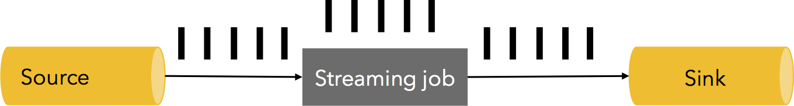
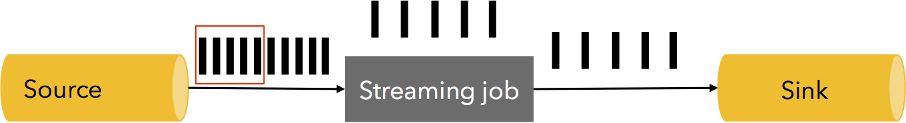
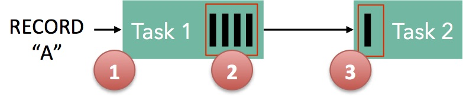

> Flink 1.4 版本

人们经常会问 Flink 是如何处理背压的。答案很简单：Flink 不使用任何复杂的机制，因为它不需要任何处理机制。只凭借数据流引擎，就可以从容地应对背压。在这篇博文中，我们介绍一下背压。然后，深入了解 Flink 是如何在任务之间传送缓冲区中的数据，并展示流数传输自然双倍下降的背压机制。我们最终通过一个小实验展示这一点。

### 1. 什么是背压

像 Flink 这样的流处理系统需要能够从容地处理背压。背压是指系统在一个临时负载峰值期间接收数据的速率大于其处理速率的一种场景(可以理解为处理速度慢，接收速度快，系统处理不了接收的数据)。许多日常情况都会导致背压。例如，垃圾回收卡顿可能导致流入的数据堆积起来，或者数据源可能出现发送数据过快的峰值。如果处理不当，背压会导致资源耗尽，甚至导致数据丢失。

让我们看一个简单的例子。假设一个数据流管道包含一个数据源，一个流作业和一个 Sink，以每秒 500 万个元素的稳定速度处理数据，如下所示(一个黑条代表 100 万个元素，下图是系统某一秒的快照)：

在某些时候，流处理作业或 Sink 有1秒的卡顿，导致 500 多万个元素的堆积。或者，数据源可能出现了一个峰值，在一秒内以双倍的速度产生数据：

我们如何处理这样的情况(如上数据源出现一个峰值，一秒内以双倍的速度产生数据)呢？当然，可以放弃这些元素(一秒内只能处理一半的数据)。但是，对于许多按 Exactly-Once 处理语义的流式应用程序来说，数据丢失是不可接受的。额外的数据可以缓存在某个地方。缓存也应该是可持久化的，因为在失败的情况下，这些数据需要被重新读取以防止数据丢失。理想情况下，这些数据应该被缓存在一个持久化的通道中(例如，如果数据源自己能保证持久性， Apache Kafka 就是这样的一种数据源)。理想状态下应对背压的措施是将整个管道从 Sink 回压到数据源，并对源头进行限流，以将管道速度调整为最慢，从而达到稳定状态:

### 2. Flink 中的背压

Flink 运行时的构建组件是算子和流。每个算子消费中间数据流，并对其进行转换，并产生新的数据流。描述这种机制的最好比喻是 Flink 充分使用有界容量的分布式阻塞队列。与 Java 连接线程的常规阻塞队列一样，一旦队列的有效缓冲耗尽(有界容量)，较慢的接收者就会使发送者放慢发送速度。以两个任务之间的简单流程为例，说明 Flink 如何实现背压：

- 记录 A 进入 Flink 并由任务1处理。
- 记录被序列化在缓冲区，
- 缓冲区输送到任务2中，然后任务2从缓冲区中读取记录。

为了使记录通过 Flink 进行处理，缓冲区必须是可用的。在 Flink 中，这些分布式队列被认为是逻辑数据流，通过生产流和消费流管理的缓冲池来实现有界容量。缓冲池是缓冲区的集合，它们在使用后会被回收。总体思路很简单：从缓冲池中取出一个缓冲区，填充数据，在数据消耗完后，将缓冲区放回缓冲池中，之后还可以再次使用它。

缓冲池的大小在运行时会动态变化。网络堆栈中的内存缓冲区的数量(=队列的容量)决定了系统在不同发送/接收速度可以进行的缓冲量。Flink 保证始终有足够的缓冲区来进行进程处理，但是这个进程的速度取决于用户程序和可用内存的数量。更多的内存意味着系统可以轻松地缓冲一定的瞬时背压(短时间段，短 GC)。越少的内存意味着需要对背压进行直接响应(没有足够的缓冲区进行缓存，只能响应处理)。

从上面的简单例子可以看出：在任务1输出端和任务2输入端都有一个与其关联的缓冲池。如果有一个可用于序列化 A 的缓冲区，我们将其序列化并分配缓冲区。我们在这里有必要看两个 case：
- 本地交换：如果任务1和任务2在同一个工作节点(TaskManager)上运行，缓冲区可以直接交给下一个任务。一旦任务2消费完，它就会被回收。如果任务2比任务1慢，则缓冲区将以低于任务1填充的速度进行回收，从而导致任务1速度变慢。
- 远程交换：如果任务1和任务2在不同的工作节点上运行，缓冲区一旦发送到线路中(TCP通道)就可以被回收。在接收端，数据从线路复制到输入缓冲池的缓冲区。如果没有缓冲区可用，从TCP连接读取操作将被中断。输出端通过一个简单的 watermark 机制保证不会在线上放置太多的数据。如果有足够的数据处在可发送状态，我们会一直复制更多的数据到线路中直到低于某个阈值时。这保证了没有太多的数据在传输途中。如果接收端没有消费新的数据(因为没有缓冲区可用)，这会减慢发送方的速度。

这种简单的在固定大小缓冲池之间的缓冲区流使 Flink 能够拥有一个强大的背压机制，在这种机制下，任务生产数据速度不会比消费的快。我们描述的两个任务之间的数据传输的机制可以自然的推广到复杂管道上，保证背压在整个管道内传播。

让我们看看一个简单的实验，展示了 Flink 在背压情况下的行为。我们运行一个简单的生产者-消费者流式拓扑，其中任务在本地交换数据，在这里我们可以变换任务产生记录的速度。对于这个测试，我们使用比默认更少的内存，以使得背压效果更明显。我们使用每个任务有2个大小为4096字节的缓冲区。在通常的 Flink 部署中，任务将具有更大更多缓冲区，这会提高性能。这个测试在单个JVM中运行，但使用完整的 Flink 代码堆栈。

图中显示了生产者任务(黄色)和消费者任务(绿色)随着时间变化所达到的最大吞吐量(单个JVM中每秒达到800万个元素)的平均吞吐量占比。为了衡量平均吞吐量，我们每5秒测量一次任务处理的记录数量。

首先，我们以60％的速度运行生产任务(我们通过调用Thread.sleep()来模拟减速)。消费者以相同的速度处理数据，不会产生延迟。然后我们把消费者任务放慢到全速的30％。在这里，背压效果产生作用，因为我们看到生产者也自然放缓到全速的30％。然后，我们取消消费者任务的人为减速，并且这两项任务都达到最大吞吐量。我们再次把消费者任务放慢到全速的30％，管道立即响应，生产者任务也全速下降到30％。最后，我们再次停止减速，两项任务都以100％的速度持续下去。总而言之，我们看到生产者和消费者在管道上相互跟随彼此的吞吐量，这是我们在流水线中期望的行为。

### 3. 结论

Flink 与像 Kafka 这样的可持久化数据源配合使用，可以立即响应处理背压而不会丢失数据。Flink 不需要专门的机制来处理背压，因为 Flink 中的数据传输可以兼做背压机制。因此，Flink 实现了管道最慢部分允许的最大吞吐量。

原文: [How Apache Flink™ handles backpressure](https://data-artisans.com/blog/how-flink-handles-backpressure)
