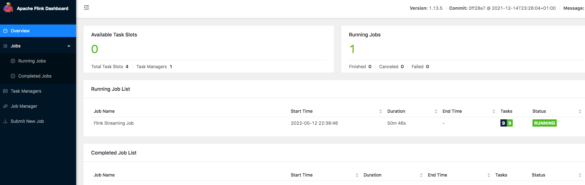

我们运行 Flink 任务，一般都是提交到集群中运行，这样可以看到作业的的执行计划、占用资源、反压、Checkpoint 等信息。但是这样我们必须先将程序打成 jar 包，然后通过 Web 页面或命令行提交到集群中运行。但是在开发测试阶段，每一次都需要将作业打包并提交到集群中运行，这样很麻烦。很多时候，我们希望在 IDE 中编写 Flink 代码运行，能够直接看到 Web UI，从而来了解 Flink 程序的运行情况。

Flink 为我们解决了这个问题，我们只需要引入 Flink Web UI 的依赖即可：
```xml
<dependency>
    <groupId>org.apache.flink</groupId>
    <artifactId>flink-runtime-web_${scala.binary.version}</artifactId>
    <version>${flink.version}</version>
</dependency>
```
需要注意的是在代码配置执行环境时要创建一个带 WebUI 的本地执行环境，如下所示：
```java
StreamExecutionEnvironment env = StreamExecutionEnvironment.createLocalEnvironmentWithWebUI(new Configuration());
StreamTableEnvironment tEnv = StreamTableEnvironment.create(env);
```
Web UI 的 rest 端口号默认是 8081，如果想改变端口号，可以在 configuration 中添加如下配置：
```java
Configuration configuration = new Configuration();
// 指定端口号
configuration.setString(RestOptions.BIND_PORT, "8091");

StreamExecutionEnvironment env = StreamExecutionEnvironment.createLocalEnvironmentWithWebUI(configuration);
StreamTableEnvironment tEnv = StreamTableEnvironment.create(env);
```
启动 Flink 程序之后，我们可以打开 http://localhost:8091 查看 WebUI：


