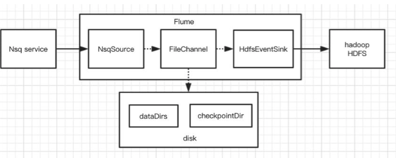
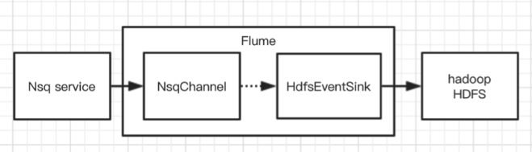
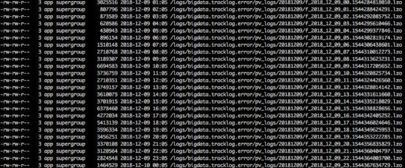

## 1. 前言

Flume 是一个分布式的高可靠，可扩展的数据采集服务。Flume 在有赞的大数据业务中一直扮演着一个稳定可靠的日志数据“搬运工”的角色。本文主要讲一下有赞大数据部门在 Flume 的应用实践，同时也穿插着我们对 Flume 的一些理解。

## 2. Delivery 保证认识

Flume 对事件投递的可靠性保证是非常重要的，它往往是我们是否使用 Flume 来解决问题的决定因素之一。消息投递的可靠保证有三种：
- At-least-once
- At-most-once
- Exactly-once

基本上所有工具的使用用户都希望工具框架能保证消息 Exactly-once ，这样就不必在设计实现上考虑消息的丢失或者重复的处理场景。但是事实上很少有工具和框架能做到这一点，真正能做到这一点所付出的成本往往很大，或者带来的额外影响反而让你觉得不值得。假设 Flume 真的做到了 Exactly-once ，那势必降低了稳定性和吞吐量，所以 Flume 选择的策略是 At-least-once 。

当然这里的 At-least-once 需要加上引号，并不是说用上 Flume 的随便哪个组件组成一个实例，运行过程中就能保证消息不会丢失。事实上 At-least-once 原则只是说的是 Source、Channel 和 Sink 三者之间上下投递消息的保证。而当你选择 MemoryChannel 时，实例如果异常挂了再重启，在 channel 中的未被 sink 所消费的残留数据也就丢失了，从而没办法保证整条链路的 At-least-once。Flume 的 At-least-once 保证的实现基础是建立了自身的 Transaction 机制。Flume 的 Transaction 有4个生命周期函数，分别是 start、 commit、 rollback 和 close。当 Source 往 Channel 批量投递事件时首先调用 start 开启事务，批量 put 完事件后通过 commit 来提交事务，如果 commit 异常则 rollback，然后 close 事务，最后 Source 将刚才提交的一批消息事件向源服务 ack（比如 kafka 提交新的 offset ）。 Sink 消费 Channel 也是相同的模式，唯一的区别就是 Sink 需要在向目标源完成写入之后才对事务进行 commit。两个组件的相同做法都是只有向下游成功投递了消息才会向上游 ack，从而保证了数据能 At-least-once 向下投递。

## 3. datay

应用场景基于 mysql binlog 的数仓增量同步（ datay 业务）是大数据这边使用 Flume 中一个比较经典的应用场景，datay 具体业务不详细说明，需要强调的是它对 Flume 的一个要求是必须保证在 nsq（消息队列）的 binlog 消息能可靠的落地到 hdfs ，不允许一条消息的丢失，需要绝对的 At-least-once。Flume 模型本身是基于 At-least-once 原则来传递事件，所以需要需要考虑是在各种异常情况（比如进程异常挂了）下的 At-least-once 保证。显然 MemoryChannel 无法满足，所以我们用 FlieChannel 做代替。由于公司目前是使用 nsq 作为 binlog 的消息中转服务，故我们没有办法使用现有的 KafkaSource，所以基于公司的 nsq sdk 扩展了 NsqSource。这里需要说明的是为了保证 At-least-once，Source 源必须支持消息接收的 ack 机制，比如 kafka 客户端只有认为消费了消息后，才对 offset 进行提交，不然就需要接受重复的消息。

于是我们第一个版本上线了，看上去很有保障了，即使进程异常挂了重启也不会丢数据。



可能有同学想到一个关键性的问题：如果某一天磁盘坏了而进程异常退出，而 FileChannel 刚好又有未被消费的事件数据，这个时候不就丢数据了吗？虽然磁盘坏了是一个极低的概率，但这确实是一个需要考虑的问题。在 Flume 现有组件中比 FlieChannel 更可靠的，可能想到的是 KafkaChannel，kafka 可以对消息保留多个副本，从而增强了数据的可靠性。但是我们第二版本的方案没有选择它，而是直接扩展出 NsqChannel 。于是第二个版本就有了。



初次使用 Flume 的用户往往陷入到必须搭配 Source + Channel + Sink 三个组件的固有模式，事实上我们不一定要三个组件都使用上。另外直接 NsqChannel 到 HDFSEventSink 的有几个好处：
- 每个消息的传递只需要一次事务，而非两次，性能上更佳。
- 避免引入了新的 kafka 服务，减少了资源成本的同时保持架构上更简单从而更稳定。

## 4. 定制化扩展Flume

在各个组件的扩展性支持具有非常好的设计考虑。当无法满足我们的自定义需求，我们可以选择合适的组件上进行扩展。下面就讲讲我们扩展的一些内容。

### 4.1 NsqSource

在 Flume 定制化一个 Source 比较简单，继承一个已有通用实现的抽象类，实现相对几个生命周期方法即可。这里说明注意的是 Flume 组件的生命周期在可能被会调用多次，比如 Flume 具有自动发现实例配置发生变化并 restart 各个组件，这种情况需要考虑资源的正确释放。

### 4.2 HdfsEventSink

它本身就具有 role file 功能，比如当 Sink 是按小时生成文件，有这一个小时的第一个事件创建新的文件，然后经过固定的 role 配置时间（比如一小时）关闭文件。这里存在的问题就是如果源平时的数据量不大，比如8点这个小时的第一个事件是在8点25分来临，那就是说需要9点25才能关闭这个文件。由于没有关闭的tmp文件会被离线数据任务的计算引擎所忽略，在小时级的数据离线任务就没办法得到实时的数据。而我们做的改造就是 roll file 基于整点时间，而不是第一次事件的时间，比如固定的05分关闭上一次小时的文件，而离线任务调度时间设置在每小时的05分之后就能解决这个问题。最终的效果给下图： 



### 4.3 MetricsReportServer

当我们需要收集 Flume 实例运行时的各个组件 counter metric ，就需要开启 MonitorService 服务。自定义了一个定期发生 http 请求汇报 metric 到一个集中的 web 服务。原生的 HTTPMetricsServer 也是基于 http 服务，区别在于它将 Flume 作为 http 服务端，而我们将很多实例部署在一台机器上，端口分配成了比较头疼的问题。当我们收集到以下的 counter metric 时，就可以利用它来实现一些监控报警：
```json
{
  "identity": "olap_offline_daily_olap_druid_test_timezone_4@49",
  "startTime": 1544287799839,
  "reportCount": 4933,
  "metrics": {
    "SINK.olap_offline_daily_olap_druid_test_timezone_4_snk": {
      "ConnectionCreatedCount": "9",
      "ConnectionClosedCount": "8",
      "Type": "SINK",
      "BatchCompleteCount": "6335",
      "BatchEmptyCount": "2",
      "EventDrainAttemptCount": "686278",
      "StartTime": "1544287799837",
      "EventDrainSuccessCount": "686267",
      "BatchUnderflowCount": "5269",
      "StopTime": "0",
      "ConnectionFailedCount": "48460"
    },
    "SOURCE.olap_offline_daily_olap_druid_test_timezone_4_src": {
      "KafkaEventGetTimer": "26344146",
      "AppendBatchAcceptedCount": "0",
      "EventAcceptedCount": "686278",
      "AppendReceivedCount": "0",
      "StartTime": "1544287800219",
      "AppendBatchReceivedCount": "0",
      "KafkaCommitTimer": "14295",
      "EventReceivedCount": "15882278",
      "Type": "SOURCE",
      "OpenConnectionCount": "0",
      "AppendAcceptedCount": "0",
      "KafkaEmptyCount": "0",
      "StopTime": "0"
    },
    "CHANNEL.olap_offline_daily_olap_druid_test_timezone_4_cha": {
      "ChannelCapacity": "10000",
      "ChannelFillPercentage": "0.11",
      "Type": "CHANNEL",
      "ChannelSize": "11",
      "EventTakeSuccessCount": "686267",
      "StartTime": "1544287799332",
      "EventTakeAttemptCount": "715780",
      "EventPutAttemptCount": "15882278",
      "EventPutSuccessCount": "686278",
      "StopTime": "0"
    }
  }
}
```
### 4.4 事件时间戳拦截

有一些 hdfs sink 业务对消息事件的时间比较敏感，同一小时的数据必须放在同一个目录里，这就要求使用 HdfsEventSink 的时候不能使用系统时间来计算文件目录，而是应该基于消息内容中的某个时间戳字段。这个可以通过扩展 Interceptor 来解决。 Interceptor 用于在 Source 投递事件给 Channel 前的一个拦截处理，一般都是用来对事件丰富 header 信息。强烈不建议在 Source 中直接处理，实现一个 Interceptor 可以满足其他 Source 类似需求的复用性。

## 5. 性能调优

Flume 实例进行性能调优最常见的配置是 事务 batch 和 ChannelCapacity。
- 事务 batch 指的是合理设置 batch 配置，可以明显的改善实例的吞吐量。上面已经讲到 Source 对 Channel 进行 put 或者 Sink 对 Channel 进行 take 都是通过开启事务来操作，所以调大两个组件的 batch 配置可以降低 cpu 消耗，减少网络 IO 等待等。
- Channel 的 capacity 大小直接影响着 source 和 sink 两端的事件生产和消费。capacity 越大，吞吐量越好，但是其他因素制约着不能设置的很大。比如 MemoryChannel ，直接表现着对内存的消耗，以及进程异常退出所丢失的事件数量。不同的 Channel 需要不同的考虑，最终 trade-off 是难免的。

## 6. 总结和展望

Flume 是一个非常稳定的服务，这一点在我们生产环境中得到充分验证。同时它的模型设计也非常清晰易懂，每一种组件类型都有很多现成的实现，同时特考虑到各个扩展点，所以我们很容易找到或者定制化我们所需要的数据管道的解决方案。随着用户越来越多，需要有一个统一的平台来集中管理所有的 Flume 实例。有以下几点好处：
- 降低用户对 Flume 的成本。尽可能在不太了解 Flume 的情况下就可以享受到它带来的价值。
- 有效对机器的资源进行合理协调使用。
- 完善的监控让 FLume 运行的更加稳定可靠。

当然这一步我们也才刚启动，希望它未来的价值变得越来越大。


> 原文:[Flume 在有赞大数据的实践](https://mp.weixin.qq.com/s/gd0KMAt7z0WbrJL0RkMEtA)
