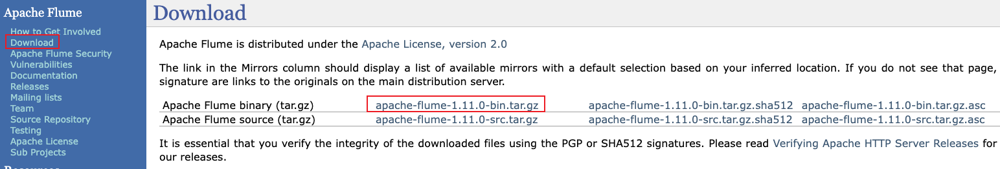

## 1. 安装

### 1.1 下载

从 [下载页](https://flume.apache.org/download.html) 下载最新版本的 Flume，当前最新版本为 1.11.0：



下载之后解压缩到工作目录 `/opt` 下：
```shell
tar -zxvf apache-flume-1.11.0-bin.tar.gz -C /opt/
```
创建软连接，便于升级：
```shell
ln -s apache-flume-1.11.0-bin/ flume
```

### 1.2 配置

在 `/etc/profile` 配置文件中添加如下配置，将 Flume 安装目录配置到 PATH 中：
```shell
# Flume
export FLUME_HOME=/opt/flume
export PATH=${FLUME_HOME}/bin:$PATH
```
执行如下命令使环境变量立即生效：
```shell
source /etc/profile
```

Flume 使用需要依赖 JDK 1.8 以上版本，确保已安装。首先创建 `flume-env.sh` 文件：
```shell
cp flume-env.sh.template flume-env.sh
```
在 `flume-env.sh` 文件中添加如下配置：
```shell
# Enviroment variables can be set here.
export JAVA_HOME=/Library/Java/JavaVirtualMachines/jdk1.8.0_161.jdk/Contents/Home
export JAVA_OPTS="-Dflume.root.logger=INFO,console"
```
### 1.3 验证安装是否成功

执行 `flume-ng version` 命令，出现下面信息，表示安装成功了：
```
localhost:bin wy$ flume-ng version
Flume 1.11.0
Source code repository: https://git.apache.org/repos/asf/flume.git
Revision: 1a15927e594fd0d05a59d804b90a9c31ec93f5e1
Compiled by rgoers on Sun Oct 16 14:44:15 MST 2022
From source with checksum bbbca682177262aac3a89defde369a37
```

## 2. 启动 Agent

Flume Agent 的配置是在一个本地的配置文件中。这是一个遵循 Java properties 文件格式的文本文件。一个或多个 Agent 配置可放在同一个配置文件里。配置文件包含 Agent的 Source，Sink 和 Channel 的各个属性以及他们的数据流连接。每个组件（Source，Sink 或者 Channel）都有一个 name，type 以及一系列的基于其 type 或实例的属性。

例如，一个 NetCat TCP Source 需要有个hostname（或者ip地址）一个端口号来接收数据。一个内存 channel有最大队列长度的属性（capacity）， 一个 HDFS sink 需要知晓文件系统的URI地址创建文件，文件访问频率（hdfs.rollInterval）等等。所有的这些组件属性都需要在Flume配置文件中设置。

### 2.1 配置 Agent

在这配置一个单节点的名为 `a1` 的 Flume Agent，同时为 Agent a1 配置一个名为 `r1` 的 Source，一个名为 `k1` 的 Sink 以及一个名为 `c1` 的 Channel 组件：
```
# 配置 Agent a1 各个组件的名称
a1.sources = r1    # Agent a1 的一个 Source：r1
a1.sinks = k1      # Agent a1 的一个 Sink：k1
a1.channels = c1   # Agent a1 的一个 Channel：c1
```

### 2.2 配置 Source

在这为 Agent a1 配置一个名为 `r1` 的 NetCat TCP Source。NetCat TCP Source 需要指定如下必须属性：

| 属性名 | 说明 |
| :------------- | :------------- |
| type  | 需要指定为 `netcat`  |
| bind  | 绑定的主机名或者IP地址  |
| port  | 绑定的端口号  |

Source 的 type 属性指定为 `netcat`，这里配的是别名，Flume 内置的一些组件都是有别名的，没有别名填全限定类名。Source 监听的的是本机，bind 属性指定为 `localhost`。Source 在这监听的端口号为 `44444`：
```
# 配置 Agent a1 的 Source r1 的属性
a1.sources.r1.type = netcat       # 使用的是 NetCat TCP Source
a1.sources.r1.bind = localhost    # NetCat TCP Source 监听的 hostname，这个是本机
a1.sources.r1.port = 44444        # 监听的端口
```

### 2.3 配置 Sink

在这为 Agent a1 配置一个名为 `k1` 的 Logger Sink。Logger Sink 需要指定如下必须属性：

| 属性名 | 说明 |
| :------------- | :------------- |
| type  | 需要指定为 `logger`  |

Source 的 type 属性指定为 `logger`：
```
# 配置 Agent a1 的 Sink k1 的属性
a1.sinks.k1.type = logger         # Sink 使用的是 Logger Sink，这个配的也是别名
```

### 2.4 配置 Channel

在这为 Agent a1 配置一个名为 `c1` 的 Memory Channel。Memory Channel 需要指定如下必须属性：

| 属性名 | 默认值 | 说明 |
| :------------- | :------------- | :------------- |
| type  | - | Channel 类型，需要指定为 `memory`  |
| capacity | 100 | 内存中存储 Event 的最大数 |
| transactionCapacity | 100 | source 或者 sink 每个事务中存取 Event 的操作数量（不能比 capacity 大） |


```
# 配置 Agent a1 的 Channel c1的属性，channel 是用来缓冲 Event 数据的
a1.channels.c1.type = memory                #channel的类型是内存channel，顾名思义这个channel是使用内存来缓冲数据
a1.channels.c1.capacity = 1000              #内存channel的容量大小是1000，注意这个容量不是越大越好，配置越大一旦Flume挂掉丢失的event也就越多
a1.channels.c1.transactionCapacity = 100    #source和sink从内存channel每次事务传输的event数量
```

### 2.5 配置连接关系


```
# 把 Source 和 Sink 绑定到 Channel 上
a1.sources.r1.channels = c1       #与source r1绑定的channel有一个，叫做c1
a1.sinks.k1.channel = c1          #与sink k1绑定的channel有一个，叫做c1
```


...
