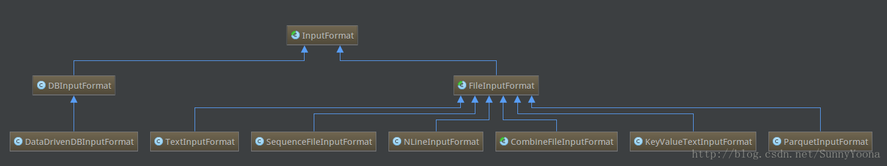
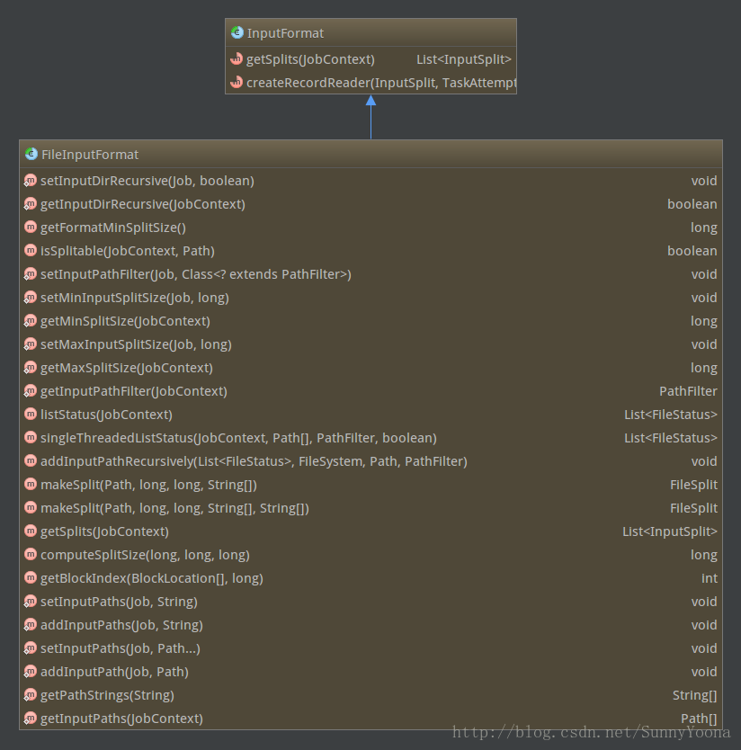

系统自带了各种 InputFormat 实现。为了方便用户编写 MapReduce 程序，Hadoop 自带了一些针对数据库和文件的 InputFormat 实现，具体如下图所示。通常而言，用户需要处理的数据均以文件形式存储到 HDFS 上, 所以我们重点针对文件的 InputFormat 实现进行讨论 。



所有基于文件的 InputFormat 实现的基类是 FileInputFormat，并由此派生出针对文本文件格式的 TextInputFormat、KeyValueTextInputFormat 和 NLineInputFormat，针对二进制文件格式的 SequenceFileInputFormat 等。整个基于文件的 InputFormat 体系的设计思路是由公共基类 FileInputFormat 采用统一的方法对各种输入文件进行切分，比如按照某个固定大小等分，而由各个派生 InputFormat 自己提供机制将进一步解析 InputSplit。对应到具体的实现是，基类 FileInputFormat 提供 getSplits 实现，而派生类提供 getRecordReader 实现。

FileInputFormat 是所有基于文件的 InputFormat 的基类。提供了 getSplits(JobContext) 的通用实现。FileInputFormat 的子类可以重写 isSplitable(JobContext，Path) 方法，以确保输入文件不可分割，作为一个整体交由 Mapper 处理。



从图中可以看出 FileInputFormat 实现了 InputFormat 接口中的 getSplit 方法，并没有实现 createRecordReader 方法。createRecordReader 需要在 FileInputFormat 的继承类中实现。FileInputFormat 最重要的功能是为各种 InputFormat 提供统一的 getSplits 函数。该函数实现中最核心的两个算法就是文件切分算法和 host 选择算法。

## 1. 文件切分

文件切分算法主要用于确定 InputSplit 的个数以及每个 InputSplit 对应的数据段。FileInputFormat 以文件为单位切分生成 InputSplit。对于每个文件，由以下三个属性值确定其对应的 InputSplit 的个数：
- goalSize：它是根据用户期望的 InputSplit 个数计算出来的，即 totalSize/numSplit。其中，totalSize 为文件的总大小；numSplit 为用户设定的 Map Task 个数，默认为1；
- minSize：InputSplit 的最小值，由配置参数 `mapred.min.split.size` 确定，默认为1；
- blockSize：文件在 HDFS 中存储的 block 大小，默认为64MB（MR1默认为64M，MR2默认为128M）。

这三个参数一起决定 InputSplit 的最终大小，方法如下：
```
splitSize = max{minSize, min{goalSize, blockSize}}  (不小于设置的最小分片大小minSize 同时不大于块大小blockSize)
```
在新版 API 中，InputSplit 划分不再考虑用户设定的 Map Task 个数，而是用 `mapred.max.split.size`(记为 maxSize)代替，即 InputSplit 大小的计算公式变为：
```
splitSize = max{minSize, min{maxSize, blockSize}}
```
一旦确定 splitSize 值后，FileInputFormat 将文件一次切成大小为 splitSize 的 InputSplit，最后剩下不足 splitSize 的数据块单独成为一个 InputSplit。

Example:

假设输入目录下有一个文件，大小为250M，若blockSize默认值为64MB，则不同minSize和goalSize下，文件切分结果如下所示:
minSize|numSplit|goalSize|blockSize|splitSize|InputSplit个数
---|---|---|---|---|---
1MB|1|250MB|64Mb|64MB|4
32MB|5|50MB|64MB|50MB|5
128MB|2|125MB|64MB|128MB|2
250MB|2|125MB|64MB|250MB|1

综合表格和公式，我们可以知道如果想让InputSplit大小大于blockSize，则直接增大配置参数`mapred.min.split.size`即可。

```java
public List<InputSplit> getSplits(JobContext job) throws IOException {
  StopWatch sw = new StopWatch().start();
  long minSize = Math.max(getFormatMinSplitSize(), getMinSplitSize(job));
  long maxSize = getMaxSplitSize(job);

  List<InputSplit> splits = new ArrayList<InputSplit>();
  List<FileStatus> files = listStatus(job);
  for (FileStatus file: files) {
    Path path = file.getPath();
    long length = file.getLen();
    if (length != 0) {
      BlockLocation[] blkLocations;
      if (file instanceof LocatedFileStatus) {
        blkLocations = ((LocatedFileStatus) file).getBlockLocations();
      }
      else {
        FileSystem fs = path.getFileSystem(job.getConfiguration());
        blkLocations = fs.getFileBlockLocations(file, 0, length);
      }
      if (isSplitable(job, path)) {
        long blockSize = file.getBlockSize();
        long splitSize = computeSplitSize(blockSize, minSize, maxSize);

        long bytesRemaining = length;
        while (((double) bytesRemaining)/splitSize > SPLIT_SLOP) {
          int blkIndex = getBlockIndex(blkLocations, length-bytesRemaining);
          splits.add(makeSplit(path, length-bytesRemaining, splitSize, blkLocations[blkIndex].getHosts(), blkLocations[blkIndex].getCachedHosts()));
          bytesRemaining -= splitSize;
        }

        if (bytesRemaining != 0) {
          int blkIndex = getBlockIndex(blkLocations, length-bytesRemaining);
          splits.add(makeSplit(path, length-bytesRemaining, bytesRemaining, blkLocations[blkIndex].getHosts(), blkLocations[blkIndex].getCachedHosts()));
        }
      }
      else { // not splitable
        splits.add(makeSplit(path, 0, length, blkLocations[0].getHosts(), blkLocations[0].getCachedHosts()));
      }
    }
    else {
      //Create empty hosts array for zero length files
      splits.add(makeSplit(path, 0, length, new String[0]));
    }
  }
  // Save the number of input files for metrics/loadgen
  job.getConfiguration().setLong(NUM_INPUT_FILES, files.size());
  sw.stop();
  return splits;
}
```

#### 1.2 hosts选择

确定 InputSplit 切分方案之后，下一步要确定每个 InputSplit 的元数据信息。这通常由四部分组成: <file, start, length, hosts>，分别表示 InputSplit 所在的文件，起始位置，长度以及所在的 host(节点)列表。前三个很容易确定，难点在于 host 列表的选择方法。

InputSplit 的 host 列表选择策略直接影响到运行过程中的任务本地性，我们知道HDFS上的文件是以block为单位组织的，一个大文件对应的block可能遍布Hadoop集群，而InputSplit的划分算法可能导致一个InputSplit对应多个block，这些block可能位于不同节点上，这使得Hadoop不可能实现完全的数据本地性。为此，Hadoop将数据本地性按照按照代价划分为三个等级:node locality, rack locality和data center locality。在进行任务进度时，会依次考虑三个节点的locality，即优先让空闲资源处理本地节点上的数据，如果节点上没有可处理的数据，则处理同一个机架上的数据，最差情况是处理其他机架上的数据(但是，必须位于同一个数据中心)。

虽然InputSplit对应的block可能位于多个节点上，但考虑到任务调度的效率，通常不会把所有节点加到InputSplit的host列表中，而是选择包含该InputSplit数据总量最大的前几个节点(Hadoop限制最多选择10个，多余的会过滤掉)，以作为任务调度时判断任务是否具有本地性的主要凭证。

当使用基于FileInputFormat实现InputFormat时，为了提高Map Task的数据本地性，应尽量使InputSplit大小与block大小相同。


### 源码

#### PathFilter
PathFilter被用来对文件进行过滤，控制哪些文件作为输入，哪些不作为输入。PathFilter是一个接口，里面只有一个方法accept(Path path)。如果传进来的Path参数是我们需要的文件返回true，否则返回false。可以通过设置 **mapred.input.pathFilter.class** 来设置用户自定义的PathFilter。FileInputFormat类定义了一个hiddenFilter，用来过滤以"-"或者"."开头的文件。

```java
  private static final PathFilter hiddenFileFilter = new PathFilter(){
      public boolean accept(Path p){
        String name = p.getName();
        return !name.startsWith("_") && !name.startsWith(".");
      }
    };
```
#### MultiPathFilter

代理PathFilter，只有满足在构造函数中给定的所有PathFilter时才可以接受路径作为输入。MultiPathFilter将内置的hiddenFileFilter与用户自定义的PathFilter（如果有）组装一起。MultiPathFilter会在listStatus()方法中使用，而listStatus()方法又被getSplits()方法用来获取输入文件，也就是说实现了在获取输入分片前先进行文件过滤。


```java
  private static class MultiPathFilter implements PathFilter {
    private List<PathFilter> filters;

    public MultiPathFilter(List<PathFilter> filters) {
      this.filters = filters;
    }

    public boolean accept(Path path) {
      for (PathFilter filter : filters) {
        if (!filter.accept(path)) {
          return false;
        }
      }
      return true;
    }
  }
```
在listStatus()方法中的使用：

```java
List<PathFilter> filters = new ArrayList<PathFilter>();
filters.add(hiddenFileFilter);
PathFilter jobFilter = getInputPathFilter(job);
if (jobFilter != null) {
    filters.add(jobFilter);
}
PathFilter inputFilter = new MultiPathFilter(filters);
```
