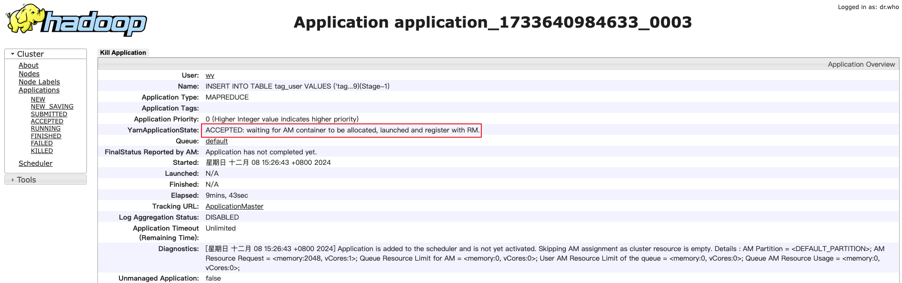
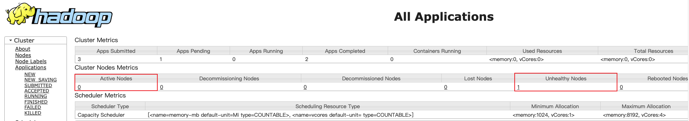

## 1. 问题

在运行 Hive 作业时，作业一直卡在下面语句不能运行：
```
hive (default)> INSERT INTO TABLE tag_user VALUES ('tag2', 8), ('tag2', 9);
Query ID = wy_20241208152637_0c540671-a4b0-4a19-97a3-4ff9f421fc46
Total jobs = 3
Launching Job 1 out of 3
Number of reduce tasks is set to 0 since there's no reduce operator
Starting Job = job_1733640984633_0003, Tracking URL = http://localhost:8088/proxy/application_1733640984633_0003/
Kill Command = /opt/hadoop/bin/hadoop job  -kill job_1733640984633_0003
```

## 2. 分析

通过 Tracking URL `http://localhost:8088/proxy/application_1733640984633_0003/` 查看任务一直处于 `ACCEPTED: waiting for AM container to be allocated, launched and register with RM.` 状态：



在 ResourceManager 页面中，发现 YARN 节点状态是不健康的，从而导致一直等待 AM 容器的分配：



点击进入查看 NodeHealthReport 报告如下：
```
1/1 local-dirs usable space is below configured utilization percentage/no more usable space [ /Users/wy/tmp/hadoop/nm-local-dir : used space above threshold of 98.5% ] ; 1/1 log-dirs usable space is below configured utilization percentage/no more usable space [ /opt/hadoop-2.10.1/logs/userlogs : used space above threshold of 98.5% ]
```
从上面可以看到是因为磁盘使用率超过 `max-disk-utilization-per-disk-percentage` 参数配置的 98.5% 从而产生了不健康节点：
```xml
<property>
    <name>yarn.nodemanager.disk-health-checker.max-disk-utilization-per-disk-percentage</name>
    <value>98.5</value>
</property>
```
> 默认值为 90.0%

之前我们已经将阈值从 90% 提高到了 98.5%，本是治标不治本的措施。根治的解决方案还是要删除一些没用的数据，降低磁盘的使用率。
