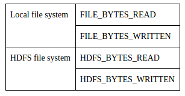
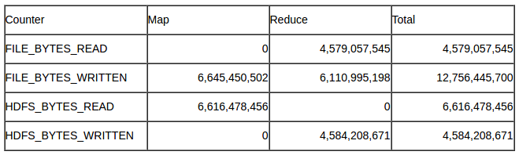
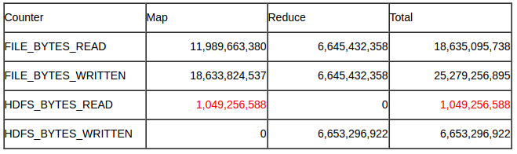
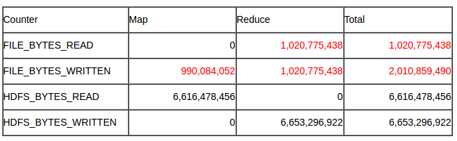
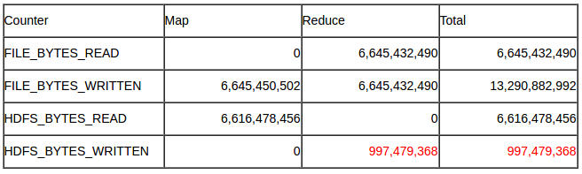
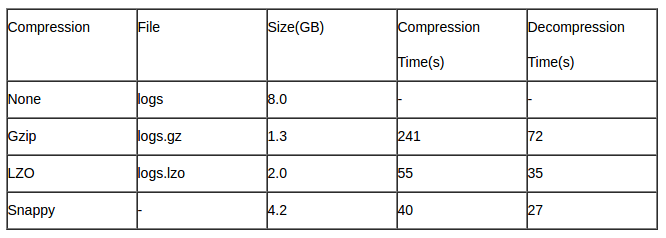

就如上一篇文章介绍的那样，如果输入文件是压缩文件，当 MapReduce 程序读取压缩文件时，根据文件名的后缀来选择 codes，输入文件自动解压缩（我们不需要指定压缩文件是哪一种压缩格式）。

下面我们列出了一些代码，为 Hadoop 中常用的压缩格式设置输出压缩。

### 1. 常用压缩格式

#### 1.1 Gzip

对于最终输出，我们可以使用 FileOutputFormat 上的静态方便方法来设置属性：
```java
FileOutputFormat.setCompressOutput(job, true);
FileOutputFormat.setOutputCompressorClass(job, GzipCodec,class);
```
或者
```java
Configuration conf = new Configuration();
conf.setBoolean("mapreduce.output.fileoutputformat.compress", true);
conf.setClass("mapreduce.output.fileoutputformat.compress.codec", GzipCodec.class, CompressionCodec.class);
```
对于 Map 输出：
```java
Configuration conf = new Configuration();
conf.setBoolean("mapreduce.map.output.compress",true);
conf.setClass("mapreduce.map.output.compress.codec", GzipCodec.class, CompressionCodec.class);
Job job = Job.getInstance(conf);
```

#### 1.2 LZO

对于最终输出：
```java
FileOutputFormat.setCompressOutput(conf, true);
FileOutputFormat.setOutputCompressorClass(conf, LzoCodec.class);
```
> 为了使LZO可分割，我们需要生成一个LZO索引文件。

对于 Map 输出：
```java
Configuration conf = new Configuration();
conf.setBoolean("mapreduce.map.output.compress",true);
conf.setClass("mapreduce.map.output.compress.codec", LzoCodec.class, CompressionCodec.class);
Job job = Job.getInstance(conf);
```

#### 1.3 Snappy

对于最终输出：
```java
conf.setOutputFormat(SequenceFileOutputFormat.class);
SequenceFileOutputFormat.setOutputCompressionType(conf, CompressionType.BLOCK);
SequenceFileOutputFormat.setCompressOutput(conf, true);
conf.set("mapreduce.output.fileoutputformat.compress.codec","org.apache.hadoop.io.compress.SnappyCodec");
```
对于Map输出：
```java
Configuration conf = new Configuration();
conf.setBoolean("mapreduce.map.output.compress", true);
conf.set("mapreduce.map.output.compress.codec","org.apache.hadoop.io.compress.SnappyCodec");
```
### 2. 实验与结果

#### 2.1 Filesystem counters

文件系统计数器用于分析实验结果。以下是典型的内置文件系统计数器。



`FILE_BYTES_READ` 是本地文件系统读取的字节数。假设所有的 map 输入数据都来自 HDFS，那么在 map 阶段，`FILE_BYTES_READ` 应该为零。另一方面，reducer 的输入文件是 reduce 端本地磁盘上的数据，它们是从 map 端磁盘拉取过来的。因此，reduce 端 `FILE_BYTES_READ` 表示 reducer 读取的总字节数。

`FILE_BYTES_WRITTEN` 由两部分组成。第一部分来自 mappers。所有的 mappers 都会将中间输出溢出到磁盘上。mappers 写入磁盘的所有字节将包含在 `FILE_BYTES_WRITTEN` 中。第二部分来自 reducers。 在 shuffle 阶段，所有 reducers 将从 mappers 中获取中间数据，合并并溢写到 reducer 端的磁盘上。reducers 写入磁盘的所有字节也将包含在 `FILE_BYTES_WRITTEN` 中。

`HDFS_BYTES_READ` 表示作业启动时 mappers 从 HDFS 上读取的字节数。这些数据不仅包括源文件的内容，还包括关于 splits 的元数据。

`HDFS_BYTES_WRITTEN` 表示写入 HDFS 的字节。这是最终输出的字节数。

请注意，由于 HDFS 和本地文件系统是不同的文件系统，因此来自两个文件系统的数据不会重叠。

#### 2.2 压缩比较

(1) 没有压缩



(2) 只压缩输入



我们可以看到 `HDFS_BYTES_READ` 明显减少。这表明 mappers 从 HDFS 上读取的总字节数显着减少。

(3) 只压缩map中间输出



我们可以看到 `FILE_BYTES_READ` 和 `FILE_BYTES_WRITTEN` 显着减少。这意味着本地文件系统节点之间的数据传输显着减少。

(4) 只压缩最终输出



我们可以看到 `HDFS_BYTES_WRITTEN` 显着减少。这表明 HDFS 的最终输出显着降低。

#### 2.3 不同压缩格式的比较：gzip，lzo



正如我们所看到的，LZO 文件略大于对应的 gzip 文件，但都比原来未压缩文件小得多。另外，LZO 文件压缩速度快了近五倍，解压速度快了两倍。

我们还可以看到 Snappy 文件比相应的 LZO 文件大，但仍然是原来未压缩文件的一半。另外，Snappy 的压缩和解压缩速度都比 LZO 更快。总之，Snappy 在压缩和解压缩时间方面速度更快，但在压缩比方面效率更低。

原文：http://comphadoop.weebly.com/how-to-use-compression.html
