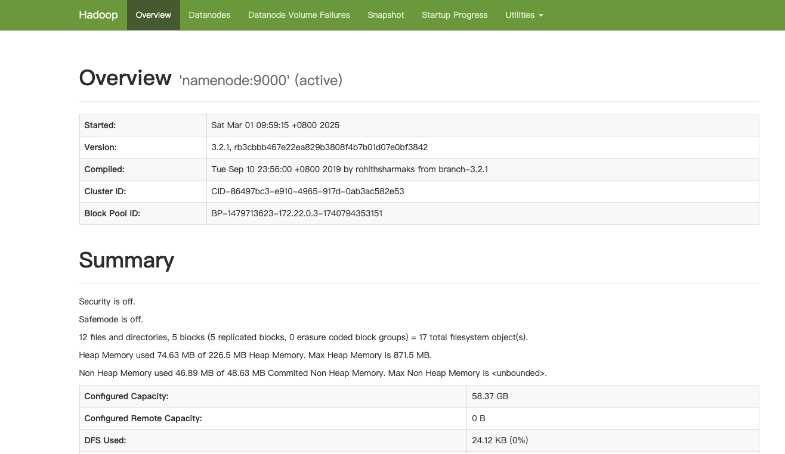
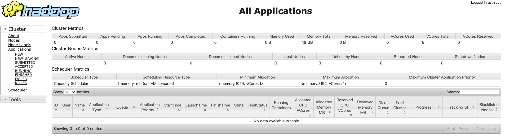
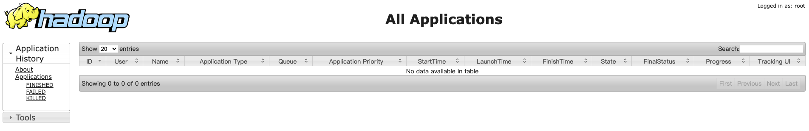
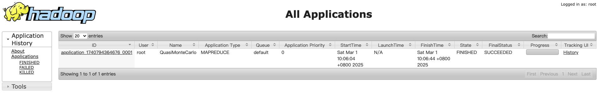

在现代软件开发的众多环节中，容器化技术已经成为了加速开发、简化部署的关键工具。Docker 作为市场上最流行的容器平台之一，提供了一种高效的方式来打包、分发和管理应用。在这片博文中，我们将探索如何利用 Docker Compose 来部署一个 Apache Hadoop 集群。在开发环境中，使用 Docker Compose 部署 Hadoop 不仅能够保证环境的一致性，还允许开发者快速部署和撤销实例，极大地提高了开发效率。

## 1. Hadoop 简介

Hadoop 是一个开源的 分布式计算框架，用于高效存储和处理海量数据（从 TB 到 PB 级别）。它基于 Google 的 MapReduce 和 GFS 论文 设计，由 Apache 基金会开发维护，是 大数据生态系统的基石。核心组成：
- HDFS（Hadoop Distributed File System）
  - 分布式文件系统，提供高容错、高吞吐量的数据存储。
  - 主从架构：
    - NameNode：管理文件元数据（如目录结构、文件分块信息）。
    - DataNode：存储实际数据块，默认冗余 3 份，保障数据安全。
- MapReduce
  - 分布式计算模型，将任务分解为 Map（并行处理）和 Reduce（汇总结果）两个阶段。
  - 适合离线批处理（如日志分析、数据清洗）。
- YARN（Yet Another Resource Negotiator）
  - 资源管理框架，负责集群资源的调度与任务监控。
  - 支持多种计算框架（如 MapReduce、Spark、Flink）。

## 2. Docker Compose 简介

Docker Compose 是一个用于定义和运行多容器 Docker 应用程序的工具。通过 Compose，您可以通过一个 YAML 文件来配置您的应用的服务。然后，使用一个简单的命令，就可以创建并启动所有配置中的服务。这让组织和管理容器变成了一件轻而易举的事情。

在开始之前，首先需要确保已经安装了 Docker Compose，如果没有安装或者不熟悉 Compose 的具体查阅 [Docker 实战：使用 Docker Compose 实现高效的多容器部署](https://smartsi.blog.csdn.net/article/details/138414972)。

## 3. Docker Compose 部署 Hadoop 集群

接下来，我们将一步步通过 Docker Compose 来部署一个 Hadoop 集群。在开始部署之前，请确保以下环境已经准备好：
- 安装 Docker：确保 Docker 已经安装并运行在你的机器上。可以通过以下命令验证 Docker 是否安装：
   ```bash
   docker --version
   ```
- 安装 Docker Compose：确保 Docker Compose 已经安装并配置完成。可以通过以下命令验证 Docker Compose 是否安装：
   ```bash
   docker-compose --version
   ```

### 3.1 创建项目目录

首先为项目创建一个目录。在这里，在我们的工作目录 `/opt/workspace/docker` 下创建一个名为 `hadoop` 的项目：
```shell
smartsi@localhost docker % mkdir hadoop
smartsi@localhost docker % cd hadoop
```

> 该目录是应用程序镜像的上下文。该目录应该只包含用于构建该镜像的资源。

### 3.2 构建 Compose 文件

Docker Compose 简化了对整个应用程序堆栈的控制，使得在一个易于理解的 YAML 配置文件中轻松管理服务、网络和数据卷。要使用 Docker Compose 部署，首先需创建一个`docker-compose.yml`文件，从 [bde2020](https://github.com/big-data-europe/docker-hadoop/tree/master)下载配置文件，按照自己的需求修改即可。在这我们的配置如下所示：
```yaml
version: "3"

services:
  namenode:
    image: bde2020/hadoop-namenode:2.0.0-hadoop3.2.1-java8
    container_name: namenode
    networks:
      - hadoop-network
    restart: always
    ports:
      - 9870:9870
      - 9000:9000
    volumes:
      - hadoop_namenode:/hadoop/dfs/name
    environment:
      - CLUSTER_NAME=docker-hadoop-cluster
    env_file:
      - ./hadoop.env

  datanode:
    image: bde2020/hadoop-datanode:2.0.0-hadoop3.2.1-java8
    container_name: datanode
    networks:
      - hadoop-network
    restart: always
    volumes:
      - hadoop_datanode:/hadoop/dfs/data
    environment:
      SERVICE_PRECONDITION: "namenode:9870"
    env_file:
      - ./hadoop.env

  resourcemanager:
    image: bde2020/hadoop-resourcemanager:2.0.0-hadoop3.2.1-java8
    container_name: resourcemanager
    networks:
      - hadoop-network
    restart: always
    ports:
      - "8088:8088"  # Web UI
    environment:
      SERVICE_PRECONDITION: "namenode:9000 namenode:9870 datanode:9864"
    env_file:
      - ./hadoop.env

  nodemanager:
    image: bde2020/hadoop-nodemanager:2.0.0-hadoop3.2.1-java8
    container_name: nodemanager
    networks:
      - hadoop-network
    restart: always
    environment:
      SERVICE_PRECONDITION: "namenode:9000 namenode:9870 datanode:9864 resourcemanager:8088"
    env_file:
      - ./hadoop.env

  historyserver:
    image: bde2020/hadoop-historyserver:2.0.0-hadoop3.2.1-java8
    container_name: historyserver
    networks:
      - hadoop-network
    restart: always
    ports:
      - "8188:8188"
    environment:
      SERVICE_PRECONDITION: "namenode:9000 namenode:9870 datanode:9864 resourcemanager:8088"
    volumes:
      - hadoop_historyserver:/hadoop/yarn/timeline
    env_file:
      - ./hadoop.env

volumes:
  hadoop_namenode:
  hadoop_datanode:
  hadoop_historyserver:

networks:
  hadoop-network:
    driver: bridge
    ipam:
      config:
        - subnet: 172.22.0.0/24
```


#### 3.2.1 服务定义（Services）

`services` 用于定义 Hadoop 集群的各个组件，每个组件对应一个容器。上面的配置定义了5个服务：
- `namenode`：HDFS 的 NameNode，负责管理文件系统的元数据。
- `datanode`：HDFS 的 DataNode，负责存储实际的数据块。
- `resourcemanager`：YARN 的 ResourceManager，负责集群资源管理和任务调度。
- `nodemanager`：YARN 的 NodeManager，负责管理单个节点上的资源和任务。
- `historyserver`：YARN 的 HistoryServer，负责保存和展示已完成任务的历史信息。

Docker Compose 会将每个服务部署在各自的容器中，在这里我们自定义了与服务名称一致的容器名称，因此 Docker Compose 会部署5个名为 `namenode`、`datanode`、`resourcemanager`、`nodemanager` 以及 `historyserver` 的容器。

##### 3.2.1.1 NameNode 服务

```yaml
namenode:
  image: bde2020/hadoop-namenode:2.0.0-hadoop3.2.1-java8
  container_name: namenode
  networks:
    - hadoop-network
  restart: always
  ports:
    - 9870:9870
    - 9000:9000
  volumes:
    - hadoop_namenode:/hadoop/dfs/name
  environment:
    - CLUSTER_NAME=docker-hadoop-cluster
  env_file:
    - ./hadoop.env
```

核心配置：
- `image`：使用基于 Hadoop 3.2.1 版本预构建的 2.0.0 版本 `bde2020/hadoop-namenode` 镜像部署 `NameNode` 服务。
- `container_name`：容器名称固定为 `namenode`，便于其他服务引用。
- `networks`：连接到自定义桥接网络 `hadoop-network`，确保容器间通信。
- `restart`：`always` 指定容器异常退出时自动重启。
- `ports`：
  - `9870:9870`：暴露 `NameNode` 的 Web UI。
  - `9000:9000`：HDFS 客户端（如 `DataNode`）与 `NameNode` 通信的 RPC 端口。
- `volumes`：将宿主机数据卷 `hadoop_namenode` 挂载到容器内的 `/hadoop/dfs/name`，持久化存储 `NameNode` 元数据。
- `environment`：
  - `CLUSTER_NAME`: 定义集群名称为 `docker-hadoop-cluster`。
- `env_file`：从 `hadoop.env` 文件加载环境变量（如 CORE_CONF、HDFS_CONF 等 Hadoop 配置）。

##### 3.2.1.2 DataNode 服务

```yaml
datanode:
  image: bde2020/hadoop-datanode:2.0.0-hadoop3.2.1-java8
  container_name: datanode
  networks:
    - hadoop-network
  restart: always
  volumes:
    - hadoop_datanode:/hadoop/dfs/data
  environment:
    SERVICE_PRECONDITION: "namenode:9870"
  env_file:
    - ./hadoop.env
```

核心配置：
- `image`：使用基于 Hadoop 3.2.1 版本预构建的 2.0.0 版本 `bde2020/hadoop-datanode` 镜像部署 `DataNode` 服务。
- `container_name`：容器名称固定为 `datanode`，便于其他服务引用。
- `networks`：连接到自定义桥接网络 `hadoop-network`，确保容器间通信。
- `restart`：`always` 指定容器异常退出时自动重启。
- `volumes`：将宿主机数据卷 `hadoop_namenode` 挂载到容器内的 `/hadoop/dfs/data`，持久化存储数据块。
- `environment`：
  - `SERVICE_PRECONDITION`：定义服务启动前提条件，需等待 `namenode:9870` 端口可用，即 NameNode 完全启动后再启动 `DataNode`。
- `env_file`：从 `hadoop.env` 文件加载环境变量（如 CORE_CONF、HDFS_CONF 等 Hadoop 配置）。

> 当前配置通过 `SERVICE_PRECONDITION` 环境变量实现服务等待机制（基于镜像内置的wait-for-it脚本），而非传统的 `depends_on`。这种设计的优势在于：
- 真实依赖检测：等待端口级可用而不仅是容器启动
- 自动重试机制：内置10秒间隔的重试逻辑
- 精确控制：可指定多个依赖条件（如`namenode:9000` 和 `namenode:9870`）

##### 3.2.1.3 ResourceManager 服务

```yaml
resourcemanager:
  image: bde2020/hadoop-resourcemanager:2.0.0-hadoop3.2.1-java8
  container_name: resourcemanager
  networks:
    - hadoop-network
  restart: always
  ports:
    - "8088:8088"  # Web UI
  environment:
    SERVICE_PRECONDITION: "namenode:9000 namenode:9870 datanode:9864"
  env_file:
    - ./hadoop.env
```
核心配置：
- `image`：使用基于 Hadoop 3.2.1 版本预构建的 2.0.0 版本 `bde2020/hadoop-resourcemanager` 镜像部署 `ResourceManager` 服务。
- `container_name`：容器名称固定为 `resourcemanager`，便于其他服务引用。
- `networks`：连接到自定义桥接网络 `hadoop-network`，确保容器间通信。
- `restart`：`always` 指定容器异常退出时自动重启。
- `ports`：
  - `8088:8088`：暴露 `YARN` 的 Web UI。
- `environment`：
  - `SERVICE_PRECONDITION`：需确保 `NameNode` 和 `DataNode` 相关端口就绪（9000、9870、9864）。
- `env_file`：从 `hadoop.env` 文件加载环境变量（如 CORE_CONF、HDFS_CONF 等 Hadoop 配置）。

##### 3.2.1.4 NodeManager 服务

```yaml
nodemanager:
  image: bde2020/hadoop-nodemanager:2.0.0-hadoop3.2.1-java8
  container_name: nodemanager
  networks:
    - hadoop-network
  restart: always
  environment:
    SERVICE_PRECONDITION: "namenode:9000 namenode:9870 datanode:9864 resourcemanager:8088"
  env_file:
    - ./hadoop.env
```
核心配置：
- `image`：使用基于 Hadoop 3.2.1 版本预构建的 2.0.0 版本 `bde2020/hadoop-nodemanager` 镜像部署 `NodeManager` 服务。
- `container_name`：容器名称固定为 `nodemanager`，便于其他服务引用。
- `networks`：连接到自定义桥接网络 `hadoop-network`，确保容器间通信。
- `restart`：`always` 指定容器异常退出时自动重启。
- `environment`：
  - `SERVICE_PRECONDITION`：需确保 `NameNode`、`DataNode` 和 `ResourceManager` 相关端口就绪（9000、9870、9864、8088）。
- `env_file`：从 `hadoop.env` 文件加载环境变量（如 CORE_CONF、HDFS_CONF 等 Hadoop 配置）。

##### 3.2.1.5 HistoryServer 服务

```yaml
historyserver:
  image: bde2020/hadoop-historyserver:2.0.0-hadoop3.2.1-java8
  container_name: historyserver
  networks:
    - hadoop-network
  restart: always
  ports:
    - "8188:8188"
  environment:
    SERVICE_PRECONDITION: "namenode:9000 namenode:9870 datanode:9864 resourcemanager:8088"
  volumes:
    - hadoop_historyserver:/hadoop/yarn/timeline
  env_file:
    - ./hadoop.env
```
核心配置：
- `image`：使用基于 Hadoop 3.2.1 版本预构建的 2.0.0 版本 `bde2020/hadoop-historyserver` 镜像部署 `HistoryServer` 服务。
- `container_name`：容器名称固定为 `historyserver`，便于其他服务引用。
- `networks`：连接到自定义桥接网络 `hadoop-network`，确保容器间通信。
- `restart`：`always` 指定容器异常退出时自动重启。
- `ports`：
  - `8188:8188`：暴露历史任务监控端口。
- `environment`：
  - `SERVICE_PRECONDITION`：需确保 `NameNode`、`DataNode` 和 `ResourceManager` 相关端口就绪（9000、9870、9864、8088）。
- `volumes`：将宿主机数据卷 `hadoop_historyserver` 挂载到容器内的 `/hadoop/yarn/timeline`，存储作业历史数据。
- `env_file`：从 `hadoop.env` 文件加载环境变量（如 CORE_CONF、HDFS_CONF 等 Hadoop 配置）。

#### 3.2.2 卷定义（Volumes）

```yaml
volumes:
  hadoop_namenode:
  hadoop_datanode:
  hadoop_historyserver:
```
声明三个 Docker 数据卷，用于持久化存储 NameNode 元数据、DataNode 数据块和 HistoryServer 历史记录。

> Docker 会自动管理这些卷的实际存储位置（默认在 /var/lib/docker/volumes/），确保容器重启后数据不丢失。

#### 3.2.3 网络定义（Networks）

```yaml
networks:
  hadoop-network:
    driver: bridge
    ipam:
      config:
        - subnet: 172.22.0.0/24
```

核心配置：
- `hadoop-network`：自定义网络名称
- `driver: bridge`：创建桥接网络，允许容器间通过容器名称通信。
- `ipam`：配置静态 IP 地址范围（172.22.0.0/24），避免容器 IP 变动导致服务不可用。

### 3.3 配置 `hadoop.env` 文件

`hadoop.env` 配置文件在这配置如下所示：
```yaml
CORE_CONF_fs_defaultFS=hdfs://namenode:9000
CORE_CONF_hadoop_http_staticuser_user=root
CORE_CONF_hadoop_proxyuser_hue_hosts=*
CORE_CONF_hadoop_proxyuser_hue_groups=*
CORE_CONF_io_compression_codecs=org.apache.hadoop.io.compress.SnappyCodec

HDFS_CONF_dfs_webhdfs_enabled=true
HDFS_CONF_dfs_permissions_enabled=false
HDFS_CONF_dfs_namenode_datanode_registration_ip___hostname___check=false

YARN_CONF_yarn_log___aggregation___enable=true
YARN_CONF_yarn_log_server_url=http://historyserver:8188/applicationhistory/logs/
YARN_CONF_yarn_resourcemanager_recovery_enabled=true
YARN_CONF_yarn_resourcemanager_store_class=org.apache.hadoop.yarn.server.resourcemanager.recovery.FileSystemRMStateStore
YARN_CONF_yarn_resourcemanager_scheduler_class=org.apache.hadoop.yarn.server.resourcemanager.scheduler.capacity.CapacityScheduler
YARN_CONF_yarn_scheduler_capacity_root_default_maximum___allocation___mb=8192
YARN_CONF_yarn_scheduler_capacity_root_default_maximum___allocation___mb=8192
YARN_CONF_yarn_resourcemanager_fs_state___store_uri=/rmstate
YARN_CONF_yarn_resourcemanager_system___metrics___publisher_enabled=true
YARN_CONF_yarn_resourcemanager_hostname=resourcemanager
YARN_CONF_yarn_resourcemanager_address=resourcemanager:8032
YARN_CONF_yarn_resourcemanager_scheduler_address=resourcemanager:8030
YARN_CONF_yarn_resourcemanager_resource__tracker_address=resourcemanager:8031
YARN_CONF_yarn_timeline___service_enabled=true
YARN_CONF_yarn_timeline___service_generic___application___history_enabled=true
YARN_CONF_yarn_timeline___service_hostname=historyserver
YARN_CONF_mapreduce_map_output_compress=true
YARN_CONF_mapred_map_output_compress_codec=org.apache.hadoop.io.compress.SnappyCodec
YARN_CONF_yarn_nodemanager_resource_memory___mb=16384
YARN_CONF_yarn_nodemanager_resource_cpu___vcores=8
YARN_CONF_yarn_nodemanager_disk___health___checker_max___disk___utilization___per___disk___percentage=98.5
YARN_CONF_yarn_nodemanager_remote___app___log___dir=/app-logs
YARN_CONF_yarn_nodemanager_aux___services=mapreduce_shuffle

MAPRED_CONF_mapreduce_framework_name=yarn
MAPRED_CONF_mapred_child_java_opts=-Xmx4096m
MAPRED_CONF_mapreduce_map_memory_mb=4096
MAPRED_CONF_mapreduce_reduce_memory_mb=8192
MAPRED_CONF_mapreduce_map_java_opts=-Xmx3072m
MAPRED_CONF_mapreduce_reduce_java_opts=-Xmx6144m
MAPRED_CONF_yarn_app_mapreduce_am_env=HADOOP_MAPRED_HOME=/opt/hadoop-3.2.1/
MAPRED_CONF_mapreduce_map_env=HADOOP_MAPRED_HOME=/opt/hadoop-3.2.1/
MAPRED_CONF_mapreduce_reduce_env=HADOOP_MAPRED_HOME=/opt/hadoop-3.2.1/
```

> 配置参数既可以在 `hadoop.env` 配置文件中指定，也可以作为指定服务(例如 namenode、datanode等)的环境变量。

下面介绍一下配置参数如何配置。以下面配置参数为例：
```
CORE_CONF_fs_defaultFS = hdfs://namenode: 8020
```
`CORE_CONF` 对应 `core-site.xml` 配置文件，`fs_defaultFS=hdfs://namenode:8020` 参数会被转换为：
```xml
<property>
  <name>fs.defaultFS</name>
  <value>hdfs://namenode:8020</value>
</property>
```
除了 `CORE_CONF` 之外，还可以有如下选择：
- `HDFS_CONF`：对应 `/etc/hadoop/hdfs-site.xml` 配置文件
- `YARN_CONF`：对应 `/etc/hadoop/yarn-site.xml` 配置文件
- `HTTPFS_CONF`：对应 `/etc/hadoop/httpfs-site.xml` 配置文件
- `KMS_CONF`：对应 `/etc/hadoop/kms-site.xml ` 配置文件
- `MAPRED_CONF`：对应 `/etc/hadoop/mapred-site.xml` 配置文件

此外需要注意的是配置参数中定义的横线需要使用三重下划线表示，例如 `yarn_conf_yarn_log___aggregation___enable=true` (yarn-site.xml) 对应如下配置：
```xml
<property>
  <name>yarn.log-aggregation-enable</name>
  <value>true</value>
</property>
```

### 3.4 启动集群

在项目目录中执行 `docker-compose up -d` 命令启动 `Hadoop` 集群：
```bash
smartsi@smartsi hadoop % docker-compose up -d
[+] Running 14/14
✔ Network hadoop_hadoop-network         Created   0.0s
✔ Volume "hadoop_hadoop_historyserver"  Created   0.0s
✔ Volume "hadoop_hadoop_namenode"       Created   0.0s
✔ Volume "hadoop_hadoop_datanode"       Created   0.0s
✔ Container datanode                    Started   0.1s
✔ Container historyserver               Started   0.1s
✔ Container namenode                    Started   0.1s
✔ Container nodemanager                 Started   0.1s
✔ Container resourcemanager             Started   0.1s
```
> `-d` 表示后台运行容器。

### 3.5 查看容器状态

通过 `docker-compose ps` 命令查看所有容器的状态：
```bash
smartsi@smartsi hadoop % docker-compose ps
NAME              IMAGE                                                    COMMAND                   SERVICE           CREATED         STATUS                   PORTS
datanode          bde2020/hadoop-datanode:2.0.0-hadoop3.2.1-java8          "/entrypoint.sh /run…"   datanode          2 minutes ago   Up 2 minutes (healthy)   9864/tcp
historyserver     bde2020/hadoop-historyserver:2.0.0-hadoop3.2.1-java8     "/entrypoint.sh /run…"   historyserver     2 minutes ago   Up 2 minutes (healthy)   0.0.0.0:8188->8188/tcp
namenode          bde2020/hadoop-namenode:2.0.0-hadoop3.2.1-java8          "/entrypoint.sh /run…"   namenode          2 minutes ago   Up 2 minutes (healthy)   0.0.0.0:9000->9000/tcp, 0.0.0.0:9870->9870/tcp
nodemanager       bde2020/hadoop-nodemanager:2.0.0-hadoop3.2.1-java8       "/entrypoint.sh /run…"   nodemanager       2 minutes ago   Up 2 minutes (healthy)   8042/tcp
resourcemanager   bde2020/hadoop-resourcemanager:2.0.0-hadoop3.2.1-java8   "/entrypoint.sh /run…"   resourcemanager   2 minutes ago   Up 2 minutes (healthy)   0.0.0.0:8088->8088/tcp
```
你会看到所有服务 `namenode`、`datanode`、`resourcemanager`、`nodemanager`、`historyserver` 都处于正常运行 "Up" 状态。

### 3.6 查看日志

如果需要查看某个服务的日志，可以执行以下命令：
```bash
docker-compose logs <service_name>
```
例如，查看 NameNode 的日志：
```bash
smartsi@smartsi hadoop % docker-compose logs namenode
namenode  | Configuring core
namenode  |  - Setting hadoop.proxyuser.hue.hosts=*
namenode  |  - Setting fs.defaultFS=hdfs://namenode:9000
namenode  |  - Setting hadoop.http.staticuser.user=root
namenode  |  - Setting io.compression.codecs=org.apache.hadoop.io.compress.SnappyCodec
namenode  |  - Setting hadoop.proxyuser.hue.groups=*
namenode  | Configuring hdfs
namenode  |  - Setting dfs.namenode.datanode.registration.ip-hostname-check=false
namenode  |  - Setting dfs.webhdfs.enabled=true
namenode  |  - Setting dfs.permissions.enabled=false
namenode  |  - Setting dfs.namenode.name.dir=file:///hadoop/dfs/name
namenode  | Configuring yarn
namenode  |  - Setting yarn.timeline-service.enabled=true
namenode  |  - Setting yarn.scheduler.capacity.root.default.maximum-allocation-vcores=4
namenode  |  - Setting yarn.resourcemanager.system-metrics-publisher.enabled=true
namenode  |  - Setting yarn.resourcemanager.store.class=org.apache.hadoop.yarn.server.resourcemanager.recovery.FileSystemRMStateStore
namenode  |  - Setting yarn.nodemanager.disk-health-checker.max-disk-utilization-per-disk-percentage=98.5
namenode  |  - Setting yarn.log.server.url=http://historyserver:8188/applicationhistory/logs/
namenode  |  - Setting yarn.resourcemanager.fs.state-store.uri=/rmstate
namenode  |  - Setting yarn.timeline-service.generic-application-history.enabled=true
namenode  |  - Setting yarn.log-aggregation-enable=true
...
```

## 4. 验证集群运行状态

### 4.1 Web UI 验证集群

| 服务           | 访问地址                   | 默认账号密码 |
|----------------|---------------------------|-------------|
| NameNode       | http://localhost:9870     | 无需认证    |
| ResourceManager| http://localhost:8088     | 无需认证    |
| HistoryServer  | http://localhost:8188     | 无需认证    |

检查要点：
- `Datanode` 显示1个活跃节点
- 存储容量正常显示
- 集群状态为 "active"

#### 4.1.1 访问 HDFS Web UI

`HDFS` 的 Web UI 默认运行在 `namenode` 容器的 `9870` 端口。你可以通过以下地址访问：
```
http://localhost:9870
```

在浏览器中打开该地址，你应该会看到 HDFS 的 Web 界面，如下图所示：



#### 4.1.2 访问 YARN Web UI

`YARN` 的 `ResourceManager` Web UI 默认运行在 `resourcemanager` 容器的 `8088` 端口。你可以通过以下地址访问：
```
http://localhost:8088
```

在浏览器中打开该地址，你应该会看到 ResourceManager 界面，如下图所示：



#### 4.1.3 访问 HistoryServer Web UI

`YARN` 的 `HistoryServer` Web UI 默认运行在 `HistoryServer` 容器的 `8188` 端口。你可以通过以下地址访问：
```
http://localhost:8188/applicationhistory
```

在浏览器中打开该地址，你应该会看到 HistoryServer 界面，如下图所示：



### 4.2 使用 Hadoop 命令验证集群

执行 `docker-compose exec namenode /bin/bash` 命令进入 `NameNode` 容器来检查 HDFS、YARN 状态：
```bash
smartsi@smartsi hadoop % docker-compose exec namenode /bin/bash
root@ef3db9867111:/#
root@ef3db9867111:/#
```

#### 4.2.1 检查 HDFS 状态

执行 `hdfs dfsadmin -report` 命令检查 HDFS 状态，你会看到如下类似的 `DataNode` 状态信息：
```bash
root@ef3db9867111:/# hdfs dfsadmin -report
Configured Capacity: xxx (xxx GB)
Present Capacity: xxx (xxx GB)
DFS Remaining: xxx (xxx GB)
DFS Used: 77824 (76 KB)
DFS Used%: 0.00%
...

-------------------------------------------------
Live datanodes (1):

Name: 172.20.0.2:9866 (datanode.hadoop_hadoop-network)
Hostname: 1aa6d471e2ae
Decommission Status : Normal
...
```

#### 4.2.2 检查 YARN 状态

执行 `yarn node -list` 命令检查 `YARN` 状态，你会看到如下类似的 `NodeManager` 状态信息：
```bash
root@ef3db9867111:/# yarn node -list
2025-02-28 04:57:59,347 INFO client.RMProxy: Connecting to ResourceManager at resourcemanager/172.20.0.5:8032
2025-02-28 04:57:59,546 INFO client.AHSProxy: Connecting to Application History server at historyserver/172.20.0.4:10200
Total Nodes:1
        Node-Id     Node-StateNode-Http-AddressNumber-of-Running-Containers
a6a82c91028f:45381        RUNNINGa6a82c91028f:8042                           0
```

### 4.3 YARN 作业测试

可以通过下面的命令提交一个示例 `MapReduce` 作业来验证：
```bash
hadoop jar /opt/hadoop-3.2.1/share/hadoop/mapreduce/hadoop-mapreduce-examples-3.2.1.jar pi 10 100
```
如果任务成功运行，你会看到计算结果：
```bash
root@ef3db9867111:/# hadoop jar /opt/hadoop-3.2.1/share/hadoop/mapreduce/hadoop-mapreduce-examples-3.2.1.jar pi 10 100
Number of Maps  = 10
Samples per Map = 100
...
2025-02-28 04:59:30,639 INFO impl.YarnClientImpl: Submitted application application_1740717892351_0001
2025-02-28 04:59:30,705 INFO mapreduce.Job: The url to track the job: http://resourcemanager:8088/proxy/application_1740717892351_0001/
2025-02-28 04:59:30,706 INFO mapreduce.Job: Running job: job_1740717892351_0001
2025-02-28 04:59:41,125 INFO mapreduce.Job: Job job_1740717892351_0001 running in uber mode : false
2025-02-28 04:59:41,134 INFO mapreduce.Job:  map 0% reduce 0%
2025-02-28 04:59:48,308 INFO mapreduce.Job:  map 10% reduce 0%
2025-02-28 04:59:49,320 INFO mapreduce.Job:  map 20% reduce 0%
2025-02-28 04:59:50,329 INFO mapreduce.Job:  map 30% reduce 0%
2025-02-28 04:59:53,413 INFO mapreduce.Job:  map 40% reduce 0%
2025-02-28 04:59:54,433 INFO mapreduce.Job:  map 50% reduce 0%
2025-02-28 04:59:56,557 INFO mapreduce.Job:  map 60% reduce 0%
2025-02-28 04:59:58,585 INFO mapreduce.Job:  map 70% reduce 0%
2025-02-28 05:00:00,613 INFO mapreduce.Job:  map 80% reduce 0%
2025-02-28 05:00:01,629 INFO mapreduce.Job:  map 90% reduce 0%
2025-02-28 05:00:03,650 INFO mapreduce.Job:  map 100% reduce 0%
2025-02-28 05:00:06,679 INFO mapreduce.Job:  map 100% reduce 100%
2025-02-28 05:00:08,775 INFO mapreduce.Job: Job job_1740717892351_0001 completed successfully
2025-02-28 05:00:08,903 INFO mapreduce.Job: Counters: 54
File System Counters
FILE: Number of bytes read=63
FILE: Number of bytes written=2526243
    ...
Job Counters
Launched map tasks=10
Launched reduce tasks=1
Rack-local map tasks=10
    ...
Map-Reduce Framework
Map input records=10
    ...
Shuffle Errors
BAD_ID=0
CONNECTION=0
IO_ERROR=0
WRONG_LENGTH=0
WRONG_MAP=0
WRONG_REDUCE=0
File Input Format Counters
Bytes Read=1180
File Output Format Counters
Bytes Written=97
Job Finished in 41.772 seconds
2025-02-28 05:00:08,964 INFO sasl.SaslDataTransferClient: SASL encryption trust check: localHostTrusted = false, remoteHostTrusted = false
Estimated value of Pi is 3.14800000000000000000
```
这时候再查看 HistoryServer Web UI，你会看到一个运行完成状态的作业：



### 4.4 数据持久化验证

通过如下几个步骤验证删除容器之后持久化的数据是否还存在：
```bash
# 停止并删除容器（保留数据卷）
docker compose down

# 重新启动集群
docker compose up -d

# 检查之前创建的数据是否仍然存在
docker exec namenode hdfs dfs -ls /
```

> 删除容器时使用 `docker-compose down -v` 会清除数据，生产环境建议绑定宿主目录代替匿名卷
