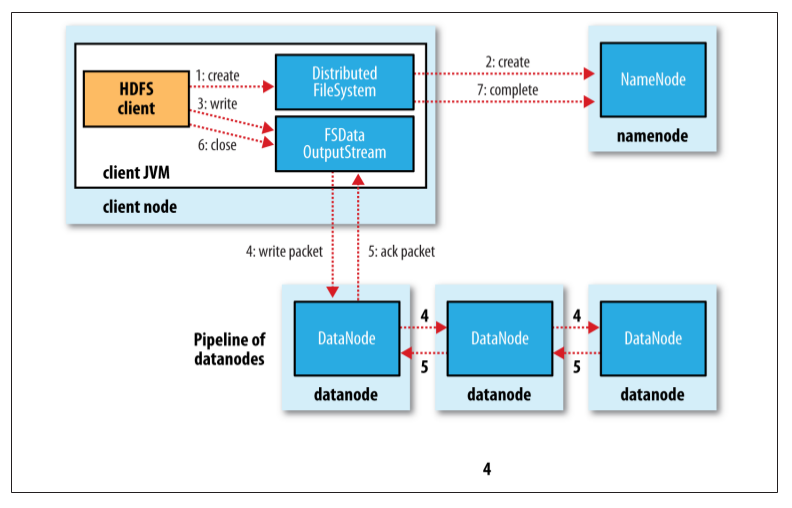
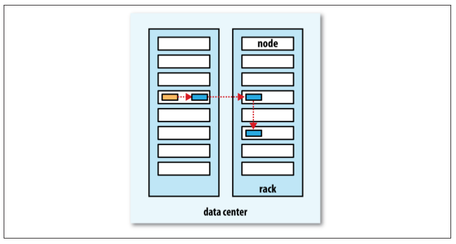

### 1. 写入过程

接下来我们看看文件是如何写入HDFS 的。尽管比较详细，但对于理解数据流还是很有用的，因为它清楚地说明了 HDFS 的一致模型。我们要考虑的情况是如何新建一个文件，把数据写入该文件，最后关闭该文件。参见下图。

客户端通过对 DistributedFileSystem 对象调用 `create()` 函数来新建文件(步骤1)。DistributedFileSystem 对 NameNode 创建一个RPC调用，在文件系统的命名空间中新建一个文件，此时该文件中还没有相应的数据块(步骤2)。NameNode 执行各种不同的检查以确保这个文件不存在以及客户端有新建该文件的权限。如果这些检查均通过，NameNode 就会为创建新文件记录一条记录；否则，文件创建失败并向客户端抛出一个IOException异常。DistributedFileSystem向客户端返回一个FSDataOutputStream对象，由此客户端可以开始写入数据。就像读取事件一样，FSDataOutputStream封装一个DFSoutPutstream对象，该对象负责处理 DataNode 和 NameNode 之间的通信。

在客户端写入数据时(步骤3)，DFSOutputStream将它分成一个个的数据包，并写入内部队列，称为“数据队列”(data queue)。DataStreamer处理数据队列，它的责任是根据 DataNode 列表来要求 NameNode 分配适合的新块来存储数据复本。这一组 DataNode 构成一个管线——我们假设复本数为3，所以管线中有3个节点。DataStreamer将数据包流式传输到管线中第1个 DataNode，该 DataNode 存储数据包并将它发送到管线中的第2个 DataNode。同样，第2个 DataNode 存储该数据包并且发送给管线中的第3个(也是最后一个) DataNode (步骤4)。

DFSOutputStream也维护着一个内部数据包队列来等待 DataNode 的收到确认回执，称为“确认队列”(ack queue)。收到管道中所有 DataNode 确认信息后，该数据包才会从确认队列删除(步骤5)。

如果在数据写入期间 DataNode 发生故障，则执行以下操作(对写入数据的客户端是透明的)。首先关闭管线，确认把队列中的所有数据包都添加回数据队列的最前端，以确保故障节点下游的 DataNode 不会漏掉任何一个数据包。为存储在另一正常 DataNode 的当前数据块指定一个新的标识，并将该标识传送给 NameNode，以便故障 DataNode 在恢复后可以删除存储的部分数据块。从管线中删除故障数据节点并且把余下的数据块写入管线中另外两个正常的的 DataNode。NameNode 注意到块复本量不足时，会在另一个节点上创建一个新的复本。后续的数据块继续正常接受处理。

在一个块被写入期间可能会有多个 DataNode 同时发生故障，但非常少见。只要写入了 `dfs.replication.min` 的复本数(默认为1)，写操作就会成功，并且这个块可以在集群中异步复制，直到达到其目标复本数(`dfs.replication` 的默认值为3)。

客户端完成数据的写入后，对数据流调用close()方法(步骤6)。该操作将剩余的所有数据包写入 DataNode 管线，并在联系到 NameNode 且发送文件写入完成信号之前，等待确认(步骤7)。NameNode 已经知道文件由哪些块组成(通过Datastreamer请求分配数据块)，所以它在返回成功前只需要等待数据块进行最小量的复制。

### 2. 复本怎么放

NameNode 如何选择在哪个 DataNode 存储复本(replica)？这里需要对可靠性、写入带宽和读取带宽进行权衡。例如，把所有复本都存储在一个节点损失的写入带宽最小，因为复制管线都是在同一节点上运行，但这并不提供真实的冗余(如果节点发生故障，那么该块中的数据会丢失)。同时，同一机架上服务器间的读取带宽是很高的。另一个极端，把复本放在不同的数据中心可以最大限度地提高冗余，但带宽的损耗非常大。即使在同一数据中心(到目前为止，所有Hadoop 集群均运行在同一数据中心内)，也有许多不同的数据布局策略。其实，在发布的Hadoop 0.17.0版中改变了数据布局策略来辅助保持数据块在集群内分布相对均匀(第350页的“均衡器”详细说明了如何保持集群的均衡)。在1.x之后的发行版本，可即时选择数据块的布局策略。

Hadoop 的默认布局策略是在运行客户端的节点上放第1个复本 (如果客户端运行在集群之外，就随机选择一个节点，不过系统会避免挑选那些存储太满或太忙的节点)。第2个复本放在与第一个不同且随机另外选择的机架中节点上(离架)。第3个复本与第2个复本放在同一个机架上，且随机选择另一个节点。其他复本放在集群中随机选择的节点上，不过系统会尽量避免在同一个的机架上放太多复本。

一旦选定复本的放置位置，就根据网络拓扑创建一个管线。如果复本数为3，则有下图所示的管线。

总的来说，这一方法不仅提供很好的稳定性(数据块存储在两个机架中)并实现很好的负载均衡，包括写入带宽(写入操作只需要遍历一个交换机)、读取性能(可以从两个机架中选择读取)和集群中块的均匀分布(客户端只在本地机架上写入一个块)。

来源：Hadoop权威指南
