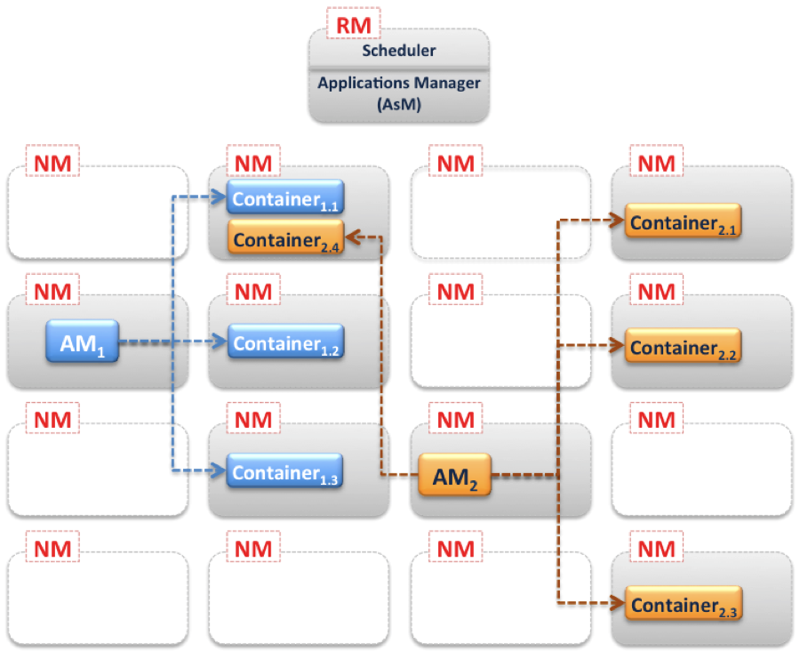
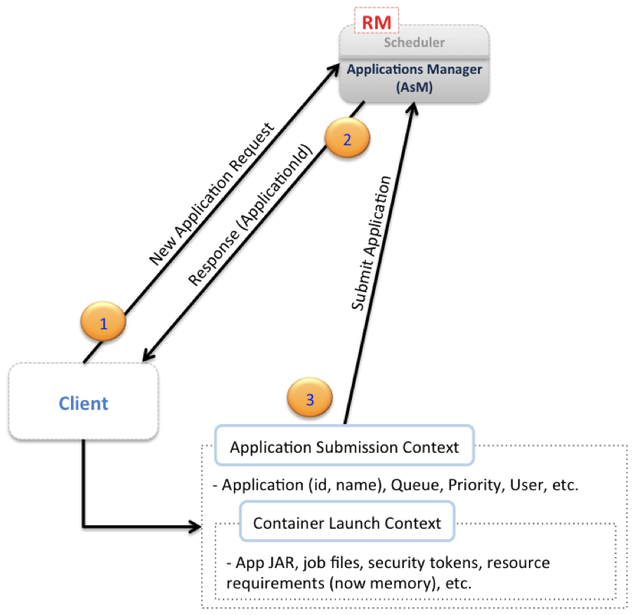
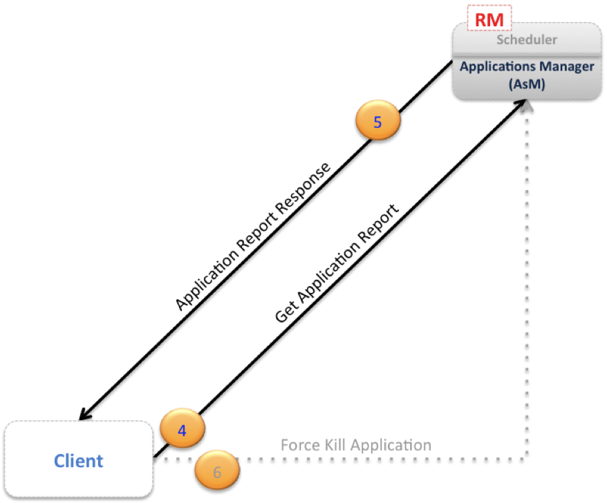
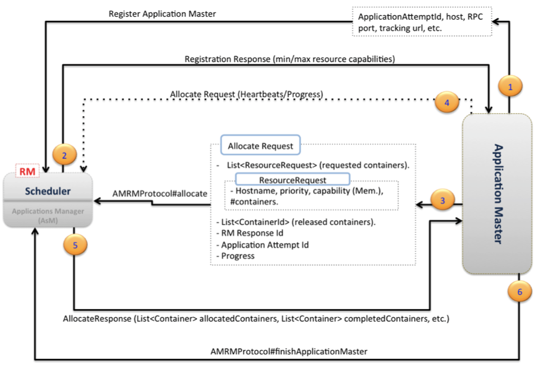
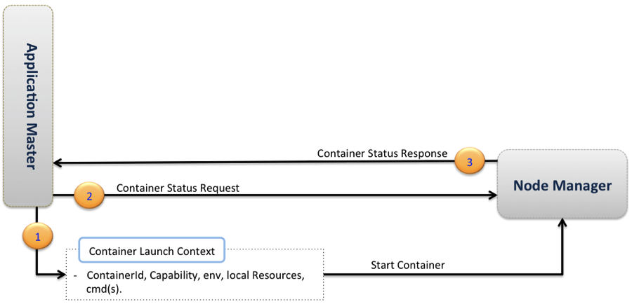

### 1. MapReduce 2.0 概述

`Apache Hadoop 0.23` 比以前的版本有了很大的改进。以下是 `MapReduce` 的一些亮点；请注意，`HDFS`也有一些主要的改进，这些不在本文的讨论范围之内。`MapReduce 2.0`(又名`MRv2`或`YARN`)。新的架构将 `JobTracker` 的两个主要功能 - 资源管理和作业生命周期管理 - 分解成单独的组件：
- 管理计算资源到应用程序的全局分配的 `ResourceManager`(`RM`)。
- 每个应用程序的 `ApplicationMaster`(`AM`)，用于管理应用程序的生命周期。

每个节点上还有一个`NodeManager`(`NM`)，用于管理该节点上的用户进程。`RM`和`NM`构成集群的计算框架。该设计还允许在`NM`中运行长时间的辅助服务；这些都是特定于应用程序的服务，作为配置的一部分进行指定，并在启动期间由`NM`加载。对于`YARN`上的`MapReduce`应用，`shuffle`是由`NM`加载的典型的辅助服务。请注意，在`Hadoop 0.23`版本之前，`shuffle`是`TaskTracker`的一部分。

每个应用程序的`ApplicationMaster`是一个特定框架库，负责与`ResourceManager`协商资源，并与`NodeManager`一起来执行和监视这些任务。在`YARN`设计中，`MapReduce`只是一个应用程序框架，该设计也可以允许使用其他框架来构建和部署分布式应用程序。例如，`Hadoop 0.23`附带了一个分布式`Shell`应用程序，允许在`YARN`集群上的多个节点上运行一个`shell`脚本。

### 2. MapReduce 2.0 设计

下图显示了一个`YARN`集群。只有一个资源管理器，它有两个主要服务：
- 可插拔的调度器，用于管理和实施集群中的资源调度策略。请注意，在编写本博文时，`Hadoop 0.23`中支持两个调度器，默认的`FIFO`调度器和`Capacity`调度器; `Fair`调度器尚未支持(译者注:博文2012编写，现在已经支持)。
- `Applications Manager`(`AsM`)，负责管理集群中运行的`Application Masters`，例如，负责启动`Application Masters`，以及在发生故障时在不同节点上监视和重新启动`Application Masters`。

上图还显示了在集群上的每个节点上都运行一个`NM`服务。该图还显示了有两个`AM`(`AM1`和`AM2`)。对于给定的任意`YARN`集群中，有多少个应用程序(作业)，就运行多少个`Application Masters`。每个`AM`管理应用程序的各个任务(启动，监视，以及在发生故障时重新启动任务)。该图还显示了`AM1`管理三个任务(容器1.1,1.2和1.3)，`AM2`管理四个任务(容器2.1,2.2,2.3和2.4)。每个任务运行在每个节点的`Container`中。在`AM`联系对应的`NM`来启动应用程序的各个任务之前，从`RM`的调度器中获取这些容器。这些容器可以大致与以前的`Hadoop`版本中的`Map`/`Reduce`插槽进行比较。然而，从集群利用角度来看，`Hadoop-0.23`中的资源分配模型更加优化。

### 3. MapReduce 2.0 资源分配模型

在较早的`Hadoop`版本中，集群中的每个节点都静态分配运行预定义数量的`Map`插槽和预定义数量的`Reduce`插槽的资源容量。插槽无法在`Map`和`Reduce`之间共享。这种静态分配槽的方式并不是最佳选择，因为在`MR`作业生命周期中槽的需求是不同的(典型地，当作业开始时对`Map`槽有需求，相反，对`Reduce`槽的需求是在最后)。实际上，在一个真正的集群中，作业是随机提交的，每个集群都有自己的`Map`/`Reduce`槽需求，对集群充分利用不是不可能，是非常难。

`Hadoop 0.23`中的资源分配模型通过提供更灵活的资源建模来解决此类缺陷。以容器的形式请求资源，其中每个容器具有许多非静态属性。在写本博客时(2012年)，唯一支持的属性是内存(`RAM`)。然而，该模型是通用的，并且有意在将来的版本中添加更多的属性(例如CPU和网络带宽)。在这个新的资源管理模型中，每个属性只定义了最小值和最大值，并且`AM`可以请求具有这些最小值的倍数的属性值的容器。

### 4. MapReduce 2.0 主要组件

我们将详细介绍 MapReduce 架构的主要组件，以了解这些组件的功能以及它们如何交互的。

#### 2.1 Client – Resource Manager

下展示了在`YARN`集群上运行应用程序的初始步骤。通常，客户端与`RM`(特别是与`RM`的`Applications Manager`组件)通信来开启此步骤。图中标记为(1)的第一步是让客户端告诉`Applications Manager`我们提交应用程序的意愿，这是通过创建应用程序请求(`New Application Request`)完成的。标记为(2)的`RM`响应通常包含一个新生成的唯一应用程序ID，以及有关客户端在请求资源以运行应用程序`AM`时所需要的集群资源容量的信息。

使用从`RM`接收到的响应信息，客户端可以构建并提交标记为(3)的应用程序提交上下文(`Application Submission Context`)，除了`RM`所需要来启动`AM`的信息之外，通常还包含诸如调度器队列，优先级和用户信息之类的信息。这些信息包含在容器启动上下文(`Container Launch Context`)中，还包含应用程序的`jar`，作业文件，安全令牌和任何需要的资源等。

在提交申请之后，客户端可以向`RM`查询应用程序报告，并接收返回的报告，并且如果需要，客户端也可以要求`RM`终止该应用程序。这三个步骤在下图中展示:

#### 2.2 Resource Manager – Application Master

当`RM`从客户端接收到应用程序提交上下文时，会找到一个满足运行`AM`资源需求的可用容器，并与该容器的`NM`联系，以便在该节点上启动`AM`进程。下图描述了`AM`和`RM`(特别是与`RM`的调度器)之间的通信步骤。图中标记为(1)的第一步是`AM`将自己注册到`RM`中。这一步由一个握手过程组成，同时还传递了`AM`将要监听的`RPC`端口，监视应用程序状态和进度的跟踪URL等信息。

标记为(2)的`RM`注册响应为`AM`传递一些基本信息，比如集群的最小和最大资源容量。`AM`将使用这些信息为各个任务的任何资源请求来计算和请求资源。标记为(3)的从`AM`到`RM`的资源分配请求主要包含所请求的容器列表，并且还可能包含该`AM`所释放的容器列表。心跳和进度信息也可以通过资源分配请求进行传达，如箭头(4)所示。

当`RM`的调度器接收到资源分配请求时，它基于调度策略计算满足该请求的容器列表，并且返回分配响应，标记为(5)，其中包含分配的资源列表。使用资源列表，`AM`开始联系相关联的`NM`(很快就会看到)，最后，如箭头(6)所示，当作业完成时，`AM`向`RM`发送应用完成的消息并退出。

#### 2.3 Application Master – Container Manager

下图描述了`AM`和`Node Manager`之间的通信。`AM`为每个容器请求`NM`来启动它，如图中箭头(1)所示。在容器运行时，`AM`可以分别请求并接收容器状态报告，如步骤(2)和(3)所示。

基于以上讨论，编写`YARN`应用程序的开发人员应主要关注以下接口：
- `ClientRMProtocol`：`Client` `RM`(图3)。这是客户端与`RM`进行通信以启动新的应用程序(即AM)，检查应用程序状态或终止应用程序的协议。
- `AMRMProtocol`：`AM` `RM`(图4)。这是`AM`用来向`RM`注册或取消注册，以及从`RM`调度器请求资源来运行任务的协议。
- `ContainerManager`：`AM` `NM`(图5)。这是`AM`用来与`NM`进行通信以启动或停止容器以及获取容器状态更新的协议。

原文:http://blog.cloudera.com/blog/2012/02/mapreduce-2-0-in-hadoop-0-23/
