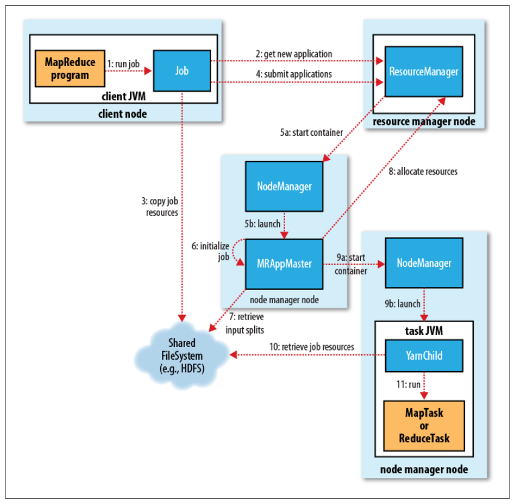

### 1. 概述

对于节点数超出 4000 的大型集群，MapReduce 1 的系统开始面领着扩展性的瓶颈。在 2010 年雅虎的一个团队开始设计下一代 MapReduce。由此，YARN(Yet Another Resource Negotiator)应运而生。

YARN 将 Jobtracker 的职能划分为多个独立的实体，从而改善了经典的 MapReduce 面临的扩展瓶颈问题。Jobtracker 负责作业调度和任务进度监视、追踪任务、重启失败或过慢的任务和进行任务登记，例如维护计数器总数。

YARN 将这两种角色划分为两个独立的守护进程：管理集群上资源使用的资源管理器 ResourceManager 和管理集群上运行任务生命周期的应用管理器 ApplicationMaster。基本思路是：应用服务器与资源管理器协商集群的计算资源：容器(每个容器都有特定的内存上限)，在这些容器上运行特定应用程序的进程。容器由集群节点上运行的节点管理器(NodeManager)监视，以确保应用程序使用的资源不会超过分配给它的资源。

与 Jobtracker 不同，应用的每个实例（这里指一个 MapReduce 作业）有一个专用的 ApplicationMaster，它运行在应用的运行期间。这种方式实际上和最初的 Google 的 MapReduce 论文里介绍的方法很相似，该论文描述了 master 进程如何协调在一组 worker 上运行的 map 任务和 reduce 任务。

如前所述，YARN 比 MapReduce 更具一般性，实际上 MapReduce 只是 YARN 应用的一种形式。有很多其他的 YARN 应用(例如能够在集群中的一组节点上运行脚本的分布式shell)以及其他正在开发的程序。YARN 设计的精妙之处在于不同的 YARN 应用可以在同一个集群上共存。例如，一个 MapReduce 应用可以同时作为 MPI 应用运行，这大大提高了可管理性和集群的利用率。

此外，用户甚至有可能在同一个 YARN 集群上运行多个不同版本的 MapReduce，这使得 MapReduce 升级过程更容易管理。注意，MapReduce 的某些部分(比如作业历史服务器和 shuffle 处理器)以及 YARN 本身仍然需要在整个集群上升级。

YARN 上的 MapReduce 比经典的 MapReduce 包括更多的实体：
- 提交 MapReduce 作业的客户端
- YARN 资源管理器 ResourceManager，负责协调集群上计算资源的分配
- YARN 节点管理器 NodeManager，负责启动和监视集群中机器上的计算容器 container
- MapReduce 应用程序 master(ApplicationMaster)，负责协调运行 MapReduce 作业的任务。它和 MapReduce 任务在容器中运行，这些容器由资源管理器分配并由节点管理器进行管理
- 分布式文件系统（一般为HDFS），用来与其他实体见共享作业文件

作业运行过程如下图所示:

### 2. 作业提交

Job 的 submit() 方法创建一个内部的 JobSunmmiter 实例，并且调用其 submitJobInternal() 方法。提交作业后，waitForCompletion() 每秒轮询作业的进度，如果发现自上次报告后有改变，便把进度报告到控制台。作业完成后，如果成功，就显示作业计数器。如果失败，导致作业失败的错误被记录到控制台。

JobSunmmiter 所实现的作业提交过程与 MapReduce 1.0 类似，如下所示：
- 向资源管理器 ResourceManager（不再是 JobTracker）请求一个新应用ID。参见上图步骤2。
- 检查作业的输出。例如，如果没有指定输出目录或者输出目录已经存在，作业就不提交，错误抛回给 MapReduce 程序。
- 计算作业的输入分片。如果分片无法计算，比如因为输入路径不存在，作业不会提交，错误返回给 MapReduce 程序。
- 将运行作业所需要的资源(包括作业 JAR 文件、配置文件和计算所得的输入分片）复制到一个以作业 ID 命名的目录下的文件系统中。参见上图步骤3.
- 通过调用资源管理器 ResourceManager 的 submitApplication() 方法提交作业。参见上图步骤4。

### 3. 作业初始化

资源管理器 ResourceManager 收到调用它的 submitApplication() 消息后，便将请求传递给调度器 Scheduler。调度器为其分配一个容器 Container，然后资源管理器 ResourceManager 在节点管理器 NodeManager 的管理下，在容器 Container 中启动应用程序的 master 进程，即 ApplicationMaster。参见上图步骤 5a 和 5b。

MapReduce 作业的 ApplicationMaster 是一个 Java 应用程序，它的主类是 MRAppMaster。它对作业进行初始化：通过创建多个簿记对象以保持对作业进度的跟踪，因为它将接受来自任务的进度和完成报告(参见上图步骤6)。接下来，它接收来自共享文件系统在客户端计算的输入分片 InputSplit(参见上图步骤7)。对每一个分片创建一个 Map 任务对象以及根据 mapreduce.job.reduces 属性创建多个 Reduce 任务对象。

接下来，ApplicationMaster 决定如何运行构成 MapReduce 作业的各个任务。如果作业很小，就选择在与它同一个 JVM 上运行任务。如果判断在新的容器 Container 中分配和运行任务的开销大于并行运行它们的开销时，就会在一个节点上顺序运行它们。这不同于 MapReduce 1.0，MapReduce 1.0 从不在单个 Tasktracker 上运行小作业。这样的作业称为 uberized，或者作为 uber 任务运行。

哪些任务是小任务呢？默认情况下，小任务就是小于 10 个 mapper 且只有 1 个 reducer 且输入大小小于一个 HDFS 块的任务(通过设置 mapreduce.job.ubertask.maxmaps、mapreduce.job.ubertask.maxreduces 以及 mapreduce.job.ubertask.maxbytes 可以改变一个作业的上述值)。将 mapreduce.job.ubertask.enable 设置为 false 也可以完全使 uber 任务不可用。

### 4. 任务分配

如果作业不适合作为 uber 任务运行，那么 ApplicationMaster 就会为该作业中的所有 Map 任务和 Reduce 任务向资源管理器 ResourceManager 请求容器 Container(参见上图步骤8)。附着心跳信息的请求包括每个 Map 任务的数据本地化信息，特别是输入分片所在的主机和相应机架信息。调度器使用这些信息来做调度策略。理想情况下，它将任务分配到数据本地化的节点，但如果不可能实现，调度器就会相对于非本地化的分配有限使用机架本地化的分配。

请求也为任务指定了内存需求。在默认情况下，Map 任务和 Reduce 任务都会分配到 1024 MB的内存，但这可以通过 mapreduce.map.memory.mb和 mapreduce.reduce.memory.mb 参数来设置。内存的分配方式不同于 MapReduce 1.0，后者中 Tasktrackers 有在集群配置时设置的固定数量的槽，每个任务在一个槽上运行。槽有最大内存分配限制，这对集群是固定的，导致当任务使用较少内存时无法充分利用内存(因为其他等待的任务不能使用这些未使用的内存)以及由于任务不能获取足够内存而导致作业失败。

在 YARN 中，资源划分粒度更细，所以可以避免上述问题。具体而言，应用程序可以请求最小到最大限制范围内的任意最小值倍数的内存容量。默认的内存分配容量是调度器特定的，对于容量调度器，它的默认值最小值是 1024 MB(由 yarn.sheduler.capacity.minimum-allocation-mb 设置)，默认的最大值是 10240 MB(由 yarn.sheduler.capacity.maximum-allocation-mb 设置)。因此，任务可以通过适当设置 mapreduce.map.memory.mb 和 mapreduce.reduce.memory.mb 来请求 1GB 到 10GB 间的任意 1GB 倍数的内存容量(调度器在需要的时候使用最接近的倍数)。

### 5. 任务执行

一旦资源管理器 ResourceManager 的调度器为任务分配了容器 Container，ApplicationMaster 就通过与节点管理器 NodeManager 通信来启动容器 Container(参见上图步骤9a和9b)。该任务由主类 YarnChild 的 Java 应用程序执行，在它运行任务之前，首先将任务需要的资源本地化，包括作业的配置、JAR文件和所有来自分布式缓存的文件(参见上图步骤10)。最后，运行 Map 任务或 Reduce 任务(参见上图步骤11)。

YarnChild 在指定的 JVM 中运行，因此用户定义的 Map 和 Reduce 函数中的任何 bug 都不会影响到节点管理器 NodeManager。

### 6. 进度和状态更新

在 YARN 下运行时，任务每三秒钟通过 umbilical 接口向 ApplicationMaster 汇报进度和状态(包含计数器)，作为作业的汇聚视图(aggregate view)。相比之下，MapReduce 1.0 通过 Tasktracker 到 Jobtracker 来实现进度更新。

客户端每秒钟(通过 mapreduce.client.progressmonitor.pollinterval 设置)查询一次 ApplicationMaster 以接收进度更新，通常都会向用户显示。

### 7. 作业完成

除了向 ApplicationMaster 查询进度外，客户端每5秒钟通过调用 Job 的 waitForCompletion() 来检查作业是否完成。查询的间隔可以通过 mapreduce.client.completion.pollinterval 属性进行设置。

作业完成后，ApplicationMaster 和任务容器清理其工作状态，OutputCommitter 的作业清理方法会被调用。作业历史服务器保存作业的信息供用户需要时查询。

来源于: Hadoop 权威指南
