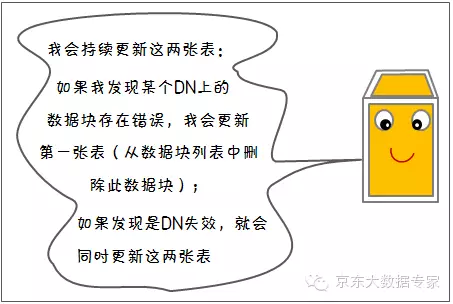

结合 Maneesh Varshney 的漫画改编，为大家分析 HDFS 存储机制与运行原理。

### 1. HDFS 角色

如下图所示，`HDFS`存储相关角色与功能如下：
- `Client`：客户端，系统使用者，调用`HDFS API`操作文件；与`NameNode`交互获取文件元数据；与`DataNode`交互进行数据读写。
- `Namenode`：元数据节点，是系统唯一的管理者。负责元数据的管理；与`client`交互进行提供元数据查询；分配数据存储节点等。
- `Datanode`：数据存储节点，负责数据块的存储与冗余备份；执行数据块的读写操作等。

### 2. HDFS写文件

#### 2.1 发送写数据请求

`HDFS`中的存储单元是`block`。文件通常被分成64或128M一块的数据块进行存储。与普通文件系统不同的是，在`HDFS`中，如果一个文件大小小于一个数据块的大小，它是不需要占用整个数据块的存储空间的。

#### 2.2 文件切分

#### 2.3 DataNode分配

#### 2.4 数据写入

#### 2.5 完成写入

#### 2.6 角色定位

#### 2.7 写操作分析

通过写过程，我们可以了解到：
- `HDFS`属于`Maste`r与`Slave`结构。一个集群中只有一个`NameNode`，可以有多个`DataNode`；
- `HDFS`存储机制保存了多个副本，当写入1T文件时，我们需要3T的存储，3T的网络流量带宽；系统提供容错机制，副本丢失或宕机可自动恢复，保证系统高可用性。
- `HDFS`默认会将文件分割成`block`。然后将`block`按键值对存储在`HDFS`上，并将键值对的映射存到内存中。如果小文件太多，会导致内存的负担很重。

### 3. HDFS读文件

#### 3.1 用户需求

`HDFS`采用的是`一次写入多次读取`的文件访问模型。一个文件经过创建、写入和关闭之后就不需要改变。这一假设简化了数据一致性问题，并且使高吞吐量的数据访问成为可能。

#### 3.2 联系元数据节点

#### 3.3 下载数据

前文提到在写数据过程中，数据存储已经按照客户端与`DataNode`节点之间的距离进行了排序，距客户端越近的`DataNode`节点被放在最前面，客户端会优先从本地读取该数据块。

#### 3.4 思考

### 4. HDFS容错机制一

#### 4.1 三类故障

##### 4.1.1 节点失败

##### 4.1.2 网络故障

##### 4.1.3 数据损坏(脏数据)

#### 4.2 故障监测机制

##### 4.2.1 节点失败监测机制

##### 4.2.2 通信故障监测机制

##### 4.2.3 数据错误监测机制

#### 4.3 心跳信息与数据块报告

`HDFS`存储理念是以最少的钱买最烂的机器并实现最安全、难度高的分布式文件系统（高容错性低成本），从上可以看出，`HDFS`认为机器故障是种常态，所以在设计时充分考虑到单个机器故障，单个磁盘故障，单个文件丢失等情况。

### 5. HDFS容错机制二

#### 5.1 写容错

#### 5.2 读容错

### 6. HDFS容错机制三

#### 6.1 数据节点(DN)失效

### 7. 备份规则

#### 7.1 机架与数据节点

#### 7.2 副本放置策略

数据块的第一个副本优先放在写入数据块的客户端所在的节点上，但是如果这个客户端上的数据节点空间不足或者是当前负载过重，则应该从该数据节点所在的机架中选择一个合适的数据节点作为本地节点。

如果客户端上没有一个数据节点的话，则从整个集群中随机选择一个合适的数据节点作为此时这个数据块的本地节点。

`HDFS`的存放策略是将一个副本存放在本地机架节点上，另外两个副本放在不同机架的不同节点上。

这样集群可在完全失去某一机架的情况下还能存活。同时，这种策略减少了机架间的数据传输，提高了写操作的效率，因为数据块只存放在两个不同的机架上，减少了读取数据时需要的网络传输总带宽。这样在一定程度上兼顾了数据安全和网络传输的开销。

来源于: 京东大数据专家公众号
