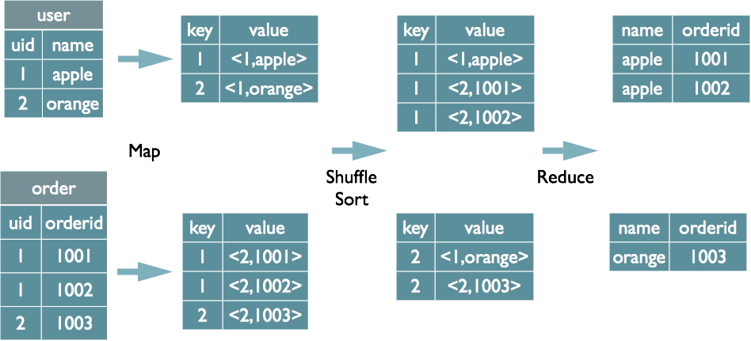
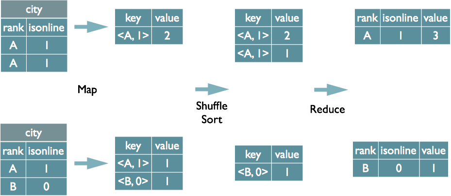
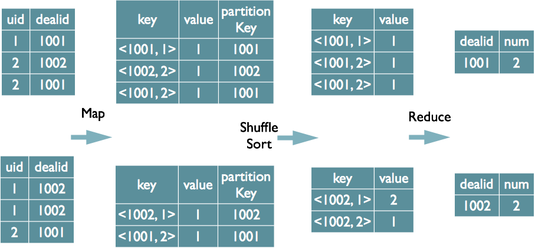
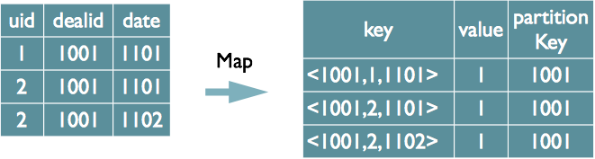

Hive 是基于 Hadoop 的一个数据仓库系统，在各大公司都有广泛的应用。美团数据仓库也是基于 Hive 搭建，每天执行近万次的 Hive ETL 计算流程，负责每天数百GB的数据存储和分析。Hive 的稳定性和性能对我们的数据分析非常关键。

在几次升级 Hive 的过程中，我们遇到了一些大大小小的问题。通过向社区的咨询和自己的努力，在解决这些问题的同时我们对 Hive 将 SQL 编译为 MapReduce 的过程有了比较深入的理解。对这一过程的理解不仅帮助我们解决了一些 Hive 的 bug，也有利于我们优化 Hive SQL，提升我们对 Hive 的掌控力，同时有能力去定制一些需要的功能。

## 1. MapReduce 实现基本 SQL 操作的原理

详细讲解 SQL 编译为 MapReduce 之前，我们先来看看 MapReduce 框架实现 SQL 基本操作的原理

### 1.1 Join 的实现原理

```sql
SELECT u.name, o.orderid
FROM order o
JOIN user u
ON o.uid = u.uid;
```
在 map 的输出 value 中为不同表的数据打上 tag 标记，在 reduce 阶段根据 tag 判断数据来源。MapReduce 的过程如下（这里只是说明最基本的 Join 的实现，还有其他的实现方式）



> MapReduce CommonJoin的实现

### 1.2 Group By 的实现原理

```sql
SELECT rank, isonline, count(*)
FROM city
GROUP BY rank, isonline;
```
将 GroupBy 的字段组合为 map 的输出 key 值，利用 MapReduce 的排序，在 reduce 阶段保存 LastKey 区分不同的 key。MapReduce 的过程如下（当然这里只是说明 Reduce 端的非 Hash 聚合过程）



> MapReduce Group By的实现

### 1.3 Distinct 的实现原理

```sql
SELECT dealid, count(distinct uid) num
FROM order
GROUP BY dealid;
```
当只有一个 distinct 字段时，如果不考虑 Map 阶段的 Hash GroupBy，只需要将 GroupBy 字段和 Distinct 字段组合为 map 输出 key，利用 mapreduce 的排序，同时将 GroupBy 字段作为 reduce 的 key，在 reduce 阶段保存 LastKey 即可完成去重



> MapReduce Distinct的实现

如果有多个distinct字段呢，如下面的 SQL：
```sql
SELECT dealid, count(distinct uid), count(distinct date)
FROM order
GROUP BY dealid;
```
实现方式有两种：
- 如果仍然按照上面一个distinct字段的方法，即下图这种实现方式，无法跟据uid和date分别排序，也就无法通过LastKey去重，仍然需要在reduce阶段在内存中通过Hash去重



> MapReduce Multi Distinct的实现

- 第二种实现方式，可以对所有的 distinct 字段编号，每行数据生成n行数据，那么相同字段就会分别排序，这时只需要在 reduce 阶段记录 LastKey 即可去重。这种实现方式很好的利用了 MapReduce 的排序，节省了 reduce 阶段去重的内存消耗，但是缺点是增加了 shuffle 的数据量。

> 需要注意的是，在生成reduce value时，除第一个distinct字段所在行需要保留value值，其余distinct数据行value字段均可为空。


> MapReduce Multi Distinct的实现

## 2. SQL 转化为 MapReduce 的过程

了解了 MapReduce 实现 SQL 基本操作之后，我们来看看 Hive 是如何将 SQL 转化为 MapReduce 任务的，整个编译过程分为六个阶段：
- Antlr定义SQL的语法规则，完成 SQL 词法，语法解析，将 SQ L转化为抽象语法树 AST Tree
- 遍历 AST Tree，抽象出查询的基本组成单元 QueryBlock
- 遍历 QueryBlock，翻译为执行操作树 OperatorTree
- 逻辑层优化器进行 OperatorTree 变换，合并不必要的 ReduceSinkOperator，减少 shuffle 数据量
- 遍历 OperatorTree，翻译为 MapReduce 任务
- 物理层优化器进行 MapReduce 任务的变换，生成最终的执行计划

下面分别对这六个阶段进行介绍。

### 2.1 Phase1 SQL 词法，语法解析

#### 2.1.1 Antlr

Hive 使用 Antlr 实现 SQL 的词法和语法解析。Antlr 是一种语言识别的工具，可以用来构造领域语言。这里不详细介绍 Antlr，只需要了解使用 Antlr 构造特定的语言只需要编写一个语法文件，定义词法和语法替换规则即可，Antlr 完成了词法分析、语法分析、语义分析、中间代码生成的过程。

Hive 中语法规则的定义文件在 0.10 版本以前是 `Hive.g` 一个文件，随着语法规则越来越复杂，由语法规则生成的 Java 解析类可能超过 Java 类文件的最大上限，0.11 版本将 `Hive.g` 拆成了5个文件，词法规则 `HiveLexer.g` 和语法规则的 4 个文件 `SelectClauseParser.g`，`FromClauseParser.g`，`IdentifiersParser.g`，`HiveParser.g`。

#### 2.1.2 抽象语法树 AST Tree

经过词法和语法解析后，如果需要对表达式做进一步的处理，使用 Antlr 的抽象语法树语法 Abstract Syntax Tree，在语法分析的同时将输入语句转换成抽象语法树，后续在遍历语法树时完成进一步的处理。

下面的一段语法是 Hive SQL 中 SelectStatement 的语法规则，从中可以看出，SelectStatement 包含 select, from, where, groupby, having, orderby 等子句。 （在下面的语法规则中，箭头表示对于原语句的改写，改写后会加入一些特殊词标示特定语法，比如 TOK_QUERY 标示一个查询块）
```
selectStatement
   :
   selectClause
   fromClause
   whereClause?
   groupByClause?
   havingClause?
   orderByClause?
   clusterByClause?
   distributeByClause?
   sortByClause?
   limitClause? -> ^(TOK_QUERY fromClause ^(TOK_INSERT ^(TOK_DESTINATION ^(TOK_DIR TOK_TMP_FILE))
                     selectClause whereClause? groupByClause? havingClause? orderByClause? clusterByClause?
                     distributeByClause? sortByClause? limitClause?))
   ;
```
样例SQL
为了详细说明SQL翻译为MapReduce的过程，这里以一条简单的SQL为例，SQL中包含一个子查询，最终将数据写入到一张表中

FROM
(
  SELECT
    p.datekey datekey,
    p.userid userid,
    c.clienttype
  FROM
    detail.usersequence_client c
    JOIN fact.orderpayment p ON p.orderid = c.orderid
    JOIN default.user du ON du.userid = p.userid
  WHERE p.datekey = 20131118
) base
INSERT OVERWRITE TABLE `test`.`customer_kpi`
SELECT
  base.datekey,
  base.clienttype,
  count(distinct base.userid) buyer_count
GROUP BY base.datekey, base.clienttype
SQL生成AST Tree
Antlr对Hive SQL解析的代码如下，HiveLexerX，HiveParser分别是Antlr对语法文件Hive.g编译后自动生成的词法解析和语法解析类，在这两个类中进行复杂的解析。

HiveLexerX lexer = new HiveLexerX(new ANTLRNoCaseStringStream(command));    //词法解析，忽略关键词的大小写
TokenRewriteStream tokens = new TokenRewriteStream(lexer);
if (ctx != null) {
  ctx.setTokenRewriteStream(tokens);
}
HiveParser parser = new HiveParser(tokens);                                 //语法解析
parser.setTreeAdaptor(adaptor);
HiveParser.statement_return r = null;
try {
  r = parser.statement();                                                   //转化为AST Tree
} catch (RecognitionException e) {
  e.printStackTrace();
  throw new ParseException(parser.errors);
}
最终生成的AST Tree如下图右侧（使用Antlr Works生成，Antlr Works是Antlr提供的编写语法文件的编辑器），图中只是展开了骨架的几个节点，没有完全展开。 子查询1/2，分别对应右侧第1/2两个部分。

SQL生成AST Tree
SQL生成AST Tree

这里注意一下内层子查询也会生成一个TOK_DESTINATION节点。请看上面SelectStatement的语法规则，这个节点是在语法改写中特意增加了的一个节点。原因是Hive中所有查询的数据均会保存在HDFS临时的文件中，无论是中间的子查询还是查询最终的结果，Insert语句最终会将数据写入表所在的HDFS目录下。

详细来看，将内存子查询的from子句展开后，得到如下AST Tree，每个表生成一个TOK_TABREF节点，Join条件生成一个“=”节点。其他SQL部分类似，不一一详述。

AST Tree
AST Tree

Phase2 SQL基本组成单元QueryBlock
AST Tree仍然非常复杂，不够结构化，不方便直接翻译为MapReduce程序，AST Tree转化为QueryBlock就是将SQL进一部抽象和结构化。

QueryBlock
QueryBlock是一条SQL最基本的组成单元，包括三个部分：输入源，计算过程，输出。简单来讲一个QueryBlock就是一个子查询。

下图为Hive中QueryBlock相关对象的类图，解释图中几个重要的属性

QB#aliasToSubq（表示QB类的aliasToSubq属性）保存子查询的QB对象，aliasToSubq key值是子查询的别名
QB#qbp即QBParseInfo保存一个基本SQL单元中的给个操作部分的AST Tree结构，QBParseInfo#nameToDest这个HashMap保存查询单元的输出，key的形式是inclause-i（由于Hive支持Multi Insert语句，所以可能有多个输出），value是对应的ASTNode节点，即TOK_DESTINATION节点。类QBParseInfo其余HashMap属性分别保存输出和各个操作的ASTNode节点的对应关系。
QBParseInfo#JoinExpr保存TOK_JOIN节点。QB#QBJoinTree是对Join语法树的结构化。
QB#qbm保存每个输入表的元信息，比如表在HDFS上的路径，保存表数据的文件格式等。
QBExpr这个对象是为了表示Union操作。
QueryBlock
QueryBlock

AST Tree生成QueryBlock
AST Tree生成QueryBlock的过程是一个递归的过程，先序遍历AST Tree，遇到不同的Token节点，保存到相应的属性中，主要包含以下几个过程

TOK_QUERY => 创建QB对象，循环递归子节点
TOK_FROM => 将表名语法部分保存到QB对象的aliasToTabs等属性中
TOK_INSERT => 循环递归子节点
TOK_DESTINATION => 将输出目标的语法部分保存在QBParseInfo对象的nameToDest属性中
TOK_SELECT => 分别将查询表达式的语法部分保存在destToSelExpr、destToAggregationExprs、destToDistinctFuncExprs三个属性中
TOK_WHERE => 将Where部分的语法保存在QBParseInfo对象的destToWhereExpr属性中
最终样例SQL生成两个QB对象，QB对象的关系如下，QB1是外层查询，QB2是子查询

QB1

  \

   QB2
Phase3 逻辑操作符Operator
Operator
Hive最终生成的MapReduce任务，Map阶段和Reduce阶段均由OperatorTree组成。逻辑操作符，就是在Map阶段或者Reduce阶段完成单一特定的操作。

基本的操作符包括TableScanOperator，SelectOperator，FilterOperator，JoinOperator，GroupByOperator，ReduceSinkOperator

从名字就能猜出各个操作符完成的功能，TableScanOperator从MapReduce框架的Map接口原始输入表的数据，控制扫描表的数据行数，标记是从原表中取数据。JoinOperator完成Join操作。FilterOperator完成过滤操作

ReduceSinkOperator将Map端的字段组合序列化为Reduce Key/value, Partition Key，只可能出现在Map阶段，同时也标志着Hive生成的MapReduce程序中Map阶段的结束。

Operator在Map Reduce阶段之间的数据传递都是一个流式的过程。每一个Operator对一行数据完成操作后之后将数据传递给childOperator计算。

Operator类的主要属性和方法如下

RowSchema表示Operator的输出字段
InputObjInspector outputObjInspector解析输入和输出字段
processOp接收父Operator传递的数据，forward将处理好的数据传递给子Operator处理
Hive每一行数据经过一个Operator处理之后，会对字段重新编号，colExprMap记录每个表达式经过当前Operator处理前后的名称对应关系，在下一个阶段逻辑优化阶段用来回溯字段名
由于Hive的MapReduce程序是一个动态的程序，即不确定一个MapReduce Job会进行什么运算，可能是Join，也可能是GroupBy，所以Operator将所有运行时需要的参数保存在OperatorDesc中，OperatorDesc在提交任务前序列化到HDFS上，在MapReduce任务执行前从HDFS读取并反序列化。Map阶段OperatorTree在HDFS上的位置在Job.getConf(“hive.exec.plan”) + “/map.xml”
QueryBlock
QueryBlock

QueryBlock生成Operator Tree
QueryBlock生成Operator Tree就是遍历上一个过程中生成的QB和QBParseInfo对象的保存语法的属性，包含如下几个步骤：

QB#aliasToSubq => 有子查询，递归调用
QB#aliasToTabs => TableScanOperator
QBParseInfo#joinExpr => QBJoinTree => ReduceSinkOperator + JoinOperator
QBParseInfo#destToWhereExpr => FilterOperator
QBParseInfo#destToGroupby => ReduceSinkOperator + GroupByOperator
QBParseInfo#destToOrderby => ReduceSinkOperator + ExtractOperator
由于Join/GroupBy/OrderBy均需要在Reduce阶段完成，所以在生成相应操作的Operator之前都会先生成一个ReduceSinkOperator，将字段组合并序列化为Reduce Key/value, Partition Key

接下来详细分析样例SQL生成OperatorTree的过程

先序遍历上一个阶段生成的QB对象

首先根据子QueryBlock QB2#aliasToTabs {du=dim.user, c=detail.usersequence_client, p=fact.orderpayment}生成TableScanOperator

TableScanOperator(“dim.user”) TS[0]
TableScanOperator(“detail.usersequence_client”) TS[1]       TableScanOperator(“fact.orderpayment”) TS[2]
先序遍历QBParseInfo#joinExpr生成QBJoinTree，类QBJoinTree也是一个树状结构，QBJoinTree保存左右表的ASTNode和这个查询的别名，最终生成的查询树如下

   base
   /  \
  p    du
 /      \
c        p
前序遍历QBJoinTree，先生成detail.usersequence_client和fact.orderpayment的Join操作树

Join to Operator
Join to Operator

图中 TS=TableScanOperator RS=ReduceSinkOperator JOIN=JoinOperator

生成中间表与dim.user的Join操作树
Join to Operator
Join to Operator

根据QB2 QBParseInfo#destToWhereExpr 生成FilterOperator。此时QB2遍历完成。
下图中SelectOperator在某些场景下会根据一些条件判断是否需要解析字段。

Where to Operator
Where to Operator

图中 FIL= FilterOperator SEL= SelectOperator

根据QB1的QBParseInfo#destToGroupby生成ReduceSinkOperator + GroupByOperator
GroupBy to Operator
GroupBy to Operator

图中 GBY= GroupByOperator GBY[12]是HASH聚合，即在内存中通过Hash进行聚合运算

最终都解析完后，会生成一个FileSinkOperator，将数据写入HDFS
FileSinkOperator
FileSinkOperator

图中FS=FileSinkOperator

Phase4 逻辑层优化器
大部分逻辑层优化器通过变换OperatorTree，合并操作符，达到减少MapReduce Job，减少shuffle数据量的目的。

名称

作用

② SimpleFetchOptimizer

优化没有GroupBy表达式的聚合查询

② MapJoinProcessor

MapJoin，需要SQL中提供hint，0.11版本已不用

② BucketMapJoinOptimizer

BucketMapJoin

② GroupByOptimizer

Map端聚合

① ReduceSinkDeDuplication

合并线性的OperatorTree中partition/sort key相同的reduce

① PredicatePushDown

谓词前置

① CorrelationOptimizer

利用查询中的相关性，合并有相关性的Job，HIVE-2206

ColumnPruner

字段剪枝

表格中①的优化器均是一个Job干尽可能多的事情/合并。②的都是减少shuffle数据量，甚至不做Reduce。

CorrelationOptimizer优化器非常复杂，都能利用查询中的相关性，合并有相关性的Job，参考 Hive Correlation Optimizer

对于样例SQL，有两个优化器对其进行优化。下面分别介绍这两个优化器的作用，并补充一个优化器ReduceSinkDeDuplication的作用

PredicatePushDown优化器
断言判断提前优化器将OperatorTree中的FilterOperator提前到TableScanOperator之后

PredicatePushDown
PredicatePushDown

NonBlockingOpDeDupProc优化器
NonBlockingOpDeDupProc优化器合并SEL-SEL 或者 FIL-FIL 为一个Operator

NonBlockingOpDeDupProc
NonBlockingOpDeDupProc

ReduceSinkDeDuplication优化器
ReduceSinkDeDuplication可以合并线性相连的两个RS。实际上CorrelationOptimizer是ReduceSinkDeDuplication的超集，能合并线性和非线性的操作RS，但是Hive先实现的ReduceSinkDeDuplication

譬如下面这条SQL语句

from (select key, value from src group by key, value) s select s.key group by s.key;
经过前面几个阶段之后，会生成如下的OperatorTree，两个Tree是相连的，这里没有画到一起

ReduceSinkDeDuplication
ReduceSinkDeDuplication

这时候遍历OperatorTree后能发现前前后两个RS输出的Key值和PartitionKey如下


Key

PartitionKey

childRS

key

key

parentRS

key,value

key,value

ReduceSinkDeDuplication优化器检测到：1. pRS Key完全包含cRS Key，且排序顺序一致；2. pRS PartitionKey完全包含cRS PartitionKey。符合优化条件，会对执行计划进行优化。

ReduceSinkDeDuplication将childRS和parentheRS与childRS之间的Operator删掉，保留的RS的Key为key,value字段，PartitionKey为key字段。合并后的OperatorTree如下：

ReduceSinkDeDuplication
ReduceSinkDeDuplication

Phase5 OperatorTree生成MapReduce Job的过程
OperatorTree转化为MapReduce Job的过程分为下面几个阶段

对输出表生成MoveTask
从OperatorTree的其中一个根节点向下深度优先遍历
ReduceSinkOperator标示Map/Reduce的界限，多个Job间的界限
遍历其他根节点，遇过碰到JoinOperator合并MapReduceTask
生成StatTask更新元数据
剪断Map与Reduce间的Operator的关系
对输出表生成MoveTask
由上一步OperatorTree只生成了一个FileSinkOperator，直接生成一个MoveTask，完成将最终生成的HDFS临时文件移动到目标表目录下

MoveTask[Stage-0]
Move Operator
开始遍历
将OperatorTree中的所有根节点保存在一个toWalk的数组中，循环取出数组中的元素（省略QB1，未画出）

开始遍历
开始遍历

取出最后一个元素TS[p]放入栈 opStack{TS[p]}中

Rule #1 TS% 生成MapReduceTask对象，确定MapWork
发现栈中的元素符合下面规则R1（这里用python代码简单表示）

"".join([t + "%" for t in opStack]) == "TS%"
生成一个MapReduceTask[Stage-1]对象，MapReduceTask[Stage-1]对象的MapWork属性保存Operator根节点的引用。由于OperatorTree之间之间的Parent Child关系，这个时候MapReduceTask[Stage-1]包含了以TS[p]为根的所有Operator

Stage-1 生成Map阶段
Stage-1 生成Map阶段

Rule #2 TS%.*RS% 确定ReduceWork
继续遍历TS[p]的子Operator，将子Operator存入栈opStack中 当第一个RS进栈后，即栈opStack = {TS[p], FIL[18], RS[4]}时，就会满足下面的规则R2

"".join([t + "%" for t in opStack]) == "TS%.*RS%"
这时候在MapReduceTask[Stage-1]对象的ReduceWork属性保存JOIN[5]的引用

Stage-1 生成Reduce阶段
Stage-1 生成Reduce阶段

Rule #3 RS%.*RS% 生成新MapReduceTask对象，切分MapReduceTask
继续遍历JOIN[5]的子Operator，将子Operator存入栈opStack中

当第二个RS放入栈时，即当栈opStack = {TS[p], FIL[18], RS[4], JOIN[5], RS[6]}时，就会满足下面的规则R3

"".join([t + "%" for t in opStack]) == “RS%.*RS%” //循环遍历opStack的每一个后缀数组
这时候创建一个新的MapReduceTask[Stage-2]对象，将OperatorTree从JOIN[5]和RS[6]之间剪开，并为JOIN[5]生成一个子Operator FS[19]，RS[6]生成一个TS[20]，MapReduceTask[Stage-2]对象的MapWork属性保存TS[20]的引用。

新生成的FS[19]将中间数据落地，存储在HDFS临时文件中。

Stage-2
Stage-2

继续遍历RS[6]的子Operator，将子Operator存入栈opStack中

当opStack = {TS[p], FIL[18], RS[4], JOIN[5], RS[6], JOIN[8], SEL[10], GBY[12], RS[13]}时，又会满足R3规则

同理生成MapReduceTask[Stage-3]对象，并切开 Stage-2 和 Stage-3 的OperatorTree

Stage-3
Stage-3

R4 FS% 连接MapReduceTask与MoveTask
最终将所有子Operator存入栈中之后，opStack = {TS[p], FIL[18], RS[4], JOIN[5], RS[6], JOIN[8], SEL[10], GBY[12], RS[13], GBY[14], SEL[15], FS[17]} 满足规则R4

"".join([t + "%" for t in opStack]) == “FS%”
这时候将MoveTask与MapReduceTask[Stage-3]连接起来，并生成一个StatsTask，修改表的元信息

MoveTask
MoveTask

合并Stage
此时并没有结束，还有两个根节点没有遍历。

将opStack栈清空，将toWalk的第二个元素加入栈。会发现opStack = {TS[du]}继续满足R1 TS%，生成MapReduceTask[Stage-5]

Stage-5
Stage-5

继续从TS[du]向下遍历，当opStack={TS[du], RS[7]}时，满足规则R2 TS%.*RS%

此时将JOIN[8]保存为MapReduceTask[Stage-5]的ReduceWork时，发现在一个Map对象保存的Operator与MapReduceWork对象关系的Map<Operator, MapReduceWork>对象中发现，JOIN[8]已经存在。此时将MapReduceTask[Stage-2]和MapReduceTask[Stage-5]合并为一个MapReduceTask

合并 Stage-2 和 Stage-5
合并 Stage-2 和 Stage-5

同理从最后一个根节点TS[c]开始遍历，也会对MapReduceTask进行合并

合并 Stage-1 和 Stage-6
合并 Stage-1 和 Stage-6

切分Map Reduce阶段
最后一个阶段，将MapWork和ReduceWork中的OperatorTree以RS为界限剪开

切分Map Reduce阶段
切分Map Reduce阶段

OperatorTree生成MapReduceTask全貌
最终共生成3个MapReduceTask，如下图

OperatorTree生成MapReduceTask全貌
OperatorTree生成MapReduceTask全貌

Phase6 物理层优化器
这里不详细介绍每个优化器的原理，单独介绍一下MapJoin的优化器

名称

作用

Vectorizer

HIVE-4160，将在0.13中发布

SortMergeJoinResolver

与bucket配合，类似于归并排序

SamplingOptimizer

并行order by优化器，在0.12中发布

CommonJoinResolver + MapJoinResolver

MapJoin优化器

MapJoin原理
mapjoin原理
mapjoin原理

MapJoin简单说就是在Map阶段将小表读入内存，顺序扫描大表完成Join。

上图是Hive MapJoin的原理图，出自Facebook工程师Liyin Tang的一篇介绍Join优化的slice，从图中可以看出MapJoin分为两个阶段：

通过MapReduce Local Task，将小表读入内存，生成HashTableFiles上传至Distributed Cache中，这里会对HashTableFiles进行压缩。

MapReduce Job在Map阶段，每个Mapper从Distributed Cache读取HashTableFiles到内存中，顺序扫描大表，在Map阶段直接进行Join，将数据传递给下一个MapReduce任务。

conditionaltask
conditionaltask

如果Join的两张表一张表是临时表，就会生成一个ConditionalTask，在运行期间判断是否使用MapJoin

CommonJoinResolver优化器
CommonJoinResolver优化器就是将CommonJoin转化为MapJoin，转化过程如下

深度优先遍历Task Tree
找到JoinOperator，判断左右表数据量大小
对与小表 + 大表 => MapJoinTask，对于小/大表 + 中间表 => ConditionalTask
遍历上一个阶段生成的MapReduce任务，发现MapReduceTask[Stage-2] JOIN[8]中有一张表为临时表，先对Stage-2进行深度拷贝（由于需要保留原始执行计划为Backup Plan，所以这里将执行计划拷贝了一份），生成一个MapJoinOperator替代JoinOperator，然后生成一个MapReduceLocalWork读取小表生成HashTableFiles上传至DistributedCache中。

mapjoin变换
mapjoin变换

MapReduceTask经过变换后的执行计划如下图所示

mapjoin变换
mapjoin变换

MapJoinResolver优化器
MapJoinResolver优化器遍历Task Tree，将所有有local work的MapReduceTask拆成两个Task

MapJoinResolver
MapJoinResolver

最终MapJoinResolver处理完之后，执行计划如下图所示

MapJoinResolver
MapJoinResolver

Hive SQL编译过程的设计
从上述整个SQL编译的过程，可以看出编译过程的设计有几个优点值得学习和借鉴

使用Antlr开源软件定义语法规则，大大简化了词法和语法的编译解析过程，仅仅需要维护一份语法文件即可。
整体思路很清晰，分阶段的设计使整个编译过程代码容易维护，使得后续各种优化器方便的以可插拔的方式开关，譬如Hive 0.13最新的特性Vectorization和对Tez引擎的支持都是可插拔的。
每个Operator只完成单一的功能，简化了整个MapReduce程序。
社区发展方向
Hive依然在迅速的发展中，为了提升Hive的性能，hortonworks公司主导的Stinger计划提出了一系列对Hive的改进，比较重要的改进有：

Vectorization - 使Hive从单行单行处理数据改为批量处理方式，大大提升了指令流水线和缓存的利用率
Hive on Tez - 将Hive底层的MapReduce计算框架替换为Tez计算框架。Tez不仅可以支持多Reduce阶段的任务MRR，还可以一次性提交执行计划，因而能更好的分配资源。
Cost Based Optimizer - 使Hive能够自动选择最优的Join顺序，提高查询速度
Implement insert, update, and delete in Hive with full ACID support - 支持表按主键的增量更新
我们也将跟进社区的发展，结合自身的业务需要，提升Hive型ETL流程的性能
