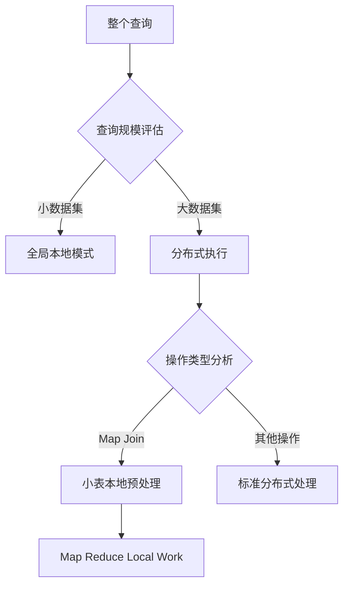

# Hive执行计划中出现"Map Reduce Local Work"的原因解析

即使设置了`hive.exec.mode.local.auto=false`，执行计划中仍然可能出现"Map Reduce Local Work"阶段，这与Hive的查询优化机制有关，而非本地执行模式的启用。

## 核心原因解释

1. **`Map Reduce Local Work` ≠ 本地执行模式**
   - 这里的"Local Work"是MapReduce作业内部的本地化处理阶段
   - 属于分布式执行计划的一部分，而非整个查询的本地模式执行

2. **Hive的查询优化策略**
   - 即使禁用本地模式，Hive仍会尝试在mapper端进行本地化预处理
   - 这是为了减少shuffle数据量，提高分布式执行效率

## 具体分析您的执行计划

从您的执行计划可以看出：

### Stage-5: Map Reduce Local Work
- 这是对小表(`a2`)的本地预处理阶段
- 构建哈希表用于后续的Map Join操作
- 数据量很小(仅4行)，适合在本地处理

### Stage-2: 真正的分布式执行
- 包含完整的Map-Reduce流程
- 使用了向量化执行(`Execution mode: vectorized`)
- 处理大数据量表(`a1`，数据量约36GB)

## 为什么会有这种设计？

1. **Map Join优化**：
   - 对小表进行本地预处理可以显著提高join性能
   - 将小表完全加载到内存，避免shuffle

2. **两阶段执行策略**：
   - 第一阶段：本地准备小表数据(Stage-5)
   - 第二阶段：分布式处理大表并完成join(Stage-2)

3. **资源效率**：
   - 避免将小表数据分发到所有节点
   - 只在需要的地方进行本地计算

## 与本地执行模式的区别

| 特性                | Map Reduce Local Work               | 本地执行模式                     |
|---------------------|-------------------------------------|----------------------------------|
| 触发条件            | 查询优化策略决定                    | hive.exec.mode.local.auto=true   |
| 执行范围            | 单个stage的本地预处理               | 整个查询在本地执行               |
| 数据量限制          | 由hive.mapjoin.localtask.max.memory控制 | 由hive.exec.mode.local.auto.inputbytes.max控制 |
| 是否使用集群资源    | 是(属于MR作业的一部分)              | 否(完全本地执行)                |
| 典型用途            | Map Join的小表处理                  | 开发测试、小数据量查询           |

## 相关配置参数

这些本地化处理行为受以下参数影响(与本地执行模式无关)：

```sql
-- 控制Map Join中小表处理方式
SET hive.auto.convert.join=true;
SET hive.auto.convert.join.noconditionaltask=true;
SET hive.auto.convert.join.noconditionaltask.size=10000000;

-- 本地任务内存限制
SET hive.mapjoin.localtask.max.memory.usage=0.90;

-- 本地哈希表实现方式
SET hive.mapjoin.localtask.hash.memory.usage=0.90;
```

## 总结

在您的案例中：
1. `hive.exec.mode.local.auto=false`确实禁用了全局本地执行模式
2. 执行计划中的"Map Reduce Local Work"是Hive优化器的合理行为
3. 这种局部本地化处理能提高分布式执行效率，特别是对于Map Join操作
4. 整个查询仍然是在分布式环境下执行的(Stage-2的Map Reduce阶段可以证明)

这种设计体现了Hive"全局分布式，局部本地化"的智能优化策略。


# 深入解析 Hive 执行计划中的 "Map Reduce Local Work"

在 `hive.exec.mode.local.auto=false` 情况下执行计划中仍然出现 "Map Reduce Local Work" 阶段，这实际上是 Hive 优化器的一个**智能设计决策**，与 Hive 的核心优化策略密切相关。

## 根本原因分析

### 1. 分布式执行中的本地化优化
`Map Reduce Local Work` 是 Hive 在分布式执行框架内实现的**本地化预处理机制**，与全局本地执行模式无关。它的存在是为了：
- 减少数据移动（shuffle）开销
- 最大化利用单个节点的计算能力
- 为分布式处理准备必要的数据结构

### 2. Map Join 优化策略
从您的执行计划可以看出，Stage-5 正在为 Map Join 做准备：
```plaintext
Stage: Stage-5
  Map Reduce Local Work
    ...
    HashTable Sink Operator
      keys:
        0 _col0 (type: string)
        1 _col0 (type: string)
```
这是在为后续的 Map Join 构建哈希表（Stage-2 中的 Map Join Operator）

### 3. 小表处理优化
注意表 `a2` 的统计信息：
```plaintext
Statistics: Num rows: 4 Data size: 67 Basic stats: COMPLETE
```
这表明这是一个非常小的表（只有 4 行数据），Hive 优化器智能地决定：
- 在本地完全处理这个小表
- 避免将其分发到整个集群
- 节省网络传输和集群资源

## 为什么这与 `hive.exec.mode.local.auto=false` 不冲突？

| 特性 | 本地执行模式 | Map Reduce Local Work |
|------|-------------|----------------------|
| **执行范围** | 整个查询在单节点执行 | 查询的特定阶段在单节点预处理 |
| **目标** | 完全避免集群执行 | 优化分布式执行 |
| **数据量** | 受 `hive.exec.mode.local.auto.inputbytes.max` 限制 | 受 `hive.mapjoin.localtask.max.memory.usage` 限制 |
| **资源使用** | 不使用集群资源 | 使用集群资源，但优化使用方式 |
| **典型场景** | 开发/测试小查询 | Map Join 中的小表处理 |

## Hive 的执行优化层次结构



## 关键技术解释

### 1. Map Join 本地任务
- 当小表足够小时，Hive 在本地节点构建哈希表
- 哈希表序列化后分发到所有 Mapper 节点
- 在 Map 阶段完成 Join，避免 Reduce 阶段

### 2. 本地工作优化器
Hive 优化器自动识别以下机会：
- **可本地化的操作**：过滤、投影、小聚合
- **可本地化的数据**：小表、分区子集、采样数据
- **可本地化的计算**：UDF 预处理、类型转换

### 3. 分布式执行流水线
```plaintext
1. 本地预处理阶段 (Stage-5)
   - 小表加载到内存
   - 构建哈希表

2. 分布式处理阶段 (Stage-2)
   - 大表分布式扫描
   - 使用预处理的哈希表进行Map Join
   - 分布式聚合

3. 结果获取阶段 (Stage-0)
```

## 性能优势

这种设计带来了显著的性能提升：
1. **网络优化**：减少小表数据在集群中的传输
2. **内存优化**：避免在每个 Mapper 重复构建哈希表
3. **启动延迟优化**：本地预处理与集群资源分配并行
4. **资源利用率**：集群资源集中处理大数据量部分

## 配置参数关联

这些本地工作行为由以下参数控制：
```sql
-- 控制Map Join中小表处理方式
SET hive.auto.convert.join=true; -- 启用自动Map Join转换
SET hive.mapjoin.smalltable.filesize=25000000; -- 小表大小阈值(默认25MB)

-- 本地任务内存限制
SET hive.mapjoin.localtask.max.memory.usage=0.90; -- 本地任务最大内存使用比例

-- 是否启用本地任务优化
SET hive.optimize.local.mapjoin=true; -- 默认为true
```

## 总结

在您的执行计划中出现的 `Map Reduce Local Work` 阶段：
1. **不是**全局本地执行模式的产物
2. 是 Hive 优化器在分布式框架内实现的**智能本地化优化**
3. 专门为处理小表数据（如表 `a2`）而设计
4. 目的是优化后续的 Map Join 操作
5. 完全兼容且独立于 `hive.exec.mode.local.auto=false` 设置

这种架构设计体现了 Hive 的核心理念："在分布式框架内最大化本地计算"，它允许 Hive 在保持大规模分布式处理能力的同时，智能利用本地计算资源优化特定操作，特别是对小规模数据的预处理。
