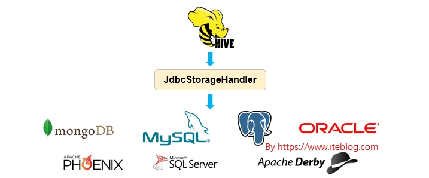
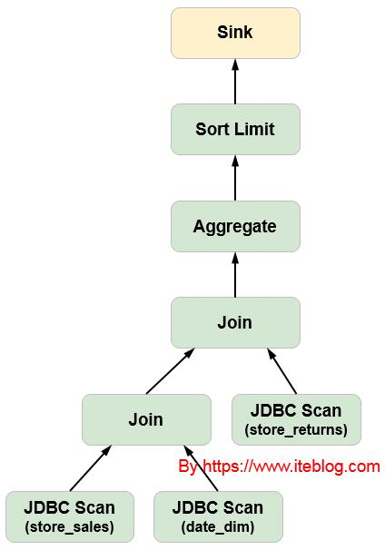

如今，很多公司可能会在内部使用多种数据存储和处理系统。这些不同的系统解决了对应的使用案例。除了传统的 RDBMS （比如 Oracle DB，Teradata或PostgreSQL） 之外，我们还会使用 Apache Kafka 来获取流和事件数据。使用 Apache Druid 处理实时系列数据（real-time series data），使用 Apache Phoenix 进行快速索引查找。 此外，我们还可能使用云存储服务或 HDFS 批量存储数据。

平台团队一般会部署所有这些系统，使应用程序开发人员可以灵活地选择，以满足他们业务分析需求所需的功能。

## 1. 使用 Apache Hive 3.0 和 SQL 统一访问

但是我们也知道，如果我们需要将不同存储来源的数据进行关联，我们需要对数据进行提取，并放到同一种存储介质里面，比如都放到 HBase 中，然后再进行关联操作。大家可以看出，这种数据割裂，会对我们的数据关联分析带来很大的麻烦，如果我们能够使用一种查询引擎分别查询不同数据源的数据，然后直接进行关联操作，这将带来巨大的效率提升。这就是本文介绍的 JDBC Storage Handler，详见 HIVE-1555。

从 JdbcStorageHandler 名字我们就可以看出，其功能应该和 HBaseStorageHandler 类似，也就是可以在 Hive 中使用标准的 JDBC 方式读取存储在不同数据存储里面的数据。比如我们可以在 Hive 中分别读取 MySQL 和 Phoenix 里面的数据，然后进行关联。其提供高效，统一的 SQL 访问 - 开箱即用。 这样做的好处是巨大的：
- 单个 SQL 方言和 API
- 统一安全控制和审计跟踪
- 统一控制
- 能够组合来自多个来源的数据
- 数据独立性

需要注意的是，目前 JdbcStorageHandler 仅仅支持从 JDBC 数据源读取数据，还不支持支持将数据写入到 JDBC 数据源。



## 2. JdbcStorageHandler 支持 CBO（Cost-based optimizer）

使用 JdbcStorageHandler 从 JDBC 数据源读取数据时，一种简单的方式是直接读取全量的数据；并将其全部加载到 Hive。这种方式虽然很简答，但是却会带来性能问题。

基于这些原因，Hive 依赖 storage handler interfaces 以及 Apache Calcite 的 CBO 实现了智能的算子下推功能。这样可以将查询规则下推到 JDBC 数据源，在 JDBC 数据源层面上进行一些过滤，再将计算结果返回给 Hive，这样可以减少数据的量，从而提高查询效率。

算子下推这个功能不限于 SQL 系统，比如我们可以将算子下推到 Apache Druid 或者 Apache Kafka。在查询 Apache Druid 里面的数据时，Hive 可以将过滤和聚合操作下推到 Druid，生成 JSON查询，并将其发送到引擎公开的 REST API。另一方面，如果我们查询 Kafka 里面的数据时，Hive 可以直接过滤相关的分区或者偏移量，有选择地从系统中的主题读取数据。

假设我们在 MySQL 或者 PostgreSQL 里面有 store_sales、 store_retuens 和 date_dim 三张表，然后我们有以下的查询：
```sql
SELECT FLOOR(d_timestap TO DAY),
    SUM(ss_sales_price) AS sum_sales
FROM store_sales, store_returns, date_dim
WHERE ss_item_sk = sr_item_sk AND
    ss_ticket_number = sr_ticket_number AND
    ss_sold_date_sk = d_date_sk AND
    ss_store_sk = 410
GROUP BY FLOOR(d_timestap TO DAY)
ORDER BY sum_sales DESC
LIMIT 100;
```
上面这条 SQL 在优化前的执行计划，如下：


其中绿色的框框是在 MySQL 或者 PostgreSQL 里面执行的，橘色的是在 Hive 执行的。从上图可以看出，三次扫描的文件直接返回到 Hive 处理，这样效率是很低下的，其实我们可以对其进行算子下沉优化，经过 Apache Calcite 的 CBO 优化之后，执行计划如下：



对应的 SQL 执行如下：
```sql
// 如果是 PostgreSQL JDBC 数据源：
SELECT DATE_TRUNC('DAY', "d_timestap"),
    SUM("ss_sales_price") AS "sum_sales"
FROM "store_sales", "store_returns", "date_dim"
WHERE "ss_item_sk" = "sr_item_sk" AND
    "ss_ticket_number" = "sr_ticket_number" AND
    "ss_sold_date_sk" = "d_date_sk" AND
    "ss_store_sk" = 410
GROUP BY DATE_TRUNC('DAY', "d_timestap")
ORDER BY "sum_sales" DESC
LIMIT 100;

// 如果是 MySQL JDBC 数据源：
SELECT DATE_FORMAT(`d_timestap`, '%Y-%m-%d 00:00:00'),
    SUM(`ss_sales_price`) AS `sum_sales`
FROM `store_sales`, `store_returns`, `date_dim`
WHERE `ss_item_sk` = `sr_item_sk` AND
    `ss_ticket_number` = `sr_ticket_number` AND
    `ss_sold_date_sk` = `d_date_sk` AND
    `ss_store_sk` = 410
GROUP BY DATE_FORMAT(`d_timestap`, '%Y-%m-%d 00:00:00')
ORDER BY `sum_sales` DESC
LIMIT 100;
```
上面的这些操作直接在对应的 JDBC 数据源上执行，然后 Hive 再调用 JDBC_Scan 将查询结果保存到对应的 Sink 中。

## 3. 如何使用 JdbcStorageHandler

说了这么多，那么我们该如何使用 JdbcStorageHandler 呢？为了使用它，我们需要在 Hive 里面创建一张外部表，具体如下：
```sql
CREATE EXTERNAL TABLE iteblog_jdbc
(
  name string,
  age int,
  gpa double
)
STORED BY 'org.apache.hive.storage.jdbc.JdbcStorageHandler'
TBLPROPERTIES (
    "hive.sql.database.type" = "MYSQL",
    "hive.sql.jdbc.driver" = "com.mysql.jdbc.Driver",
    "hive.sql.jdbc.url" = "jdbc:mysql://www.iteblog.com/sample",
    "hive.sql.dbcp.username" = "iteblog",
    "hive.sql.dbcp.password" = "iteblog_hadoop",
    "hive.sql.table" = "STUDENT",
    "hive.sql.dbcp.maxActive" = "1"
);
```
正如上述所示，create table 当前需要指定 JDBC 表的模式。[HIVE-21060](https://issues.apache.org/jira/browse/HIVE-21060) 引入了一种可以对基于 JDBC 外部表自动发现模式的功能，这样我们就不必在 create table 命令中声明它。

[HIVE-21059](https://issues.apache.org/jira/browse/HIVE-21059) 的工作是对外部 catalog 的支持。 外部 catalog 将允许在 Metastore 中创建指向外部 mysql 数据库的 catalog。并且通过此 catalog，我们可以在 Hive 查询中使用里面的所有表。

原文:[Apache Hive 联邦查询（Query Federation）](https://www.iteblog.com/archives/2524.html)
