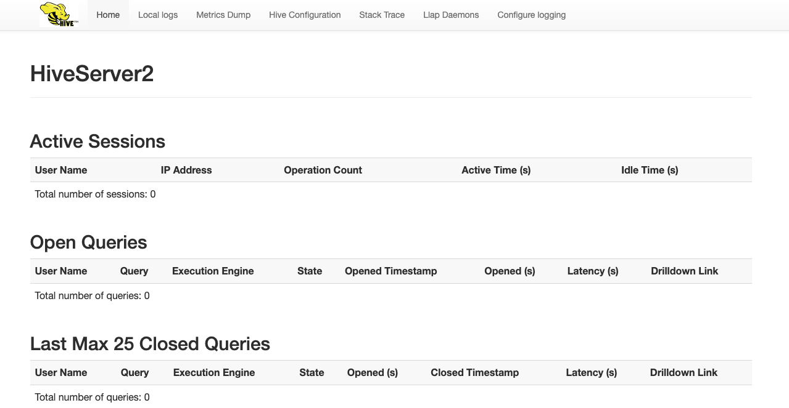

在现代软件开发的众多环节中，容器化技术已经成为了加速开发、简化部署的关键工具。Docker 作为市场上最流行的容器平台之一，提供了一种高效的方式来打包、分发和管理应用。在这片博文中，我们将探索如何利用 Docker Compose 来部署一个 Apache Hive 服务。在开发环境中，使用 Docker Compose 部署 Hive 不仅能够保证环境的一致性，还允许开发者快速部署和撤销实例，极大地提高了开发效率。

## 1. Hive 简介

Apache Hive 是建立在 Hadoop 生态系统之上的一个开源数据仓库工具，主要用于处理大规模结构化或半结构化数据。它将用户编写的类 SQL 查询（称为 HiveQL）转换为底层计算框架（如 MapReduce、Tez 或 Spark）的任务，从而实现对海量数据的分析与处理。Hive 的核心目标是 简化 Hadoop 的数据处理，让熟悉 SQL 的用户无需深入掌握 Java 或 MapReduce 即可操作分布式数据。

## 2. Docker Compose 简介

Docker Compose 是一个用于定义和运行多容器 Docker 应用程序的工具。通过 Compose，您可以通过一个 YAML 文件来配置您的应用的服务。然后，使用一个简单的命令，就可以创建并启动所有配置中的服务。这让组织和管理容器变成了一件轻而易举的事情。

## 3. Docker Compose 部署 Hive

接下来，我们将一步步通过 Docker Compose 来部署一个 Hive 服务。在开始部署之前，请确保以下环境已经准备好:
- 安装 Docker: 确保 Docker 已经安装并运行在你的机器上。可以通过以下命令验证 Docker 是否安装:
   ```bash
   docker --version
   ```
- 安装 Docker Compose: 确保 Docker Compose 已经安装并配置完成。可以通过以下命令验证 Docker Compose 是否安装:
   ```bash
   docker-compose --version
   ```

### 3.1 创建项目目录

首先为项目创建一个目录。在这里，在我们的工作目录 `/opt/workspace/docker` 下创建一个名为 `hive` 的项目:
```shell
smartsi@localhost docker % mkdir hive
smartsi@localhost docker % cd hive
```

> 该目录是应用程序镜像的上下文。该目录应该只包含用于构建该镜像的资源。

### 3.2 构建 Compose 文件

Docker Compose 简化了对整个应用程序堆栈的控制，使得在一个易于理解的 YAML 配置文件中轻松管理服务、网络和数据卷。要使用 Docker Compose 部署，首先需创建一个`docker-compose.yml`文件，从 [官方]()下载配置文件，按照自己的需求修改即可。在这我们的配置如下所示:
```yaml
services:
  postgres:
    image: postgres:15.7
    restart: unless-stopped
    container_name: postgres
    hostname: postgres
    environment:
      POSTGRES_DB: 'hive_metastore'
      POSTGRES_USER: 'admin'
      POSTGRES_PASSWORD: 'admin'
    ports:
      - '5432:5432'
    volumes:
      - pg:/var/lib/postgresql
    networks:
      - hive-network

  metastore:
    image: apache/hive:3.1.3
    depends_on:
      - postgres
    restart: unless-stopped
    container_name: metastore
    hostname: metastore
    environment:
      DB_DRIVER: postgres
      SERVICE_NAME: 'metastore'
      SERVICE_OPTS: '-Xmx1G -Djavax.jdo.option.ConnectionDriverName=org.postgresql.Driver
                     -Djavax.jdo.option.ConnectionURL=jdbc:postgresql://postgres:5432/hive_metastore
                     -Djavax.jdo.option.ConnectionUserName=admin
                     -Djavax.jdo.option.ConnectionPassword=admin'
    ports:
        - '9083:9083'
    volumes:
        - warehouse:/opt/hive/data/warehouse
        - ./lib/postgresql-42.5.6.jar:/opt/hive/lib/postgres.jar
    networks:
      - hive-network

  hiveserver2:
    image: apache/hive:3.1.3
    depends_on:
      - metastore
    restart: unless-stopped
    container_name: hiveserver2
    hostname: hiveserver2
    environment:
      HIVE_SERVER2_THRIFT_PORT: 10000
      SERVICE_OPTS: '-Xmx1G -Dhive.metastore.uris=thrift://metastore:9083'
      IS_RESUME: 'true'
      SERVICE_NAME: 'hiveserver2'
    ports:
      - '10000:10000'
      - '10002:10002'
    volumes:
      - warehouse:/opt/hive/data/warehouse
    networks:
      - hive-network

volumes:
  pg:
  warehouse:

networks:
  hive-network:
    name: hive-network
```

#### 3.2.1 服务定义（Services）

`services` 用于定义 Hive 的各个组件，每个组件对应一个容器。上面的配置定义了3个服务:
- `postgres`: 作为 Hive Metastore 的元数据库。
- `metastore`: YARN 的 ResourceManager，负责集群资源管理和任务调度。
- `hiveserver2`: YARN 的 NodeManager，负责管理单个节点上的资源和任务。

Docker Compose 会将每个服务部署在各自的容器中，在这里我们自定义了与服务名称一致的容器名称，因此 Docker Compose 会部署3个名为 `postgres`、`metastore` 以及 `hiveserver2` 的容器。

##### 3.2.1.1 Postgres 服务

```yaml
postgres:
  image: postgres:15.7
  restart: unless-stopped
  container_name: postgres
  hostname: postgres
  environment:
    POSTGRES_DB: 'hive_metastore'
    POSTGRES_USER: 'admin'
    POSTGRES_PASSWORD: 'admin'
  ports:
    - '5432:5432'
  volumes:
    - pg:/var/lib/postgresql
  networks:
    - hive-network
```

核心配置:
- `image`: 使用预构建的 15.7 版本 `postgres` 镜像部署 `Postgres` 服务。
- `container_name` 和 `hostname`: 固定容器名和主机名为 `postgres`，确保其他服务可通过该主机名访问。
- `networks`: 连接到自定义桥接网络 `hive-network`，确保容器间通信。
- `restart`: `unless-stopped` 指定容器异常退出时自动重启（除非手动停止）。
- `environment`:
  - `POSTGRES_DB`: 创建名为 `hive_metastore` 的数据库，用于存储 Hive 元数据。
  - `POSTGRES_USER/POSTGRES_PASSWORD`: 为数据库设置用户名与密码。
- `ports`:
  - `5432:5432`: 将宿主机的 5432 端口映射到容器的 5432 端口，允许外部直接访问 PostgreSQL。
- `volumes`:
  - `pg:/var/lib/postgresql`: 将名为 `pg` 数据卷挂载到容器内的 `/var/lib/postgresql`。
  - 将数据库数据持久化到名为 `pg` 的数据卷中，避免容器重启后数据丢失。

##### 3.2.1.2 Metastore 服务

```yaml
metastore:
  image: apache/hive:3.1.3
  depends_on:
    - postgres
  restart: unless-stopped
  container_name: metastore
  hostname: metastore
  environment:
    DB_DRIVER: postgres
    SERVICE_NAME: 'metastore'
    SERVICE_OPTS: '-Xmx1G -Djavax.jdo.option.ConnectionDriverName=org.postgresql.Driver
                   -Djavax.jdo.option.ConnectionURL=jdbc:postgresql://postgres:5432/hive_metastore
                   -Djavax.jdo.option.ConnectionUserName=admin
                   -Djavax.jdo.option.ConnectionPassword=admin'
  ports:
      - '9083:9083'
  volumes:
      - warehouse:/opt/hive/data/warehouse
      - ./lib/postgresql-42.5.6.jar:/opt/hive/lib/postgres.jar
  networks:
    - hive-network
```

核心配置:
- `image`: 使用预构建的 3.1.3 版本 `apache/hive` 镜像部署 `Metastore` 服务。
- `container_name`: 容器名称固定为 `metastore`，便于其他服务引用。
- `networks`: 连接到自定义桥接网络 `hive-network`，确保容器间通信。
- `restart`: `unless-stopped` 指定容器异常退出时自动重启（除非手动停止）。
- `depends_on`:
  - `postgres`: 确保 `PostgreSQL` 服务先启动。
- `environment`:
  - `DB_DRIVER`: 指定元数据存储使用 `PostgreSQL`。
  - `SERVICE_NAME`: 声明服务角色为元数据存储。
  - `SERVICE_OPTS`: JVM 启动参数
    - `-Xmx1G`: 分配最大 1GB 堆内存。
    - `-Djavax.jdo...`: 配置 JDBC 连接参数，指向 `PostgreSQL` 服务。
- `ports`:
  - `9083:9083`: 暴露 Metastore 的 Thrift 服务端口 9083，供 `HiveServer2` 和其他客户端连接。
- `volumes`:
  - `warehouse`: 持久化 Hive 数据仓库目录
  - `./lib/postgresql-42.5.6.jar:/opt/hive/lib/postgres.jar`: 本地文件 `./lib/postgresql-42.5.6.jar` 挂载到容器内的 `/opt/hive/lib/postgres.jar`，提供 `PostgreSQL` JDBC 驱动。

##### 3.2.1.3 HiveServer 服务

```yaml
hiveserver2:
  image: apache/hive:3.1.3
  depends_on:
    - metastore
  restart: unless-stopped
  container_name: hiveserver2
  environment:
    HIVE_SERVER2_THRIFT_PORT: 10000
    SERVICE_OPTS: '-Xmx1G -Dhive.metastore.uris=thrift://metastore:9083'
    IS_RESUME: 'true'
    SERVICE_NAME: 'hiveserver2'
  ports:
    - '10000:10000'
    - '10002:10002'
  volumes:
    - warehouse:/opt/hive/data/warehouse
  networks:
    - hive-network
```

核心配置:
- `image`: 使用预构建的 3.1.3 版本 `apache/hive` 镜像部署 `HiveServer` 服务。
- `container_name`: 容器名称固定为 `hiveserver2`，便于其他服务引用。
- `networks`: 连接到自定义桥接网络 `hive-network`，确保容器间通信。
- `restart`: `unless-stopped` 指定容器异常退出时自动重启（除非手动停止）。
- `depends_on`:
  - `metastore`: 确保 metastore 服务先启动。
- `environment`:
  - `HIVE_SERVER2_THRIFT_PORT`: 指定 Thrift 服务端口为 10000。
  - SERVICE_OPTS:
    - `-Dhive.metastore.uris=thrift://metastore:9083`: 告知 HiveServer2 如何找到 Metastore。
  - `IS_RESUME`: 允许服务恢复（用于容器重启后保持会话）
  - `SERVICE_NAME`: 声明服务角色为元数据存储。
- `ports`:
  - `10000:10000`: 暴露 Thrift 的服务端口，用于 JDBC/ODBC 连接。
  - `10002:10002`: 暴露 HiveServer2 的 Web UI 端口。
- `volumes`:
  - `warehouse`: 持久化 Hive 数据仓库目录

#### 3.2.2 卷定义（Volumes）

```yaml
volumes:
  pg:
  warehouse:
```
声明三个 Docker 数据卷，用于持久化存储 `PostgreSQL` 数据库数据、Hive 数据仓库数据。

> Docker 会自动管理这些卷的实际存储位置（默认在 /var/lib/docker/volumes/），确保容器重启后数据不丢失。

#### 3.2.3 网络定义（Networks）

```yaml
networks:
  hive-network:
    driver: bridge
    ipam:
      config:
        - subnet: 172.23.0.0/24
```

核心配置:
- `hive-network`: 创建名为 `hive-network` 的自定义 Docker 网络。
- `driver: bridge`: 创建桥接网络，允许容器间通过容器名称通信。
- `ipam`: 配置静态 IP 地址范围（172.22.0.0/24），避免容器 IP 变动导致服务不可用。

### 3.3 配置驱动

Hive 需要通过 PostgreSQL JDBC 驱动连接 PostgreSQL，在 Metastore 服务通过将本地文件 `./lib/postgresql-42.5.6.jar` 挂载到容器内的 `/opt/hive/lib/postgres.jar`，来提供 `PostgreSQL` JDBC 驱动。所以需要在创建一个 `lib` 目录存储下载的 JDBC 驱动：
```bash
mkdir lib
wget -P lib https://jdbc.postgresql.org/download/postgresql-42.5.6.jar
```

你还可以选择另外一种方式:
```yaml
volumes:
  - type: bind
  - source: `mvn help:evaluate -Dexpression=settings.localRepository -q -DforceStdout`/org/postgresql/postgresql/42.5.1/postgresql-42.5.6.jar
  - target: /opt/hive/lib/postgres.jar
```

上述 source 命令是用于通过 Maven 工具处理 PostgreSQL JDBC 驱动依赖，并将其本地存储路径导出为环境变量。第一步是调用 Maven 的 dependency 插件将指定版本的 PostgreSQL 驱动强制下载到本地 Maven 仓库:
```
mvn dependency:copy -Dartifact="org.postgresql:postgresql:42.5.1"
```
第二步是获取本地仓库路径并设置环境变量:
```
export POSTGRES_LOCAL_PATH=`mvn help:evaluate -Dexpression=settings.localRepository -q -DforceStdout`/org/postgresql/postgresql/42.5.1/postgresql-42.5.1.jar
```
> `mvn help:evaluate -Dexpression=settings.localRepository` 获取 Maven 本地仓库路径（默认: `~/.m2/repository`），`-q -DforceStdout` 静默模式并强制标准输出

最终 source 值为:
```
~/.m2/repository/org/postgresql/postgresql/42.5.1/postgresql-42.5.1.jar
```

### 3.4 启动集群

在项目目录中执行 `docker-compose up -d` 命令启动 `Hive` 服务:
```bash
smartsi@smartsi:hive wy$ docker compose up -d
[+] Running 6/6
 ✔ Network hive-network     Created 0.6s
 ✔ Volume "hive_pg"         Created 0.0s
 ✔ Volume "hive_warehouse"  Created 0.0s
 ✔ Container postgres       Started 1.3s
 ✔ Container metastore      Started 0.3s
 ✔ Container hiveserver2    Started 0.1s
```
> `-d` 表示后台运行容器。

### 3.5 查看容器状态

通过 `docker-compose ps` 命令查看所有容器的状态:
```bash
localhost:hive wy$ docker-compose ps
WARN[0000] /opt/workspace/docker/hive/docker-compose.yml: `version` is obsolete
NAME          IMAGE               COMMAND                  SERVICE       CREATED         STATUS              PORTS
hiveserver2   apache/hive:3.1.3   "sh -c /entrypoint.sh"   hiveserver2   2 minutes ago   Up About a minute   0.0.0.0:10000->10000/tcp, 9083/tcp, 0.0.0.0:10002->10002/tcp
metastore     apache/hive:3.1.3   "sh -c /entrypoint.sh"   metastore     2 minutes ago   Up About a minute   10000/tcp, 0.0.0.0:9083->9083/tcp, 10002/tcp
postgres      postgres:15.7       "docker-entrypoint.s…"   postgres      2 minutes ago   Up About a minute   0.0.0.0:5432->5432/tcp
```
你会看到所有服务 `namenode`、`datanode`、`resourcemanager`、`nodemanager`、`historyserver` 都处于正常运行 "Up" 状态。

### 3.6 查看日志

如果需要查看某个服务的日志，可以执行以下命令:
```bash
docker-compose logs <service_name>
```
例如，查看 metastore 的日志:
```bash
localhost:hive wy$ docker-compose logs metastore
metastore  | + : postgres
metastore  | + SKIP_SCHEMA_INIT=false
metastore  | + [[ '' = \t\r\u\e ]]
metastore  | + VERBOSE_MODE=
metastore  | + export HIVE_CONF_DIR=/opt/hive/conf
metastore  | + HIVE_CONF_DIR=/opt/hive/conf
metastore  | + '[' -d '' ']'
metastore  | + export 'HADOOP_CLIENT_OPTS= -Xmx1G -Xmx1G -Djavax.jdo.option.ConnectionDriverName=org.postgresql.Driver -Djavax.jdo.option.ConnectionURL=jdbc:postgresql://postgres:5432/hive_metastore -Djavax.jdo.option.ConnectionUserName=admin -Djavax.jdo.option.ConnectionPassword=admin'
metastore  | + HADOOP_CLIENT_OPTS=' -Xmx1G -Xmx1G -Djavax.jdo.option.ConnectionDriverName=org.postgresql.Driver -Djavax.jdo.option.ConnectionURL=jdbc:postgresql://postgres:5432/hive_metastore -Djavax.jdo.option.ConnectionUserName=admin -Djavax.jdo.option.ConnectionPassword=admin'
metastore  | + [[ false == \f\a\l\s\e ]]
metastore  | + initialize_hive
metastore  | + COMMAND=-initOrUpgradeSchema
metastore  | ++ echo 3.1.3
metastore  | ++ cut -d . -f1
metastore  | + '[' 4 -lt 4 ']'
metastore  | + /opt/hive/bin/schematool -dbType postgres -initOrUpgradeSchema
...
metastore  | Metastore connection URL:	 jdbc:postgresql://postgres:5432/hive_metastore
metastore  | Metastore connection Driver :	 org.postgresql.Driver
metastore  | Metastore connection User:	 admin
metastore  | Initializing the schema to: 3.1.3
metastore  | Metastore connection URL:	 jdbc:postgresql://postgres:5432/hive_metastore
metastore  | Metastore connection Driver :	 org.postgresql.Driver
metastore  | Metastore connection User:	 admin
metastore  | Starting metastore schema initialization to 3.1.3
metastore  | Initialization script hive-schema-3.1.3.postgres.sql
...
metastore  | Initialization script completed
metastore  | Initialized schema successfully..
metastore  | + '[' 0 -eq 0 ']'
metastore  | + echo 'Initialized schema successfully..'
metastore  | + '[' metastore == hiveserver2 ']'
metastore  | + '[' metastore == metastore ']'
metastore  | + export METASTORE_PORT=9083
metastore  | + METASTORE_PORT=9083
metastore  | + exec /opt/hive/bin/hive --skiphadoopversion --skiphbasecp --service metastore
metastore  | 2025-03-01 06:43:53: Starting Hive Metastore Server
```

## 4. 验证集群运行状态

### 4.1 Web UI 验证集群


`HiveServer` 的 Web UI 默认运行在 `hiveserver2` 容器的 `10002` 端口。你可以通过以下地址访问：
```
http://localhost:10002
```

在浏览器中打开该地址，你应该会看到 HDFS 的 Web 界面，如下图所示：



### 4.2 使用 HiveSQL 验证

执行如下命令进入 `hiveserver2` 容器来 beeline 客户端:
```bash
localhost:hive wy$ docker exec -it hiveserver2 beeline -u 'jdbc:hive2://hiveserver2:10000/'
...
Connecting to jdbc:hive2://hiveserver2:10000/
Connected to: Apache Hive (version 3.1.3)
Driver: Hive JDBC (version 3.1.3)
Transaction isolation: TRANSACTION_REPEATABLE_READ
Beeline version 3.1.3 by Apache Hive
0: jdbc:hive2://hiveserver2:10000/>
0: jdbc:hive2://hiveserver2:10000/>
0: jdbc:hive2://hiveserver2:10000/>
```
执行 `show tables` 查看目前的表：
```
0: jdbc:hive2://hiveserver2:10000/> show tables;
...
+-----------+
| tab_name  |
+-----------+
+-----------+
No rows selected (4.288 seconds)
```

## 5. 集成 Hadoop 集群

如果没有配置与 Hadoop 集群的链接，Hive 仍然可以运行，但它的行为会退化为 **本地模式**（Local Mode）。此时，Hive 的数据存储和计算均依赖于本地文件系统和本地执行引擎（如本地 MapReduce），而非分布式存储（HDFS）和分布式计算框架（如 YARN）。在用户提供的 docker-compose.yml 中，Hive 未挂载 Hadoop 配置文件，因此实际行为如下:
- 数据存储: 通过 warehouse 卷挂载到本地路径 /opt/hive/data/warehouse。
- 执行引擎: 使用本地 MapReduce（无 YARN 调度）。
- HDFS 交互: 完全缺失，所有数据操作基于本地文件系统。

为了将 Hive 与已经独立部署的 Hadoop 集群集成，需要确保 Hive 能正确访问 Hadoop 的 HDFS 和 YARN 服务。这就需要确保 Hive 和 Hadoop 两者在同一 Docker 网络、共享 Hadoop 配置，并正确设置 Hive 配置参数。下面我们将详细讲解如何与远程 Hadoop 集群集成。

### 5.1 挂载 Hadoop 配置文件到 Hive 容器

Hive 需要 Hadoop 的核心配置文件（`core-site.xml`, `hdfs-site.xml`, `yarn-site.xml`、`mapred-site.xml`）才能与远程集群通信。需要挂载到 Hive 的配置目录，并确保配置一致性。

第一步在本地创建配置文件目录。例如，在 Docker Compose 文件同级目录下创建 `hadoop-conf` 文件夹:
```bash
mkdir hadoop-conf
```
第二步从 Hadoop 集群复制配置文件到本地配置文件目录。在 `Hadoop` 集群的任意节点上可以找到如下配置文件（默认路径通常是 `$HADOOP_HOME/etc/hadoop/`）
- `core-site.xml`（包含 HDFS NameNode 地址）
- `hdfs-site.xml`（HDFS 详细配置）
- `yarn-site.xml`（YARN ResourceManager 地址）
- `mapred-site.xml`（MapReduce 配置）

你可以通过如下命令直接提取 `Hadoop` 配置文件到本地配置文件目录:
```bash
localhost:hive wy$ docker cp namenode:/etc/hadoop/core-site.xml ./hadoop-conf/
Successfully copied 4.1kB to /opt/workspace/docker/hive/hadoop-conf/
localhost:hive wy$
localhost:hive wy$ docker cp namenode:/etc/hadoop/hdfs-site.xml ./hadoop-conf/
Successfully copied 6.14kB to /opt/workspace/docker/hive/hadoop-conf/
localhost:hive wy$
localhost:hive wy$ docker cp namenode:/etc/hadoop/yarn-site.xml ./hadoop-conf/
Successfully copied 39.9kB to /opt/workspace/docker/hive/hadoop-conf/
localhost:hive wy$
localhost:hive wy$ docker cp namenode:/etc/hadoop/mapred-site.xml ./hadoop-conf/
Successfully copied 3.58kB to /opt/workspace/docker/hive/hadoop-conf/
```
第三步修改 Hive 的 `docker-compose.yml` 配置文件并挂载配置文件。在 `metastore` 和 `hiveserver2` 服务的 `volumes` 中挂载配置文件:
```yaml
volumes:
 - warehouse:/opt/hive/data/warehouse
 - ./hadoop-conf:/opt/hive/conf
```

### 5.2 网络集成: 打通 Hive 与 Hadoop 网络

确保 `Hive` 服务能通过容器名访问 `Hadoop` 组件，需要将 `Hive` 的服务（metastore、hiveserver2）加入 `Hadoop` 所在的网络(在这为 `pub-network`)。修改 `Hive` 的 `docker-compose.yml`:
```yaml
# 使用 Hadoop 的外部网络，移除原 hive-network
networks:
  pub-network:
    external: true  # 引用 Hadoop 所在的 pub-network 网络

services:
  postgres:
    networks:
      - pub-network  # 所有服务加入 Hadoop 所在的 pub-network 网络
  metastore:
    networks:
      - pub-network
  hiveserver2:
    networks:
      - pub-network
```

经过上述调整之后的配置文件如下所示:
```yaml
services:
  postgres:
    image: postgres:15.7
    restart: unless-stopped
    container_name: postgres
    hostname: postgres
    environment:
      POSTGRES_DB: 'hive_metastore'
      POSTGRES_USER: 'admin'
      POSTGRES_PASSWORD: 'admin'
    ports:
      - '5432:5432'
    volumes:
      - pg:/var/lib/postgresql
    networks:
      - pub-network

  metastore:
    image: apache/hive:3.1.3
    depends_on:
      - postgres
    restart: unless-stopped
    container_name: metastore
    hostname: metastore
    environment:
      DB_DRIVER: postgres
      SERVICE_NAME: 'metastore'
      SERVICE_OPTS: '-Xmx1G -Djavax.jdo.option.ConnectionDriverName=org.postgresql.Driver
                     -Djavax.jdo.option.ConnectionURL=jdbc:postgresql://postgres:5432/hive_metastore
                     -Djavax.jdo.option.ConnectionUserName=admin
                     -Djavax.jdo.option.ConnectionPassword=admin'
    ports:
        - '9083:9083'
    volumes:
        - warehouse:/opt/hive/data/warehouse
        - ./lib/postgresql-42.5.6.jar:/opt/hive/lib/postgres.jar
        - ./hadoop-conf:/opt/hive/conf
    networks:
      - pub-network

    hiveserver2:
      image: apache/hive:3.1.3
      restart: unless-stopped
      container_name: hiveserver2
      hostname: hiveserver2
      depends_on:
        - metastore
      environment:
        HIVE_SERVER2_THRIFT_PORT: 10000
        SERVICE_OPTS: '-Xmx1G -Dhive.metastore.uris=thrift://metastore:9083'
        IS_RESUME: 'true'
        SERVICE_NAME: 'hiveserver2'
      ports:
        - '10000:10000'
        - '10002:10002'
      volumes:
        - warehouse:/opt/hive/data/warehouse
        - ./hadoop-conf:/opt/hive/conf
      networks:
        - pub-network

volumes:
  pg:
  warehouse:

networks:
  pub-network:
    external: true
```


### 5.3 配置 Hive 的 `hive-site.xml`

Hive 需要知道如何与 Hadoop 集群交互，例如指定 HDFS 仓库路径和 YARN 资源管理。在 `hadoop-conf` 目录下创建 `hive-site.xml`，添加以下关键配置:
```xml
<!-- hive-site.xml -->
<configuration>
  <!-- Hive 元数据仓库目录（指向 HDFS） -->
  <property>
    <name>hive.metastore.warehouse.dir</name>
    <value>hdfs://namenode:9000/user/hive/warehouse</value>
  </property>

  <!-- 使用 YARN 作为执行引擎 -->
  <property>
    <name>hive.execution.engine</name>
    <value>mr</value>  <!-- 或使用tez -->
  </property>

  <!-- 使用 YARN 作为执行引擎 -->
  <property>
    <name>mapreduce.framework.name</name>
    <value>yarn</value>
  </property>

  <!-- YARN ResourceManager 地址 -->
  <property>
    <name>yarn.resourcemanager.address</name>
    <value>resourcemanager:8032</value>
  </property>
</configuration>
```
> hive-site.xml 中不需要包含全部参数，只需覆盖与 Hadoop 集成相关的核心参数即可。Hive 会默认加载其内置的配置文件，而用户定义的 hive-site.xml 仅用于覆盖需要自定义的部分。

### 5.4 启动 Hive 服务

在项目目录中执行 `docker-compose up -d` 命令启动 `Hive` 服务:
```
localhost:hive wy$ docker compose up -d
[+] Running 5/5
 ✔ Volume "hive_warehouse"  Created   0.0s
 ✔ Volume "hive_pg"         Created   0.0s
 ✔ Container postgres       Started   0.3s
 ✔ Container metastore      Started   0.4s
 ✔ Container hiveserver2    Started   0.1s
```

### 5.5 验证 Hadoop 集群连通性

在 Hive 容器内执行以下命令，验证是否能访问 Hadoop 服务。

1. 进入 Hive 容器
    ```bash
    localhost:hive wy$ docker exec -it metastore bash
    hive@metastore:/opt/hive$
    ```

2. 检查 HDFS 连通性: 如果成功，会列出 HDFS 根目录内容:
    ```bash
    hive@metastore:/opt/hive$ hdfs dfs -ls hdfs://namenode:9000/
    Found 4 items
    drwxrwxrwt   - root root                0 2025-03-01 13:16 hdfs://namenode:9000/app-logs
    drwxr-xr-x   - root supergroup          0 2025-03-01 13:11 hdfs://namenode:9000/rmstate
    drwx------   - root supergroup          0 2025-03-01 13:43 hdfs://namenode:9000/tmp
    drwxr-xr-x   - root supergroup          0 2025-03-01 13:15 hdfs://namenode:9000/user
    ```

### 5.6 验证 Hive 集成 Hadoop

通过 `Beeline` 连接 `HiveServer2` 并执行操作，验证数据是否写入 `HDFS`。

1. 通过 `docker exec -it hiveserver2 beeline -u 'jdbc:hive2://hiveserver2:10000/'` 命令启动 `Beeline` 客户端
  ```bash
  localhost:hive wy$ docker exec -it hiveserver2 beeline -u 'jdbc:hive2://hiveserver2:10000/'
  Connecting to jdbc:hive2://hiveserver2:10000/
  Connected to: Apache Hive (version 3.1.3)
  Driver: Hive JDBC (version 3.1.3)
  Transaction isolation: TRANSACTION_REPEATABLE_READ
  Beeline version 3.1.3 by Apache Hive
  0: jdbc:hive2://hiveserver2:10000/>
  ```

2. 创建测试表并插入数据
  ```sql
  CREATE TABLE test_remote (id INT, name STRING);
  INSERT INTO test_remote VALUES (1, 'hive'), (2, 'hadoop');
  ```

3. 检查 HDFS 数据目录。在 Hadoop 集群节点上执行查看 `test_remote` HDFS 存储，你会看到如 `000000_0` 的数据文件:
  ```bash
  localhost:hadoop wy$ docker exec -it namenode bash
  root@b689a807d934:/#
  root@b689a807d934:/# hdfs dfs -ls /user/hive/warehouse/test_remote
  Found 1 items
  -rw-r--r--   3 hive supergroup         16 2025-03-02 12:06 /user/hive/warehouse/test_remote/000000_0
  ```

4. 提交 MapReduce 作业。在 Beeline 中执行查询，触发 MapReduce作业:
  ```sql
  0: jdbc:hive2://hiveserver2:10000/> SELECT COUNT(*) FROM test_remote;
  ...
  +------+
  | _c0  |
  +------+
  | 2    |
  +------+
  1 row selected (0.348 seconds)
  ```
