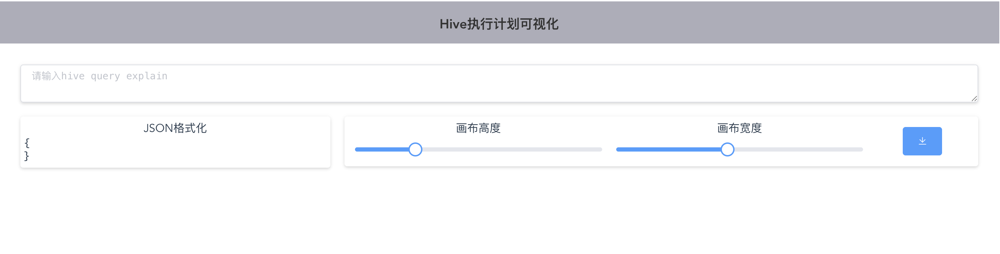
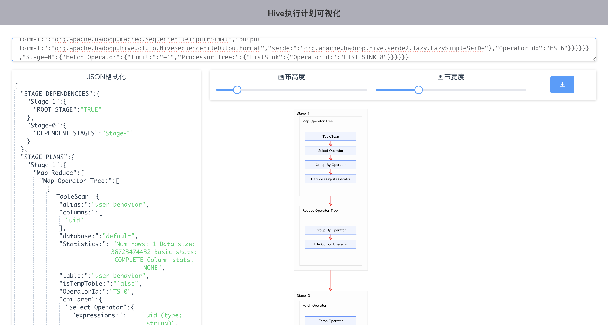

## 1. 环境搭建

### 1.1 安装 homebrew

使用 `brew -v` 检查是否安装了 homebrew 这个 macOS 软件包的管理器。如果安装，跳转到第 nvm 步骤：
```
smarsi:~ smartsi$ brew -v
Homebrew 4.6.3
```
这表示已经安装了 homebrew，否则执行如下语句安装：
```
/bin/zsh -c "$(curl -fsSL https://gitee.com/cunkai/HomebrewCN/raw/master/Homebrew.sh)"
```

## 1.2 安装 nvm

注意可视化工具需要 node 版本 <=14，使用 nvm 可以安装多个版本的 node，详细请参阅[实战 | Mac 如何使用 nvm 管理 node 版本](https://smartsi.blog.csdn.net/article/details/152375109)

## 2. 安装可视化工具

### 2.1 下载源码

下载源码并进入工作目录：
```
smarsi:Code smartsi$ git clone git@github.com:gitlbo/hive-query-plan-viz.git
smarsi:Code smartsi$ cd hive-query-plan-viz/
smarsi:hive-query-plan-viz smartsi$
smarsi:hive-query-plan-viz smartsi$ ls -al
total 2712
drwxr-xr-x@ 12 smartsi  staff      384 10  1 18:07 .
drwxr-xr-x  15 smartsi  staff      480 10  1 18:07 ..
drwxr-xr-x@ 12 smartsi  staff      384 10  1 18:07 .git
-rw-r--r--@  1 smartsi  staff      231 10  1 18:07 .gitignore
-rw-r--r--@  1 smartsi  staff    11558 10  1 18:07 LICENSE
-rw-r--r--@  1 smartsi  staff      522 10  1 18:07 README.md
-rw-r--r--@  1 smartsi  staff       73 10  1 18:07 babel.config.js
-rw-r--r--@  1 smartsi  staff   181072 10  1 18:07 img.png
-rw-r--r--@  1 smartsi  staff  1171762 10  1 18:07 package-lock.json
-rw-r--r--@  1 smartsi  staff      996 10  1 18:07 package.json
drwxr-xr-x@  4 smartsi  staff      128 10  1 18:07 public
drwxr-xr-x@ 10 smartsi  staff      320 10  1 18:07 src
```

### 2.2 安装依赖

使用 `npm install` 命令安装项目依赖的包:
```
smarsi:hive-query-plan-viz smartsi$ npm install
```

### 2.3 启动服务器调试

> npm run serve 主要用于启动开发服务器，提供实时调试环境，常见于 Vue CLI 项目

执行 `npm run serve` 命令启动服务器进行调试：
```
smarsi:hive-query-plan-viz smartsi$ npm run serve

> hive-query-plan-viz@0.1.0 serve /Users/smartsi/学习/Code/hive-query-plan-viz
> vue-cli-service serve

Browserslist: caniuse-lite is outdated. Please run:
  npx update-browserslist-db@latest
  Why you should do it regularly: https://github.com/browserslist/update-db#readme
 INFO  Starting development server...
10% building 0/1 modules 1 active ...48:8080&sockPath=/sockjs-node
...
DONE  Compiled successfully in 14342ms                                                                                                                 下午7:08:11


 App running at:
 - Local:   http://localhost:8080/
 - Network: http://192.168.1.48:8080/

 Note that the development build is not optimized.
 To create a production build, run npm run build.
```

在浏览器中访问 http://localhost:8080 即可调试阅览：



### 2.4 打包

执行 `npm run build` 命令进行打包：
```bash
smarsi:hive-query-plan-viz smartsi$ npm run build

> hive-query-plan-viz@0.1.0 build /Users/smartsi/学习/Code/hive-query-plan-viz
> vue-cli-service build

...
 DONE  Build complete. The dist directory is ready to be deployed.
 INFO  Check out deployment instructions at https://cli.vuejs.org/guide/deployment.html

smarsi:hive-query-plan-viz smartsi$
```

`npm run build` 打包后，项目文件通常生成在 `dist` 目录（Vue 项目默认生成 dist/ 文件夹，包含 index.html、样式文件、脚本文件等资源）。

### 2.5 预览

如果你有 Python 安装在你的系统上，可以使用如下命令来通过启动一个简单的 HTTP 服务器来访问：
```
python -m SimpleHTTPServer 8000
```
或者如果你有 Node.js 安装，可以使用 http-server 包来快速启动一个服务器来访问：
```bash
smarsi:hive-query-plan-viz smartsi$ npm install -g http-server
/Users/smartsi/.nvm/versions/node/v13.14.0/bin/http-server -> /Users/smartsi/.nvm/versions/node/v13.14.0/lib/node_modules/http-server/bin/http-server
+ http-server@14.1.1
added 48 packages from 42 contributors in 11.522s
```
进入到 dist 目录启动服务器：
```bash
smarsi:hive-query-plan-viz smartsi$ cd dist
smarsi:dist smartsi$
smarsi:dist smartsi$
smarsi:dist smartsi$ http-server -p 8000
Starting up http-server, serving ./

http-server version: 14.1.1

http-server settings:
CORS: disabled
Cache: 3600 seconds
Connection Timeout: 120 seconds
Directory Listings: visible
AutoIndex: visible
Serve GZIP Files: false
Serve Brotli Files: false
Default File Extension: none

Available on:
  http://127.0.0.1:8000
  http://192.168.1.48:8000
Hit CTRL-C to stop the server
```
在浏览器中访问 http://localhost:8000 即可：


## 3. 使用

使用如下命令获取格式化后的执行计划（json格式），放入输入框，即可得到执行计划图：
```
explain formatted <sql>
```
我们使用一个 COUNT DISTINCT 语句示例来查看执行计划图，首先来查看执行计划：
```sql
EXPLAIN FORMATTED
SELECT COUNT(DISTINCT uid) AS num
FROM user_behavior;
```
执行计划如下所示：
```json
{
  "STAGE DEPENDENCIES": {
    "Stage-1": {
      "ROOT STAGE": "TRUE"
    },
    "Stage-0": {
      "DEPENDENT STAGES": "Stage-1"
    }
  },
  "STAGE PLANS": {
    "Stage-1": {
      "Map Reduce": {
        "Map Operator Tree:": [
          {
            "TableScan": {
              "alias:": "user_behavior",
              "columns:": [
                "uid"
              ],
              "database:": "default",
              "Statistics:": "Num rows: 1 Data size: 36723474432 Basic stats: COMPLETE Column stats: NONE",
              "table:": "user_behavior",
              "isTempTable:": "false",
              "OperatorId:": "TS_0",
              "children": {
                "Select Operator": {
                  "expressions:": "uid (type: string)",
                  "columnExprMap:": {
                    "BLOCK__OFFSET__INSIDE__FILE": "BLOCK__OFFSET__INSIDE__FILE",
                    "INPUT__FILE__NAME": "INPUT__FILE__NAME",
                    "ROW__ID": "ROW__ID",
                    "behavior": "behavior",
                    "cid": "cid",
                    "pid": "pid",
                    "ts": "ts",
                    "uid": "uid"
                  },
                  "outputColumnNames:": [
                    "uid"
                  ],
                  "Statistics:": "Num rows: 1 Data size: 36723474432 Basic stats: COMPLETE Column stats: NONE",
                  "OperatorId:": "SEL_1",
                  "children": {
                    "Group By Operator": {
                      "aggregations:": [
                        "count(DISTINCT uid)"
                      ],
                      "columnExprMap:": {
                        "_col0": "uid"
                      },
                      "keys:": "uid (type: string)",
                      "mode:": "hash",
                      "outputColumnNames:": [
                        "_col0",
                        "_col1"
                      ],
                      "Statistics:": "Num rows: 1 Data size: 36723474432 Basic stats: COMPLETE Column stats: NONE",
                      "OperatorId:": "GBY_2",
                      "children": {
                        "Reduce Output Operator": {
                          "columnExprMap:": {
                            "KEY._col0:0._col0": "_col0"
                          },
                          "key expressions:": "_col0 (type: string)",
                          "sort order:": "+",
                          "Statistics:": "Num rows: 1 Data size: 36723474432 Basic stats: COMPLETE Column stats: NONE",
                          "OperatorId:": "RS_3"
                        }
                      }
                    }
                  }
                }
              }
            }
          }
        ],
        "Reduce Operator Tree:": {
          "Group By Operator": {
            "aggregations:": [
              "count(DISTINCT KEY._col0:0._col0)"
            ],
            "mode:": "mergepartial",
            "outputColumnNames:": [
              "_col0"
            ],
            "Statistics:": "Num rows: 1 Data size: 16 Basic stats: COMPLETE Column stats: NONE",
            "OperatorId:": "GBY_4",
            "children": {
              "File Output Operator": {
                "compressed:": "false",
                "Statistics:": "Num rows: 1 Data size: 16 Basic stats: COMPLETE Column stats: NONE",
                "table:": {
                  "input format:": "org.apache.hadoop.mapred.SequenceFileInputFormat",
                  "output format:": "org.apache.hadoop.hive.ql.io.HiveSequenceFileOutputFormat",
                  "serde:": "org.apache.hadoop.hive.serde2.lazy.LazySimpleSerDe"
                },
                "OperatorId:": "FS_6"
              }
            }
          }
        }
      }
    },
    "Stage-0": {
      "Fetch Operator": {
        "limit:": "-1",
        "Processor Tree:": {
          "ListSink": {
            "OperatorId:": "LIST_SINK_8"
          }
        }
      }
    }
  }
}
```
放入输入框，即可得到执行计划图：


