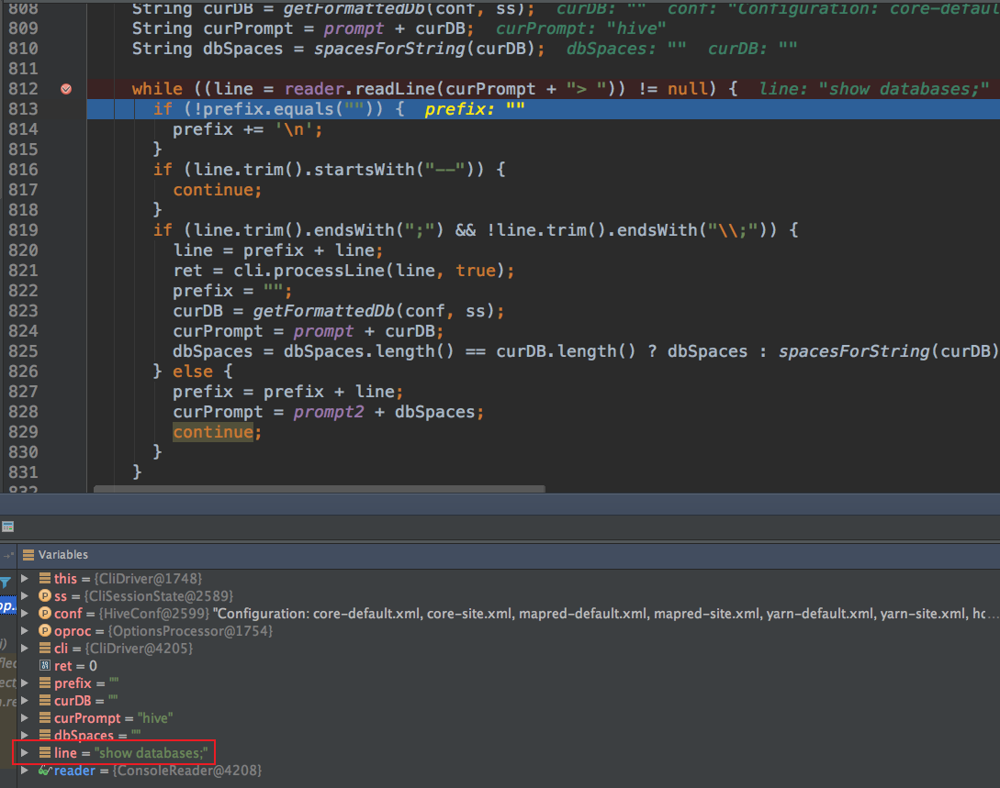

使用 Hive 执行 HQL 查询时遇到 bug，解决办法无非几种，explain HQL、查看日志、远程 Debug，本文就将详细讲解如何使用 Idea 远程 Debug。

## 1. Debug 环境准备

下载 Hive 源码包，自行编译一下，建议在 Linux 环境下编译，然后将整个编译好的包全部拷贝到 IDEA 工作目录中并使用 IDEA 打开。本文是以 Hive 2.3.4 版本作为讲解。克隆到本地后切换到 2.3.4 版本：
```
git checkout release-2.3.4 rel/release-2.3.4
```
本地需要先编译一下整个工程，因为有些代码是用 Antlr 自动生成的，编译之后，会产生对应的类。可以使用如下语句进行编译：
```
mvn clean package -Pdist -DskipTests -Dmaven.javadoc.skip=true
```
如果编译过程中出现 `Failed to read artifact descriptor for org.apache.directory.client.ldap:ldap-client-api:jar:0.1-SNAPSHOT` 错误，可以查阅博文 [Hive 3.1.3 编译出错 ldap-client-api:jar:0.1-SNAPSHOT 获取不到](https://smartsi.blog.csdn.net/article/details/128366027) 解决。如果编译结束之后出现如下信息，表示你的编译成功了：


编译完之后，在 packaging 包中会生成一个二进制包，这个包可以在服务器上运行的：


然后使用这个二进制包进行 Hive 环境的搭建，具体可以查阅 [Hive 安装与配置](https://smartsi.blog.csdn.net/article/details/126198200)。

## 2. 调试

首先在 Hive CLI 模式下执行 `hive --debug`：


接下来，把源码导入 Idea 中，等待 Idea 完成。然后再 Idea 中创建一个远程 Debug 的配置。输入上边 Hive 客户端 IP 和端口：


配置好后点击 Debug 按钮进行调试，并在 CliDriver 类的 run 方法中随意打上断点：


追踪到后面的源码，可以发现一直在等待用户的输入，每次输入之后，都会调用 processLine 方法处理：
```java
while ((line = reader.readLine(curPrompt + "> ")) != null) {
  if (!prefix.equals("")) {
    prefix += '\n';
  }
  if (line.trim().startsWith("--")) {
    continue;
  }
  if (line.trim().endsWith(";") && !line.trim().endsWith("\\;")) {
    line = prefix + line;
    // 执行 HQL
    ret = cli.processLine(line, true);
    prefix = "";
    curDB = getFormattedDb(conf, ss);
    curPrompt = prompt + curDB;
    dbSpaces = dbSpaces.length() == curDB.length() ? dbSpaces : spacesForString(curDB);
  } else {
    prefix = prefix + line;
    curPrompt = prompt2 + dbSpaces;
    continue;
  }
}
```
例如在 Hive CLI 执行 `show databases`：


