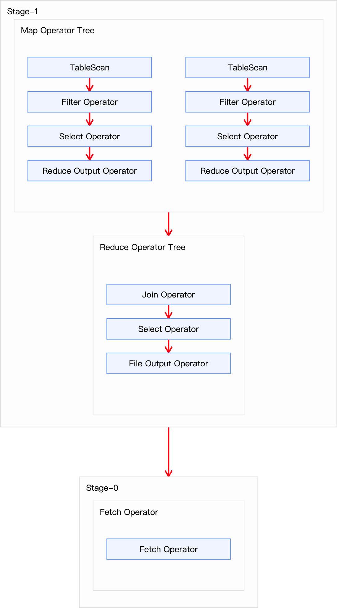
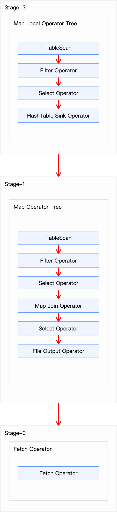

## 1. Bucket Map Join

### 1.1 原理

Bucket Map Join 是 Map Join 的一种扩展，打破了 Map Join 只适用于大表 Join 小表的限制，可用于大表 Join 大表(或者小表不够小，无法完全装入单个 Mapper 节点的内存)的场景。使用该 Join 策略要求参与 Join 的两个表均为分桶表，都根据 Join Key 进行分桶(CLUSTERED BY)，以及两表的桶数量相同或成倍数关系。
- 分桶对齐：两个表的分桶机制确保了相同 Join Key 的记录必然落在相同编号的桶中(或具有映射关系的桶中)。
- Mapper 处理对应桶：每个 Mapper 只处理两个表中相同桶编号(或具有映射关系的桶)的数据(例如，Mapper 1 只读 Table A 的 Bucket 1 和 Table B 的 Bucket 1)。
- 内存哈希表(桶级别)：Mapper 将小表对应桶的数据加载到内存中构建哈希表。无需再缓存小表的全表数据额，只需要缓存其分桶中的数据即可。
- Join 执行：使用大表(同一桶内)的记录去探测内存中的哈希表完成 Join。结果直接在 Mapper 输出。

### 1.2 优点

- 打破了 Map Join 的局限性，可处理更大的"小表"：因为每个 Mapper 只需要加载小表的一个桶(或多个有映射关系的桶)，而非整个小表。
- 避免全局 Shuffle：只需要在 Mapper 内处理对应桶的数据，无需跨节点传输。
- 高效利用分桶特性。

### 1.3 缺点

- 严格依赖分桶：两个表必须在 Join Key 上预先进行分桶，且桶数量满足条件(相同或成倍数)。
- 桶内数据仍需能装入内存：如果某个桶的数据量很大，该 Mapper 仍可能 OOM。

## 2. 触发条件

Bucket Map Join 不支持自动转换，必须通过用户在 SQL 语句中提供如下 Hint 提示，并配置相关参数，方可使用：
```sql
SELECT
    /*+ MAPJOIN(ta) */
    ta.id,
    tb.id
FROM table_a AS ta
JOIN table_b AS tb
ON ta.id=tb.id;
```

关键参数说明：
- `hive.ignore.mapjoin.hint`：必须设为 false。MapJoin hint 默认会被忽略(因为已经过时)，需将参数设置为 false。
- `hive.cbo.enable`：必须设为 false。关闭 CBO 优化，CBO 会导致 hint 信息被忽略。
- `hive.optimize.bucketmapjoin`：必须设为 true。启用 Bucket Map Join 优化功能。
- `hive.enforce.bucketmapjoin`：是否强制检查分桶条件 (有时 CBO 足够智能可省略)。
- `hive.auto.convert.join.noconditionaltask.size`：仍需满足，但评估的是小表的单个桶而非整表小。

此外关于分桶表的一些限制：
- 两表必须分桶 (CLUSTERED BY) Join Key。
- 桶数量：小表桶数 = 大表桶数 * 整数倍 (N)。大表每个桶会被对应的小表 N 个桶 Join。
- Join Key = 分桶 Key。

## 3. 优化案例

### 3.1 优化前

下面我们以订单表关联支付表为例演示 Bucket Map Join 如何优化查询：
```sql
SELECT o.order_id, o.user_id, p.payment_time, p.payment_amount
FROM (
  SELECT id AS order_id, user_id
  FROM tb_order WHERE dt = '2020-06-14'
) AS o
JOIN (
  SELECT order_id, payment_time, total_amount AS payment_amount
  FROM tb_payment
  WHERE dt = '2020-06-14'
) AS p
ON o.order_id = p.order_id;
```
上述 SQL 语句共有两张表一次 Join 操作，故优化前的执行计划应包含一个 Common Join 任务，通过一个 MapReduce Job 实现。

> hive.auto.convert.join 默认为 true，自动开启转 MapJoin

通过 `EXPLAIN xxx` 命令查询该语句的执行计划如下所示：
```
STAGE DEPENDENCIES:
  Stage-1 is a root stage
  Stage-0 depends on stages: Stage-1

STAGE PLANS:
  Stage: Stage-1
    Map Reduce
      Map Operator Tree:
          TableScan
            alias: tb_order
            Statistics: Num rows: 20000000 Data size: 1136009934 Basic stats: COMPLETE Column stats: NONE
            Filter Operator
              predicate: id is not null (type: boolean)
              Statistics: Num rows: 20000000 Data size: 1136009934 Basic stats: COMPLETE Column stats: NONE
              Select Operator
                expressions: id (type: string), user_id (type: string)
                outputColumnNames: _col0, _col1
                Statistics: Num rows: 20000000 Data size: 1136009934 Basic stats: COMPLETE Column stats: NONE
                Reduce Output Operator
                  key expressions: _col0 (type: string)
                  sort order: +
                  Map-reduce partition columns: _col0 (type: string)
                  Statistics: Num rows: 20000000 Data size: 1136009934 Basic stats: COMPLETE Column stats: NONE
                  value expressions: _col1 (type: string)
          TableScan
            alias: tb_payment
            Statistics: Num rows: 6000000 Data size: 322198480 Basic stats: COMPLETE Column stats: NONE
            Filter Operator
              predicate: order_id is not null (type: boolean)
              Statistics: Num rows: 6000000 Data size: 322198480 Basic stats: COMPLETE Column stats: NONE
              Select Operator
                expressions: order_id (type: string), payment_time (type: string), total_amount (type: decimal(16,2))
                outputColumnNames: _col0, _col1, _col2
                Statistics: Num rows: 6000000 Data size: 322198480 Basic stats: COMPLETE Column stats: NONE
                Reduce Output Operator
                  key expressions: _col0 (type: string)
                  sort order: +
                  Map-reduce partition columns: _col0 (type: string)
                  Statistics: Num rows: 6000000 Data size: 322198480 Basic stats: COMPLETE Column stats: NONE
                  value expressions: _col1 (type: string), _col2 (type: decimal(16,2))
      Reduce Operator Tree:
        Join Operator
          condition map:
               Inner Join 0 to 1
          keys:
            0 _col0 (type: string)
            1 _col0 (type: string)
          outputColumnNames: _col0, _col1, _col3, _col4
          Statistics: Num rows: 22000000 Data size: 1249610954 Basic stats: COMPLETE Column stats: NONE
          Select Operator
            expressions: _col0 (type: string), _col1 (type: string), _col3 (type: string), _col4 (type: decimal(16,2))
            outputColumnNames: _col0, _col1, _col2, _col3
            Statistics: Num rows: 22000000 Data size: 1249610954 Basic stats: COMPLETE Column stats: NONE
            File Output Operator
              compressed: false
              Statistics: Num rows: 22000000 Data size: 1249610954 Basic stats: COMPLETE Column stats: NONE
              table:
                  input format: org.apache.hadoop.mapred.SequenceFileInputFormat
                  output format: org.apache.hadoop.hive.ql.io.HiveSequenceFileOutputFormat
                  serde: org.apache.hadoop.hive.serde2.lazy.LazySimpleSerDe

  Stage: Stage-0
    Fetch Operator
      limit: -1
      Processor Tree:
        ListSink
```

从上面信息可以知道，该查询涉及 `Stage-0` 和 `Stage-1` 2个执行阶段。`Stage-1` 是根阶段（root stage），即最开始执行的阶段。在这 `Stage-1` 通过一个 MapReduce 作业来完成（包含 Map 和 Reduce）；`Stage-0` 依赖于 `Stage-1`，需要在 `Stage-1` 完成后才能执行。`Stage-0` 是一个 Fetch 作业，负责将结果返回给客户端。

> `Stage-1` 是核心阶段。



`Stage-1` 是一个执行 Common Join 的 MapReduce 作业：
- Map 端操作:
  - 表 tb_order 处理
    - 表扫描（TableScan）
      - 表 tb_order 是个大表（2000w行）
    - 过滤操作（Filter Operator）
      - 过滤掉 id 为 NULL 的记录(Join Key)
    - 选择操作（Select Operator）
      - 选择 id 和 user_id 两列
    - 输出重命名为：`_col0`、`_col1`
    - Reduce 输出操作（Reduce Output Operator）
      - 按 id 进行分区和排序
  - 表 tb_payment 处理
    - 表扫描（TableScan）
      - 表 tb_payment 是个中表（600w行）
    - 过滤操作（Filter Operator）
      - 过滤 order_id 为 NULL 的记录(Join Key)
    - 选择操作（Select Operator）
      - 选择 order_id、payment_time、total_amount 3个字段
    - 输出重命名为：`_col0`、`_col1`、`_col2`
    - Reduce 输出操作（Reduce Output Operator）
      - 按 order_id 进行分区和排序
- Reduce 端操作:
  - JOIN 操作（Join Operator）：
    - Join 类型：Inner Join
    - Join 策略：Common Join
    - Join 键：`_col0`（tb_order.id = tb_payment.order_id）
    - 输出列：`_col0`(order_id), `_col1`(user_id), `_col3`(payment_time), `_col4`(total_amount)


### 3.2 优化后

通过 `DESC FORMATTED xxx;` 命令可以探查参与 Join 的两张表数据量如下：

| 表名 | 大小 |
| :------------- | :------------- |
| tb_order | 1136009934（约1122M） |
| tb_payment	| 334198480（约319M）|

两张表都相对较大，若采用普通的 Map Join 算法，则 Map 端需要较多的内存来缓存数据，当然可以选择为 Map 段分配更多的内存，来保证任务运行成功。但是，Map 端的内存不可能无上限的分配，所以当参与 Join 的表数据量均过大时，就可以考虑采用 Bucket Map Join 算法。下面演示如何使用 Bucket Map Join。

#### 3.2.1 创建分桶表

首先需要依据源表创建两个分桶表，tb_order 建议分 16 个 bucket，tb_payment 建议分 8 个 bucket：
```sql
-- 订单表
CREATE TABLE tb_order_bucket (
    id           string comment '订单id',
    user_id      string comment '用户id',
    product_id   string comment '商品id',
    province_id  string comment '省份id',
    create_time  string comment '下单时间',
    product_num  int comment '商品件数',
    total_amount decimal(16, 2) comment '下单金额'
)
PARTITIONED BY (dt string)
CLUSTERED BY (id) INTO 16 buckets
ROW FORMAT DELIMITED
FIELDS TERMINATED BY ','
LINES TERMINATED BY '\n';

-- 支付表
CREATE TABLE tb_payment_bucket(
    id              string comment '支付id',
    order_id        string comment '订单id',
    user_id         string comment '用户id',
    payment_time    string comment '支付时间',
    total_amount    decimal(16, 2) comment '支付金额'
)
PARTITIONED BY (dt string)
CLUSTERED BY (order_id) into 8 buckets
ROW FORMAT DELIMITED
FIELDS TERMINATED BY ','
LINES TERMINATED BY '\n';
```
> 注意分桶个数的倍数关系以及分桶字段。

然后向两个分桶表导入数据：
```sql
-- 订单表
INSERT OVERWRITE TABLE tb_order_bucket PARTITION(dt='2020-06-14')
SELECT
    id,
    user_id,
    product_id,
    province_id,
    create_time,
    product_num,
    total_amount   
FROM tb_order
WHERE dt = '2020-06-14';

-- 支付表
INSERT OVERWRITE TABLE tb_payment_bucket PARTITION(dt='2020-06-14')
SELECT
    id,
    order_id,
    user_id,
    payment_time,
    total_amount
FROM tb_payment
WHERE dt='2020-06-14';
```
#### 3.2.2 参数优化

然后设置以下参数：
```sql
--关闭cbo优化，cbo会导致hint信息被忽略，需将如下参数修改为false
set hive.cbo.enable=false;
--map join hint默认会被忽略(因为已经过时)，需将如下参数修改为false
set hive.ignore.mapjoin.hint=false;
--启用 bucket map join 优化功能,默认不启用，需将如下参数修改为true
set hive.optimize.bucketmapjoin = true;

```
#### 3.2.3 执行计划

```sql
SELECT
  /*+ MAPJOIN(p) */
  o.order_id, o.user_id, p.payment_time, p.payment_amount
FROM (
  SELECT id AS order_id, user_id
  FROM tb_order_bucket
  WHERE dt = '2020-06-14'
) AS o
JOIN (
  SELECT order_id, payment_time, total_amount AS payment_amount
  FROM tb_payment_bucket
  WHERE dt = '2020-06-14'
) AS p
ON o.order_id = p.order_id;
```

优化后的执行计划如下所示:
```
STAGE DEPENDENCIES:
  Stage-3 is a root stage
  Stage-1 depends on stages: Stage-3
  Stage-0 depends on stages: Stage-1

STAGE PLANS:
  Stage: Stage-3
    Map Reduce Local Work
      Alias -> Map Local Tables:
        p:tb_payment_bucket
          Fetch Operator
            limit: -1
      Alias -> Map Local Operator Tree:
        p:tb_payment_bucket
          TableScan
            alias: tb_payment_bucket
            Statistics: Num rows: 6000000 Data size: 394198480 Basic stats: COMPLETE Column stats: NONE
            Filter Operator
              predicate: order_id is not null (type: boolean)
              Statistics: Num rows: 6000000 Data size: 394198480 Basic stats: COMPLETE Column stats: NONE
              Select Operator
                expressions: order_id (type: string), payment_time (type: string), total_amount (type: decimal(16,2))
                outputColumnNames: _col0, _col1, _col2
                Statistics: Num rows: 6000000 Data size: 394198480 Basic stats: COMPLETE Column stats: NONE
                HashTable Sink Operator
                  keys:
                    0 _col0 (type: string)
                    1 _col0 (type: string)

  Stage: Stage-1
    Map Reduce
      Map Operator Tree:
          TableScan
            alias: tb_order_bucket
            Statistics: Num rows: 20000000 Data size: 1496009934 Basic stats: COMPLETE Column stats: NONE
            Filter Operator
              predicate: id is not null (type: boolean)
              Statistics: Num rows: 20000000 Data size: 1496009934 Basic stats: COMPLETE Column stats: NONE
              Select Operator
                expressions: id (type: string), user_id (type: string)
                outputColumnNames: _col0, _col1
                Statistics: Num rows: 20000000 Data size: 1496009934 Basic stats: COMPLETE Column stats: NONE
                Map Join Operator
                  condition map:
                       Inner Join 0 to 1
                  keys:
                    0 _col0 (type: string)
                    1 _col0 (type: string)
                  outputColumnNames: _col0, _col1, _col3, _col4
                  Statistics: Num rows: 22000000 Data size: 1645610963 Basic stats: COMPLETE Column stats: NONE
                  Select Operator
                    expressions: _col0 (type: string), _col1 (type: string), _col3 (type: string), _col4 (type: decimal(16,2))
                    outputColumnNames: _col0, _col1, _col2, _col3
                    Statistics: Num rows: 22000000 Data size: 1645610963 Basic stats: COMPLETE Column stats: NONE
                    File Output Operator
                      compressed: false
                      Statistics: Num rows: 22000000 Data size: 1645610963 Basic stats: COMPLETE Column stats: NONE
                      table:
                          input format: org.apache.hadoop.mapred.SequenceFileInputFormat
                          output format: org.apache.hadoop.hive.ql.io.HiveSequenceFileOutputFormat
                          serde: org.apache.hadoop.hive.serde2.lazy.LazySimpleSerDe
      Execution mode: vectorized
      Local Work:
        Map Reduce Local Work

  Stage: Stage-0
    Fetch Operator
      limit: -1
      Processor Tree:
        ListSink
```

从上面信息可以知道，该查询涉及 `Stage-0`、`Stage-1` 以及 `Stage-3` 3个执行阶段。`Stage-3` 是根阶段（root stage），即最开始执行的阶段。在这 `Stage-3` 是 Map 端本地工作阶段；`Stage-1` 依赖于 `Stage-3`，需要在 `Stage-3` 完成后才能执行。在这 `Stage-1` 是一个 Map Reduce 阶段(只有 Map)。`Stage-0` 是一个 Fetch 作业，负责将结果返回给客户端。



- `Stage-3`：Map 端本地工作阶段，核心完成表 tb_payment_bucket 表的处理构建哈希表
  - 表扫描（TableScan）：
    - 扫描 tb_payment_bucket 表(600w行)
  - 过滤操作（Filter Operator）：
    - 过滤掉 order_id 为 NULL 的记录(Join Key)
  - 选择操作（Select Operator）：
    - 选择 order_id、payment_time、total_amount 3个字段
  - 输出重命名为：`_col0`、`_col1`、`_col2`
  - 哈希表下沉操作（HashTable Sink Operator）：
    - 关键步骤：为Map Join构建哈希表
    - Join键：`_col0`（即 order_id）
    - 这个阶段的结果将缓存在内存中供 Stage-1 使用
- `Stage-1`：Map Reduce 阶段，在这上只有 Map
  - 表扫描（TableScan）：
    - 扫描 tb_order_bucket 表（2000w行）
  - 过滤操作（Filter Operator）：
    - 过滤掉 id 为 NULL 的记录(Join Key)
  - 选择操作（Select Operator）：
    - 选择 id、user_id 2个字段
  - MapJoin 操作（Map Join Operator）：
    - Join 类型：Inner Join
    - Join 策略：Bucket Map Join
    - Join 键：`_col0`（tb_order_bucket.id = tb_payment_bucket.order_id）
    - 输出列：`_col0`(order_id), `_col1`(user_id), `_col3`(payment_time), `_col4`(total_amount)


需要注意的是，Bucket Map Join 的执行计划的基本信息和普通的 Map Join 无异，若想看到差异，可执行如下语句，查看执行计划的详细信息：
```sql
EXPLAIN EXTENDED
SELECT
  /*+ MAPJOIN(p) */
  o.order_id, o.user_id, p.payment_time, p.payment_amount
FROM (
  SELECT id AS order_id, user_id
  FROM tb_order_bucket
  WHERE dt = '2020-06-14'
) AS o
JOIN (
  SELECT order_id, payment_time, total_amount AS payment_amount
  FROM tb_payment_bucket
  WHERE dt = '2020-06-14'
) AS p
ON o.order_id = p.order_id;
```
详细执行计划中，如在 Map Join Operator 中看到 `BucketMapJoin: true` 则表明使用的是 Bucket Map Join：
```
STAGE DEPENDENCIES:
  Stage-3 is a root stage
  Stage-1 depends on stages: Stage-3
  Stage-0 depends on stages: Stage-1

STAGE PLANS:
  Stage: Stage-3
    Map Reduce Local Work
      Alias -> Map Local Tables:
        p:tb_payment_bucket
          Fetch Operator
            limit: -1
            Partition Description:
                Partition
                  input format: org.apache.hadoop.mapred.TextInputFormat
                  output format: org.apache.hadoop.hive.ql.io.HiveIgnoreKeyTextOutputFormat
                  partition values:
                    dt 2020-06-14
                  properties:
                    COLUMN_STATS_ACCURATE {"BASIC_STATS":"true","COLUMN_STATS":{"id":"true","order_id":"true","payment_time":"true","total_amount":"true","user_id":"true"}}
                    bucket_count 8
                    bucket_field_name order_id
                    column.name.delimiter ,
                    columns id,order_id,user_id,payment_time,total_amount
                    columns.comments '??id','??id','??id','????','????'
                    columns.types string:string:string:string:decimal(16,2)
                    field.delim ,
                    file.inputformat org.apache.hadoop.mapred.TextInputFormat
                    file.outputformat org.apache.hadoop.hive.ql.io.HiveIgnoreKeyTextOutputFormat
                    line.delim

                    location hdfs://localhost:9000/user/hive/warehouse/tb_payment_bucket/dt=2020-06-14
                    name default.tb_payment_bucket
                    numFiles 8
                    numRows 6000000
                    partition_columns dt
                    partition_columns.types string
                    rawDataSize 394198480
                    serialization.ddl struct tb_payment_bucket { string id, string order_id, string user_id, string payment_time, decimal(16,2) total_amount}
                    serialization.format ,
                    serialization.lib org.apache.hadoop.hive.serde2.lazy.LazySimpleSerDe
                    totalSize 400198480
                    transient_lastDdlTime 1759492183
                  serde: org.apache.hadoop.hive.serde2.lazy.LazySimpleSerDe

                    input format: org.apache.hadoop.mapred.TextInputFormat
                    output format: org.apache.hadoop.hive.ql.io.HiveIgnoreKeyTextOutputFormat
                    properties:
                      bucket_count 8
                      bucket_field_name order_id
                      bucketing_version 2
                      column.name.delimiter ,
                      columns id,order_id,user_id,payment_time,total_amount
                      columns.comments '??id','??id','??id','????','????'
                      columns.types string:string:string:string:decimal(16,2)
                      field.delim ,
                      file.inputformat org.apache.hadoop.mapred.TextInputFormat
                      file.outputformat org.apache.hadoop.hive.ql.io.HiveIgnoreKeyTextOutputFormat
                      line.delim

                      location hdfs://localhost:9000/user/hive/warehouse/tb_payment_bucket
                      name default.tb_payment_bucket
                      partition_columns dt
                      partition_columns.types string
                      serialization.ddl struct tb_payment_bucket { string id, string order_id, string user_id, string payment_time, decimal(16,2) total_amount}
                      serialization.format ,
                      serialization.lib org.apache.hadoop.hive.serde2.lazy.LazySimpleSerDe
                      transient_lastDdlTime 1759491882
                    serde: org.apache.hadoop.hive.serde2.lazy.LazySimpleSerDe
                    name: default.tb_payment_bucket
                  name: default.tb_payment_bucket
      Alias -> Map Local Operator Tree:
        p:tb_payment_bucket
          TableScan
            alias: tb_payment_bucket
            Statistics: Num rows: 6000000 Data size: 394198480 Basic stats: COMPLETE Column stats: NONE
            GatherStats: false
            Filter Operator
              isSamplingPred: false
              predicate: order_id is not null (type: boolean)
              Statistics: Num rows: 6000000 Data size: 394198480 Basic stats: COMPLETE Column stats: NONE
              Select Operator
                expressions: order_id (type: string), payment_time (type: string), total_amount (type: decimal(16,2))
                outputColumnNames: _col0, _col1, _col2
                Statistics: Num rows: 6000000 Data size: 394198480 Basic stats: COMPLETE Column stats: NONE
                HashTable Sink Operator
                  keys:
                    0 _col0 (type: string)
                    1 _col0 (type: string)
                  Position of Big Table: 0
      Bucket Mapjoin Context:
          Alias Bucket Base File Name Mapping:
            p:tb_payment_bucket {dt=2020-06-14/000000_0=[dt=2020-06-14/000000_0], ...
          Alias Bucket File Name Mapping:
            p:tb_payment_bucket {hdfs://localhost:9000/user/hive/warehouse/tb_order_bucket/dt=2020-06-14/000000_0=[hdfs://localhost:9000/user/hive/warehouse/tb_payment_bucket/dt=2020-06-14/000000_0], ...
          Alias Bucket Output File Name Mapping:
            hdfs://localhost:9000/user/hive/warehouse/tb_order_bucket/dt=2020-06-14/000000_0 0
            ...

  Stage: Stage-1
    Map Reduce
      Map Operator Tree:
          TableScan
            alias: tb_order_bucket
            Statistics: Num rows: 20000000 Data size: 1496009934 Basic stats: COMPLETE Column stats: NONE
            GatherStats: false
            Filter Operator
              isSamplingPred: false
              predicate: id is not null (type: boolean)
              Statistics: Num rows: 20000000 Data size: 1496009934 Basic stats: COMPLETE Column stats: NONE
              Select Operator
                expressions: id (type: string), user_id (type: string)
                outputColumnNames: _col0, _col1
                Statistics: Num rows: 20000000 Data size: 1496009934 Basic stats: COMPLETE Column stats: NONE
                Map Join Operator
                  condition map:
                       Inner Join 0 to 1
                  keys:
                    0 _col0 (type: string)
                    1 _col0 (type: string)
                  outputColumnNames: _col0, _col1, _col3, _col4
                  Position of Big Table: 0
                  Statistics: Num rows: 22000000 Data size: 1645610963 Basic stats: COMPLETE Column stats: NONE
                  BucketMapJoin: true
                  Select Operator
                    expressions: _col0 (type: string), _col1 (type: string), _col3 (type: string), _col4 (type: decimal(16,2))
                    outputColumnNames: _col0, _col1, _col2, _col3
                    Statistics: Num rows: 22000000 Data size: 1645610963 Basic stats: COMPLETE Column stats: NONE
                    File Output Operator
                      compressed: false
                      GlobalTableId: 0
                      directory: hdfs://localhost:9000/tmp/hive/smartsi/dabceee0-9b03-4ed6-a9b0-b0c14001f7c3/hive_2025-10-03_20-46-06_186_7533190546039353785-1/-mr-10000/.hive-staging_hive_2025-10-03_20-46-06_186_7533190546039353785-1/-ext-10001
                      NumFilesPerFileSink: 1
                      Statistics: Num rows: 22000000 Data size: 1645610963 Basic stats: COMPLETE Column stats: NONE
                      Stats Publishing Key Prefix: hdfs://localhost:9000/tmp/hive/smartsi/dabceee0-9b03-4ed6-a9b0-b0c14001f7c3/hive_2025-10-03_20-46-06_186_7533190546039353785-1/-mr-10000/.hive-staging_hive_2025-10-03_20-46-06_186_7533190546039353785-1/-ext-10001/
                      table:
                          input format: org.apache.hadoop.mapred.SequenceFileInputFormat
                          output format: org.apache.hadoop.hive.ql.io.HiveSequenceFileOutputFormat
                          properties:
                            columns _col0,_col1,_col2,_col3
                            columns.types string:string:string:decimal(16,2)
                            escape.delim \
                            hive.serialization.extend.additional.nesting.levels true
                            serialization.escape.crlf true
                            serialization.format 1
                            serialization.lib org.apache.hadoop.hive.serde2.lazy.LazySimpleSerDe
                          serde: org.apache.hadoop.hive.serde2.lazy.LazySimpleSerDe
                      TotalFiles: 1
                      GatherStats: false
                      MultiFileSpray: false
      Execution mode: vectorized
      Local Work:
        Map Reduce Local Work
      Path -> Alias:
        hdfs://localhost:9000/user/hive/warehouse/tb_order_bucket/dt=2020-06-14 [o:tb_order_bucket]
      Path -> Partition:
        hdfs://localhost:9000/user/hive/warehouse/tb_order_bucket/dt=2020-06-14
          Partition
            base file name: dt=2020-06-14
            input format: org.apache.hadoop.mapred.TextInputFormat
            output format: org.apache.hadoop.hive.ql.io.HiveIgnoreKeyTextOutputFormat
            partition values:
              dt 2020-06-14
            properties:
              COLUMN_STATS_ACCURATE {"BASIC_STATS":"true","COLUMN_STATS":{"create_time":"true","id":"true","product_id":"true","product_num":"true","province_id":"true","total_amount":"true","user_id":"true"}}
              bucket_count 16
              bucket_field_name id
              column.name.delimiter ,
              columns id,user_id,product_id,province_id,create_time,product_num,total_amount
              columns.comments '??id','??id','??id','??id','????','????','????'
              columns.types string:string:string:string:string:int:decimal(16,2)
              field.delim ,
              file.inputformat org.apache.hadoop.mapred.TextInputFormat
              file.outputformat org.apache.hadoop.hive.ql.io.HiveIgnoreKeyTextOutputFormat
              line.delim

              location hdfs://localhost:9000/user/hive/warehouse/tb_order_bucket/dt=2020-06-14
              name default.tb_order_bucket
              numFiles 16
              numRows 20000000
              partition_columns dt
              partition_columns.types string
              rawDataSize 1496009934
              serialization.ddl struct tb_order_bucket { string id, string user_id, string product_id, string province_id, string create_time, i32 product_num, decimal(16,2) total_amount}
              serialization.format ,
              serialization.lib org.apache.hadoop.hive.serde2.lazy.LazySimpleSerDe
              totalSize 1516009934
              transient_lastDdlTime 1759492082
            serde: org.apache.hadoop.hive.serde2.lazy.LazySimpleSerDe

              input format: org.apache.hadoop.mapred.TextInputFormat
              output format: org.apache.hadoop.hive.ql.io.HiveIgnoreKeyTextOutputFormat
              properties:
                bucket_count 16
                bucket_field_name id
                bucketing_version 2
                column.name.delimiter ,
                columns id,user_id,product_id,province_id,create_time,product_num,total_amount
                columns.comments '??id','??id','??id','??id','????','????','????'
                columns.types string:string:string:string:string:int:decimal(16,2)
                field.delim ,
                file.inputformat org.apache.hadoop.mapred.TextInputFormat
                file.outputformat org.apache.hadoop.hive.ql.io.HiveIgnoreKeyTextOutputFormat
                line.delim

                location hdfs://localhost:9000/user/hive/warehouse/tb_order_bucket
                name default.tb_order_bucket
                partition_columns dt
                partition_columns.types string
                serialization.ddl struct tb_order_bucket { string id, string user_id, string product_id, string province_id, string create_time, i32 product_num, decimal(16,2) total_amount}
                serialization.format ,
                serialization.lib org.apache.hadoop.hive.serde2.lazy.LazySimpleSerDe
                transient_lastDdlTime 1759485269
              serde: org.apache.hadoop.hive.serde2.lazy.LazySimpleSerDe
              name: default.tb_order_bucket
            name: default.tb_order_bucket
      Truncated Path -> Alias:
        /tb_order_bucket/dt=2020-06-14 [o:tb_order_bucket]

  Stage: Stage-0
    Fetch Operator
      limit: -1
      Processor Tree:
        ListSink
```
