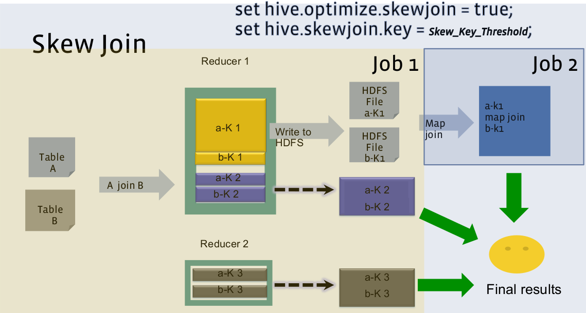

## 1. Skew Join

Skew Join 可以解决这个问题。在运行时，它会扫描数据并检测具有较大倾斜的 key，Hive 在运行时是没有办法判断哪个 key 会产生多大的倾斜，所以使用参数 `hive.skewjoin.key` 来控制倾斜的阈值。不是处理这些 key，而是将它们临时存储在一个 HDFS 目录中。后面会启动一个新的 MapReduce 作业来处理那些倾斜的 key。对于所有表来说，相同的 key 有可能不都是倾斜的，因此会是一个 map-join，这个新的 MapReduce 作业（对于倾斜的 key）执行会更快一些。

例如，假设我们 A 表和 B 表在 id 列上进行 Join：
```sql
SELECT	A.*
FROM	A
JOIN B
ON A.id	=	B.id;
```

### 2.1 拆分优化

A 表有一个 id　列，在数值 `k1` 上有数据倾斜，即相对于这一列的其他值来说 `k1` 数据量比较大。B 表 id 列也有 `k1` 值，但是数据量远没有 A 表的大。

我们可以将查询拆分为多个查询并单独运行以避免数据倾斜。考虑到我们的示例表，我们需要编写 2 个查询来避免 skew join：

执行不包括 SKEWED 值的查询，如下所示：
```sql
SELECT *
FROM FACT AS a
LEFT JOIN DIMENSION b
ON a.code_id = b.code_id
WHERE a.code_id <> 250;
```
仅使用 SKEWED 值执行查询，如下所示：
```sql
SELECT *
FROM FACT AS a
LEFT JOIN DIMENSION b
ON a.code_id = b.code_id
WHERE a.code_id = 250 AND b.code_id = 250;
```

优势：
- 对查询最一点简单的更改就可以避免 JOIN 时的数据倾斜。
- 当查询很简单时很有帮助。

劣势：
- 我们需要编写两次相同的查询。
- 如果原始查询很复杂，那么编写 2 个单独的查询也会比较困难。
- 如果我们想修改查询时，需要在 2 个不同的地方进行修改。

### 2.2 自动优化

这种情形下，第一步是扫描 B 表并将 `k1` 对应的所有行数据保存在内存中的 HashTable 中。完成后，然后运行一组 Mapper 来读取 A 表 `k1` 的数据完成一个 Map Join。



> 黄色的 A表的 `k1` 有数据倾斜，对应的B表 `k1`　没有数据倾斜，因此后续的 MapReduce 作业(Job2) 是一个 `map-join`。

我们可以看到 B 表在 Skew Join 期间被扫描两次。A 表中的倾斜 key 只通过 Mapper 读取和处理，不需要发送到 Reducer。对于 A 表中的其余 key，它们使用常规的 Common Join。


这种方案对参与join的源表大小没有要求，但是对两表中倾斜的key的数据量有要求，要求一张表中的倾斜key的数据量比较小（方便走mapjoin）。

## 2. 使用条件

我们可以使用 Hive 配置开启 Skew Join 优化，如下所示：
```sql
-- 启用 Skew Join 优化，默认不启用
set hive.optimize.skewjoin=true;
-- 触发 Skew Join 的阈值，若某个 key 的行数超过该参数值，则触发
set hive.skewjoin.key=100000;
```


下面我们详细看一下配置项：
- hive.optimize.skewjoin：是否开启 Skew JOIN 优化，默认值为 false。在运行时，检测倾斜较大的 Key。不会处理这些 Key，而是将它们临时存储在 HDFS 目录中。在后续的 MapReduce 作业中，再处理这些倾斜的 Key。
- hive.skewjoin.key：判断我们 JOIN 中是否有倾斜 Key。如果相同 Key 的行超过了指定阈值，那么我们认为该 Key 是一个 Skew JOIN Key。默认值为 100000。
- hive.skewjoin.mapjoin.map.tasks：用来处理倾斜 Key 的 Map JOIN 作业的 Map 任务数，默认值为 10000。与 hive.skewjoin.mapjoin.min.split 参数配合使用。
- hive.skewjoin.mapjoin.min.split：用来处理倾斜 Key 的 Map JOIN 的最小数据切分大小，以字节为单位，默认为 33554432(32M)。与 hive.skewjoin.mapjoin.map.tasks 参数配合使用。
- hive.optimize.skewjoin.compiletime：

hive.optimize.skewjoin.compiletime 和 hive.optimize.skewjoin 区别为前者为编译时参数，后者为运行时参数。前者在生成执行计划时根据元数据生成 skewjoin，此参数要求倾斜值一定；后者为运行过程中根据数据条数进行skewjoin优化。

> 上述参数在 Hive 0.6.0 版本中引入。

## 3. 优化


如何识别 是否使用了 Skew Join？使用 EXPLAIN 命令时，你将会在 Join Operator 和 Reduce Operator Tree 下面看到 `handleSkewJoin：true`。

有几种方法可以优化 HIVE 中的 Skew join 问题。 以下是一些：


```sql
SELECT o.id AS order_id, o.province_id, p.province_name
FROM tb_order AS o
JOIN tb_province AS p
ON o.province_id = p.id;
```

tb_order 表中的 province_id 字段存在严重倾斜：
```sql
SELECT province_id, COUNT(*) AS num
FROM tb_order AS o
GROUP BY province_id
ORDER BY num DESC;
```
若不经过优化，通过观察任务的执行过程，是能够看出数据倾斜现象的。有两种优化思路可以解决该数据倾斜问题：第一种是 Map Join 优化，这种方式不在本文章讲解范围之内，暂时不考虑；第二种方式是开启 Skew Join 优化。

```sql
-- 启用 Skew Join 优化
set hive.optimize.skewjoin=true;
-- 为了演示 Skew Join 优化，关闭 Map Join 自动转换
set hive.auto.convert.join=false;
```
> Hive 中的 Map Join 自动转换是默认开启的，这种方式不在本文章讲解范围之内，暂时不考虑。需要先将该参数设置为 false 进行关闭。


开启 Skew Join 后，使用explain可以很明显看到执行计划如下图所示，说明skew join生效，任务既有common join，又有部分key走了map join。


```sql
EXPLAIN FORMATTED
SELECT o.id AS order_id, o.province_id, p.province_name
FROM tb_order AS o
JOIN tb_province AS p
ON o.province_id = p.id;
```


参考：
- https://weidongzhou.wordpress.com/2017/06/08/join-type-in-hive-skewed-join/
- https://medium.com/expedia-group-tech/skew-join-optimization-in-hive-b66a1f4cc6ba
