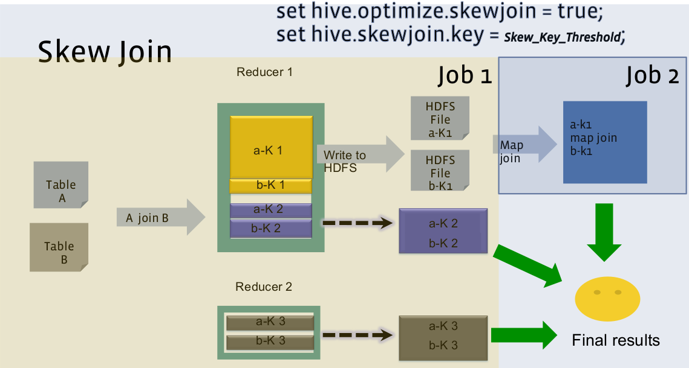
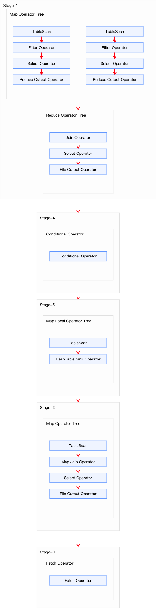

## 1. Skew Join

假设我们有 A 表和 B 表在 id 列上进行 Join：
```sql
SELECT A.*
FROM A
JOIN B
ON A.id = B.id;
```
A 表 id 列在数值 `k1` 上有数据倾斜，即相对于这一列的其他值来说 `k1` 数据量比较大。B 表 id 列也有 `k1` 值，但是数据量远没有 A 表的大并且没有倾斜。如果直接运行可能会造成运行上的数据倾斜，针对这一情况，我们可以将查询拆分为2个查询并单独运行以避免倾斜。第一个查询执行不包括倾斜 Key 的查询，如下所示：
```sql
SELECT A.*
FROM A
JOIN B
ON A.id = B.id;
WHERE A.id <> 'k1';
```
第二个查询执行仅有倾斜 Key 的查询，如下所示：
```sql
SELECT A.*
FROM A
JOIN B
ON A.id = B.id;
WHERE A.id = 'k1';
```
这种拆分对查询进行简单的更改就可以避免 JOIN 时的数据倾斜。当查询很简单时很有帮助，但是这种方案我们需要编写两次相同的查询。如果原始查询很复杂，那么编写 2 个单独的查询也会比较困难。如果我们想修改查询时，需要在 2 个不同的地方进行修改。

为此 Hive 为我们提供了一种自动拆分优化的方案 Skew Join。这是一种专门为解决 Common Join 中数据倾斜(某些 Join Key 对应的记录数异常多) 问题而设计的：



> 黄色的 A 表的 `k1` 有数据倾斜，B 表 `k1`　没有数据倾斜，因此后续的 MapReduce 作业(Job2) 是一个 `Map Join`。

Skew Join 在运行时，它会扫描数据并检测具有较大倾斜的 key，Hive 在运行时是没有办法判断哪个 key 会产生多大的倾斜，所以使用参数 `hive.skewjoin.key` 来控制倾斜的阈值从而判断倾斜的 Key：
- 对于倾斜 Key：将大表中属于倾斜 Key 的记录单独拆分出来。对于这些拆分出来的记录，使用 Map Join 的策略。即将小表中对应这些倾斜 Key 的记录广播到所有处理这些大表倾斜记录的 Mapper 上，在 Mapper 内存中进行 Join。
- 对于非倾斜 Key：大表中不属于倾斜 Key 的记录和小表中不属于倾斜 Key 的记录，仍然走常规的 Common Join (Shuffle-Sort-Reduce)。
- 结果合并：最后将倾斜 Key 的 Join 结果和非倾斜 Key 的 Join 结果合并。

## 2. 使用条件

开启 Skew Join 优化需要配置如下所示参数：
- `hive.optimize.skewjoin`：是否开启 Skew JOIN 优化，默认值为 false。启用 Skew Join 优化，必须设置为 true。在运行时，检测倾斜较大的 Key。不会处理这些 Key，而是将它们临时存储在 HDFS 目录中。在后续的 MapReduce 作业中，再处理这些倾斜的 Key。
- `hive.skewjoin.key`：触发 Skew Join 的阈值，判断 JOIN 中是否有倾斜 Key。如果相同 Key 的行超过了指定阈值，那么认为该 Key 是一个 Skew JOIN Key。默认值为 100000。

## 3. 优化

### 3.1 优化前

下面我们以订单表关联省份表为例演示 Skew Join 如何优化查询：
```sql
SELECT o.id AS order_id, o.province_id, p.province_name
FROM tb_order AS o
JOIN tb_province AS p
ON o.province_id = p.id;
```

为了演示 Skew Join 的优化效果，在这关闭 Map Join 的自动转换优化：
```sql
-- 为了演示 Skew Join 优化，关闭 Map Join 自动转换
set hive.auto.convert.join=false;
```
上述 SQL 语句共有两张表一次 Join 操作，故优化前的执行计划应包含一个 Common Join 任务，通过一个 MapReduce Job 实现。通过 `EXPLAIN xxx` 命令查询该语句的执行计划如下所示：
```
STAGE DEPENDENCIES:
  Stage-1 is a root stage
  Stage-0 depends on stages: Stage-1

STAGE PLANS:
  Stage: Stage-1
    Map Reduce
      Map Operator Tree:
          TableScan
            alias: o
            Statistics: Num rows: 20000000 Data size: 1136009934 Basic stats: COMPLETE Column stats: NONE
            Filter Operator
              predicate: province_id is not null (type: boolean)
              Statistics: Num rows: 20000000 Data size: 1136009934 Basic stats: COMPLETE Column stats: NONE
              Select Operator
                expressions: id (type: string), province_id (type: string)
                outputColumnNames: _col0, _col1
                Statistics: Num rows: 20000000 Data size: 1136009934 Basic stats: COMPLETE Column stats: NONE
                Reduce Output Operator
                  key expressions: _col1 (type: string)
                  sort order: +
                  Map-reduce partition columns: _col1 (type: string)
                  Statistics: Num rows: 20000000 Data size: 1136009934 Basic stats: COMPLETE Column stats: NONE
                  value expressions: _col0 (type: string)
          TableScan
            alias: p
            Statistics: Num rows: 34 Data size: 303 Basic stats: COMPLETE Column stats: NONE
            Filter Operator
              predicate: id is not null (type: boolean)
              Statistics: Num rows: 34 Data size: 303 Basic stats: COMPLETE Column stats: NONE
              Select Operator
                expressions: id (type: string), province_name (type: string)
                outputColumnNames: _col0, _col1
                Statistics: Num rows: 34 Data size: 303 Basic stats: COMPLETE Column stats: NONE
                Reduce Output Operator
                  key expressions: _col0 (type: string)
                  sort order: +
                  Map-reduce partition columns: _col0 (type: string)
                  Statistics: Num rows: 34 Data size: 303 Basic stats: COMPLETE Column stats: NONE
                  value expressions: _col1 (type: string)
      Reduce Operator Tree:
        Join Operator
          condition map:
               Inner Join 0 to 1
          keys:
            0 _col1 (type: string)
            1 _col0 (type: string)
          outputColumnNames: _col0, _col1, _col3
          Statistics: Num rows: 22000000 Data size: 1249610954 Basic stats: COMPLETE Column stats: NONE
          Select Operator
            expressions: _col0 (type: string), _col1 (type: string), _col3 (type: string)
            outputColumnNames: _col0, _col1, _col2
            Statistics: Num rows: 22000000 Data size: 1249610954 Basic stats: COMPLETE Column stats: NONE
            File Output Operator
              compressed: false
              Statistics: Num rows: 22000000 Data size: 1249610954 Basic stats: COMPLETE Column stats: NONE
              table:
                  input format: org.apache.hadoop.mapred.SequenceFileInputFormat
                  output format: org.apache.hadoop.hive.ql.io.HiveSequenceFileOutputFormat
                  serde: org.apache.hadoop.hive.serde2.lazy.LazySimpleSerDe

  Stage: Stage-0
    Fetch Operator
      limit: -1
      Processor Tree:
        ListSink
```

从上面信息可以知道，该查询涉及 `Stage-0` 和 `Stage-1` 2个执行阶段。`Stage-1` 是根阶段（root stage），即最开始执行的阶段。在这 `Stage-1` 通过一个 MapReduce 作业来完成（包含 Map 和 Reduce）；`Stage-0` 依赖于 `Stage-1`，需要在 `Stage-1` 完成后才能执行。`Stage-0` 是一个 Fetch 作业，负责将结果返回给客户端。

> `Stage-1` 是核心阶段。


`Stage-1`：一个执行 Common Join 的 MapReduce 作业阶段：
- Map 端操作:
  - 表 tb_order 处理
    - 表扫描操作（TableScan）
      - 表 tb_order 是个大表（2000w行）
    - 过滤操作（Filter Operator）
      - 过滤掉 province_id 为 NULL 的记录(Join Key)
    - 选择操作（Select Operator）
      - 选择 id 和 province_id 两列
    - 输出重命名为：`_col0`、`_col1`
    - Reduce 输出操作（Reduce Output Operator）
      - 按 `_col1` 即 province_id 字段进行分区和排序
  - 表 tb_province 处理
    - 表扫描操作（TableScan）
      - 表 tb_province 是个小表（34行）
    - 过滤操作（Filter Operator）
      - 过滤 province_id 为 NULL 的记录(Join Key)
    - 选择操作（Select Operator）
      - 选择 id、province_name 3个字段
    - 输出重命名为：`_col0`、`_col1`
    - Reduce 输出操作（Reduce Output Operator）
      - 按 `_col0` 即 id 字段进行分区和排序
- Reduce 端操作:
  - JOIN 操作（Join Operator）：
    - Join 类型：Inner Join
    - Join 策略：Common Join
    - Join 键：tb_order 的 `_col1`、tb_province 的 `_col0`（tb_order.province_id = tb_province.id）

### 3.2 优化后

tb_order 表中的 province_id 字段存在严重倾斜：
```sql
SELECT province_id, COUNT(*) AS num
FROM tb_order AS o
GROUP BY province_id
ORDER BY num DESC;
```
可以看到所有订单几乎都集中在 province_id = 1 的省份中：
```
1	19981085
26	9866
6	2032
2	1000
31	221
32	221
18	219
3	216
34	215
10	215
13	214
27	211
16	208
20	206
28	206
12	205
33	204
22	204
23	201
11	200
25	198
8	198
15	195
```
若不经过优化，通过观察任务的执行过程，是能够看出数据倾斜现象的。有两种优化思路可以解决该数据倾斜问题：第一种是 Map Join 优化，这种方式不在本文章讲解范围之内，暂时不考虑；第二种方式是开启 Skew Join 优化:
```sql
-- 启用 Skew Join 优化
set hive.optimize.skewjoin=true;
-- 为了演示 Skew Join 优化，关闭 Map Join 自动转换
set hive.auto.convert.join=false;
-- 触发 Skew Join 的阈值，若某个 key 的行数超过该参数值，则触发; 默认为 100000
set hive.skewjoin.key=100000
```
> Hive 中的 Map Join 自动转换是默认开启的，这种方式不在本文章讲解范围之内，暂时不考虑。需要先将该参数设置为 false 进行关闭；倾斜 Key 的数据量 19981085 已经远超触发 Skew Join 的阈值。

通过 `EXPLAIN xxx` 命令查询该语句的执行计划如下所示：
```
STAGE DEPENDENCIES:
  Stage-1 is a root stage
  Stage-4 depends on stages: Stage-1 , consists of Stage-5
  Stage-5
  Stage-3 depends on stages: Stage-5
  Stage-0 depends on stages: Stage-3

STAGE PLANS:
  Stage: Stage-1
    Map Reduce
      Map Operator Tree:
          TableScan
            alias: o
            Statistics: Num rows: 20000000 Data size: 1136009934 Basic stats: COMPLETE Column stats: NONE
            Filter Operator
              predicate: province_id is not null (type: boolean)
              Statistics: Num rows: 20000000 Data size: 1136009934 Basic stats: COMPLETE Column stats: NONE
              Select Operator
                expressions: id (type: string), province_id (type: string)
                outputColumnNames: _col0, _col1
                Statistics: Num rows: 20000000 Data size: 1136009934 Basic stats: COMPLETE Column stats: NONE
                Reduce Output Operator
                  key expressions: _col1 (type: string)
                  sort order: +
                  Map-reduce partition columns: _col1 (type: string)
                  Statistics: Num rows: 20000000 Data size: 1136009934 Basic stats: COMPLETE Column stats: NONE
                  value expressions: _col0 (type: string)
          TableScan
            alias: p
            Statistics: Num rows: 34 Data size: 303 Basic stats: COMPLETE Column stats: NONE
            Filter Operator
              predicate: id is not null (type: boolean)
              Statistics: Num rows: 34 Data size: 303 Basic stats: COMPLETE Column stats: NONE
              Select Operator
                expressions: id (type: string), province_name (type: string)
                outputColumnNames: _col0, _col1
                Statistics: Num rows: 34 Data size: 303 Basic stats: COMPLETE Column stats: NONE
                Reduce Output Operator
                  key expressions: _col0 (type: string)
                  sort order: +
                  Map-reduce partition columns: _col0 (type: string)
                  Statistics: Num rows: 34 Data size: 303 Basic stats: COMPLETE Column stats: NONE
                  value expressions: _col1 (type: string)
      Reduce Operator Tree:
        Join Operator
          condition map:
               Inner Join 0 to 1
          handleSkewJoin: true
          keys:
            0 _col1 (type: string)
            1 _col0 (type: string)
          outputColumnNames: _col0, _col1, _col3
          Statistics: Num rows: 22000000 Data size: 1249610954 Basic stats: COMPLETE Column stats: NONE
          Select Operator
            expressions: _col0 (type: string), _col1 (type: string), _col3 (type: string)
            outputColumnNames: _col0, _col1, _col2
            Statistics: Num rows: 22000000 Data size: 1249610954 Basic stats: COMPLETE Column stats: NONE
            File Output Operator
              compressed: false
              Statistics: Num rows: 22000000 Data size: 1249610954 Basic stats: COMPLETE Column stats: NONE
              table:
                  input format: org.apache.hadoop.mapred.SequenceFileInputFormat
                  output format: org.apache.hadoop.hive.ql.io.HiveSequenceFileOutputFormat
                  serde: org.apache.hadoop.hive.serde2.lazy.LazySimpleSerDe

  Stage: Stage-4
    Conditional Operator

  Stage: Stage-5
    Map Reduce Local Work
      Alias -> Map Local Tables:
        1
          Fetch Operator
            limit: -1
      Alias -> Map Local Operator Tree:
        1
          TableScan
            HashTable Sink Operator
              keys:
                0 reducesinkkey0 (type: string)
                1 reducesinkkey0 (type: string)

  Stage: Stage-3
    Map Reduce
      Map Operator Tree:
          TableScan
            Map Join Operator
              condition map:
                   Inner Join 0 to 1
              keys:
                0 reducesinkkey0 (type: string)
                1 reducesinkkey0 (type: string)
              outputColumnNames: _col0, _col1, _col3
              Select Operator
                expressions: _col0 (type: string), _col1 (type: string), _col3 (type: string)
                outputColumnNames: _col0, _col1, _col2
                Statistics: Num rows: 22000000 Data size: 1249610954 Basic stats: COMPLETE Column stats: NONE
                File Output Operator
                  compressed: false
                  Statistics: Num rows: 22000000 Data size: 1249610954 Basic stats: COMPLETE Column stats: NONE
                  table:
                      input format: org.apache.hadoop.mapred.SequenceFileInputFormat
                      output format: org.apache.hadoop.hive.ql.io.HiveSequenceFileOutputFormat
                      serde: org.apache.hadoop.hive.serde2.lazy.LazySimpleSerDe
      Local Work:
        Map Reduce Local Work

  Stage: Stage-0
    Fetch Operator
      limit: -1
      Processor Tree:
        ListSink
```

从上面信息可以知道，该查询涉及 `Stage-0`、`Stage-1`、`Stage-3`、`Stage-4` 以及 `Stage-5` 5个执行阶段。



`Stage-1` 是根阶段（root stage），即最开始执行的阶段。在这 `Stage-1` 通过一个 MapReduce 作业来完成；通过与优化前的执行计划相比，只是在 Join Operator 中多了一个 `handleSkewJoin: true`，从这点也可证明使用了 Skew Join 进行优化。在该阶段会检测 province_id 字段每个键的数据量分布，识别倾斜 Key(某些省份数据量异常大)。对于正常数据，直接完成 Reduce Join 并输出；对于倾斜数据，标记并转发到后续阶段。

`Stage-4` 依赖于 `Stage-1`，是条件判断阶段，只包含一条条件路径 `Stage-5`。这个阶段是执行计划的决策中心，如果 `Stage-1` 输出存在倾斜 Key 则触发 `Stage-5`，否则跳过后续倾斜处理。

`Stage-5` 依赖于 `Stage-4`，是本地 Map 阶段。这个阶段核心完成 tb_province 表倾斜 Key 的读取，构建哈希表，以供 `Stage-3` 使用。`Stage-3` 依赖于 `Stage-5`，是一个只包含 Map 的 MapReduce 阶段。这个阶段读取 `Stage-1` 标记的倾斜数据进行 Map Join 处理。

`Stage-0` 是一个 Fetch 作业，负责将结果返回给客户端。
