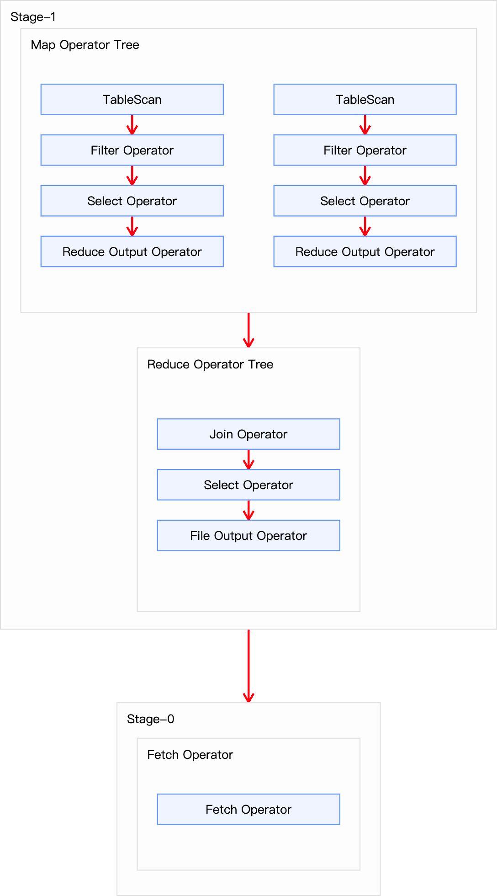

## 1. Sort Merge Bucket Map Join

Sort Merge Bucket Map Join (SMB Map Join) 是在 Bucket Map Join 的基础上更进一步，除了要求参与 Join 的两个表均为分桶表，都根据 Join Key 进行分桶(CLUSTERED BY)，两表的桶数量相同或成倍数关系，新增要求每个桶内的数据在 Join Key 上排序(SORTED BY)。

SMB Map Join 与 Bucket Map Join 一样，都是利用两表分桶之间的关联关系，在分桶之间进行 Join 操作，不同的是分桶之间的实现算法。Bucket Map Join 两个分桶之间的 Join 实现算法是 Hash Join 算法，而 SMB Map Join 两个分桶之间的 Join 实现算法是 Sort Merge Join 算法。

## 2. 使用条件

SMB Map Join 支持自动转换，不需要像 Bucket Map Join 必须通过在 SQL 语句中提供 Hint 提示来使用。启用 SMB Map Join 自动转换只需要配置如下参数：
```sql
-- 启动 Sort Merge Bucket Map Join 优化：总开关
set hive.optimize.bucketmapjoin.sortedmerge=true;
-- 使用自动转换 SMB Join
set hive.auto.convert.sortmerge.join=true;
```

SMB Map Join 除了支持自动转换之外，也可以通过在 SQL 语句中提供 `/*+ MAPJOIN(xxx) */` Hint 提示来使用，不过需要注意的是 Hint 提示已过时，不推荐使用。如果使用的话，需要配置如下参数：
```sql
-- 启动 Sort Merge Bucket Map Join 优化
set hive.optimize.bucketmapjoin.sortedmerge=true;
-- MapJoin hint 默认会被忽略(因为已经过时)，需将如下参数修改为false
set hive.ignore.mapjoin.hint=false;
-- CBO 优化会导致 hint 信息被忽略，因此要关闭 CBO 优化。需将如下参数修改为false
set hive.cbo.enable=false;
```
> hive.optimize.bucketmapjoin.sortedmerge 是 SMB Map Join 的总开关，必须设置为 true；

此外关于分桶表的一些限制：
- 严格依赖分桶：两个表必须在 Join Key 上预先进行分桶，且桶数量满足条件(相同或成倍数)。
- 要求最严格：两个表必须在 Join Key 上分桶且排序。
  - Join Key = 分桶 Key = 排序 Key

## 3. 优化案例

### 3.1 优化前

下面我们以订单表关联支付表为例演示 Sort Merge Bucket Map Join 如何优化查询：
```sql
SELECT o.order_id, o.user_id, p.payment_time, p.payment_amount
FROM (
  SELECT id AS order_id, user_id
  FROM tb_order
  WHERE dt = '2020-06-14'
) AS o
JOIN (
  SELECT order_id, payment_time, total_amount AS payment_amount
  FROM tb_payment
  WHERE dt = '2020-06-14'
) AS p
ON o.order_id = p.order_id;
```
上述 SQL 语句共有两张表一次 Join 操作，故优化前的执行计划应包含一个 Common Join 任务，通过一个 MapReduce Job 实现。通过 `EXPLAIN xxx` 命令查询该语句的执行计划如下所示：
```
STAGE DEPENDENCIES:
  Stage-1 is a root stage
  Stage-0 depends on stages: Stage-1

STAGE PLANS:
  Stage: Stage-1
    Map Reduce
      Map Operator Tree:
          TableScan
            alias: tb_order
            Statistics: Num rows: 20000000 Data size: 1136009934 Basic stats: COMPLETE Column stats: NONE
            Filter Operator
              predicate: id is not null (type: boolean)
              Statistics: Num rows: 20000000 Data size: 1136009934 Basic stats: COMPLETE Column stats: NONE
              Select Operator
                expressions: id (type: string), user_id (type: string)
                outputColumnNames: _col0, _col1
                Statistics: Num rows: 20000000 Data size: 1136009934 Basic stats: COMPLETE Column stats: NONE
                Reduce Output Operator
                  key expressions: _col0 (type: string)
                  sort order: +
                  Map-reduce partition columns: _col0 (type: string)
                  Statistics: Num rows: 20000000 Data size: 1136009934 Basic stats: COMPLETE Column stats: NONE
                  value expressions: _col1 (type: string)
          TableScan
            alias: tb_payment
            Statistics: Num rows: 6000000 Data size: 322198480 Basic stats: COMPLETE Column stats: NONE
            Filter Operator
              predicate: order_id is not null (type: boolean)
              Statistics: Num rows: 6000000 Data size: 322198480 Basic stats: COMPLETE Column stats: NONE
              Select Operator
                expressions: order_id (type: string), payment_time (type: string), total_amount (type: decimal(16,2))
                outputColumnNames: _col0, _col1, _col2
                Statistics: Num rows: 6000000 Data size: 322198480 Basic stats: COMPLETE Column stats: NONE
                Reduce Output Operator
                  key expressions: _col0 (type: string)
                  sort order: +
                  Map-reduce partition columns: _col0 (type: string)
                  Statistics: Num rows: 6000000 Data size: 322198480 Basic stats: COMPLETE Column stats: NONE
                  value expressions: _col1 (type: string), _col2 (type: decimal(16,2))
      Reduce Operator Tree:
        Join Operator
          condition map:
               Inner Join 0 to 1
          keys:
            0 _col0 (type: string)
            1 _col0 (type: string)
          outputColumnNames: _col0, _col1, _col3, _col4
          Statistics: Num rows: 22000000 Data size: 1249610954 Basic stats: COMPLETE Column stats: NONE
          Select Operator
            expressions: _col0 (type: string), _col1 (type: string), _col3 (type: string), _col4 (type: decimal(16,2))
            outputColumnNames: _col0, _col1, _col2, _col3
            Statistics: Num rows: 22000000 Data size: 1249610954 Basic stats: COMPLETE Column stats: NONE
            File Output Operator
              compressed: false
              Statistics: Num rows: 22000000 Data size: 1249610954 Basic stats: COMPLETE Column stats: NONE
              table:
                  input format: org.apache.hadoop.mapred.SequenceFileInputFormat
                  output format: org.apache.hadoop.hive.ql.io.HiveSequenceFileOutputFormat
                  serde: org.apache.hadoop.hive.serde2.lazy.LazySimpleSerDe

  Stage: Stage-0
    Fetch Operator
      limit: -1
      Processor Tree:
        ListSink
```

从上面信息可以知道，该查询涉及 `Stage-0` 和 `Stage-1` 2个执行阶段。`Stage-1` 是根阶段（root stage），即最开始执行的阶段。在这 `Stage-1` 通过一个 MapReduce 作业来完成（包含 Map 和 Reduce）；`Stage-0` 依赖于 `Stage-1`，需要在 `Stage-1` 完成后才能执行。`Stage-0` 是一个 Fetch 作业，负责将结果返回给客户端。

> `Stage-1` 是核心阶段。



`Stage-1` 是一个执行 Common Join 的 MapReduce 作业：
- Map 端操作:
  - 表 tb_order 处理
    - 表扫描操作（TableScan）
      - 表 tb_order 是个大表（2000w行）
    - 过滤操作（Filter Operator）
      - 过滤掉 id 为 NULL 的记录(Join Key)
    - 选择操作（Select Operator）
      - 选择 id 和 user_id 两列
    - 输出重命名为：`_col0`、`_col1`
    - Reduce 输出操作（Reduce Output Operator）
      - 按 `_col0` 即 id 字段进行分区和排序
  - 表 tb_payment 处理
    - 表扫描操作（TableScan）
      - 表 tb_payment 是个中表（600w行）
    - 过滤操作（Filter Operator）
      - 过滤 order_id 为 NULL 的记录(Join Key)
    - 选择操作（Select Operator）
      - 选择 order_id、payment_time、total_amount 3个字段
    - 输出重命名为：`_col0`、`_col1`、`_col2`
    - Reduce 输出操作（Reduce Output Operator）
      - 按 `_col0` 即 order_id 字段进行分区和排序
- Reduce 端操作:
  - JOIN 操作（Join Operator）：
    - Join 类型：Inner Join
    - Join 策略：Common Join
    - Join 键：`_col0`（tb_order.id = tb_payment.order_id）


### 3.2 优化后

通过 `DESC FORMATTED xxx;` 命令可以探查参与 Join 的两张表数据量如下：

| 表名 | 大小 |
| :------------- | :------------- |
| tb_order | 1136009934（约1122M） |
| tb_payment	| 334198480（约319M）|

两张表都相对较大，若采用普通的 Map Join 算法，则 Map 端需要较多的内存来缓存数据，当然可以选择为 Map 端分配更多的内存，来保证任务运行成功。但是，Map 端的内存不可能无上限的分配，所以当参与 Join 的表数据量均过大时，除了可以考虑采用 [Bucket Map Join](https://smartsi.blog.csdn.net/article/details/152504326) 优化，还可以采用 Sort Merge Bukcet Map Join。相较于 Bucket Map Join，SMB Map Join 对分桶大小没有要求的。下面演示如何使用 SMB Map Join。

#### 3.2.1 创建分桶表

首先需要根据源表创建两个分桶表：tb_order 建议分 16 个 bucket，tb_payment 建议分 8 个 bucket：
```sql
-- 订单表
CREATE TABLE tb_order_sorted_bucket (
    id           string comment '订单id',
    user_id      string comment '用户id',
    product_id   string comment '商品id',
    province_id  string comment '省份id',
    create_time  string comment '下单时间',
    product_num  int comment '商品件数',
    total_amount decimal(16, 2) comment '下单金额'
)
PARTITIONED BY (dt string)
CLUSTERED BY (id) SORTED BY (id) INTO 16 buckets
ROW FORMAT DELIMITED
FIELDS TERMINATED BY ','
LINES TERMINATED BY '\n';

-- 支付表
CREATE TABLE tb_payment_sorted_bucket(
    id              string comment '支付id',
    order_id        string comment '订单id',
    user_id         string comment '用户id',
    payment_time    string comment '支付时间',
    total_amount    decimal(16, 2) comment '支付金额'
)
PARTITIONED BY (dt string)
CLUSTERED BY (order_id) SORTED BY (order_id) INTO 8 buckets
ROW FORMAT DELIMITED
FIELDS TERMINATED BY ','
LINES TERMINATED BY '\n';
```
> 注意分桶个数的倍数关系以及分桶字段。

然后向两个分桶表导入数据：
```sql
-- 订单表
INSERT OVERWRITE TABLE tb_order_sorted_bucket PARTITION(dt='2020-06-14')
SELECT
    id,
    user_id,
    product_id,
    province_id,
    create_time,
    product_num,
    total_amount   
FROM tb_order
WHERE dt = '2020-06-14';

-- 支付表
INSERT OVERWRITE TABLE tb_payment_sorted_bucket PARTITION(dt='2020-06-14')
SELECT
    id,
    order_id,
    user_id,
    payment_time,
    total_amount
FROM tb_payment
WHERE dt='2020-06-14';
```
#### 3.2.2 优化

使用自动转换 SMB Map Join 方式优化之前的 SQL 需要设置如下参数：
```sql
-- 为了验证 SMB Map Join，关闭如下2个参数
set hive.optimize.bucketmapjoin=false;
set hive.auto.convert.join=false;
-- 启动 Sort Merge Bucket Map Join 优化: 总开关
set hive.optimize.bucketmapjoin.sortedmerge=true;
-- 使用自动转换 SMB Join
set hive.auto.convert.sortmerge.join=true;
```
或者使用旧的 Hint 方式：
```sql
-- 为了验证 SMB Map Join，关闭如下2个参数
set hive.optimize.bucketmapjoin=false;
set hive.auto.convert.join=false;
-- 启动 Sort Merge Bucket Map Join 优化
set hive.optimize.bucketmapjoin.sortedmerge=true;
-- MapJoin hint 默认会被忽略(因为已经过时)，需将如下参数修改为false
set hive.ignore.mapjoin.hint=false;
-- CBO 优化会导致 hint 信息被忽略，因此要关闭 CBO 优化。需将如下参数修改为false
set hive.cbo.enable=false;
```
使用 Hint 方式自然需要修改 SQL 语句添加 Hint 信息：
```sql
SELECT
  /*+ MAPJOIN(p) */
  o.order_id, o.user_id, p.payment_time, p.payment_amount
FROM (
  SELECT id AS order_id, user_id
  FROM tb_order_sorted_bucket
  WHERE dt = '2020-06-14'
) AS o
JOIN (
  SELECT order_id, payment_time, total_amount AS payment_amount
  FROM tb_payment_sorted_bucket
  WHERE dt = '2020-06-14'
) AS p
ON o.order_id = p.order_id;
```

设置完参数之后，通过 `EXPLAIN xxx` 命令查询该语句的执行计划如下所示：
```
STAGE DEPENDENCIES:
  Stage-1 is a root stage
  Stage-0 depends on stages: Stage-1

STAGE PLANS:
  Stage: Stage-1
    Map Reduce
      Map Operator Tree:
          TableScan
            alias: tb_order_sorted_bucket
            Statistics: Num rows: 20000000 Data size: 1496009934 Basic stats: COMPLETE Column stats: NONE
            Filter Operator
              predicate: id is not null (type: boolean)
              Statistics: Num rows: 20000000 Data size: 1496009934 Basic stats: COMPLETE Column stats: NONE
              Select Operator
                expressions: id (type: string), user_id (type: string)
                outputColumnNames: _col0, _col1
                Statistics: Num rows: 20000000 Data size: 1496009934 Basic stats: COMPLETE Column stats: NONE
                Sorted Merge Bucket Map Join Operator
                  condition map:
                       Inner Join 0 to 1
                  keys:
                    0 _col0 (type: string)
                    1 _col0 (type: string)
                  outputColumnNames: _col0, _col1, _col3, _col4
                  Select Operator
                    expressions: _col0 (type: string), _col1 (type: string), _col3 (type: string), _col4 (type: decimal(16,2))
                    outputColumnNames: _col0, _col1, _col2, _col3
                    File Output Operator
                      compressed: false
                      table:
                          input format: org.apache.hadoop.mapred.SequenceFileInputFormat
                          output format: org.apache.hadoop.hive.ql.io.HiveSequenceFileOutputFormat
                          serde: org.apache.hadoop.hive.serde2.lazy.LazySimpleSerDe

  Stage: Stage-0
    Fetch Operator
      limit: -1
      Processor Tree:
        ListSink
```

从上面信息可以知道，该查询涉及 `Stage-0` 和 `Stage-1` 2个执行阶段。`Stage-1` 是根阶段（root stage），即最开始执行的阶段。在这 `Stage-1` 是一个 MapReduce 作业(Sort Merge Bucket Map Join)；`Stage-0` 是一个 Fetch 作业，负责将结果返回给客户端。


- `Stage-1`：MapReduce 阶段，核心完成 Sort Merge Bucket Map Join
  - 表扫描操作（TableScan）：
    - 扫描 tb_order_sorted_bucket 表(2000w行)
  - 过滤操作（Filter Operator）：
    - 过滤掉 id 为 NULL 的记录(Join Key)
  - 选择操作（Select Operator）：
    - 选择 id、user_id 2个字段
  - 输出重命名为：`_col0`、`_col1`、`_col2`
  - SMB Map Join 操作（Sorted Merge Bucket Map Join Operator）：
    - Join 类型：Inner Join
    - Join 策略：SMB Map Join
    - Join 键：`_col0`(tb_order_sorted_bucket.id = tb_payment_sorted_bucket.order_id）
