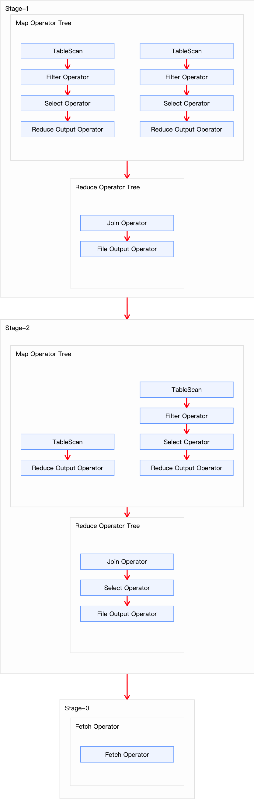
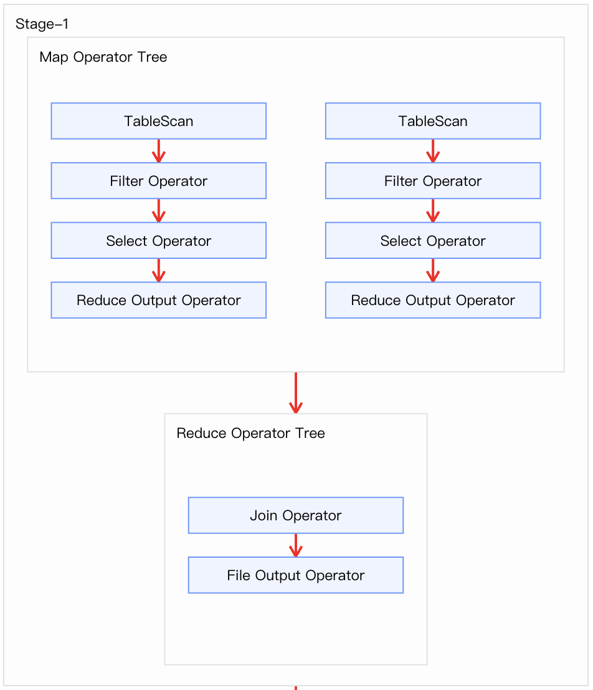
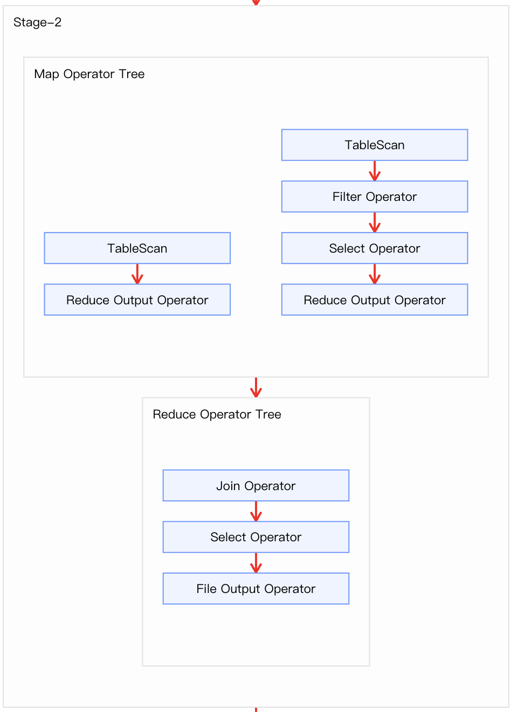
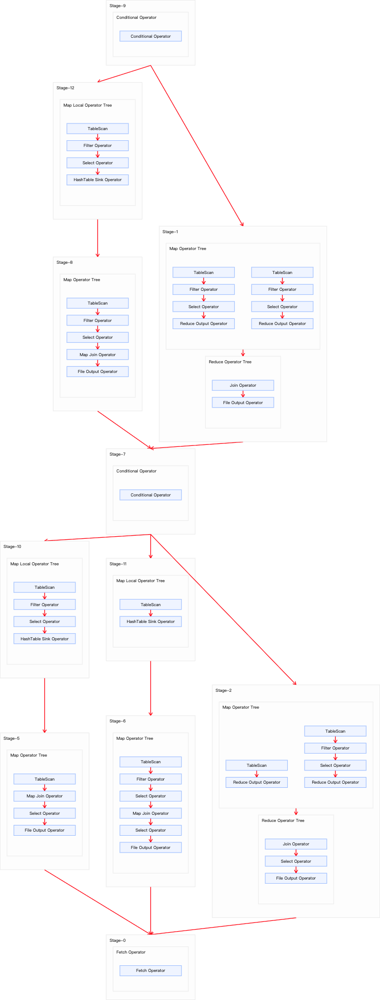
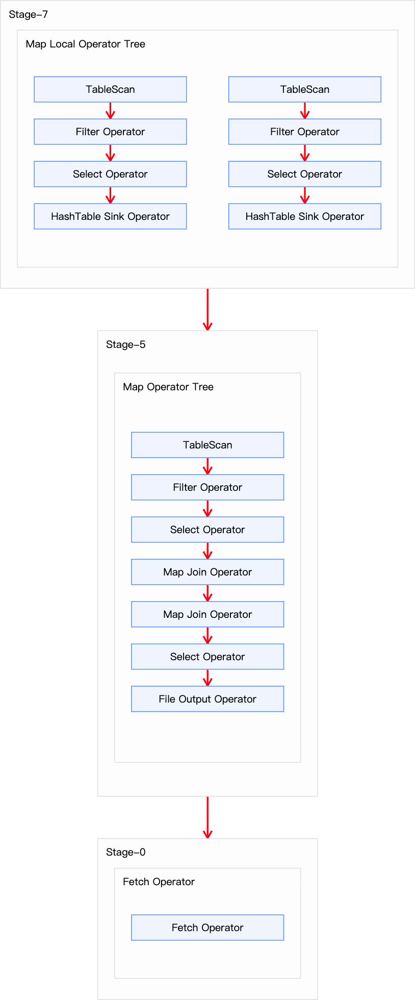
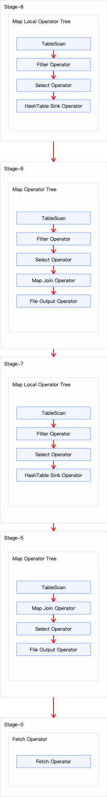
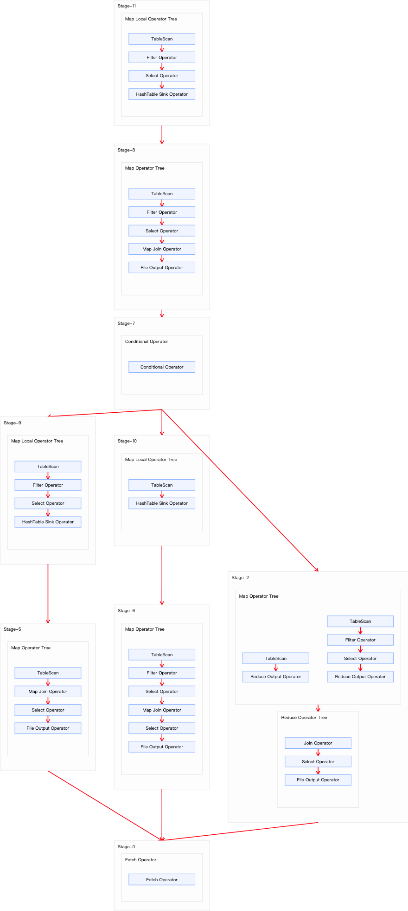

## 1.

```
// 关闭，强制走 Common Join
set hive.auto.convert.join=false;
```

```sql
EXPLAIN FORMATTED
SELECT a1.id AS order_id, a1.user_id, a1.product_id, a2.product_name, a1.province_id, a3.province_name
FROM tb_order AS a1
JOIN tb_product AS a2
ON a1.product_id = a2.id
JOIN tb_province AS a3
ON a1.province_id = a3.id;
```

上述 SQL 共有三张表进行两次 Join 操作，且两次 Join 操作的关联字段不同。因此执行计划应该包含两个 Common Join，也就是由两个 MapReduce 任务实现。执行计划如下所示：



```
STAGE DEPENDENCIES:
  Stage-1 is a root stage
  Stage-2 depends on stages: Stage-1
  Stage-0 depends on stages: Stage-2

STAGE PLANS:
  Stage: Stage-1
    Map Reduce
      Map Operator Tree:
          TableScan
            alias: a3
            Statistics: Num rows: 34 Data size: 303 Basic stats: COMPLETE Column stats: NONE
            Filter Operator
              predicate: id is not null (type: boolean)
              Statistics: Num rows: 34 Data size: 303 Basic stats: COMPLETE Column stats: NONE
              Select Operator
                expressions: id (type: string), province_name (type: string)
                outputColumnNames: _col0, _col1
                Statistics: Num rows: 34 Data size: 303 Basic stats: COMPLETE Column stats: NONE
                Reduce Output Operator
                  key expressions: _col0 (type: string)
                  sort order: +
                  Map-reduce partition columns: _col0 (type: string)
                  Statistics: Num rows: 34 Data size: 303 Basic stats: COMPLETE Column stats: NONE
                  value expressions: _col1 (type: string)
          TableScan
            alias: a1
            Statistics: Num rows: 20000000 Data size: 1136009934 Basic stats: COMPLETE Column stats: NONE
            Filter Operator
              predicate: (product_id is not null and province_id is not null) (type: boolean)
              Statistics: Num rows: 20000000 Data size: 1136009934 Basic stats: COMPLETE Column stats: NONE
              Select Operator
                expressions: id (type: string), user_id (type: string), product_id (type: string), province_id (type: string)
                outputColumnNames: _col0, _col1, _col2, _col3
                Statistics: Num rows: 20000000 Data size: 1136009934 Basic stats: COMPLETE Column stats: NONE
                Reduce Output Operator
                  key expressions: _col3 (type: string)
                  sort order: +
                  Map-reduce partition columns: _col3 (type: string)
                  Statistics: Num rows: 20000000 Data size: 1136009934 Basic stats: COMPLETE Column stats: NONE
                  value expressions: _col0 (type: string), _col1 (type: string), _col2 (type: string)
      Reduce Operator Tree:
        Join Operator
          condition map:
               Inner Join 0 to 1
          keys:
            0 _col0 (type: string)
            1 _col3 (type: string)
          outputColumnNames: _col1, _col2, _col3, _col4, _col5
          Statistics: Num rows: 22000000 Data size: 1249610954 Basic stats: COMPLETE Column stats: NONE
          File Output Operator
            compressed: false
            table:
                input format: org.apache.hadoop.mapred.SequenceFileInputFormat
                output format: org.apache.hadoop.hive.ql.io.HiveSequenceFileOutputFormat
                serde: org.apache.hadoop.hive.serde2.lazybinary.LazyBinarySerDe

  Stage: Stage-2
    Map Reduce
      Map Operator Tree:
          TableScan
            Reduce Output Operator
              key expressions: _col4 (type: string)
              sort order: +
              Map-reduce partition columns: _col4 (type: string)
              Statistics: Num rows: 22000000 Data size: 1249610954 Basic stats: COMPLETE Column stats: NONE
              value expressions: _col1 (type: string), _col2 (type: string), _col3 (type: string), _col5 (type: string)
          TableScan
            alias: a2
            Statistics: Num rows: 1000000 Data size: 23285707 Basic stats: COMPLETE Column stats: NONE
            Filter Operator
              predicate: id is not null (type: boolean)
              Statistics: Num rows: 1000000 Data size: 23285707 Basic stats: COMPLETE Column stats: NONE
              Select Operator
                expressions: id (type: string), product_name (type: string)
                outputColumnNames: _col0, _col1
                Statistics: Num rows: 1000000 Data size: 23285707 Basic stats: COMPLETE Column stats: NONE
                Reduce Output Operator
                  key expressions: _col0 (type: string)
                  sort order: +
                  Map-reduce partition columns: _col0 (type: string)
                  Statistics: Num rows: 1000000 Data size: 23285707 Basic stats: COMPLETE Column stats: NONE
                  value expressions: _col1 (type: string)
      Reduce Operator Tree:
        Join Operator
          condition map:
               Inner Join 0 to 1
          keys:
            0 _col4 (type: string)
            1 _col0 (type: string)
          outputColumnNames: _col1, _col2, _col3, _col4, _col5, _col7
          Statistics: Num rows: 24200000 Data size: 1374572079 Basic stats: COMPLETE Column stats: NONE
          Select Operator
            expressions: _col2 (type: string), _col3 (type: string), _col4 (type: string), _col7 (type: string), _col5 (type: string), _col1 (type: string)
            outputColumnNames: _col0, _col1, _col2, _col3, _col4, _col5
            Statistics: Num rows: 24200000 Data size: 1374572079 Basic stats: COMPLETE Column stats: NONE
            File Output Operator
              compressed: false
              Statistics: Num rows: 24200000 Data size: 1374572079 Basic stats: COMPLETE Column stats: NONE
              table:
                  input format: org.apache.hadoop.mapred.SequenceFileInputFormat
                  output format: org.apache.hadoop.hive.ql.io.HiveSequenceFileOutputFormat
                  serde: org.apache.hadoop.hive.serde2.lazy.LazySimpleSerDe

  Stage: Stage-0
    Fetch Operator
      limit: -1
      Processor Tree:
        ListSink
```

从上面信息可以知道：
- 该查询涉及三个执行阶段：`Stage-1` 和 `Stage-0`
- `Stage-1` 是根阶段（root stage），即最先执行的阶段，是一个 MapReduce 作业；
- `Stage-2` 依赖于 `Stage-1`，也是一个 MapReduce 作业，`Stage-2` 需要在 `Stage-1` 完成后才能执行
- `Stage-0` 依赖于 `Stage-2`，是一个简单 Fetch 作业，`Stage-0` 需要在 `Stage-2` 完成后才能执行

### 2.1 Stage-1



Stage-1 是一个执行 Common Join 的 MapReduce 作业：
- Map端操作:
  - 表 a3 处理
    - 表a3是个小表（仅34行）
    - 过滤掉id为NULL的记录
    - 选择 id 和 province_name 两列
    - 按 id 进行分区和排序
  - 表 a1 处理
    - 表a1是个大表（2000万行，约1.1GB）
    - 过滤 product_id 和 province_id 为 NULL 的记录
    - 选择 id、user_id、product_id、province_id 4个字段
    - 按 province_id 进行分区和排序
- Reduce端操作
  - JOIN 类型：INNER JOIN
  - JOIN 条件：a3.id = a1.province_id
  - 数据分布：小表a3(34行) JOIN 大表a1(2000万行)
  - 输出结果：2200万行，约1.25GB

### 2.2 Stage-2



Stage-2 是一个执行 Common Join 的 MapReduce 作业：
- Map 端操作:
  - Stage-1 输出结果
  - 表 a2 处理
    - 表 a2 是中等表（100万行，约23MB）
    - 过滤 id 为 NULL 的记录
    - 选择 id 和 product_name 两列
    - 按 id 进行分区和排序
- Reduce 端操作
  - JOIN 类型：INNER JOIN
  - JOIN 条件：a3.id = a1.province_id
  - 数据分布：小表a3(34行) JOIN 大表a1(2000万行)
  - 输出结果：2200万行，约1.25GB


## 2. 触发方式

Map Join 有两种触发方式，一种是用户在SQL语句中增加hint提示，另外一种是Hive优化器根据参与join表的数据量大小，自动触发。

### 2.1 Hint提示
用户可通过如下方式，指定通过map join算法，并且ta将作为map join中的小表。这种方式已经过时，不推荐使用。

### 2.2 自动触发

Hive在编译SQL语句阶段，起初所有的join操作均采用Common Join算法实现。

之后在物理优化阶段，Hive会根据每个Common Join任务所需表的大小判断该Common Join任务是否能够转换为Map Join任务，若满足要求，便将Common Join任务自动转换为Map Join任务。
但有些Common Join任务所需的表大小，在SQL的编译阶段是未知的（例如对子查询进行join操作），所以这种Common Join任务是否能转换成Map Join任务在编译阶是无法确定的。
针对这种情况，Hive会在编译阶段生成一个条件任务（Conditional Task），其下会包含一个计划列表，计划列表中包含转换后的Map Join任务以及原有的Common Join任务。最终具体采用哪个计划，是在运行时决定的。大致思路如下图所示：


## 3. 优化


```sql
// 伪代码表示决策过程
if (hive.auto.convert.join.noconditionaltask) {
    // 关闭 Conditional Task
    if (所有小表总大小 <= hive.auto.convert.join.noconditionaltask.size) {
        // 直接生成 MapJoin 计划
        return generateMapJoinPlan();
    } else {
        // 生成 Common Join 计划
        return generateCommonJoinPlan();
    }
} else {
    // 开启 Conditional Task
    return generateConditionalTask();
}
```

### 3.1 方案1

开启 Map Join 自动转换：
```sql
set hive.auto.convert.join=true;
```
启用 Conditional Task，生成包含多个执行路径的条件性计划：
```sql
-- 启用 Conditional Task
set hive.auto.convert.join.noconditionaltask=false;
-- 默认25MB
hive.mapjoin.smalltable.filesize=25000000;
```
这样可保证将两个 Common Join 均可转为 Map Join，同时启用 Conditional Task 来生成包含多个执行路径的条件性计划(包含主计划和备份计划，运行时根据实际情况选择执行路径)，保证计算任务的稳定。

```sql
EXPLAIN FORMATTED
SELECT a1.id AS order_id, a1.user_id, a1.product_id, a2.product_name, a1.province_id, a3.province_name
FROM tb_order AS a1
JOIN tb_product AS a2
ON a1.product_id = a2.id
JOIN tb_province AS a3
ON a1.province_id = a3.id;
```



```
STAGE DEPENDENCIES:
  Stage-9 is a root stage , consists of Stage-12, Stage-1
  Stage-12 has a backup stage: Stage-1
  Stage-8 depends on stages: Stage-12
  Stage-7 depends on stages: Stage-1, Stage-8 , consists of Stage-10, Stage-11, Stage-2
  Stage-10 has a backup stage: Stage-2
  Stage-5 depends on stages: Stage-10
  Stage-11 has a backup stage: Stage-2
  Stage-6 depends on stages: Stage-11
  Stage-2
  Stage-1
  Stage-0 depends on stages: Stage-5, Stage-6, Stage-2

STAGE PLANS:
  Stage: Stage-9
    Conditional Operator

  Stage: Stage-12
    Map Reduce Local Work
      Alias -> Map Local Tables:
        $hdt$_1:a3
          Fetch Operator
            limit: -1
      Alias -> Map Local Operator Tree:
        $hdt$_1:a3
          TableScan
            alias: a3
            Statistics: Num rows: 34 Data size: 303 Basic stats: COMPLETE Column stats: NONE
            Filter Operator
              predicate: id is not null (type: boolean)
              Statistics: Num rows: 34 Data size: 303 Basic stats: COMPLETE Column stats: NONE
              Select Operator
                expressions: id (type: string), province_name (type: string)
                outputColumnNames: _col0, _col1
                Statistics: Num rows: 34 Data size: 303 Basic stats: COMPLETE Column stats: NONE
                HashTable Sink Operator
                  keys:
                    0 _col0 (type: string)
                    1 _col3 (type: string)

  Stage: Stage-8
    Map Reduce
      Map Operator Tree:
          TableScan
            alias: a1
            Statistics: Num rows: 20000000 Data size: 1136009934 Basic stats: COMPLETE Column stats: NONE
            Filter Operator
              predicate: (product_id is not null and province_id is not null) (type: boolean)
              Statistics: Num rows: 20000000 Data size: 1136009934 Basic stats: COMPLETE Column stats: NONE
              Select Operator
                expressions: id (type: string), user_id (type: string), product_id (type: string), province_id (type: string)
                outputColumnNames: _col0, _col1, _col2, _col3
                Statistics: Num rows: 20000000 Data size: 1136009934 Basic stats: COMPLETE Column stats: NONE
                Map Join Operator
                  condition map:
                       Inner Join 0 to 1
                  keys:
                    0 _col0 (type: string)
                    1 _col3 (type: string)
                  outputColumnNames: _col1, _col2, _col3, _col4, _col5
                  Statistics: Num rows: 22000000 Data size: 1249610954 Basic stats: COMPLETE Column stats: NONE
                  File Output Operator
                    compressed: false
                    table:
                        input format: org.apache.hadoop.mapred.SequenceFileInputFormat
                        output format: org.apache.hadoop.hive.ql.io.HiveSequenceFileOutputFormat
                        serde: org.apache.hadoop.hive.serde2.lazybinary.LazyBinarySerDe
      Execution mode: vectorized
      Local Work:
        Map Reduce Local Work

  Stage: Stage-7
    Conditional Operator

  Stage: Stage-10
    Map Reduce Local Work
      Alias -> Map Local Tables:
        $hdt$_0:a2
          Fetch Operator
            limit: -1
      Alias -> Map Local Operator Tree:
        $hdt$_0:a2
          TableScan
            alias: a2
            Statistics: Num rows: 1000000 Data size: 23285707 Basic stats: COMPLETE Column stats: NONE
            Filter Operator
              predicate: id is not null (type: boolean)
              Statistics: Num rows: 1000000 Data size: 23285707 Basic stats: COMPLETE Column stats: NONE
              Select Operator
                expressions: id (type: string), product_name (type: string)
                outputColumnNames: _col0, _col1
                Statistics: Num rows: 1000000 Data size: 23285707 Basic stats: COMPLETE Column stats: NONE
                HashTable Sink Operator
                  keys:
                    0 _col4 (type: string)
                    1 _col0 (type: string)

  Stage: Stage-5
    Map Reduce
      Map Operator Tree:
          TableScan
            Map Join Operator
              condition map:
                   Inner Join 0 to 1
              keys:
                0 _col4 (type: string)
                1 _col0 (type: string)
              outputColumnNames: _col1, _col2, _col3, _col4, _col5, _col7
              Statistics: Num rows: 24200000 Data size: 1374572079 Basic stats: COMPLETE Column stats: NONE
              Select Operator
                expressions: _col2 (type: string), _col3 (type: string), _col4 (type: string), _col7 (type: string), _col5 (type: string), _col1 (type: string)
                outputColumnNames: _col0, _col1, _col2, _col3, _col4, _col5
                Statistics: Num rows: 24200000 Data size: 1374572079 Basic stats: COMPLETE Column stats: NONE
                File Output Operator
                  compressed: false
                  Statistics: Num rows: 24200000 Data size: 1374572079 Basic stats: COMPLETE Column stats: NONE
                  table:
                      input format: org.apache.hadoop.mapred.SequenceFileInputFormat
                      output format: org.apache.hadoop.hive.ql.io.HiveSequenceFileOutputFormat
                      serde: org.apache.hadoop.hive.serde2.lazy.LazySimpleSerDe
      Execution mode: vectorized
      Local Work:
        Map Reduce Local Work

  Stage: Stage-11
    Map Reduce Local Work
      Alias -> Map Local Tables:
        $INTNAME
          Fetch Operator
            limit: -1
      Alias -> Map Local Operator Tree:
        $INTNAME
          TableScan
            HashTable Sink Operator
              keys:
                0 _col4 (type: string)
                1 _col0 (type: string)

  Stage: Stage-6
    Map Reduce
      Map Operator Tree:
          TableScan
            alias: a2
            Statistics: Num rows: 1000000 Data size: 23285707 Basic stats: COMPLETE Column stats: NONE
            Filter Operator
              predicate: id is not null (type: boolean)
              Statistics: Num rows: 1000000 Data size: 23285707 Basic stats: COMPLETE Column stats: NONE
              Select Operator
                expressions: id (type: string), product_name (type: string)
                outputColumnNames: _col0, _col1
                Statistics: Num rows: 1000000 Data size: 23285707 Basic stats: COMPLETE Column stats: NONE
                Map Join Operator
                  condition map:
                       Inner Join 0 to 1
                  keys:
                    0 _col4 (type: string)
                    1 _col0 (type: string)
                  outputColumnNames: _col1, _col2, _col3, _col4, _col5, _col7
                  Statistics: Num rows: 24200000 Data size: 1374572079 Basic stats: COMPLETE Column stats: NONE
                  Select Operator
                    expressions: _col2 (type: string), _col3 (type: string), _col4 (type: string), _col7 (type: string), _col5 (type: string), _col1 (type: string)
                    outputColumnNames: _col0, _col1, _col2, _col3, _col4, _col5
                    Statistics: Num rows: 24200000 Data size: 1374572079 Basic stats: COMPLETE Column stats: NONE
                    File Output Operator
                      compressed: false
                      Statistics: Num rows: 24200000 Data size: 1374572079 Basic stats: COMPLETE Column stats: NONE
                      table:
                          input format: org.apache.hadoop.mapred.SequenceFileInputFormat
                          output format: org.apache.hadoop.hive.ql.io.HiveSequenceFileOutputFormat
                          serde: org.apache.hadoop.hive.serde2.lazy.LazySimpleSerDe
      Execution mode: vectorized
      Local Work:
        Map Reduce Local Work

  Stage: Stage-2
    Map Reduce
      Map Operator Tree:
          TableScan
            Reduce Output Operator
              key expressions: _col4 (type: string)
              sort order: +
              Map-reduce partition columns: _col4 (type: string)
              Statistics: Num rows: 22000000 Data size: 1249610954 Basic stats: COMPLETE Column stats: NONE
              value expressions: _col1 (type: string), _col2 (type: string), _col3 (type: string), _col5 (type: string)
          TableScan
            alias: a2
            Statistics: Num rows: 1000000 Data size: 23285707 Basic stats: COMPLETE Column stats: NONE
            Filter Operator
              predicate: id is not null (type: boolean)
              Statistics: Num rows: 1000000 Data size: 23285707 Basic stats: COMPLETE Column stats: NONE
              Select Operator
                expressions: id (type: string), product_name (type: string)
                outputColumnNames: _col0, _col1
                Statistics: Num rows: 1000000 Data size: 23285707 Basic stats: COMPLETE Column stats: NONE
                Reduce Output Operator
                  key expressions: _col0 (type: string)
                  sort order: +
                  Map-reduce partition columns: _col0 (type: string)
                  Statistics: Num rows: 1000000 Data size: 23285707 Basic stats: COMPLETE Column stats: NONE
                  value expressions: _col1 (type: string)
      Reduce Operator Tree:
        Join Operator
          condition map:
               Inner Join 0 to 1
          keys:
            0 _col4 (type: string)
            1 _col0 (type: string)
          outputColumnNames: _col1, _col2, _col3, _col4, _col5, _col7
          Statistics: Num rows: 24200000 Data size: 1374572079 Basic stats: COMPLETE Column stats: NONE
          Select Operator
            expressions: _col2 (type: string), _col3 (type: string), _col4 (type: string), _col7 (type: string), _col5 (type: string), _col1 (type: string)
            outputColumnNames: _col0, _col1, _col2, _col3, _col4, _col5
            Statistics: Num rows: 24200000 Data size: 1374572079 Basic stats: COMPLETE Column stats: NONE
            File Output Operator
              compressed: false
              Statistics: Num rows: 24200000 Data size: 1374572079 Basic stats: COMPLETE Column stats: NONE
              table:
                  input format: org.apache.hadoop.mapred.SequenceFileInputFormat
                  output format: org.apache.hadoop.hive.ql.io.HiveSequenceFileOutputFormat
                  serde: org.apache.hadoop.hive.serde2.lazy.LazySimpleSerDe

  Stage: Stage-1
    Map Reduce
      Map Operator Tree:
          TableScan
            alias: a3
            Statistics: Num rows: 34 Data size: 303 Basic stats: COMPLETE Column stats: NONE
            Filter Operator
              predicate: id is not null (type: boolean)
              Statistics: Num rows: 34 Data size: 303 Basic stats: COMPLETE Column stats: NONE
              Select Operator
                expressions: id (type: string), province_name (type: string)
                outputColumnNames: _col0, _col1
                Statistics: Num rows: 34 Data size: 303 Basic stats: COMPLETE Column stats: NONE
                Reduce Output Operator
                  key expressions: _col0 (type: string)
                  sort order: +
                  Map-reduce partition columns: _col0 (type: string)
                  Statistics: Num rows: 34 Data size: 303 Basic stats: COMPLETE Column stats: NONE
                  value expressions: _col1 (type: string)
          TableScan
            alias: a1
            Statistics: Num rows: 20000000 Data size: 1136009934 Basic stats: COMPLETE Column stats: NONE
            Filter Operator
              predicate: (product_id is not null and province_id is not null) (type: boolean)
              Statistics: Num rows: 20000000 Data size: 1136009934 Basic stats: COMPLETE Column stats: NONE
              Select Operator
                expressions: id (type: string), user_id (type: string), product_id (type: string), province_id (type: string)
                outputColumnNames: _col0, _col1, _col2, _col3
                Statistics: Num rows: 20000000 Data size: 1136009934 Basic stats: COMPLETE Column stats: NONE
                Reduce Output Operator
                  key expressions: _col3 (type: string)
                  sort order: +
                  Map-reduce partition columns: _col3 (type: string)
                  Statistics: Num rows: 20000000 Data size: 1136009934 Basic stats: COMPLETE Column stats: NONE
                  value expressions: _col0 (type: string), _col1 (type: string), _col2 (type: string)
      Reduce Operator Tree:
        Join Operator
          condition map:
               Inner Join 0 to 1
          keys:
            0 _col0 (type: string)
            1 _col3 (type: string)
          outputColumnNames: _col1, _col2, _col3, _col4, _col5
          Statistics: Num rows: 22000000 Data size: 1249610954 Basic stats: COMPLETE Column stats: NONE
          File Output Operator
            compressed: false
            table:
                input format: org.apache.hadoop.mapred.SequenceFileInputFormat
                output format: org.apache.hadoop.hive.ql.io.HiveSequenceFileOutputFormat
                serde: org.apache.hadoop.hive.serde2.lazybinary.LazyBinarySerDe

  Stage: Stage-0
    Fetch Operator
      limit: -1
      Processor Tree:
        ListSink
```

```
STAGE DEPENDENCIES:
  Stage-9 is a root stage , consists of Stage-12, Stage-1
  Stage-12 has a backup stage: Stage-1
  Stage-8 depends on stages: Stage-12
  Stage-7 depends on stages: Stage-1, Stage-8 , consists of Stage-10, Stage-11, Stage-2
  Stage-10 has a backup stage: Stage-2
  Stage-5 depends on stages: Stage-10
  Stage-11 has a backup stage: Stage-2
  Stage-6 depends on stages: Stage-11
  Stage-2
  Stage-1
  Stage-0 depends on stages: Stage-5, Stage-6, Stage-2
```

从上面信息可以知道：
- 该查询涉及12个执行阶段：
- `Stage-9` 是根阶段（root stage），由 Stage-12 和 Stage-1 两个阶段组成；
  - `Stage-12`
- `Stage-2` 依赖于 `Stage-1`，也是一个 MapReduce 作业，`Stage-2` 需要在 `Stage-1` 完成后才能执行
- `Stage-0` 依赖于 `Stage-2`，是一个简单 Fetch 作业，`Stage-0` 需要在 `Stage-2` 完成后才能执行

### 2.1 Stage-9

`Stage-9` 是根阶段（root stage），是最开始执行的阶段。此外该 Stage 是一个 Conditional Operator，由 `Stage-12` 和 `Stage-1` 两个阶段组成，对应了处理表 a3 的两种不同执行路径，需要根据执行条件来选择执行的路径；

### 2.2 Stage-12

`Stage-12` 是 MapJoin 本地工作


## 3. 优化2

开启 Map Join 自动转换：
```sql
set hive.auto.convert.join=true;
```
关闭 Conditional Task，只生成单一最优执行计划：
```sql
-- 关闭 Conditional Task
set hive.auto.convert.join.noconditionaltask=true;
```
这样可保证将两个 Common Join 均可转为 Map Join，同时关闭 Conditional Task 来生成包含多个执行路径的条件性计划，只生成单一最优执行计划，编译时即做出决策。

在关闭 Conditional Task 时，若所有小表大小小于等于 `hive.auto.convert.join.noconditionaltask.size` 则生成最优 Map Join 计划。通过 `DESC FORMATTED xxx;` 命令可以探查表实际大小：

| 表名 | 大小 |
| :------------- | :------------- |
| tb_order | 1136009934（约1122M） |
| tb_product	| 25285707（约24M）|
| tb_province	| 369（约0.36K）|

在这调整 `hive.auto.convert.join.noconditionaltask.size` 参数，使其大小等于两个小表 tb_product 和 tb_province 之和：
```sql
set hive.auto.convert.join.noconditionaltask.size=25286076;
```
这样两个 Map Join operator 任务可合并为同一个。这个方案计算效率最高，但需要的内存也是最多的。

```sql
EXPLAIN FORMATTED
SELECT a1.id AS order_id, a1.user_id, a1.product_id, a2.product_name, a1.province_id, a3.province_name
FROM tb_order AS a1
JOIN tb_product AS a2
ON a1.product_id = a2.id
JOIN tb_province AS a3
ON a1.province_id = a3.id;
```



```
STAGE DEPENDENCIES:
  Stage-7 is a root stage
  Stage-5 depends on stages: Stage-7
  Stage-0 depends on stages: Stage-5

STAGE PLANS:
  Stage: Stage-7
    Map Reduce Local Work
      Alias -> Map Local Tables:
        $hdt$_0:a2
          Fetch Operator
            limit: -1
        $hdt$_1:a3
          Fetch Operator
            limit: -1
      Alias -> Map Local Operator Tree:
        $hdt$_0:a2
          TableScan
            alias: a2
            Statistics: Num rows: 1000000 Data size: 23285707 Basic stats: COMPLETE Column stats: NONE
            Filter Operator
              predicate: id is not null (type: boolean)
              Statistics: Num rows: 1000000 Data size: 23285707 Basic stats: COMPLETE Column stats: NONE
              Select Operator
                expressions: id (type: string), product_name (type: string)
                outputColumnNames: _col0, _col1
                Statistics: Num rows: 1000000 Data size: 23285707 Basic stats: COMPLETE Column stats: NONE
                HashTable Sink Operator
                  keys:
                    0 _col4 (type: string)
                    1 _col0 (type: string)
        $hdt$_1:a3
          TableScan
            alias: a3
            Statistics: Num rows: 34 Data size: 303 Basic stats: COMPLETE Column stats: NONE
            Filter Operator
              predicate: id is not null (type: boolean)
              Statistics: Num rows: 34 Data size: 303 Basic stats: COMPLETE Column stats: NONE
              Select Operator
                expressions: id (type: string), province_name (type: string)
                outputColumnNames: _col0, _col1
                Statistics: Num rows: 34 Data size: 303 Basic stats: COMPLETE Column stats: NONE
                HashTable Sink Operator
                  keys:
                    0 _col0 (type: string)
                    1 _col3 (type: string)

  Stage: Stage-5
    Map Reduce
      Map Operator Tree:
          TableScan
            alias: a1
            Statistics: Num rows: 20000000 Data size: 1136009934 Basic stats: COMPLETE Column stats: NONE
            Filter Operator
              predicate: (product_id is not null and province_id is not null) (type: boolean)
              Statistics: Num rows: 20000000 Data size: 1136009934 Basic stats: COMPLETE Column stats: NONE
              Select Operator
                expressions: id (type: string), user_id (type: string), product_id (type: string), province_id (type: string)
                outputColumnNames: _col0, _col1, _col2, _col3
                Statistics: Num rows: 20000000 Data size: 1136009934 Basic stats: COMPLETE Column stats: NONE
                Map Join Operator
                  condition map:
                       Inner Join 0 to 1
                  keys:
                    0 _col0 (type: string)
                    1 _col3 (type: string)
                  outputColumnNames: _col1, _col2, _col3, _col4, _col5
                  Statistics: Num rows: 22000000 Data size: 1249610954 Basic stats: COMPLETE Column stats: NONE
                  Map Join Operator
                    condition map:
                         Inner Join 0 to 1
                    keys:
                      0 _col4 (type: string)
                      1 _col0 (type: string)
                    outputColumnNames: _col1, _col2, _col3, _col4, _col5, _col7
                    Statistics: Num rows: 24200000 Data size: 1374572079 Basic stats: COMPLETE Column stats: NONE
                    Select Operator
                      expressions: _col2 (type: string), _col3 (type: string), _col4 (type: string), _col7 (type: string), _col5 (type: string), _col1 (type: string)
                      outputColumnNames: _col0, _col1, _col2, _col3, _col4, _col5
                      Statistics: Num rows: 24200000 Data size: 1374572079 Basic stats: COMPLETE Column stats: NONE
                      File Output Operator
                        compressed: false
                        Statistics: Num rows: 24200000 Data size: 1374572079 Basic stats: COMPLETE Column stats: NONE
                        table:
                            input format: org.apache.hadoop.mapred.SequenceFileInputFormat
                            output format: org.apache.hadoop.hive.ql.io.HiveSequenceFileOutputFormat
                            serde: org.apache.hadoop.hive.serde2.lazy.LazySimpleSerDe
      Execution mode: vectorized
      Local Work:
        Map Reduce Local Work

  Stage: Stage-0
    Fetch Operator
      limit: -1
      Processor Tree:
        ListSink
```


## 3. 优化3

开启 Map Join 自动转换：
```sql
set hive.auto.convert.join=true;
```
关闭 Conditional Task，只生成单一最优执行计划：
```sql
-- 关闭 Conditional Task
set hive.auto.convert.join.noconditionaltask=true;
```
这样可保证将两个 Common Join 均可转为 Map Join，同时关闭 Conditional Task 来生成包含多个执行路径的条件性计划，只生成单一最优执行计划，编译时即做出决策。

在这调整 `hive.auto.convert.join.noconditionaltask.size` 参数，使其等于 tb_product 大小(和上一方案唯一的区别)：
```sql
set hive.auto.convert.join.noconditionaltask.size=25285707;
```
这样不会将两个 Map Join 的任务合并。

```sql
EXPLAIN FORMATTED
SELECT a1.id AS order_id, a1.user_id, a1.product_id, a2.product_name, a1.province_id, a3.province_name
FROM tb_order AS a1
JOIN tb_product AS a2
ON a1.product_id = a2.id
JOIN tb_province AS a3
ON a1.province_id = a3.id;
```



```
STAGE DEPENDENCIES:
  Stage-8 is a root stage
  Stage-6 depends on stages: Stage-8
  Stage-7 depends on stages: Stage-6
  Stage-5 depends on stages: Stage-7
  Stage-0 depends on stages: Stage-5

STAGE PLANS:
  Stage: Stage-8
    Map Reduce Local Work
      Alias -> Map Local Tables:
        $hdt$_1:a3
          Fetch Operator
            limit: -1
      Alias -> Map Local Operator Tree:
        $hdt$_1:a3
          TableScan
            alias: a3
            Statistics: Num rows: 34 Data size: 303 Basic stats: COMPLETE Column stats: NONE
            Filter Operator
              predicate: id is not null (type: boolean)
              Statistics: Num rows: 34 Data size: 303 Basic stats: COMPLETE Column stats: NONE
              Select Operator
                expressions: id (type: string), province_name (type: string)
                outputColumnNames: _col0, _col1
                Statistics: Num rows: 34 Data size: 303 Basic stats: COMPLETE Column stats: NONE
                HashTable Sink Operator
                  keys:
                    0 _col0 (type: string)
                    1 _col3 (type: string)

  Stage: Stage-6
    Map Reduce
      Map Operator Tree:
          TableScan
            alias: a1
            Statistics: Num rows: 20000000 Data size: 1136009934 Basic stats: COMPLETE Column stats: NONE
            Filter Operator
              predicate: (product_id is not null and province_id is not null) (type: boolean)
              Statistics: Num rows: 20000000 Data size: 1136009934 Basic stats: COMPLETE Column stats: NONE
              Select Operator
                expressions: id (type: string), user_id (type: string), product_id (type: string), province_id (type: string)
                outputColumnNames: _col0, _col1, _col2, _col3
                Statistics: Num rows: 20000000 Data size: 1136009934 Basic stats: COMPLETE Column stats: NONE
                Map Join Operator
                  condition map:
                       Inner Join 0 to 1
                  keys:
                    0 _col0 (type: string)
                    1 _col3 (type: string)
                  outputColumnNames: _col1, _col2, _col3, _col4, _col5
                  Statistics: Num rows: 22000000 Data size: 1249610954 Basic stats: COMPLETE Column stats: NONE
                  File Output Operator
                    compressed: false
                    table:
                        input format: org.apache.hadoop.mapred.SequenceFileInputFormat
                        output format: org.apache.hadoop.hive.ql.io.HiveSequenceFileOutputFormat
                        serde: org.apache.hadoop.hive.serde2.lazybinary.LazyBinarySerDe
      Execution mode: vectorized
      Local Work:
        Map Reduce Local Work

  Stage: Stage-7
    Map Reduce Local Work
      Alias -> Map Local Tables:
        $hdt$_0:a2
          Fetch Operator
            limit: -1
      Alias -> Map Local Operator Tree:
        $hdt$_0:a2
          TableScan
            alias: a2
            Statistics: Num rows: 1000000 Data size: 23285707 Basic stats: COMPLETE Column stats: NONE
            Filter Operator
              predicate: id is not null (type: boolean)
              Statistics: Num rows: 1000000 Data size: 23285707 Basic stats: COMPLETE Column stats: NONE
              Select Operator
                expressions: id (type: string), product_name (type: string)
                outputColumnNames: _col0, _col1
                Statistics: Num rows: 1000000 Data size: 23285707 Basic stats: COMPLETE Column stats: NONE
                HashTable Sink Operator
                  keys:
                    0 _col4 (type: string)
                    1 _col0 (type: string)

  Stage: Stage-5
    Map Reduce
      Map Operator Tree:
          TableScan
            Map Join Operator
              condition map:
                   Inner Join 0 to 1
              keys:
                0 _col4 (type: string)
                1 _col0 (type: string)
              outputColumnNames: _col1, _col2, _col3, _col4, _col5, _col7
              Statistics: Num rows: 24200000 Data size: 1374572079 Basic stats: COMPLETE Column stats: NONE
              Select Operator
                expressions: _col2 (type: string), _col3 (type: string), _col4 (type: string), _col7 (type: string), _col5 (type: string), _col1 (type: string)
                outputColumnNames: _col0, _col1, _col2, _col3, _col4, _col5
                Statistics: Num rows: 24200000 Data size: 1374572079 Basic stats: COMPLETE Column stats: NONE
                File Output Operator
                  compressed: false
                  Statistics: Num rows: 24200000 Data size: 1374572079 Basic stats: COMPLETE Column stats: NONE
                  table:
                      input format: org.apache.hadoop.mapred.SequenceFileInputFormat
                      output format: org.apache.hadoop.hive.ql.io.HiveSequenceFileOutputFormat
                      serde: org.apache.hadoop.hive.serde2.lazy.LazySimpleSerDe
      Execution mode: vectorized
      Local Work:
        Map Reduce Local Work

  Stage: Stage-0
    Fetch Operator
      limit: -1
      Processor Tree:
        ListSink
```

## 3. 优化4

开启 Map Join 自动转换：
```sql
set hive.auto.convert.join=true;
```
关闭 Conditional Task，只生成单一最优执行计划：
```sql
-- 关闭 Conditional Task
set hive.auto.convert.join.noconditionaltask=true;
```
这样可保证将两个 Common Join 均可转为 Map Join，同时关闭 Conditional Task 来生成包含多个执行路径的条件性计划，只生成单一最优执行计划，编译时即做出决策。

在这调整 `hive.auto.convert.join.noconditionaltask.size` 参数，使其等于 tb_province 大小(和上一方案唯一的区别)：
```sql
set hive.auto.convert.join.noconditionaltask.size=369;
```
这样不会将两个 Map Join 的任务合并。

```sql
EXPLAIN FORMATTED
SELECT a1.id AS order_id, a1.user_id, a1.product_id, a2.product_name, a1.province_id, a3.province_name
FROM tb_order AS a1
JOIN tb_product AS a2
ON a1.product_id = a2.id
JOIN tb_province AS a3
ON a1.province_id = a3.id;
```



```
STAGE DEPENDENCIES:
  Stage-11 is a root stage
  Stage-8 depends on stages: Stage-11
  Stage-7 depends on stages: Stage-8 , consists of Stage-9, Stage-10, Stage-2
  Stage-9 has a backup stage: Stage-2
  Stage-5 depends on stages: Stage-9
  Stage-10 has a backup stage: Stage-2
  Stage-6 depends on stages: Stage-10
  Stage-2
  Stage-0 depends on stages: Stage-5, Stage-6, Stage-2

STAGE PLANS:
  Stage: Stage-11
    Map Reduce Local Work
      Alias -> Map Local Tables:
        $hdt$_1:a3
          Fetch Operator
            limit: -1
      Alias -> Map Local Operator Tree:
        $hdt$_1:a3
          TableScan
            alias: a3
            Statistics: Num rows: 34 Data size: 303 Basic stats: COMPLETE Column stats: NONE
            Filter Operator
              predicate: id is not null (type: boolean)
              Statistics: Num rows: 34 Data size: 303 Basic stats: COMPLETE Column stats: NONE
              Select Operator
                expressions: id (type: string), province_name (type: string)
                outputColumnNames: _col0, _col1
                Statistics: Num rows: 34 Data size: 303 Basic stats: COMPLETE Column stats: NONE
                HashTable Sink Operator
                  keys:
                    0 _col0 (type: string)
                    1 _col3 (type: string)

  Stage: Stage-8
    Map Reduce
      Map Operator Tree:
          TableScan
            alias: a1
            Statistics: Num rows: 20000000 Data size: 1136009934 Basic stats: COMPLETE Column stats: NONE
            Filter Operator
              predicate: (product_id is not null and province_id is not null) (type: boolean)
              Statistics: Num rows: 20000000 Data size: 1136009934 Basic stats: COMPLETE Column stats: NONE
              Select Operator
                expressions: id (type: string), user_id (type: string), product_id (type: string), province_id (type: string)
                outputColumnNames: _col0, _col1, _col2, _col3
                Statistics: Num rows: 20000000 Data size: 1136009934 Basic stats: COMPLETE Column stats: NONE
                Map Join Operator
                  condition map:
                       Inner Join 0 to 1
                  keys:
                    0 _col0 (type: string)
                    1 _col3 (type: string)
                  outputColumnNames: _col1, _col2, _col3, _col4, _col5
                  Statistics: Num rows: 22000000 Data size: 1249610954 Basic stats: COMPLETE Column stats: NONE
                  File Output Operator
                    compressed: false
                    table:
                        input format: org.apache.hadoop.mapred.SequenceFileInputFormat
                        output format: org.apache.hadoop.hive.ql.io.HiveSequenceFileOutputFormat
                        serde: org.apache.hadoop.hive.serde2.lazybinary.LazyBinarySerDe
      Execution mode: vectorized
      Local Work:
        Map Reduce Local Work

  Stage: Stage-7
    Conditional Operator

  Stage: Stage-9
    Map Reduce Local Work
      Alias -> Map Local Tables:
        $hdt$_0:a2
          Fetch Operator
            limit: -1
      Alias -> Map Local Operator Tree:
        $hdt$_0:a2
          TableScan
            alias: a2
            Statistics: Num rows: 1000000 Data size: 23285707 Basic stats: COMPLETE Column stats: NONE
            Filter Operator
              predicate: id is not null (type: boolean)
              Statistics: Num rows: 1000000 Data size: 23285707 Basic stats: COMPLETE Column stats: NONE
              Select Operator
                expressions: id (type: string), product_name (type: string)
                outputColumnNames: _col0, _col1
                Statistics: Num rows: 1000000 Data size: 23285707 Basic stats: COMPLETE Column stats: NONE
                HashTable Sink Operator
                  keys:
                    0 _col4 (type: string)
                    1 _col0 (type: string)

  Stage: Stage-5
    Map Reduce
      Map Operator Tree:
          TableScan
            Map Join Operator
              condition map:
                   Inner Join 0 to 1
              keys:
                0 _col4 (type: string)
                1 _col0 (type: string)
              outputColumnNames: _col1, _col2, _col3, _col4, _col5, _col7
              Statistics: Num rows: 24200000 Data size: 1374572079 Basic stats: COMPLETE Column stats: NONE
              Select Operator
                expressions: _col2 (type: string), _col3 (type: string), _col4 (type: string), _col7 (type: string), _col5 (type: string), _col1 (type: string)
                outputColumnNames: _col0, _col1, _col2, _col3, _col4, _col5
                Statistics: Num rows: 24200000 Data size: 1374572079 Basic stats: COMPLETE Column stats: NONE
                File Output Operator
                  compressed: false
                  Statistics: Num rows: 24200000 Data size: 1374572079 Basic stats: COMPLETE Column stats: NONE
                  table:
                      input format: org.apache.hadoop.mapred.SequenceFileInputFormat
                      output format: org.apache.hadoop.hive.ql.io.HiveSequenceFileOutputFormat
                      serde: org.apache.hadoop.hive.serde2.lazy.LazySimpleSerDe
      Execution mode: vectorized
      Local Work:
        Map Reduce Local Work

  Stage: Stage-10
    Map Reduce Local Work
      Alias -> Map Local Tables:
        $INTNAME
          Fetch Operator
            limit: -1
      Alias -> Map Local Operator Tree:
        $INTNAME
          TableScan
            HashTable Sink Operator
              keys:
                0 _col4 (type: string)
                1 _col0 (type: string)

  Stage: Stage-6
    Map Reduce
      Map Operator Tree:
          TableScan
            alias: a2
            Statistics: Num rows: 1000000 Data size: 23285707 Basic stats: COMPLETE Column stats: NONE
            Filter Operator
              predicate: id is not null (type: boolean)
              Statistics: Num rows: 1000000 Data size: 23285707 Basic stats: COMPLETE Column stats: NONE
              Select Operator
                expressions: id (type: string), product_name (type: string)
                outputColumnNames: _col0, _col1
                Statistics: Num rows: 1000000 Data size: 23285707 Basic stats: COMPLETE Column stats: NONE
                Map Join Operator
                  condition map:
                       Inner Join 0 to 1
                  keys:
                    0 _col4 (type: string)
                    1 _col0 (type: string)
                  outputColumnNames: _col1, _col2, _col3, _col4, _col5, _col7
                  Statistics: Num rows: 24200000 Data size: 1374572079 Basic stats: COMPLETE Column stats: NONE
                  Select Operator
                    expressions: _col2 (type: string), _col3 (type: string), _col4 (type: string), _col7 (type: string), _col5 (type: string), _col1 (type: string)
                    outputColumnNames: _col0, _col1, _col2, _col3, _col4, _col5
                    Statistics: Num rows: 24200000 Data size: 1374572079 Basic stats: COMPLETE Column stats: NONE
                    File Output Operator
                      compressed: false
                      Statistics: Num rows: 24200000 Data size: 1374572079 Basic stats: COMPLETE Column stats: NONE
                      table:
                          input format: org.apache.hadoop.mapred.SequenceFileInputFormat
                          output format: org.apache.hadoop.hive.ql.io.HiveSequenceFileOutputFormat
                          serde: org.apache.hadoop.hive.serde2.lazy.LazySimpleSerDe
      Execution mode: vectorized
      Local Work:
        Map Reduce Local Work

  Stage: Stage-2
    Map Reduce
      Map Operator Tree:
          TableScan
            Reduce Output Operator
              key expressions: _col4 (type: string)
              sort order: +
              Map-reduce partition columns: _col4 (type: string)
              Statistics: Num rows: 22000000 Data size: 1249610954 Basic stats: COMPLETE Column stats: NONE
              value expressions: _col1 (type: string), _col2 (type: string), _col3 (type: string), _col5 (type: string)
          TableScan
            alias: a2
            Statistics: Num rows: 1000000 Data size: 23285707 Basic stats: COMPLETE Column stats: NONE
            Filter Operator
              predicate: id is not null (type: boolean)
              Statistics: Num rows: 1000000 Data size: 23285707 Basic stats: COMPLETE Column stats: NONE
              Select Operator
                expressions: id (type: string), product_name (type: string)
                outputColumnNames: _col0, _col1
                Statistics: Num rows: 1000000 Data size: 23285707 Basic stats: COMPLETE Column stats: NONE
                Reduce Output Operator
                  key expressions: _col0 (type: string)
                  sort order: +
                  Map-reduce partition columns: _col0 (type: string)
                  Statistics: Num rows: 1000000 Data size: 23285707 Basic stats: COMPLETE Column stats: NONE
                  value expressions: _col1 (type: string)
      Reduce Operator Tree:
        Join Operator
          condition map:
               Inner Join 0 to 1
          keys:
            0 _col4 (type: string)
            1 _col0 (type: string)
          outputColumnNames: _col1, _col2, _col3, _col4, _col5, _col7
          Statistics: Num rows: 24200000 Data size: 1374572079 Basic stats: COMPLETE Column stats: NONE
          Select Operator
            expressions: _col2 (type: string), _col3 (type: string), _col4 (type: string), _col7 (type: string), _col5 (type: string), _col1 (type: string)
            outputColumnNames: _col0, _col1, _col2, _col3, _col4, _col5
            Statistics: Num rows: 24200000 Data size: 1374572079 Basic stats: COMPLETE Column stats: NONE
            File Output Operator
              compressed: false
              Statistics: Num rows: 24200000 Data size: 1374572079 Basic stats: COMPLETE Column stats: NONE
              table:
                  input format: org.apache.hadoop.mapred.SequenceFileInputFormat
                  output format: org.apache.hadoop.hive.ql.io.HiveSequenceFileOutputFormat
                  serde: org.apache.hadoop.hive.serde2.lazy.LazySimpleSerDe

  Stage: Stage-0
    Fetch Operator
      limit: -1
      Processor Tree:
        ListSink
```


...
