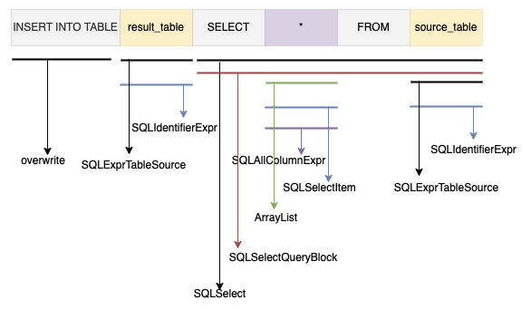

在数据仓库中我们维护了大量的开发任务，但是随着业务的发展、数据处理逻辑的更迭，以及人员变动等原因，这些开发任务越来越复杂以及越来越难维护。由于不同时期、不同开发同学的开发规范不同会给任务带来一定的风险隐患。这时候就需要通过数据治理来规避其中的风险。可以是事后治理，即通过离线任务筛选出不符合规范的任务，也可以是事前治理，即在任务上线前进行检查操作。无论是事前还是事后都需要一种检查器帮助用户发现问题。

针对数据研发，我们提供了不同的数据治理检查器，下面提供几个示例。

## 1. 禁止使用 SLECT * 检查器

如果任务中存在 SELECT * 用法，未指定查询字段会增加计算资源的消耗。因此这个检查器的用途就是判断任务是否存在 SELECT * 用法。初看这个需求觉得非常简单，首先想到的就是使用正则表达式进行匹配。但是使用正则表达式需要考虑很多特殊情况，实际做下来并没有想象中的那么简单，例如如下 SQL：
```sql
SELECT user_name
FROM user
WHERE user_id = '1' AND desc LIKE '%select *%';
```
上述示例在使用正则表达式匹配时需要考虑单双引号中的 `SLECT *`，这样处理起来就麻烦了。

因此在这我们选择使用 Druid SQL Parser 来将 SQL 解析生成对应的抽象语法树：


通过上面的抽象语法树可以看到判断 SQL 是否是 `SELECT *` 只需要判断抽象语法树中是否有 `SQLAllColumnExpr` 表达式即可：


先试想一下如果我们想查询一个 SQL 中是否有 `SQLAllColumnExpr` 表达式，我们需要查询所有子查询下的全部字段(因为可能会有嵌套查询、JOIN 查询等)，这就需要我们实现递归遍历一层一层的查询字段。幸运的是，Druid SQL Parser 为我们能提供了不同的 Visitor，只需要继承并在 visit 方法中实现我们自己的逻辑即可快速实现我们想要的遍历：
```java
// 质量规则1：禁止使用 SELECT *
public class SelectAllQualityRuleVisitor extends HiveSchemaStatVisitor {
    // 是否是 SELECT *
    private boolean isSelectAll = false;
    @Override
    public boolean visit(SQLSelectQueryBlock queryBlock) {
        // 是否有 SELECT *
        List<SQLSelectItem> selectList = queryBlock.getSelectList();
        for (SQLSelectItem selectItem : selectList) {
            SQLExpr expr = selectItem.getExpr();
            if (expr instanceof SQLAllColumnExpr) {
                isSelectAll = true;
                return false;
            }
        }
        return false;
    }
}
```
需要注意的是如下直接遍历 `SQLAllColumnExpr` 的方式是不可以的，因为像 `COUNT(*)` 这种语法也存在 `SQLAllColumnExpr`：
```java
@Override
public boolean visit(SQLAllColumnExpr expr) {
    // 是否有 SELECT *
    isSelectAll = true;
    return false;
}
```

上面我们实现了一个 `禁止使用 SELECT *` 检查器规则的 Visitor，下面只需要使用 Visitor 解析抽象语法树即可判断 SQL 中是否使用到了 `SELECT *`：
```java
public void parseQualityRule(String sql) {
    // 解析
    HiveStatementParser parser = new HiveStatementParser(sql);
    SQLStatement statement = parser.parseStatement();

    // 规则1：禁止使用 SELECT *
    SelectAllQualityRuleVisitor selectAllVisitor = new SelectAllQualityRuleVisitor();
    statement.accept(selectAllVisitor);
    if (selectAllVisitor.isSelectAll) {
        System.out.println("触发【规则】禁止使用 SELECT *");
    } else {
        System.out.println("未触发【规则】禁止使用 SELECT *");
    }
}
```
这样我们就完成了一个 `禁止使用 SELECT *` 检查器，下面来验证一下：
```java
@Test
public void testSelectAll() {
    // 触发【规则】禁止使用 SELECT *
    String sql = "SELECT * FROM user WHERE user_id = '1' AND desc LIKE '%select *%'";
    parseQualityRule(sql);
}

@Test
public void testSelectName() {
    // 未触发【规则】禁止使用 SELECT *
    String sql = "SELECT user_name FROM user WHERE user_id = '1' AND desc LIKE '%select *%'";
    parseQualityRule(sql);
}

@Test
public void testSelectAggregate() {
    // 未触发【规则】禁止使用 SELECT *
    String sql = "SELECT COUNT(*) FROM user";
    parseQualityRule(sql);
}
```

## 2. 禁止使用 INSERT INTO SELECT 检查器

如果 SQL 任务中存在仅包含使用 `INSERT INTO SELECT` 往目标表写入数据，当任务重跑时会造成数据重复写入的正确性问题。因此这个检查器的用途就是判断任务是否存在 `INSERT INTO SELECT` 用法。例如如下 SQL：
```sql
INSERT INTO result_table
SELECT * FROM source_table;
```
跟第一个规则一样在这我们选择使用 Druid SQL Parser 来将 SQL 解析生成对应的抽象语法树：



通过上面的抽象语法树可以看到判断 SQL 是否存在 `INSERT INTO SELECT` 语法需要判断抽象语法树中是否有 `SQLSelect` 查询以及 `HiveInsertStatement` 中的 `overwrite` 属性是否为 false：


通过第一个规则可以知道只需要继承 `HiveSchemaStatVisitor` 并在 visit 方法中实现判断逻辑：
```java
// 质量规则2：禁止使用 INSERT INTO SELECT
public class InsertIntoSelectQualityRuleVisitor extends HiveSchemaStatVisitor {
    // 是否是 INSERT INTO SELECT
    private boolean isInsertIntoSelect = false;

    @Override
    public boolean visit(HiveInsertStatement insertStatement) {
        boolean overwrite = insertStatement.isOverwrite();
        SQLSelect query = insertStatement.getQuery();
        if (!overwrite && !Objects.equals(query, null)) {
            isInsertIntoSelect = true;
        }
        return false;
    }
}
```
上面我们实现了一个 `禁止使用 INSERT INTO SELECT` 检查器规则的 Visitor，下面只需要使用 Visitor 解析抽象语法树即可判断 SQL 中是否使用到了 `INSERT INTO SELECT` 语法：
```java
// 解析
HiveStatementParser parser = new HiveStatementParser(sql);
SQLStatement statement = parser.parseStatement();
// 访问者模式遍历抽象语法树

// 规则2：禁止使用 SELECT *
InsertIntoSelectQualityRuleVisitor insertIntoVisitor = new InsertIntoSelectQualityRuleVisitor();
statement.accept(insertIntoVisitor);
if (insertIntoVisitor.isInsertIntoSelect) {
    System.out.println("触发【规则】禁止使用 INSERT INTO SELECT");
} else {
    System.out.println("未触发【规则】禁止使用 INSERT INTO SELECT");
}
```
这样我们就完成了一个 `禁止使用 INSERT INTO SELECT` 检查器，下面来验证一下：
```java
@Test
public void testInsertSelect() {
    // 触发【规则】禁止使用 INSERT INTO SELECT
    String sql = "INSERT INTO result_table SELECT * FROM source_table";
    parseQualityRule(sql);
}

@Test
public void testInsertValues() {
    // 未触发【规则】禁止使用 INSERT INTO SELECT
    String sql = "INSERT INTO Websites (name, country) VALUES ('百度', 'CN')";
    parseQualityRule(sql);
}

@Test
public void testInsertOverwrite() {
    // 未触发【规则】禁止使用 INSERT INTO SELECT
    String sql = "INSERT OVERWRITE Websites (name, country) VALUES ('百度', 'CN')";
    parseQualityRule(sql);
}
```
## 3. 禁止使用简单加工检查器

一般我们在 SQL 中会禁止使用简单加工。简单加工的检查逻辑相对上面两个检查器要复杂很多，因为判断条件多了不少，判断条件简单梳理如下所示：
- 对整体 SQL 任务来说
  - 只要任意一个 SQLStatement 存在简单加工，整体则为简单加工
  - 对于 UnionQuery，任意一个存在简单加工，整体则为简单加工
- 对单个 SQLSelectQuery 来说
  - 存在 JOIN、GroupBy、OrderBy、ClusterBy、DistributeBy、SortBy 语句不算简单加工
  - 没有 Where 子句不算简单加工
  - 存在开窗不算简单加工
  - 存在嵌套子查询语句不算简单加工
  - 存在聚合函数不算简单加工

> 你可以为简单加工检查器添加其他的判断条件

判断是否使用了简单加工需要通过解析抽象语法树一步一步的判断上述梳理的判断条件：


跟其他规则一样只需要继承 `HiveSchemaStatVisitor` 并在 visit 方法中实现判断逻辑：
```java
// 质量规则3：禁止使用简单查询
public class SimpleQueryQualityRuleVisitor extends HiveSchemaStatVisitor {
    // 是否是简单查询
    private boolean isSimpleQuery = false;

    @Override
    public boolean visit(SQLUnionQuery query) {
        // 是否有 UNION 查询
        isSimpleQuery = false;
        return false;
    }

    @Override
    public boolean visit(SQLSelectQueryBlock queryBlock) {
        // 是否有去重
        if (queryBlock.isDistinct()) {
            isSimpleQuery = false;
            return false;
        }
        // 是否有分组
        if (!Objects.equals(queryBlock.getGroupBy(), null)) {
            isSimpleQuery = false;
            return false;
        }
        // 是否有排序
        if (!Objects.equals(queryBlock.getOrderBy(), null)) {
            isSimpleQuery = false;
            return false;
        }
        if (queryBlock.getClusterBy().size() > 0) {
            isSimpleQuery = false;
            return false;
        }
        if (queryBlock.getDistributeBy().size() > 0) {
            isSimpleQuery = false;
            return false;
        }
        if (queryBlock.getSortBy().size() > 0) {
            isSimpleQuery = false;
            return false;
        }
        // Where 是否为空
        if (Objects.equals(queryBlock.getWhere(), null)) {
            isSimpleQuery = false;
            return false;
        }
        // 是否有开窗
        if (!Objects.equals(queryBlock.getWindows(), null)) {
            isSimpleQuery = false;
            return false;
        }
        // 2. 获取 FROM
        SQLTableSource from = queryBlock.getFrom();
        // 是否有JOIN
        if (from instanceof SQLJoinTableSource) {
            isSimpleQuery = false;
            return false;
        }
        // 是否有子查询
        if (from instanceof SQLSubqueryTableSource) {
            isSimpleQuery = false;
            return false;
        }
        // 3. 获取 SELECT
        List<SQLSelectItem> selectList = queryBlock.getSelectList();
        for (SQLSelectItem item : selectList) {
            SQLExpr expr = item.getExpr();
            // 是否有聚合函数
            if (expr instanceof SQLAggregateExpr) {
                isSimpleQuery = false;
                return false;
            }
        }
        isSimpleQuery = true;
        return false;
    }
}
```
上面我们实现了一个 `禁止使用简单加工` 检查器规则的 Visitor，下面只需要使用上面定义的 Visitor 解析抽象语法树即可判断：
```java
public void parseQualityRule(String sql) {
    // 解析
    HiveStatementParser parser = new HiveStatementParser(sql);
    SQLStatement statement = parser.parseStatement();
    // 访问者模式遍历抽象语法树
    // 规则3：禁止使用简单查询
    SimpleQueryQualityRuleVisitor simpleQueryVisitor = new SimpleQueryQualityRuleVisitor();
    statement.accept(simpleQueryVisitor);
    if (simpleQueryVisitor.isSimpleQuery) {
        System.out.println("触发【规则】禁止使用简单查询");
    } else {
        System.out.println("未触发【规则】禁止使用简单查询");
    }
}
```
这样我们就完成了一个 `禁止使用简单加工` 的检查器，下面来验证一下：
```java
@Test
public void testWhere() {
    // 触发【规则】禁止使用简单查询
    String sql = "SELECT * FROM user WHERE user_ud = '1'";
    parseQualityRule(sql);
}

@Test
public void testUnion() {
    // 未触发【规则】禁止使用简单查询
    String sql = "SELECT * FROM user WHERE user_id = '1' UNION ALL SELECT * FROM user WHERE user_id = '2'";
    parseQualityRule(sql);
}

@Test
public void testGroupBy() {
    // 未触发【规则】禁止使用简单查询
    String sql = "SELECT gender, COUNT(*) AS uv FROM user GroupBy gender";
    parseQualityRule(sql);
}

@Test
public void testOrderBy() {
    // 未触发【规则】禁止使用简单查询
    String sql = "SELECT user_id, age FROM user OrderBy age";
    parseQualityRule(sql);
}

@Test
public void testSubQuery() {
    // 未触发【规则】禁止使用简单查询
    String sql = "SELECT id, name\n" +
            "FROM (\n" +
            "  SELECT id, name FROM user\n" +
            ") AS a";
    parseQualityRule(sql);
}

@Test
public void testAggregateFunction() {
    // 未触发【规则】禁止使用简单查询
    String sql = "SELECT COUNT(*) FROM user";
    parseQualityRule(sql);
}

@Test
public void testWindow() {
    // 未触发【规则】禁止使用简单查询
    String sql = "SELECT user_id, ROW_NUMBER() OVER(PARTITION BY class_id ORDER BY score DESC) AS rank FROM user";
    parseQualityRule(sql);
}
```
