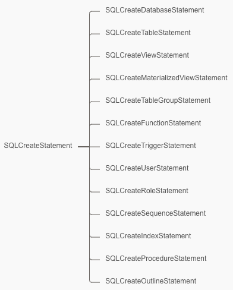
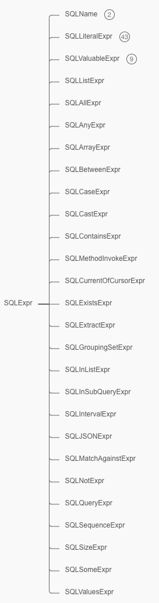
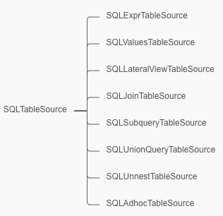
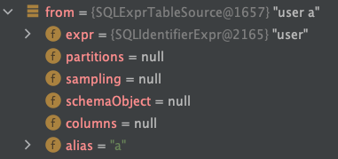
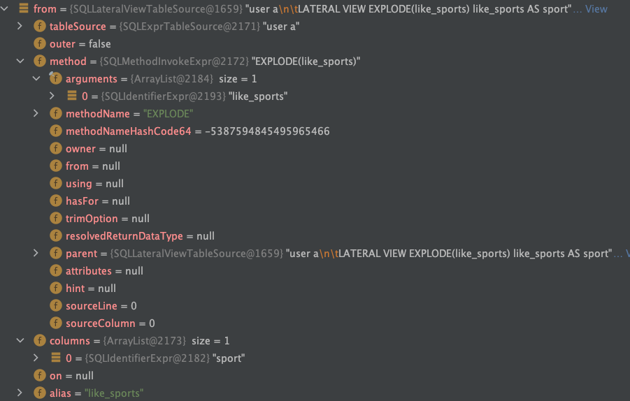
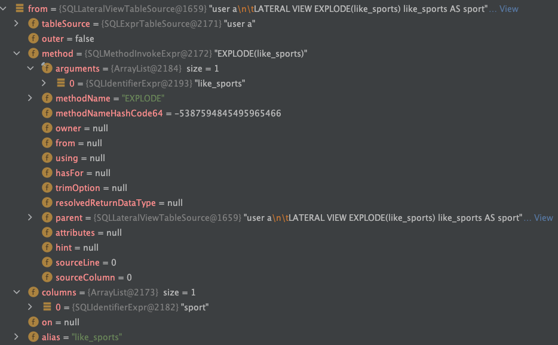
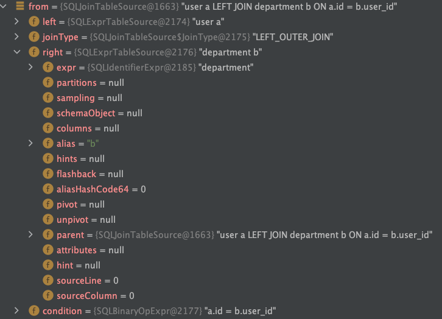
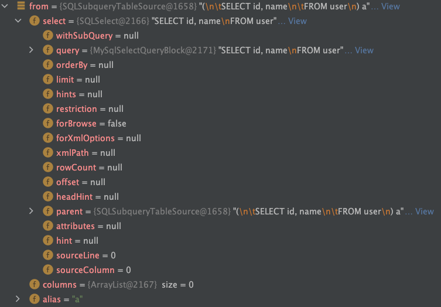

## 1. 什么是 AST

AST 是 abstract syntax tree 的缩写，也就是抽象语法树。和所有的 Parser 一样，Druid Parser 也会生成一个抽象语法树。

## 2. AST 节点类型

在 Druid SQL Parser 中，SQLObject 对象是 Druid 体系中的顶层接口，用于描述 AST 节点类型，主要包括 SQLStatement、SQLExpr、SQLTableSource 等抽象类型：
```java
public interface SQLObject {
    ...
}

public interface SQLExpr extends SQLObject, Cloneable {
    ...
}

public interface SQLDbTypedObject extends SQLObject {
    ...
}

public interface SQLStatement extends SQLObject, SQLDbTypedObject {
    ...
}

public interface SQLTableSource extends SQLObject {
    ...
}
```

### 2.1 SQLStatemment

SQLStatement 表示一条 SQL 语句，SQL 按其功能可以分为 4 类：
- DDL：数据定义语言，用来操作数据库、表、列等。主要语句有 CREATE、ALTER 和 DROP。
- DML：数据操作语言，用来操作数据库中表里的数据。主要语句有 INSERT、UPDATE 和 DELETE。
- DQL：数据查询语言，用来查询数据。核心语句为 SELECT。
- DCL：数据控制语言，用来操作访问权限和安全级别。主要语句有 GRANT、DENY 等。

#### 2.1.1 DDL 数据定义语言语句

DDL 数据定义语言语句通过 SQLDDLStatement 接口进行抽象：
```java
public interface SQLDDLStatement extends SQLStatement {
    default DDLObjectType getDDLObjectType() {
        return DDLObjectType.OTHER;
    }

    enum DDLObjectType {
        DATABASE,
        TABLE,
        VIEW,
        MATERIALIZED_VIEW,
        TABLE_SPACE,
        TABLE_GROUP,
        FUNCTION,
        TRIGGER,
        USER,
        ROLE,
        SEQUENCE,
        INDEX,
        PROCEDURE,
        TYPE,
        OTHER
    }
}
```
DDL 语句主要有 CREATE、ALTER 和 DROP 三类，因此 SQLDDLStatement 分别对应细分 SQLCreateStatement、SQLAlterStatement、SQLDropStatement 三类：
```java
public interface SQLCreateStatement extends SQLDDLStatement {
    default SQLName getName() {
        return null;
    }
}

public interface SQLAlterStatement extends SQLDDLStatement {
    default DDLObjectType getDDLObjectType() {
        return DDLObjectType.OTHER;
    }
}

public interface SQLDropStatement extends SQLDDLStatement {
    default SQLName getName() {
        return null;
    }
}
```
根据 DDL 对象类型 DDLObjectType 的不同，又分为不同类型的 Statement，以 SQLCreateStatement 为例：



如下是解析 MySQL 的 CREATE、ALTER 和 DROP DDL 语句生成抽象语法树 AST 的示例：
```java
// Create 语句
String createSQL = "CREATE TABLE user (id int, name varchar(255), age int)";
SQLStatement createStatement = SQLUtils.parseSingleMysqlStatement(createSQL);
System.out.println("CREATE: " + (createStatement instanceof SQLCreateStatement)); // true

// Alter 语句
String alterSQL = "ALTER TABLE user ADD age int;";
SQLStatement alterStatement = SQLUtils.parseSingleMysqlStatement(alterSQL);
System.out.println("ALTER: " + (alterStatement instanceof SQLAlterStatement)); // true

// Drop 语句
String dropSQL = "DROP TABLE user";
SQLStatement dropStatement = SQLUtils.parseSingleMysqlStatement(dropSQL);
System.out.println("DROP: " + (dropStatement instanceof SQLDropStatement)); // true
```

#### 2.1.2 DML 数据操作语言语句

DML 数据操作语言语句通过继承 SQLStatementImpl 抽象类实现：
```java
public abstract class SQLStatementImpl extends SQLObjectImpl implements SQLStatement {
    ...
}
```
DML 语句主要有 Insert、Update 和 Delete 三类，分别通过 SQLInsertStatement、SQLUpdateStatement、SQLDeleteStatement 类实现：
```java
// 插入语句
public abstract class SQLInsertInto extends SQLStatementImpl implements SQLReplaceable {
    ...
}

public class SQLInsertStatement extends SQLInsertInto implements SQLStatement {
    ...
}

// 更新语句
public class SQLUpdateStatement extends SQLStatementImpl implements SQLReplaceable {
    ...
}

// 删除语句
public class SQLDeleteStatement extends SQLStatementImpl implements SQLReplaceable {
    ...
}
```
如下是解析 MySQL 的 Insert、Update 和 Delete DML 语句生成抽象语法树 AST 的示例：
```java
// Insert 语句
String insertSQL = "insert into user(id,name,age) values (1,'Lucy',21)";
SQLStatement insertStatement = SQLUtils.parseSingleMysqlStatement(insertSQL);
System.out.println("INSERT: " + (insertStatement instanceof SQLInsertStatement)); // true

// Update 语句
String updateSQL = "update user set name = 'Tom' where id = 1";
SQLStatement updateStatement = SQLUtils.parseSingleMysqlStatement(updateSQL);
System.out.println("UPDATE: " + (updateStatement instanceof SQLUpdateStatement)); // true

// Delete 语句
String deleteSQL = "delete from user where id = 1";
SQLStatement deleteStatement = SQLUtils.parseSingleMysqlStatement(deleteSQL);
System.out.println("DELETE: " + (deleteStatement instanceof SQLDeleteStatement)); // true
```
#### 2.1.3 DQL 数据查询语言语句

DQL 数据查询语言语句也是通过继承 SQLStatementImpl 抽象类实现。DQL 语句只有 SELECT 语句，通过 SQLSelectStatement 类实现：
```java
public class SQLSelectStatement extends SQLStatementImpl {
    protected SQLSelect select;
    ...
}
```
SQLSelectStatement 包含一个 SQLSelect，对应一个 SELECT 查询。

如下是解析 MySQL 的 SELECT DQL 语句生成抽象语法树 AST 的示例：
```java
// Select 语句
String selectSQL = "select id,name,age from user";
SQLStatement selectStatement = SQLUtils.parseSingleMysqlStatement(selectSQL);
System.out.println("SELECT: " + (selectStatement instanceof SQLSelectStatement)); // true
```

### 2.2 SQLExpr

SQLExpr 是表示 SQL 语句中表达式的顶层接口，具体可以细分很多实现类：



我们以下面的 SQL 为例介绍 SQL 中涉及的几个 SQLExpr：
```sql
SELECT name, tag['id'] AS id
FROM user_profile_user
LATERAL VIEW EXPLODE(tags) tags AS tag
WHERE age >= 18 AND name = 'Lily'
```
首先 SELECT 子句中的 `name` 对应一种 SQLIdentifierExpr 标识符表达式，是 SQLName 中的一种(除此之外还有一种 `SQLPropertyExpr`)：
```java
public interface SQLName extends SQLExpr {
    ...
}

public final class SQLIdentifierExpr extends SQLExprImpl implements SQLName, Comparable<SQLIdentifierExpr> {
    protected String name;
    ...
}

public final class SQLPropertyExpr extends SQLExprImpl implements SQLName, SQLReplaceable, Comparable<SQLPropertyExpr> {
    private SQLExpr owner;
    private String splitString;
    private String name;
    ...
}
```
SELECT 子句中的 `tag['id']` 对应一种 SQLArrayExpr 数组表达式，包含一个数组名称表达式的 `expr` 以及一个数组值表达式列表的 values：
```java
public class SQLArrayExpr extends SQLExprImpl implements SQLReplaceable {
    private SQLExpr expr;
    private List<SQLExpr> values = new ArrayList<SQLExpr>();
    ...
}
```
上面例子中 expr 是 SQLIdentifierExpr 的 `tag`，values 中是 SQLCharExpr 的 `"id"`。SQLCharExpr 是一种比较简单的字符表达式。

FROM 子句中的 `EXPLODE(tags)` 是一种 `SQLMethodInvokeExpr` 方法调用的表达式，核心关注的是参数表达式列表 arguments 以及字符串的 methodName：
```java
public class SQLMethodInvokeExpr extends SQLExprImpl implements SQLReplaceable, Serializable {
    protected final List<SQLExpr> arguments = new ArrayList<SQLExpr>();
    protected String methodName;
    protected long methodNameHashCode64;
    protected SQLExpr owner;
    protected SQLExpr from;
    protected SQLExpr using;
    protected SQLExpr hasFor;
    protected String trimOption;
    protected transient SQLDataType resolvedReturnDataType;
    ...
}
```
在上面例子中调用的方法名 methodName 为 `EXPLODE`，参数表达式列表 arguments 中只有一个类型为 SQLIdentifierExpr 的 `tags`。

WHERE 子句中的 `age >= 18 AND name = 'Lily'` 是一种 SQLBinaryOpExpr 二维运算表达式，核心包括三部分：左运算表达式，右运算表达式以及运算法：
```java
public class SQLBinaryOpExpr extends SQLExprImpl implements SQLReplaceable, Serializable, SQLDbTypedObject, Comparable<SQLBinaryOpExpr> {
    private static final long serialVersionUID = 1L;
    protected SQLExpr left;
    protected SQLExpr right;
    protected SQLBinaryOperator operator;
    ...
}
```
在上面例子中左运算表达式 left 同样为 `SQLBinaryOpExpr` 的 `age >= 18`，右运算表达式 right 同样为 `SQLBinaryOpExpr` 的 `name = 'Lily'`，运算符 operator 为 `BooleanAnd`。先看表达式 `age >= 18`，左运算表达式 left 为 SQLIdentifierExpr 的 `age`，右运算表达式 right 为 SQLIntegerExpr 的 `18`，运算符为 operator 为 `GreaterThanOrEqual`。然后看一下表达式 `name = 'Lily'`，左运算表达式 left 为 SQLIdentifierExpr 的 `name`，右运算表达式 right 为 SQLCharExpr 的 `"Lily"`，运算符为 operator 为 `Equality`。

### 2.3 SQLTableSource

SQLTableSource 是 SQL 语句中表示数据源表的顶层接口，常见的 SQLTableSource 实现有 SQLExprTableSource、SQLValuesTableSource、SQLLateralViewTableSource、SQLJoinTableSource、SQLSubqueryTableSource 等：



下面我们通过几个 SQL 来介绍常见的几个 SQLTableSource。

#### 2.3.1 SQLExprTableSource

下面示例中的 FROM 子句对应 `SQLExprTableSource`：
```sql
SELECT id,name,age FROM user a
```
SQLExprTableSource 的数据源表比较简单，核心由 SQL 表达式构成：
```java
public class SQLExprTableSource extends SQLTableSourceImpl implements SQLReplaceable {
    protected SQLExpr expr;
    protected List<SQLName> partitions;
    protected SQLTableSampling sampling;
    protected SchemaObject schemaObject;

    protected List<SQLName> columns;
    ...
}
```
上面示例 `SQLExprTableSource` 中的 `user` 是一个 SQLIdentifierExpr 表达式，`a` 是对应的别名：



#### 2.3.2 SQLValuesTableSource

下面示例中的 FROM 子句对应 `SQLValuesTableSource`：
```sql
SELECT id, name
FROM Values ('1', 'Lucy'),('2', 'Lily') t(id, name)
```
`SQLValuesTableSource` 包括一个名为 `values` 的 `SQLListExpr` 数组(表示字段值)以及一个名为 `columns` 的 `SQLName` 数组(表示字段)：
```java
public class SQLValuesTableSource extends SQLTableSourceImpl implements SQLSelectQuery, SQLReplaceable {
    private List<SQLListExpr> values = new ArrayList<SQLListExpr>();
    private List<SQLName> columns = new ArrayList<SQLName>();
    ...
}
```
在上述示例中 `values` 包含两个类型为 `SQLListExpr` 的元素，第一个元素对应 `('1', 'Lucy')`，第二个元素对应 `('2', 'Lily')`，每个元素都是一个 ArrayList。第一个元素数组下包含两个 `SQLCharExpr` 类型的子元素 `1` 和 `Lucy`，第二个元素的子元素是 `2` 和 `Lily`；`columns` 包含两个类型为 `SQLIdentifierExpr` 的元素 `id` 和 `name`：



#### 2.3.3 SQLLateralViewTableSource

下面示例中的 FROM 子句对应 `SQLLateralViewTableSource`：
```sql
SELECT sport
FROM user AS a
LATERAL VIEW EXPLODE(like_sports) like_sports AS sport
```
`SQLLateralViewTableSource` 包括一个名为 `tableSource` 的 `SQLTableSource`、一个名为 `method` 的 `SQLMethodInvokeExpr`以及一个名为 `columns` 的 `SQLName` 数组：
```java
public class SQLLateralViewTableSource extends SQLTableSourceImpl {
    private SQLTableSource tableSource;
    private SQLMethodInvokeExpr method;
    private List<SQLName> columns = new ArrayList<SQLName>(2);
    ...
}
```
在上述示例中 `tableSource` 是一个 `SQLExprTableSource`，上面已经介绍过实际是表示的是数据源表 `user`；`method` 是一个方法调用表达式 `SQLMethodInvokeExpr`，实际表示的是 LATERAL VIEW 使用的 UDTF 函数 `EXPLODE`，arguments 中只有一个参数 `like_sports`；`columns` 包含一个类型为 `SQLIdentifierExpr` 的字段元素 `sport`：



#### 2.3.4 SQLJoinTableSource

下面示例中的 FROM 子句对应 `SQLJoinTableSource`：
```sql
SELECT a.id, a.name, a.age, b.department_name
FROM user AS a
LEFT OUTER JOIN department AS b
ON a.id = b.user_id
```
`SQLJoinTableSource` 核心包括一个名为 `left` 和 `right` 的 `SQLTableSource`、一个名为 `joinType` 的 `JoinType`以及一个名为 `condition` 的 `SQLExpr`：
```java
public class SQLJoinTableSource extends SQLTableSourceImpl implements SQLReplaceable {
    protected SQLTableSource left;
    protected SQLTableSource right;
    protected JoinType joinType;
    protected SQLExpr condition;
    ...
}
```
在上述示例中 JOIN 左表(`left`)和右表(`right`)均是 `SQLExprTableSource`，当然也可以是其他的 `SQLTableSource`；`joinType` 表示连接类型，在上述例子中表示一个左外连接，对应 `LEFT OUTER JOIN` 语句；`condition` 表示连接条件，在上述例子中对应 `a.id = b.user_id`。



#### 2.3.5 SQLSubqueryTableSource

下面示例中的 FROM 子句对应 `SQLSubqueryTableSource`：
```sql
SELECT id, name
FROM (
  SELECT id, name FROM user
) AS a
```
`SQLSubqueryTableSource` 包括一个名为 `select` 的 `SQLSelect` 以及一个名为 `columns` 的 `SQLName` 数组：：
```java
public class SQLSubqueryTableSource extends SQLTableSourceImpl {
    protected SQLSelect select;
    protected List<SQLName> columns = new ArrayList<SQLName>();
    ...
}
```
在上述示例中 `select` 是一个 `SQLSelect` 对应一个子查询：



## 3. 怎么产生 AST 节点


https://github.com/alibaba/druid/wiki/Druid_SQL_AST#2-%E5%9C%A8druid-sql-parser%E4%B8%AD%E6%9C%89%E5%93%AA%E4%BA%9Bast%E8%8A%82%E7%82%B9%E7%B1%BB%E5%9E%8B
