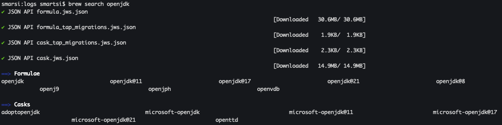

jenv 是一个轻量级的 Java 版本管理工具，可以帮助你在 macOS/Linux 上轻松安装、切换和管理多个 JDK 版本。下面详细介绍如何使用 jenv 管理多个 JDK 版本。

## 1. 安装 jenv

推荐使用 Homebrew 安装 jenv 工具来管理多个 JDK 版本:
```
brew install jenv
```

安装完成后，根据 shell 类型（bash/zsh）配置环境变量：在这，配置 `~/.bash_profile` 文件，添加如下信息：
```
# JENV
export JENV_HOME=.jenv
export PATH=$JENV_HOME/bin:$PATH
eval "$(jenv init -)"
```
重新加载配置使之生效:
```
source ~/.bash_profile
```
验证安装:
```
smarsi:~ smartsi$ jenv doctor
[OK]	No JAVA_HOME set
[OK]	Java binaries in path are jenv shims
[OK]	Jenv is correctly loaded
```
如果一切正常，会显示'Jenv is correctly loaded'。

需要注意的是 `~/.bash_profile` 环境变量中不要配置 `JAVA_HOME`，否则会出现如下异常：
```
smarsi:~ smartsi$ jenv doctor
[ERROR]	JAVA_HOME variable already set, scripts that use it directly could not use java version set by jenv
[ERROR]	Java binary in path is not in the jenv shims.
[ERROR]	Please check your path, or try using /path/to/java/home is not a valid path to java installation.
	PATH : /opt/homebrew/Cellar/jenv/0.5.7/libexec/libexec:/Users/smartsi/.nvm/versions/node/v24.13.1/bin:/opt/homebrew/bin:/opt/homebrew/sbin:/opt/workspace/maven/bin:/opt/workspace/zookeeper/bin:/opt/workspace/kafka/bin:/opt/workspace/spark/bin:/opt/workspace/hive/bin:/opt/workspace/hadoop/bin:/usr/local/mysql/bin:/Library/Java/JavaVirtualMachines/jdk-1.8.jdk/Contents/Home/bin:/usr/local/bin:/System/Cryptexes/App/usr/bin:/usr/bin:/bin:/usr/sbin:/sbin:/var/run/com.apple.security.cryptexd/codex.system/bootstrap/usr/local/bin:/var/run/com.apple.security.cryptexd/codex.system/bootstrap/usr/bin:/var/run/com.apple.security.cryptexd/codex.system/bootstrap/usr/appleinternal/bin:/Applications/iTerm.app/Contents/Resources/utilities
[ERROR]	Jenv is not loaded in your bash
[ERROR]	To fix : 	echo 'eval "$(jenv init -)"' >> /Users/smartsi/.bash_profile
```

## 2. 安装多 JDK 版本

jenv 本身不安装 JDK，你需要先通过其他方式安装好 JDK。这里以 Homebrew 安装 OpenJDK 为例。首先使用 `brew search openjdk` 命令搜索可用的 JDK 版本：



### 2.1 如何选择 JDK

从上面可以看到 有两种 JDK，一种是使用 formula 安装 OpenJDK，另一种是使用 cask 安装 Oracle JDK 或其他供应商的 JDK。区别在于安装方式、位置和管理方式：

| 特性 | Formulae | Casks |
|------|----------|-------|
| **适用对象** | 命令行工具、库、开发包（如 OpenJDK、Maven、Git） | 原生 GUI 应用程序（如 IntelliJ IDEA、Oracle JDK 安装包） |
| **安装位置** | 通常链接到 `/usr/local`（或 `/opt/homebrew`，Apple Silicon）下的 `bin`、`lib` 等目录 | 安装在 `/Applications` 或用户指定的 Applications 目录 |
| **安装内容** | 下载预编译二进制或源码编译，然后通过符号链接集成到系统环境 | 下载 `.app` 或安装器，拖拽或运行安装程序 |
| **JDK 实例** | `brew install openjdk`（安装 OpenJDK 的 Homebrew 移植版） | `brew install --cask oracle-jdk` 或 `brew install --cask adoptopenjdk`（安装官方或其他供应商的 JDK 安装包） |
| **环境配置** | 安装后通常会自动处理路径（如将 `openjdk` 加入 PATH），或需要手动链接 | 安装后需要手动设置 `JAVA_HOME` 或通过 `/usr/libexec/java_home` 工具管理 |

当你需要运行 Java 程序时，是选择 Formulae 还是 Casks？当 **纯命令行开发/运行**  场景时推荐 **Formulae**（如 `brew install openjdk@17`）。推荐原因是：安装快捷，自动加入 PATH，便于终端操作，版本切换灵活（配合 `jenv`）。

### 2.2 安装 JDK

在这选择使用 formula 安装 OpenJDK，以 `openjdk@17` 为例：
```
brew install openjdk@17
```
> 注意 Mac apple 芯片安装 openjdk@8 会报错: `The x86_64 architecture is required for this software`. 因此安装 jdk8 可以直接从 Oracle 官网上下载免费版本进行安装。

Homebrew 会将 JDK 安装在 `/usr/local/opt/openjdk@<version>`（Intel） 或 `/opt/homebrew/opt/openjdk@<version>`（Apple Silicon） 下。在这 JDK 安装路径为 `/opt/homebrew/opt/openjdk@17`

> `/opt/homebrew` 为 homebrew 安装路径。

> 通过安装包安装的 JDK 安装路径一般为 `/Library/Java/JavaVirtualMachines/`

### 2.3 将 JDK 添加到 jenv

使用 `jenv add` 命令将 JDK 的主目录路径添加进去。Homebrew 安装的 OpenJDK 路径通常是 `/usr/local/opt/openjdk@<version>` 或 `/opt/homebrew/opt/openjdk@<version>`。我们可以通过以下命令添加：
```
# 添加 OpenJDK 17
jenv add /opt/homebrew/opt/openjdk@17

# 添加 OpenJDK 11
jenv add /opt/homebrew/opt/openjdk@11
```
也可以将通过安装包安装的所有 JDK（如 Oracle JDK）添加到到 jenv:
```
jenv add /Library/Java/JavaVirtualMachines/*/Contents/Home
```
添加成功后，jenv 会给每个 JDK 分配一个简单的名称（如 11.0、17.0 等），你可以用 jenv versions 查看：
```
smarsi:JavaVirtualMachines smartsi$ jenv versions
* system (set by /Users/smartsi/.jenv/version)
  1.8
  1.8.0.461
  11
  11.0
  11.0.27
  17
  17.0
  17.0.15
  openjdk64-11.0.27
  openjdk64-17.0.15
  oracle64-1.8.0.461
```

## 3. 管理 JDK 版本

### 3.1 设置全局默认版本
```
smarsi:~ smartsi$ java -version
java version "1.8.0_461"
Java(TM) SE Runtime Environment (build 1.8.0_461-b11)
Java HotSpot(TM) 64-Bit Server VM (build 25.461-b11, mixed mode)
smarsi:~ smartsi$ jenv global 17.0
smarsi:~ smartsi$ java -version
openjdk version "17.0.15" 2025-04-15
OpenJDK Runtime Environment Homebrew (build 17.0.15+0)
OpenJDK 64-Bit Server VM Homebrew (build 17.0.15+0, mixed mode, sharing)
smarsi:~ smartsi$ jenv global 1.8
smarsi:~ smartsi$ java -version
java version "1.8.0_461"
Java(TM) SE Runtime Environment (build 1.8.0_461-b11)
Java HotSpot(TM) 64-Bit Server VM (build 25.461-b11, mixed mode)
```
`jenv global 17.0` 命令会将系统默认 Java 版本设置为 17.0，后续所有新打开的终端都会使用此版本。

### 3.2 为当前目录设置局部版本

进入你的项目目录，运行：
```
smarsi:~ smartsi$ cd /opt/workspace/datavines
smarsi:datavines smartsi$
smarsi:datavines smartsi$
smarsi:datavines smartsi$ jenv local 17.0
smarsi:datavines smartsi$
smarsi:datavines smartsi$ java -version
openjdk version "17.0.15" 2025-04-15
OpenJDK Runtime Environment Homebrew (build 17.0.15+0)
OpenJDK 64-Bit Server VM Homebrew (build 17.0.15+0, mixed mode, sharing)
```
`jenv local 17.0` 命令会将 `/opt/workspace/datavines` 目录的 Java 版本设置为 17.0。这会在当前目录下生成一个 `.java-version` 文件，进入该目录时自动切换为 JDK 17，退出目录后恢复为全局版本。

### 3.3 为当前 shell 会话临时设置版本

该设置只对当前终端窗口有效，关闭后失效:
```
jenv shell 17.0
```

## 4. 卸载 JDK 或从 jenv 中移除

如果要从 jenv 中移除某个 JDK（不卸载 JDK 本身）：
```
jenv remove 11.0
```
如果要彻底卸载 JDK（如通过 Homebrew 安装的）：
```
brew uninstall openjdk@11
```

## 5. 配置 jenv 插件（推荐）

为了确保 `JAVA_HOME` 环境变量也能自动切换，建议启用 export 插件：
```
smarsi:logs smartsi$ jenv enable-plugin export
You may restart your session to activate jenv export plugin
export plugin activated
```
重启 shell 或执行 exec $SHELL -l 使配置生效。我们为 `/opt/workspace/datavines` 目录设置 Java 版本为 17.0，查看演示效果
```
smarsi:~ smartsi$ cd /opt/workspace/
smarsi:workspace smartsi$
smarsi:workspace smartsi$ echo $JAVA_HOME
/Users/smartsi/.jenv/versions/1.8
smarsi:workspace smartsi$
smarsi:workspace smartsi$ cd datavines
smarsi:datavines smartsi$
smarsi:datavines smartsi$ echo $JAVA_HOME
/Users/smartsi/.jenv/versions/17.0
```

## 5. 总结

通过 jenv，你可以轻松管理多个 JDK 版本，在不同项目间无缝切换，而无需手动修改环境变量。配合 Homebrew 安装 JDK，整个过程非常流畅。现在你可以愉快地在多个 Java 版本之间切换工作了！
