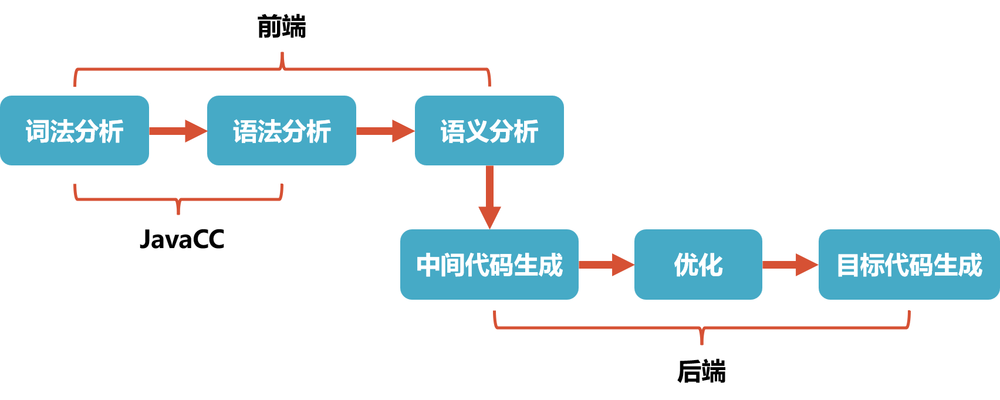

本文使用 JavaCC 实现表达式的解析, 并将解析结果生成为抽象语法树(Abstract Syntax Tree, AST)。实际上对于表达式这种简单的”语言”, 可以边解析边计算从而直接得出结果，生成抽象语法树有点”杀鸡焉用牛刀”了. 但是对于更加复杂的语言, 如通用计算机编程语言(C, Java等)或数据库查询语言SQL, 生成抽象语法树就是必须的了. 只有依托于抽象语法树才能进一步进行语义分析(如引用消解, 类型检查等), 代码生成或将SQL转化为关系代数等工作. 然而, 直接上手编写 JavaCC 的语法文件, 构建复杂语言的抽象语法树难度较大.

本文以表达式这个较为简单的”语言”为例, 通过编写 JavaCC 的语法文件将其转化为抽象语法树, 并使用 Visitor 模式访问抽象语法树对表达式进行计算. 这个例子可以说是”麻雀虽小, 五脏俱全”, 包含词法分析和语法分析的完整内容, 通过这个例子可以了解JavaCC语法文件的编写以及抽象语法树的构建方式, 在此基础上便可进一步构建更加复杂的语言的解析器. 本文的完整代码见这里.

## 1. JavaCC 介绍

### 1.1 JavaCC 功能

JavaCC的全称是 Java Compiler Compiler, 以下是其官网的介绍：
```
Java Compiler Compiler (JavaCC) is the most popular parser generator for use with Java applications.
A parser generator is a tool that reads a grammar specification and converts it to a Java program that can recognize matches to the grammar.

JavaCC 是 Java 应用程序中最流行的解析器(Parser)生成器。解析器生成器是一种工具, 它可以读取语法规范并将其转换为能够识别与语法匹配的Java程序.
```
在编译器实现中, 首先要做的就是词法分析和语法分析:
- 词法分析: 解析代码并生成 Token(一个单词的字面和它的种类及语义值)序列, 词法分析的实现一般称为扫描器(Scanner);
- 语法分析: 利用扫描器生成的 Token 序列来生成抽象语法树, 语法分析的实现一般称为解析器(Parser).



如果不依赖任何工具, 那就必须手写扫描器和解析器, 但是随着人们对编译原理的深入研究, 发现扫描器和解析器都可以根据一定的规则自动生成. 于是就出现了一系列的解析器生成器, 如Yacc, Anltr, JavaCC等. 这些解析器生成器都可以根据自定义的语法规则文件自动生成解析器代码, 比如 JavaCC 可以根据后缀为 `.jj` 的语法规则文件生成解析器的 Java 代码, 这就避免了手动编写扫描器和解析器的繁琐, 可以让我们专注于语法规则的设计.

### 1.2 JavaCC 语法文件

JavaCC 可根据用户编写的后缀名为 `.jj` 的语法规则文件自动生成解析器. 由于本文重点关注的是解析表达式并构建抽象语法树这个系统过程, 这里遵循”够用即可”的原则, 仅讲述在表达式解析中需要用到的语法. 关于 JavaCC 语法规则更详细的描述可阅读参考[JavaCC Tutorials](https://javacc.github.io/javacc/tutorials/) 和 [自制编译器](https://book.douban.com/subject/26806041/), 其中”自制编译器”的第一, 二部分对 JavaCC 的语法规则有详尽的解释, 推荐阅读.

JavaCC的语法文件一般包含如下内容：
```
options {
    JavaCC 的选项
}

PARSER_BEGIN(解析器类名)
package 包名;
import 库名;

public class 解析器类名 {
    任意的 Java 代码
}
PARSER_END(解析器类名)

扫描器的描述

解析器的描述
```
- 语法文件的开头是 JavaCC 选项的 options 块, 可以省略;
- PARSER_BEGIN 和 PARSER_END 之间是一个 Java 类, 可以支持任何 Java 语法, 这里定义的类成员变量或方法也能在解析器描述的 actions 中使用;
- 最后是扫描器的描述和解析器的描述, 后面会进一步介绍.

有了以上概念之后, 我们可以看如下语法文件 `Adder.jj`, 运行 `javacc Adder.jj` 命令即可生成一个 `Adder.java` 文件, 该文件是一个普通的 Java 类文件, 在命令行或 IDE 中编译运行后即可读取输入的整数加法表达式进行解析并计算.
```java
options {
    STATIC = false;
}

PARSER_BEGIN(Adder)
import java.io.*;

public class Adder {

  public static void main(String[] args){
    for (String arg : args) {
      try{
        System.out.println(evaluate(arg));
      } catch (ParseException e) {
        e.printStackTrace();
      }
    }
  }

  public static long evaluate(String src) throws ParseException {
    Reader reader = new StringReader(src);
    return new Adder(reader).expr();
  }
}

PARSER_END(Adder)

// 扫描器的描述
SKIP : { <[" ", "\t", "\r", "\n"]> }

TOKEN : { <INTEGER: (["0"-"9"])+> }

// 解析器的描述
long expr():
{
  Token x, y;
}
{
  x=<INTEGER> "+" y=<INTEGER> <EOF>
  {
    return Long.parseLong(x.image) + Long.parseLong(y.image);
  }
}
```
在 PARSER_BEGIN 和 PARSER_END 之间就是一个普通的 Java 类定义, 可以定义包含 main 函数在内的所有内容, 此外 JavaCC 还会自动生成以下构造函数, 上述文件中的 evaluate 方法就使用了参数为 Reader 的构造函数:
- Parser(InputStream s)
- Parser(InputStream s, String encoding)
- Parser(Reader r)
- Parser(××××TokenManager tm)

扫描器的描述主要是利用正则表达式描述各种 Token：
- SKIP 表示匹配的字符都可以跳过;
- `TOKEN : { <INTEGER: (["0"-"9"])+> }` 表示定义了名为 INTEGER 的 Token, 它可以由1个或多个数字组成.

解析器的描述支持扩展巴科斯范式(Extended Backus–Naur Form, EBNF), 可以在适当位置嵌入任意 Java 代码, 使用 Adder 类所定义的成员变量或方法. 这是由于这里的 expr() 实际上会生成为 Adder 类中的一个同名方法.
- 在 `expr()` 之后的 `{}` 中可以定义任何临时变量, 这里的 Token 是 JavaCC 预定义的表示 Token 的类.
- 在之后的 `{}` 中可定义方法体, 方法体支持 EBNF, 在 EBNF 中可随时嵌入 `{}` 并在里面编写 Java 代码, 这在 JavaCC 中称为 action. 比如在 `expr() `中, 在解析到 `<INTEGER> "+" <INTEGER> <EOF>` 之后就会执行之后 action 中的代码. 这里只是简单的将对于的字符转换为整数相加后范围, 如果有需要也可以在 action 中添加生成抽象语法树的逻辑. 在EBNF中可以将任何元素赋值给临时变量.

## 2. 表达式解析

### 2.1 表达式扫描器

为了构建表达式扫描器, 我们需要编写正则表达式, 以解析表达式中可能出现的所有字符, 并将其转化为相应的Token. 以下是表达式扫描器的描述, 第一个Token主要是数字的正则表达式, 第二个Token是一些三角函数, 读者可以加入更多的自定义Token, 比如sqrt等, 支持更丰富的运算.
```
SKIP : { " " | "\r" | "\t" }

TOKEN:
{
    < NUMBER: (<DIGIT>)+ ( "." (<DIGIT>)+ )? >
|   < DIGIT: ["0"-"9"] >
|   < EOL: "\n" >
}

TOKEN:
{
    <SIN: "sin">
|   <COS: "cos">
|   <TAN: "tan">
}
```

### 2.2 表达式解析器

表达式解析器的描述相对复杂一些, 为方便起见, 本文将表达式中可能出现的元素分为三类:
- primary: 是表达式中的一个独立元素, 可以是一个数字(如123, 987.34), 也可以是括号包围的表达式(如(1+2)), 也可以是在数字或表达式上附带一元运算符形成的元素(如 `7!`, `sin(3*4+2)` ). 由此可见这里的独立只是相对而言的, 表达式中可以有多个primary元素.
- term: 是表达式中高优先级的元素, 需要优先计算, 它可以是一个单独的primary, 也可以是高优先级的二元运算符(`*`和`/`)连接的元素, 如 32, 9/3.
- expr: 是一个表达式元素, 它可以是一个单独的 term, 也可以是第优先级的二元运算符(`+`和 `-`)连接的元素, 如 3-2, 42+34.

依据上述描述的编写的词法解析规则如下, 为方便理解, 暂时去掉了所有 action, 读者可根据注释仔细理解.
```
void expr(): { }
{
    term() ("+" expr() | "-" expr())*		// term开头, 后面可能有+expr或-expr, 也可能没有
}

void term(): { }
{
    primary() ("*" term() | "/" term())*	// primary开头, 后面可能有*term或/term, 也可能没有
}

void primary(): { }
{
    <NUMBER>							// 数字, 如123, 789.98
|   LOOKAHEAD(<NUMBER> "!")				// 数字的阶乘, 如3!, 5!
    <NUMBER> "!"
|   LOOKAHEAD("(" expr() ")" "!")		// 表达式的阶乘, 如(3+2*3)!
    "(" expr() ")" "!"				
|   "+" primary()						// "+"号前缀, 如+3, +(3+3*2)
|   "-" primary()						// "-"号前缀, 如-3, -(3+3*2)
|   "(" expr() ")"						// 括号包围的表达式, 如(3+3*2)
|   <SIN> "(" expr() ")"				// sin运算, 如sin(3), sin(3+3*4)
|   <COS> "(" expr() ")"				// cos运算, 如cos(3), cos(3+3*4)
|   <TAN> "(" n=expr() ")"				// tan运算, 如tan(3), tan(3+3*4)
}
```

## 3. 抽象语法树构建

有了上述词法和语法描述就可以实现表达式的解析了, 但也仅仅是解析, 除了检查输入的表达式在语法上是否合规并没有其他任何作用. 要实现表达式的计算就需要在解析器语法描述的适当位置加入action. 对于表达式计算这种简单的应用我们可以直接在相应位置插入计算的代码, 类似于Adder.jj那样. 不过本文会在action中添加生成抽象语法树的代码, 从而将表达式转化为抽象语法树, 然后在使用Visitor模式遍历抽象语法树计算结果.

### 3.1 抽象语法树的节点
在插入action代码之前, 我们先来设计一下抽象语法树的各个节点.

首先, 抽象语法树需要一个抽象的节点基类Node. Node类中只有一个属性sign用于指示当前节点的正负号. 抽象方法accept用于接收Visitor实现对节点的遍历.


> 原文:[]()
