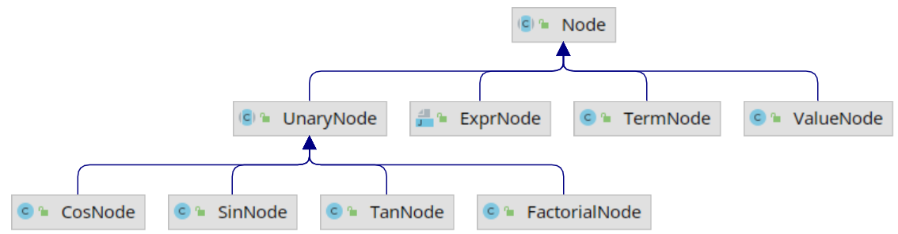

本文使用 JavaCC 实现表达式的解析, 并将解析结果生成为抽象语法树(Abstract Syntax Tree, AST)。实际上对于表达式这种简单的”语言”, 可以边解析边计算从而直接得出结果，生成抽象语法树有点”杀鸡焉用牛刀”了. 但是对于更加复杂的语言, 如通用计算机编程语言(C, Java等)或数据库查询语言SQL, 生成抽象语法树就是必须的了. 只有依托于抽象语法树才能进一步进行语义分析(如引用消解, 类型检查等), 代码生成或将SQL转化为关系代数等工作. 然而, 直接上手编写 JavaCC 的语法文件, 构建复杂语言的抽象语法树难度较大.

本文以表达式这个较为简单的”语言”为例, 通过编写 JavaCC 的语法文件将其转化为抽象语法树, 并使用 Visitor 模式访问抽象语法树对表达式进行计算. 这个例子可以说是”麻雀虽小, 五脏俱全”, 包含词法分析和语法分析的完整内容, 通过这个例子可以了解JavaCC语法文件的编写以及抽象语法树的构建方式, 在此基础上便可进一步构建更加复杂的语言的解析器. 本文的完整代码见这里.

## 1. JavaCC 介绍

### 1.1 JavaCC 功能

JavaCC的全称是 Java Compiler Compiler, 以下是其官网的介绍：
```
Java Compiler Compiler (JavaCC) is the most popular parser generator for use with Java applications.
A parser generator is a tool that reads a grammar specification and converts it to a Java program that can recognize matches to the grammar.

JavaCC 是 Java 应用程序中最流行的解析器(Parser)生成器。解析器生成器是一种工具, 它可以读取语法规范并将其转换为能够识别与语法匹配的Java程序.
```
在编译器实现中, 首先要做的就是词法分析和语法分析:
- 词法分析: 解析代码并生成 Token(一个单词的字面和它的种类及语义值)序列, 词法分析的实现一般称为扫描器(Scanner);
- 语法分析: 利用扫描器生成的 Token 序列来生成抽象语法树, 语法分析的实现一般称为解析器(Parser).


如果不依赖任何工具, 那就必须手写扫描器和解析器, 但是随着人们对编译原理的深入研究, 发现扫描器和解析器都可以根据一定的规则自动生成. 于是就出现了一系列的解析器生成器, 如Yacc, Anltr, JavaCC等. 这些解析器生成器都可以根据自定义的语法规则文件自动生成解析器代码, 比如 JavaCC 可以根据后缀为 `.jj` 的语法规则文件生成解析器的 Java 代码, 这就避免了手动编写扫描器和解析器的繁琐, 可以让我们专注于语法规则的设计.

### 1.2 JavaCC 语法文件

JavaCC 可根据用户编写的后缀名为 `.jj` 的语法规则文件自动生成解析器. 由于本文重点关注的是解析表达式并构建抽象语法树这个系统过程, 这里遵循”够用即可”的原则, 仅讲述在表达式解析中需要用到的语法. 关于 JavaCC 语法规则更详细的描述可阅读参考[JavaCC Tutorials](https://javacc.github.io/javacc/tutorials/) 和 [自制编译器](https://book.douban.com/subject/26806041/), 其中”自制编译器”的第一, 二部分对 JavaCC 的语法规则有详尽的解释, 推荐阅读.

JavaCC的语法文件一般包含如下内容：
```java
options {
    JavaCC 的选项
}

PARSER_BEGIN(解析器类名)
package 包名;
import 库名;

public class 解析器类名 {
    任意的 Java 代码
}
PARSER_END(解析器类名)

扫描器的描述

解析器的描述
```
- 语法文件的开头是 JavaCC 选项的 options 块, 可以省略;
- PARSER_BEGIN 和 PARSER_END 之间是一个 Java 类, 可以支持任何 Java 语法, 这里定义的类成员变量或方法也能在解析器描述的 actions 中使用;
- 最后是扫描器的描述和解析器的描述, 后面会进一步介绍.

有了以上概念之后, 我们可以看如下语法文件 `Adder.jj`, 运行 `javacc Adder.jj` 命令即可生成一个 `Adder.java` 文件, 该文件是一个普通的 Java 类文件, 在命令行或 IDE 中编译运行后即可读取输入的整数加法表达式进行解析并计算.
```java
options {
    STATIC = false;
}

PARSER_BEGIN(Adder)
import java.io.*;

public class Adder {

  public static void main(String[] args){
    for (String arg : args) {
      try{
        System.out.println(evaluate(arg));
      } catch (ParseException e) {
        e.printStackTrace();
      }
    }
  }

  public static long evaluate(String src) throws ParseException {
    Reader reader = new StringReader(src);
    return new Adder(reader).expr();
  }
}

PARSER_END(Adder)

// 扫描器的描述
SKIP : { <[" ", "\t", "\r", "\n"]> }
TOKEN : { <INTEGER: (["0"-"9"])+> }

// 解析器的描述
long expr():
{
  Token x, y;
}
{
  x=<INTEGER> "+" y=<INTEGER> <EOF>
  {
    return Long.parseLong(x.image) + Long.parseLong(y.image);
  }
}
```
在 PARSER_BEGIN 和 PARSER_END 之间就是一个普通的 Java 类定义, 可以定义包含 main 函数在内的所有内容, 此外 JavaCC 还会自动生成以下构造函数, 上述文件中的 evaluate 方法就使用了参数为 Reader 的构造函数:
- Parser(InputStream s)
- Parser(InputStream s, String encoding)
- Parser(Reader r)
- Parser(××××TokenManager tm)

扫描器的描述主要是利用正则表达式描述各种 Token：
- SKIP 表示匹配的字符都可以跳过;
- `TOKEN : { <INTEGER: (["0"-"9"])+> }` 表示定义了名为 INTEGER 的 Token, 它可以由1个或多个数字组成.

解析器的描述支持扩展巴科斯范式(Extended Backus–Naur Form, EBNF), 可以在适当位置嵌入任意 Java 代码, 使用 Adder 类所定义的成员变量或方法. 这是由于这里的 expr() 实际上会生成为 Adder 类中的一个同名方法.
- 在 `expr()` 之后的 `{}` 中可以定义任何临时变量, 这里的 Token 是 JavaCC 预定义的表示 Token 的类.
- 在之后的 `{}` 中可定义方法体, 方法体支持 EBNF, 在 EBNF 中可随时嵌入 `{}` 并在里面编写 Java 代码, 这在 JavaCC 中称为 action. 比如在 `expr() `中, 在解析到 `<INTEGER> "+" <INTEGER> <EOF>` 之后就会执行之后 action 中的代码. 这里只是简单的将对于的字符转换为整数相加后范围, 如果有需要也可以在 action 中添加生成抽象语法树的逻辑. 在EBNF中可以将任何元素赋值给临时变量.

## 2. 表达式解析

### 2.1 表达式扫描器

为了构建表达式扫描器, 我们需要编写正则表达式, 以解析表达式中可能出现的所有字符, 并将其转化为相应的Token. 以下是表达式扫描器的描述, 第一个Token主要是数字的正则表达式, 第二个Token是一些三角函数, 读者可以加入更多的自定义Token, 比如sqrt等, 支持更丰富的运算.
```java
SKIP : { " " | "\r" | "\t" }

TOKEN:
{
    < NUMBER: (<DIGIT>)+ ( "." (<DIGIT>)+ )? >
|   < DIGIT: ["0"-"9"] >
|   < EOL: "\n" >
}

TOKEN:
{
    <SIN: "sin">
|   <COS: "cos">
|   <TAN: "tan">
}
```

### 2.2 表达式解析器

表达式解析器的描述相对复杂一些, 为方便起见, 本文将表达式中可能出现的元素分为三类:
- primary: 是表达式中的一个独立元素, 可以是一个数字(如123, 987.34), 也可以是括号包围的表达式(如(1+2)), 也可以是在数字或表达式上附带一元运算符形成的元素(如 `7!`, `sin(3*4+2)` ). 由此可见这里的独立只是相对而言的, 表达式中可以有多个primary元素.
- term: 是表达式中高优先级的元素, 需要优先计算, 它可以是一个单独的primary, 也可以是高优先级的二元运算符(`*`和`/`)连接的元素, 如 32, 9/3.
- expr: 是一个表达式元素, 它可以是一个单独的 term, 也可以是第优先级的二元运算符(`+`和 `-`)连接的元素, 如 3-2, 42+34.

依据上述描述的编写的词法解析规则如下, 为方便理解, 暂时去掉了所有 action, 读者可根据注释仔细理解.
```java
void expr(): { }
{
    term() ("+" expr() | "-" expr())*		// term开头, 后面可能有+expr或-expr, 也可能没有
}

void term(): { }
{
    primary() ("*" term() | "/" term())*	// primary开头, 后面可能有*term或/term, 也可能没有
}

void primary(): { }
{
    <NUMBER>							// 数字, 如123, 789.98
|   LOOKAHEAD(<NUMBER> "!")				// 数字的阶乘, 如3!, 5!
    <NUMBER> "!"
|   LOOKAHEAD("(" expr() ")" "!")		// 表达式的阶乘, 如(3+2*3)!
    "(" expr() ")" "!"				
|   "+" primary()						// "+"号前缀, 如+3, +(3+3*2)
|   "-" primary()						// "-"号前缀, 如-3, -(3+3*2)
|   "(" expr() ")"						// 括号包围的表达式, 如(3+3*2)
|   <SIN> "(" expr() ")"				// sin运算, 如sin(3), sin(3+3*4)
|   <COS> "(" expr() ")"				// cos运算, 如cos(3), cos(3+3*4)
|   <TAN> "(" n=expr() ")"				// tan运算, 如tan(3), tan(3+3*4)
}
```

## 3. 抽象语法树构建

有了上述词法和语法描述就可以实现表达式的解析了, 但也仅仅是解析, 除了检查输入的表达式在语法上是否合规并没有其他任何作用. 要实现表达式的计算就需要在解析器语法描述的适当位置加入action. 对于表达式计算这种简单的应用我们可以直接在相应位置插入计算的代码, 类似于Adder.jj那样. 不过本文会在action中添加生成抽象语法树的代码, 从而将表达式转化为抽象语法树, 然后在使用Visitor模式遍历抽象语法树计算结果.

### 3.1 抽象语法树的节点
在插入action代码之前, 我们先来设计一下抽象语法树的各个节点.

首先, 抽象语法树需要一个抽象的节点基类Node. Node类中只有一个属性sign用于指示当前节点的正负号. 抽象方法accept用于接收Visitor实现对节点的遍历.
```java
public abstract class Node {

  protected int sign = 1;

  public int getSign() {
    return sign;
  }

  public void setSign(int sign) {
    this.sign = sign;
  }

  public abstract <T> T accept(ASTVisitor<T> visitor);
}
```
Node 类有多个实现类:
- ExprNode 表示表示一个expr;
- TermNode 表示一个term;
- UnaryNode 表示一元运算符对应的节点, 有4个实现类;
- ValueNode 表示一个数值节点.

各个类的继承关系如下图, 由于其实现较为简单, 这里不再展示完整的代码, 如有需要可参考[这里](https://github.com/LB-Yu/data_systems_learning/tree/master/sql-recognition-learning/javacc-learning/src/main/java/javacc/learning/calculator/ast)



基于上述节点类, 我们便可在语法文件中添加action, 从而在解析的过程中构建抽象语法树.

primary添加action后如下, 其返回值为Node类型, 因为可能返回各种类型的节点, 这里统一用基类表示. 在每种情况后都增加了action, 其主要功能是为当前解析到的字符构建抽象语法树节点. 比如, 读到<NUMBER>表示当前读到了一个数字, 之后就会创建一个ValueNode; LOOKAHEAD(<NUMBER> "!")表示超前扫描, 也就是说当扫描到<NUMBER>后还要继续往后扫描, 判断下一个字符是不是!, 如果不是则回到<NUMBER>的情况, 否则需要生成一个阶乘节点FactorialNode. 其他情况类似, 这里不再赘述.

```java
Node primary():
{
    Token t;
    Token p;
    Node n;
}
{
    t=<NUMBER>
    {
        double number = Double.parseDouble(t.image);
        return new ValueNode(number);
    }
|   LOOKAHEAD(<NUMBER> "!")
    t=<NUMBER> "!"
    {
        String value = t.image;
        double number = Double.parseDouble(value);
        return new FactorialNode(new ValueNode(number));
    }
|   LOOKAHEAD("(" n=expr() ")" "!")
    "(" n=expr() ")" "!" { return new FactorialNode(n); }
|   "+" n=primary() { return n; }
|   "-" n=primary()
    {
        n.setSign(-1);
        return n;
    }
|   "(" n=expr() ")"	{ return n; }
|   <SIN> "(" n=expr() ")" { return new SinNode(n); }
|   <COS> "(" n=expr() ")" { return new CosNode(n); }
|   <TAN> "(" n=expr() ")" { return new TanNode(n); }
}
```
term添加action之后如下, 其返回值同样为Node. term可能有一个单独的primary组成, 也可能在之后*或/ 另一个term, 每种情况下的action都返回了对应的节点.
```java
Node term():
{
    Node left;
    Node right;
}
{
    left=primary()
    (
        "*" right=term()    { return new TermNode(left, right, Operator.MUL); }
    |   "/" right=term()    { return new TermNode(left, right, Operator.DIV); }
    )*
    { return left; }
}
```
expr与term类似, 可能有一个单独的term组成, 也可能在之后+或-另一个expr, 每种情况都返回对应的节点.
```java
Node expr():
{
    Node left;
    Node right;
}
{
    left=term()
    (
        "+" right=expr()    { return new ExprNode(left, right, Operator.PLUS); }
    |   "-" right=expr()    { return new ExprNode(left, right, Operator.MINUS); }
    )*
    { return left; }
}
```
有了上述语法规则之后, 便可在PARSER_BEGIN和PARSER_END定义一个解析器类了. 这里我们将其称为Calculator.
```java
PARSER_BEGIN(Calculator)
package javacc.learning.calculator.parser;

import javacc.learning.calculator.ast.*;

public class Calculator {

    public Node parse() throws ParseException {
        return expr();
    }
}
PARSER_END(Calculator)
```
Calculator只有一个parse函数, 它调用了expr语法生成的同名函数. 通过JavaCC生成Calculator.java文件之后, 我们便可通过以下方式解析表达式并生成抽象语法树.
```java
Calculator calculator = new Calculator(System.in);
// node为抽象语法树根节点
Node node = calculator.parse();
```
上述表达式解析和生成抽象语法树的完整代码可参见 [Calculator.jj](https://github.com/LB-Yu/data_systems_learning/blob/master/sql-recognition-learning/javacc-learning/src/main/codegen/Calculator.jj).

### 3.2 Vsitor模式遍历抽象语法树

生成抽象语法树, 相当于利用JavaCC将无结构的表达式字符串转化为了内存中结构化的树. 完成了抽象语法树的生成JavaCC的任务也就完成了, 之后如何通过抽象语法树计算表达式的结果就需要我们自己解决了.

在编译器中, 通常会将源代码解析为抽象语法树, 然后使用Visitor模式遍历抽象语法树进行语义分析, 如引用消解, 静态类型检查等. 这里我们也使用Visitor模式对表达式抽象语法树进行遍历计算结果.

为了遍历抽象语法树计算结果, 我们也可以不使用Visitor模式, 而利用多态实现不同节点的计算. 比如我们可以在Node中增加一个calculate抽象方法, 让每个实现类依据节点语义实现不同的计算方法. 这样当调用抽象语法树根节点的calculate方法后, 就会递归调用子节点的calculate方法直到叶节点返回结果.
```java
public abstract class Node {
  ...

  public abstract double calculate();
}

public class ValueNode extends Node {

  ...

  public double calculate() {
      return value;
  }
}

public class SinNode extends UnaryNode {
  ...

  public double calculate() {
    double value = node.calculate();
    double result = 1;
    for (int i = 1; i <= value; ++i) {
      result *= i;
    }
    return result * getSign();
  }
}
```
然而使用上述方法存在诸多缺点:
- 对不同的遍历场景需要为节点类添加不同的方法, 比如上面为了计算表达式结果添加了calculate方法, 如果需要打印抽象语法树就需要再新增一个方法dump. 这样一旦有新的需求就必须不断改动节点类群, 由于节点类群众多, 修改相当困难.
- 由于对于一种场景, 其实现逻辑都分散在各个节点类中, 不便于阅读相关代码.

由于上述缺点我们有必要引入Visitor模式对抽象语法树进行遍历. Visitor模式有一个抽象接口, 定义了对各种类型的节点进行访问的方法. 比如在表达式抽象语法树的遍历中, 我们定义了如下ASTVisitor接口, 其中包含对各种节点的visit方法.
```java
public interface ASTVisitor<T> {
  T visit(ExprNode node);
  T visit(TermNode node);
  T visit(SinNode node);
  T visit(CosNode node);
  T visit(TanNode node);
  T visit(FactorialNode node);
  T visit(ValueNode node);
}
```
有了ASTVisitor接口, 我们只需在Node类中定义一个抽象方法accept用于实现不同场景下各个节点的遍历逻辑.
```java
public abstract class Node {
  ...

  public abstract <T> T accept(ASTVisitor<T> visitor);
}

public class ValueNode extends Node {
  ...

  @Override
  public <T> T accept(ASTVisitor<T> visitor) {
    return visitor.visit(this);
  }
}
```
有了上述接口之后, 我们只需要为不同的场景添加不同的实现类即可对抽象语法树进行遍历, 从而实现不同的逻辑. 以计算表达式结果为例, 可以添加如下实现类. 在实现类的visit方法中我们根据节点类型的不同编写对于的计算逻辑即可.
```java
public class CalculateVisitor implements ASTVisitor<Double> {

  public double calculate(Node node) {
    return node.accept(this);
  }

  ...

  @Override
  public Double visit(FactorialNode node) {
    double value = node.getNode().accept(this);
    double result = 1;
    for (int i = 1; i <= value; ++i) {
      result *= i;
    }
    return result * node.getSign();
  }

  @Override
  public Double visit(ValueNode node) {
    return node.getValue() * node.getSign();
  }
}
```
如果要添加新的遍历逻辑, 比如打印抽象语法树, 我们只需要新增一个DumpVisitor并实现相应的方法即可. CalculateVisitor和DumpVisitor的完整代码都在这里.

## 4. 总结

本文以表达式这种简单的”语言”为依托, 讲述了使用JavaCC构建解析器并生成抽象语法树的方法. 写文本的主要目的是笔者在阅读一些编译器实战书籍时, 由于通用编程语言一般较为复杂解析难度大, 直接看这些语言的语法文件有时难以理解从解析到抽象语法树构建这个系统流程. 前文也说到, 表达式这种简单场景完全可以不构建抽象语法树, 但本文还是”费劲”构建并用Visitor模式进行遍历, 目的是理解语法分析到抽象语法树构建和遍历的整个流程. 理解了本文所描述的内容之后, 再去看通用编程语言的编译前端或SQL解析就会变得一目了然了, 因为框架原理都是一样的, 无非是要在语法文件中逐步添加更多的规则, 增加更多类型的抽象语法树节点, 实现更多类型的Visitor类以支持不同类型的语义分析.


> 原文:[编译原理实践 - JavaCC解析表达式并生成抽象语法树](https://liebing.org.cn/javacc-expression-ast.html)
