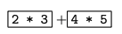

为了得到一个很实用的计算器，我们需要支持加法、减法、乘法和除法等运算符。这篇文章介绍如何为计算器添加乘法和除法运算。

## 1. 编写语法文件

你可以使用你喜欢的文本编辑器创建和编辑语法文件。在这我们创建一个 `calculator_v5.jj` 语法文件。在本节的其余部分中，代码示例将是 `calculator_v5.jj` 的文件的一部分内容。这个文件包含了用于解析器和词法分析器的 JavaCC 规范，并被用作 JavaCC 程序的输入。截止到[上一个例子]()我们已经为计算器添加了加法、减法运算并支持小数运算：
```java
options {
  STATIC = false ;
}
PARSER_BEGIN(CalculatorMinus)
  import java.io.PrintStream ;
  class CalculatorMinus {
      public static void main( String[] args ) throws ParseException, TokenMgrError, NumberFormatException {
          CalculatorMinus parser = new CalculatorMinus( System.in ) ;
          parser.Start(System.out) ;
      }
      double previousValue = 0.0 ;
  }
PARSER_END(CalculatorMinus)


SKIP : { " " }
TOKEN : { < EOL : "\n" | "\r" | "\r\n" > }
TOKEN : { < PLUS : "+" > }
TOKEN : { < MINUS : "-" > }
TOKEN : { < NUMBER : <DIGITS> | <DIGITS> "." <DIGITS> | <DIGITS> "." | "." <DIGITS> > }
TOKEN : { < #DIGITS : (["0"-"9"])+ > }


void Start(PrintStream printStream) throws NumberFormatException :
{}
{
    (
        previousValue = Expression()
        <EOL> { printStream.println( previousValue ) ; }
    )*
    <EOF>
}

double Expression() throws NumberFormatException :
{
    double i ;
    double value ;
}
{
    value = Primary()
    (
        <PLUS>
        i = Primary()
        { value += i ; }
    |
        <MINUS>
        i = Primary()
        { value -= i ; }
    )*
    { return value ; }
}

double Primary() throws NumberFormatException :
{
    Token t ;
}
{
    t = <NUMBER>
    { return Double.parseDouble( t.image ) ; }
}
```
从添加减法运算示例中可以知道添加乘法和除法运算也很简单。下面我们会一步一步的介绍如何基于上面的语法文件来支持乘法和除法运算。首先我们需在之前词法描述规范基础之上添加如下两个产生式：
```java
TOKEN : { < TIMES : "*" > }
TOKEN : { < DIVIDE : "/" > }
```
接下来我们修改 `Expression` 这个产生式，对它的修改类似上一个示例中添加减法运算所做的修改：
```java
Expression --> Primary (PLUS Primary | MINUS Primary | TIMES Primary | DIVIDE Primary)*
```
单纯从语法角度来看，这种写法没有什么问题，但是它与我们想要的求值太匹配，是因为它不知道乘法和除法应该比加法和减法具有更高的运算优先级。例如，我们计算如下表达式：
```
2*3+4*5
```
如果根据上面的产生式计算，实际获得的是 `((2×3) + 4)×5` 的结果 50，而不是预期 `(2×3) + (4×5)` 的结果 26。因此，我们需要将产生式修改成如下：
```java
Expression --> Term (PLUS Term | MINUS Term)*
Term --> Primary (TIMES Primary | DIVIDE Primary)*
```
我们将每个表达式拆分成为一个或多个 `Term` 相加或相减。在我们的例子中，`Term` 就是两个大括号中的内容：



对 `Expression` 的修改只需要将对 `Primary` 的引用更改为对 `Term` 的引用即可：
```java
double Expression() throws NumberFormatException :
{
    double i ;
    double value ;
}
{
    value = Term()
    (
        <PLUS>
        i = Term()
        { value += i ; }
    |  
        <MINUS>
        i = Term()
        { value -= i ; }
    )*
    { return value ; }
}
```
而 `Term` 的产生式如下所示：
```java
double Term() throws NumberFormatException :
{
    double i ;
    double value ;
}
{
    value = Primary()
    (
        <TIMES>
        i = Primary()
        { value *= i ; }
    |
        <DIVIDE>
        i = Primary()
        { value /= i ; }
    )*
    { return value ; }
}
```

## 2. 生成解析器和词法分析器

至此我们完成了 `calculator_v5.jj` 语法文件的修改：
```java
options {
  STATIC = false ;
}
PARSER_BEGIN(Calculator)
  import java.io.PrintStream ;
  class Calculator {
      public static void main( String[] args ) throws ParseException, TokenMgrError, NumberFormatException {
          Calculator parser = new Calculator( System.in ) ;
          parser.Start(System.out) ;
      }
      double previousValue = 0.0 ;
  }
PARSER_END(Calculator)


SKIP : { " " }
TOKEN : { < EOL : "\n" | "\r" | "\r\n" > }
TOKEN : { < PLUS : "+" > }
TOKEN : { < MINUS : "-" > }
TOKEN : { < TIMES : "*" > }
TOKEN : { < DIVIDE : "/" > }
TOKEN : { < NUMBER : <DIGITS> | <DIGITS> "." <DIGITS> | <DIGITS> "." | "." <DIGITS> > }
TOKEN : { < #DIGITS : (["0"-"9"])+ > }


void Start(PrintStream printStream) throws NumberFormatException :
{}
{
    (
        previousValue = Expression()
        <EOL> { printStream.println( previousValue ) ; }
    )*
    <EOF>
}

double Expression() throws NumberFormatException :
{
    double i ;
    double value ;
}
{
    value = Term()
    (
        <PLUS>
        i = Term()
        { value += i ; }
    |  
        <MINUS>
        i = Term()
        { value -= i ; }
    )*
    { return value ; }
}

double Term() throws NumberFormatException :
{
    double i ;
    double value ;
}
{
    value = Primary()
    (
        <TIMES>
        i = Primary()
        { value *= i ; }
    |
        <DIVIDE>
        i = Primary()
        { value /= i ; }
    )*
    { return value ; }
}

double Primary() throws NumberFormatException :
{
    Token t ;
}
{
    t = <NUMBER>
    { return Double.parseDouble( t.image ) ; }
}
```
生成 `calculator_v5.jj ` 文件后，我们对其调用 JavaCC 命令来生成解析器与词法分析器，JavaCC 的详细安装与运行请查阅[入门示例](https://smartsi.blog.csdn.net/article/details/143640803)。如下所示直接运行 `javacc calculator_v5.jj` 命令来生成：
```java
localhost:v5 wy$ javacc calculator_v5.jj
Java Compiler Compiler Version 7.0.13 (Parser Generator)
(type "javacc" with no arguments for help)
Reading from file calculator_v5.jj . . .
File "TokenMgrError.java" does not exist.  Will create one.
File "ParseException.java" does not exist.  Will create one.
File "Token.java" does not exist.  Will create one.
File "SimpleCharStream.java" does not exist.  Will create one.
Parser generated successfully.
```
执行完之后，同之前一样都会生成 7 个 Java 文件，包括解析器以及词法分析器，具体说明请查阅[入门示例](https://smartsi.blog.csdn.net/article/details/143640803)。接下来我们对这些 Java 文件进行编译，编译完成之后可得到对应的 class 文件来运行：
```java
localhost:v5 wy$ javac *.java
localhost:v5 wy$ ll
total 200
drwxr-xr-x  17 wy  wheel    544 Nov 16 16:57 ./
drwxr-xr-x   8 wy  wheel    256 Nov 16 16:56 ../
-rw-r--r--   1 wy  wheel   5891 Nov 16 16:57 Calculator.class
-rw-r--r--   1 wy  wheel   7632 Nov 16 16:55 Calculator.java
-rw-r--r--   1 wy  wheel    702 Nov 16 16:57 CalculatorConstants.class
-rw-r--r--   1 wy  wheel    825 Nov 16 16:55 CalculatorConstants.java
-rw-r--r--   1 wy  wheel   6290 Nov 16 16:57 CalculatorTokenManager.class
-rw-r--r--   1 wy  wheel  10551 Nov 16 16:55 CalculatorTokenManager.java
-rw-r--r--   1 wy  wheel   2936 Nov 16 16:57 ParseException.class
-rw-r--r--   1 wy  wheel   6221 Nov 16 16:55 ParseException.java
-rw-r--r--   1 wy  wheel   6586 Nov 16 16:57 SimpleCharStream.class
-rw-r--r--   1 wy  wheel  11826 Nov 16 16:55 SimpleCharStream.java
-rw-r--r--   1 wy  wheel    985 Nov 16 16:57 Token.class
-rw-r--r--   1 wy  wheel   4070 Nov 16 16:55 Token.java
-rw-r--r--   1 wy  wheel   2363 Nov 16 16:57 TokenMgrError.class
-rw-r--r--   1 wy  wheel   4568 Nov 16 16:55 TokenMgrError.java
-rw-r--r--   1 wy  wheel   1566 Nov 16 16:55 calculator_v5.jj
```

## 3. 运行示例

跟[入门示例](https://smartsi.blog.csdn.net/article/details/143640803)一样我们可以通过准备合适的输入文件并执行如下命令来运行程序：
```java
java Calculator <input.txt
```
> 在 input.txt 文件中包含输入序列

假设输入是 `2*3+4*5`，会在控制台看到结果 `26.0`：
```java
localhost:v5 wy$ cat input.txt
2*3+4*5
localhost:v5 wy$ java Calculator <input.txt
26.0
```
假设输入是 `2+3*4+5`，会在控制台看到结果 `19.0`：
```java
localhost:v5 wy$ cat input.txt
2+3*4+5
localhost:v5 wy$ java Calculator <input.txt
19.0
```
