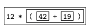

在[上一篇文章](https://smartsi.blog.csdn.net/article/details/143827977)中我们实现了一个支持加减乘除运算的计算器。为了得到一个更实用的计算器，我们需要更多的功能，这篇文章介绍如何为计算器添加括号、一元运算符和历史记录功能。

## 1. 编写语法文件

你可以使用你喜欢的文本编辑器创建和编辑语法文件。在这我们创建一个 `calculator_v6.jj` 语法文件。在本节的其余部分中，代码示例将是 `calculator_v6.jj` 的文件的一部分内容。这个文件包含了用于解析器和词法分析器的 JavaCC 规范，并被用作 JavaCC 程序的输入。截止到[上一个例子](https://smartsi.blog.csdn.net/article/details/143825513)我们已经为计算器添加了加减乘除运算并支持小数运算：
```java
options {
  STATIC = false ;
}
PARSER_BEGIN(Calculator)
  import java.io.PrintStream ;
  class Calculator {
      public static void main( String[] args ) throws ParseException, TokenMgrError, NumberFormatException {
          Calculator parser = new Calculator( System.in ) ;
          parser.Start(System.out) ;
      }
      double previousValue = 0.0 ;
  }
PARSER_END(Calculator)


SKIP : { " " }
TOKEN : { < EOL : "\n" | "\r" | "\r\n" > }
TOKEN : { < PLUS : "+" > }
TOKEN : { < MINUS : "-" > }
TOKEN : { < TIMES : "*" > }
TOKEN : { < DIVIDE : "/" > }
TOKEN : { < NUMBER : <DIGITS> | <DIGITS> "." <DIGITS> | <DIGITS> "." | "." <DIGITS> > }
TOKEN : { < #DIGITS : (["0"-"9"])+ > }


void Start(PrintStream printStream) throws NumberFormatException :
{}
{
    (
        previousValue = Expression()
        <EOL> { printStream.println( previousValue ) ; }
    )*
    <EOF>
}

double Expression() throws NumberFormatException :
{
    double i ;
    double value ;
}
{
    value = Term()
    (
        <PLUS>
        i = Term()
        { value += i ; }
    |  
        <MINUS>
        i = Term()
        { value -= i ; }
    )*
    { return value ; }
}

double Term() throws NumberFormatException :
{
    double i ;
    double value ;
}
{
    value = Primary()
    (
        <TIMES>
        i = Primary()
        { value *= i ; }
    |
        <DIVIDE>
        i = Primary()
        { value /= i ; }
    )*
    { return value ; }
}

double Primary() throws NumberFormatException :
{
    Token t ;
}
{
    t = <NUMBER>
    { return Double.parseDouble( t.image ) ; }
}
```

我们会基于上面的语法文件进行修改，只需要再添加一些特色就可以得到一个可用的四则运算计算器。在这一版的修改中，我们将允许带括号的表达式、负值，以及可以通过 `$ `符号来引用上一次计算的结果。对词法规范的修改很简单，我们只需要添如下3个产生式：
```java
TOKEN : { < OPEN_PAR : "(" > }
TOKEN : { < CLOSE_PAR : ")" > }
TOKEN : { < PREVIOUS : "$" > }
```
我们没有必要专门为负号创建一个产生式，因为负号会被识别为 `MINUS` 类型的 Token。

对解析器规范的修改都在 `Primary` 当中，在 `Primary` 中有 4 种可能的选项：数值（和以前一样）、`$` 符号、带有括号的表达式、负号然后仅跟着这些选项的任意一种。`BNF` 符号表达式如下：
```java
Primary --> NUMBER
        | PREVIOUS
        | OPEN_PAR Expression CLOSE_PAR
        | MINUS Primary
```

这个 `BNF` 产生式存在两个递归。最后一种选项是直接递归。倒数第二个选项是间接递归，因为 `Expression` 最终依赖于 Primary。在 `BNF` 产生式中使用递归没有任何问题，但是会有一些限制(我们将在后面讨论)。考虑如下表达式：
```
- - 22
```
`Primary` 如下图中的方框部分所示：


在对该输入执行生成的解析器时，将对这些方框中的每个方框调用一次 `Primary` 方法。类似地，给定如下输入：
```
12 * ( 42 + 19 )
```
相互嵌套的方框再次显示了对生成的 Primary 方法的递归调用：



下面是 JavaCC 表示法的结果：
```java
double Primary() throws NumberFormatException :
{
Token t ;
double d ;
}
{
      t=<NUMBER>
      { return Double.parseDouble( t.image ) ; }
  |   
      <PREVIOUS>
      { return previousValue ; }
  |   
      <OPEN_PAR> d=Expression() <CLOSE_PAR>
      { return d ; }
  |   
      <MINUS> d=Primary()
      { return -d ; }
}
```

## 2. 生成解析器和词法分析器

至此我们完成了 `calculator_v6.jj` 语法文件的修改：
```java
options {
  STATIC = false ;
}
PARSER_BEGIN(Calculator)
  import java.io.PrintStream ;
  class Calculator {
      public static void main( String[] args ) throws ParseException, TokenMgrError, NumberFormatException {
          Calculator parser = new Calculator( System.in ) ;
          parser.Start(System.out) ;
      }
      double previousValue = 0.0 ;
  }
PARSER_END(Calculator)


SKIP : { " " }
TOKEN : { < EOL : "\n" | "\r" | "\r\n" > }
TOKEN : { < PLUS : "+" > }
TOKEN : { < MINUS : "-" > }
TOKEN : { < TIMES : "*" > }
TOKEN : { < DIVIDE : "/" > }
TOKEN : { < NUMBER : <DIGITS> | <DIGITS> "." <DIGITS> | <DIGITS> "." | "." <DIGITS> > }
TOKEN : { < #DIGITS : (["0"-"9"])+ > }
TOKEN : { < OPEN_PAR : "(" > }
TOKEN : { < CLOSE_PAR : ")" > }
TOKEN : { < PREVIOUS : "$" > }

void Start(PrintStream printStream) throws NumberFormatException :
{}
{
    (
        previousValue = Expression()
        <EOL> { printStream.println( previousValue ) ; }
    )*
    <EOF>
}

double Expression() throws NumberFormatException :
{
    double i ;
    double value ;
}
{
    value = Term()
    (
        <PLUS>
        i = Term()
        { value += i ; }
    |  
        <MINUS>
        i = Term()
        { value -= i ; }
    )*
    { return value ; }
}

double Term() throws NumberFormatException :
{
    double i ;
    double value ;
}
{
    value = Primary()
    (
        <TIMES>
        i = Primary()
        { value *= i ; }
    |
        <DIVIDE>
        i = Primary()
        { value /= i ; }
    )*
    { return value ; }
}

double Primary() throws NumberFormatException :
{
Token t ;
double d ;
}
{
      t=<NUMBER>
      { return Double.parseDouble( t.image ) ; }
  |   
      <PREVIOUS>
      { return previousValue ; }
  |   
      <OPEN_PAR> d=Expression() <CLOSE_PAR>
      { return d ; }
  |   
      <MINUS> d=Primary()
      { return -d ; }
}
```
生成 `calculator_v6.jj` 文件后，我们对其调用 JavaCC 命令来生成解析器与词法分析器，JavaCC 的详细安装与运行请查阅[入门示例](https://smartsi.blog.csdn.net/article/details/143640803)。如下所示直接运行 `javacc calculator_v6.jj` 命令来生成：
```java
localhost:v6 wy$ javacc calculator_v6.jj
Java Compiler Compiler Version 7.0.13 (Parser Generator)
(type "javacc" with no arguments for help)
Reading from file calculator_v6.jj . . .
File "TokenMgrError.java" does not exist.  Will create one.
File "ParseException.java" does not exist.  Will create one.
File "Token.java" does not exist.  Will create one.
File "SimpleCharStream.java" does not exist.  Will create one.
Parser generated successfully.
```
执行完之后，同之前一样都会生成 7 个 Java 文件，包括解析器以及词法分析器，具体说明请查阅[入门示例](https://smartsi.blog.csdn.net/article/details/143640803)。接下来我们对这些 Java 文件进行编译，编译完成之后可得到对应的 class 文件来运行：
```java
localhost:v6 wy$ javac *.java
localhost:v6 wy$ ll
total 208
drwxr-xr-x  17 wy  wheel    544 Nov 17 10:39 ./
drwxr-xr-x   9 wy  wheel    288 Nov 17 10:38 ../
-rw-r--r--   1 wy  wheel   6141 Nov 17 10:39 Calculator.class
-rw-r--r--   1 wy  wheel   8305 Nov 17 10:39 Calculator.java
-rw-r--r--   1 wy  wheel    844 Nov 17 10:39 CalculatorConstants.class
-rw-r--r--   1 wy  wheel   1020 Nov 17 10:39 CalculatorConstants.java
-rw-r--r--   1 wy  wheel   6409 Nov 17 10:39 CalculatorTokenManager.class
-rw-r--r--   1 wy  wheel  10737 Nov 17 10:39 CalculatorTokenManager.java
-rw-r--r--   1 wy  wheel   2936 Nov 17 10:39 ParseException.class
-rw-r--r--   1 wy  wheel   6221 Nov 17 10:39 ParseException.java
-rw-r--r--   1 wy  wheel   6586 Nov 17 10:39 SimpleCharStream.class
-rw-r--r--   1 wy  wheel  11826 Nov 17 10:39 SimpleCharStream.java
-rw-r--r--   1 wy  wheel    985 Nov 17 10:39 Token.class
-rw-r--r--   1 wy  wheel   4070 Nov 17 10:39 Token.java
-rw-r--r--   1 wy  wheel   2363 Nov 17 10:39 TokenMgrError.class
-rw-r--r--   1 wy  wheel   4568 Nov 17 10:39 TokenMgrError.java
-rw-r--r--   1 wy  wheel   1852 Nov 17 10:39 calculator_v6.jj
```

## 3. 运行示例

跟[入门示例](https://smartsi.blog.csdn.net/article/details/143640803)一样我们可以通过准备合适的输入文件并执行如下命令来运行程序：
```java
java Calculator <input.txt
```
> 在 input.txt 文件中包含输入序列

假设输入是 `2+10/2+5*2-2`，会在控制台看到结果 `15.0`：
```java
localhost:v6 wy$ cat input.txt
2+10/2+5*2-2
localhost:v6 wy$ java Calculator <input.txt
15.0
```
假设输入是 `(2+3)*(6-2)/2`，会在控制台看到结果 `10.0`：
```java
localhost:v6 wy$ cat input.txt
(2+3)*(6-2)/2
localhost:v6 wy$ java Calculator <input.txt
10.0
```
假设输入如下两个表达式，会在控制台看到结果 `16.0` 和 `-18.0`：
```java
localhost:v6 wy$ cat input.txt
(5 - -3)*(6-2)/2
$/2 - $*2 + 3*2
localhost:v6 wy$ java Calculator <input.txt
16.0
-18.0
```
