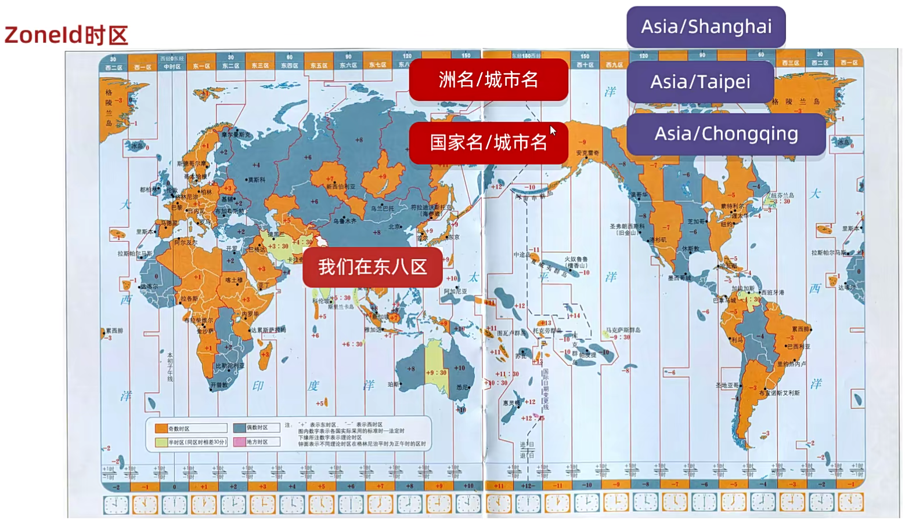

## 1. ZoneId 时区

我们知道，全世界一共是分为 24 个时区的，每一个时区的时间都是一样的。但是 Java 在定义时区的时候，不是根据 东一区、东二区、东三区... 这样去定义的，它在定义的时候格式如下：`洲名/城市名` 或者是 `国家名/城市名`。

举个例子：
- `Asia/Shanghai`，前面的第一个单词：Asia(亚洲)，后面的第二个单词：Shanghai(上海)。
- `Asia/Taipei`：亚洲/台北
- `Asia/Chongqing`：亚洲/重庆



以上三个都是我们国家的，只不过我们要注意的是：Java 在定义的时候是没有北京的 `Asia/Beijing`，因此我们一般使用的都是 Asia/Shanghai。当然，Java 给其他国家也有定义时区，例如：`Australia/Canberra` 表示的是澳大利亚的首都堪培拉、`America/New_York` 表示的是美洲的纽约。

## 2. 常用方法

### 2.1 systemDefault

获取系统默认时区:
```java
ZoneId defaultZoneId = ZoneId.systemDefault();
// Asia/Shanghai
System.out.println(defaultZoneId);
```

### 2.2 所有可用时区

Java 一共定义了 604个 时区，可以通过 ZoneId 的 `getAvailableZoneIds` 方法获取：
```java
Set<String> availableZoneIds = ZoneId.getAvailableZoneIds();
System.out.println("总共" + availableZoneIds.size() + "时区: ");
for (String zoneId: availableZoneIds) {
    System.out.println(zoneId);
}
```
返回结果如下所示：
```
总共604时区:
Asia/Aden
America/Cuiaba
Etc/GMT+9
Etc/GMT+8
Africa/Nairobi
America/Marigot
Asia/Aqtau
...
```
### 2.3 指定时区

通过 `of` 方法来指定一个时区:
```java
ZoneId zoneId = ZoneId.of("Asia/Shanghai");
```
